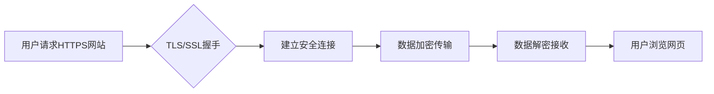

> HTTPS, TLS/SSL, 加密算法, 数字证书, 服务器端, 客户端端, 安全通信

## 1. 背景介绍

在当今互联网时代，数据安全和隐私保护已成为至关重要的议题。用户在浏览网页、进行在线交易、分享个人信息时，都希望确保其数据传输过程的安全可靠。HTTPS（Hypertext Transfer Protocol Secure）协议正是为了解决这一问题而诞生的。它基于HTTP协议，并采用TLS/SSL（Transport Layer Security/Secure Sockets Layer）加密技术，为网络通信提供安全保障。

HTTPS协议的应用范围广泛，涵盖了网站、应用程序、移动设备等各种场景。它能够有效防止数据被窃取、篡改或伪造，保障用户数据安全和隐私。

## 2. 核心概念与联系

**2.1 核心概念**

* **HTTP:** 超文本传输协议，是互联网上用于传输网页和其他资源的标准协议。
* **HTTPS:** 安全超文本传输协议，是HTTP协议的安全版本，使用TLS/SSL加密技术保护数据传输。
* **TLS/SSL:** 传输层安全协议/安全套接字层协议，是一种加密协议，用于建立安全连接并保护数据传输。
* **数字证书:** 由证书颁发机构（CA）签发的电子文件，用于验证网站身份和加密密钥。
* **公钥加密:** 使用一对密钥对进行加密和解密，其中公钥用于加密，私钥用于解密。

**2.2 核心概念联系**

HTTPS协议基于HTTP协议，并在其基础上添加了TLS/SSL加密技术。当用户访问HTTPS网站时，浏览器会与网站服务器建立安全连接。

**Mermaid 流程图**



## 3. 核心算法原理 & 具体操作步骤

**3.1 算法原理概述**

HTTPS协议的核心算法是TLS/SSL协议，它采用多种加密算法和哈希算法来保护数据传输。

* **加密算法:** 用于加密数据，使其无法被未授权用户解读。常见的加密算法包括AES、DES、RSA等。
* **哈希算法:** 用于生成数据摘要，用于验证数据完整性。常见的哈希算法包括SHA-256、MD5等。

**3.2 算法步骤详解**

1. **TLS/SSL握手:** 浏览器和服务器之间进行身份验证和密钥交换，建立安全连接。
2. **数据加密:** 服务器将数据加密后发送给浏览器，浏览器使用解密密钥解密数据。
3. **数据完整性验证:** 服务器和浏览器使用哈希算法生成数据摘要，并进行验证，确保数据未被篡改。

**3.3 算法优缺点**

* **优点:**
    * 数据加密和完整性验证，保障数据安全。
    * 支持多种加密算法和哈希算法，可根据需求选择合适的算法。
    * 广泛应用于各种场景，例如网站、应用程序、移动设备等。
* **缺点:**
    * 算法复杂，实现成本较高。
    * 需要证书颁发机构（CA）进行身份验证，存在证书信任问题。

**3.4 算法应用领域**

* **网站安全:** HTTPS协议用于保护网站数据传输，例如用户登录信息、信用卡信息等。
* **应用程序安全:** HTTPS协议用于保护应用程序数据传输，例如移动应用程序、云计算平台等。
* **移动设备安全:** HTTPS协议用于保护移动设备数据传输，例如手机银行、电子钱包等。

## 4. 数学模型和公式 & 详细讲解 & 举例说明

**4.1 数学模型构建**

TLS/SSL协议的数学模型主要基于公钥加密和哈希算法。

* **公钥加密模型:**

$$E_k(m) = c$$

其中：

* $E_k(m)$ 表示使用公钥 $k$ 加密消息 $m$。
* $c$ 表示加密后的密文。

* **哈希模型:**

$$H(m) = h$$

其中：

* $H(m)$ 表示使用哈希函数 $H$ 计算消息 $m$ 的摘要。
* $h$ 表示消息摘要。

**4.2 公式推导过程**

TLS/SSL协议中，公钥加密和哈希算法相互配合，实现数据加密和完整性验证。

1. **密钥交换:** 服务器和浏览器使用Diffie-Hellman算法进行密钥交换，生成一个共享密钥 $k$。
2. **数据加密:** 服务器使用共享密钥 $k$ 加密数据，并发送给浏览器。
3. **数据完整性验证:** 服务器和浏览器使用哈希函数 $H$ 计算数据摘要，并进行验证。

**4.3 案例分析与讲解**

假设Alice想要发送一条消息给Bob，并希望确保消息安全传输。

1. Alice和Bob使用Diffie-Hellman算法进行密钥交换，生成一个共享密钥 $k$。
2. Alice使用共享密钥 $k$ 加密消息，并发送给Bob。
3. Bob使用共享密钥 $k$ 解密消息，并验证消息完整性。

## 5. 项目实践：代码实例和详细解释说明

**5.1 开发环境搭建**

* 操作系统: Ubuntu 20.04 LTS
* 编程语言: Python 3.8
* 依赖库: OpenSSL, cryptography

**5.2 源代码详细实现**

```python
from cryptography.hazmat.backends import default_backend
from cryptography.hazmat.primitives import hashes, serialization
from cryptography.hazmat.primitives.asymmetric import rsa, padding

# 生成RSA私钥和公钥
private_key = rsa.generate_private_key(
    public_exponent=65537,
    key_size=2048,
    backend=default_backend()
)
public_key = private_key.public_key()

# 将公钥序列化为PEM格式
public_key_pem = public_key.public_bytes(
    encoding=serialization.Encoding.PEM,
    format=serialization.PublicFormat.SubjectPublicKeyInfo
)

# 加密消息
message = b"This is a secret message."
ciphertext = public_key.encrypt(
    message,
    padding.OAEP(
        mgf=padding.MGF1(algorithm=hashes.SHA256()),
        algorithm=hashes.SHA256(),
        label=None
    )
)

# 解密消息
decrypted_message = private_key.decrypt(
    ciphertext,
    padding.OAEP(
        mgf=padding.MGF1(algorithm=hashes.SHA256()),
        algorithm=hashes.SHA256(),
        label=None
    )
)

# 打印结果
print("Public Key:", public_key_pem.decode())
print("Ciphertext:", ciphertext)
print("Decrypted Message:", decrypted_message.decode())
```

**5.3 代码解读与分析**

* 代码首先使用OpenSSL库生成RSA私钥和公钥。
* 然后将公钥序列化为PEM格式，以便于传输和存储。
* 使用公钥加密消息，并使用私钥解密消息。
* OAEP填充模式用于确保消息安全加密和解密。

**5.4 运行结果展示**

运行代码后，将输出公钥、密文和解密后的消息。

## 6. 实际应用场景

HTTPS协议广泛应用于各种场景，例如：

* **电子商务网站:** HTTPS协议用于保护用户信用卡信息和个人信息的安全传输。
* **在线银行:** HTTPS协议用于保护用户银行账户信息的安全传输。
* **社交媒体平台:** HTTPS协议用于保护用户个人信息和聊天内容的安全传输。

**6.4 未来应用展望**

随着互联网的发展和数据安全需求的不断提高，HTTPS协议将继续发挥重要作用。未来，HTTPS协议可能会朝着以下方向发展：

* **更强大的加密算法:** 使用更安全的加密算法，例如量子加密算法。
* **更便捷的证书管理:** 使用自动化证书管理系统，简化证书申请和更新流程。
* **更广泛的应用场景:** 将HTTPS协议应用于更多场景，例如物联网、区块链等。

## 7. 工具和资源推荐

**7.1 学习资源推荐**

* **书籍:**
    * "Applied Cryptography" by Bruce Schneier
    * "Cryptography Engineering" by Niels Ferguson, Bruce Schneier, and Tadayoshi Kohno
* **在线课程:**
    * Coursera: Cryptography I
    * edX: Introduction to Cryptography

**7.2 开发工具推荐**

* **OpenSSL:** 一个开源的加密工具包。
* **Cryptography:** 一个Python的加密库。
* **Let's Encrypt:** 一个免费的证书颁发机构。

**7.3 相关论文推荐**

* "The TLS Protocol Version 1.3"
* "A Survey of Modern Cryptographic Protocols"

## 8. 总结：未来发展趋势与挑战

**8.1 研究成果总结**

HTTPS协议的发展历程证明了数据安全的重要性，并促进了加密算法和安全协议的不断创新。

**8.2 未来发展趋势**

未来，HTTPS协议将朝着更安全、更便捷、更广泛的方向发展。

**8.3 面临的挑战**

* **量子计算威胁:** 量子计算机的出现可能破解现有的加密算法，需要开发新的量子安全的加密算法。
* **证书信任问题:** 证书颁发机构（CA）的信任问题可能导致证书被伪造，需要加强证书管理和验证机制。
* **用户意识不足:** 一些用户对HTTPS协议的认识不足，需要加强用户教育和宣传。

**8.4 研究展望**

未来研究方向包括：

* 开发更安全的加密算法，例如量子安全的加密算法。
* 完善证书管理和验证机制，提高证书信任度。
* 开发更便捷的HTTPS应用，提高用户体验。


## 9. 附录：常见问题与解答

**9.1 HTTPS和HTTP的区别是什么？**

HTTPS协议是HTTP协议的安全版本，它使用TLS/SSL加密技术保护数据传输，而HTTP协议不提供加密保护。

**9.2 如何判断一个网站是否使用HTTPS？**

在浏览器地址栏中，如果网站地址以“https://”开头，并且浏览器地址栏显示一个锁图标，则表示该网站使用HTTPS协议。

**9.3 HTTPS协议有什么安全优势？**

HTTPS协议可以防止数据被窃取、篡改或伪造，保障用户数据安全和隐私。

**9.4 HTTPS协议有哪些缺点？**

HTTPS协议的实现成本较高，需要证书颁发机构（CA）进行身份验证，存在证书信任问题。


作者：禅与计算机程序设计艺术 / Zen and the Art of Computer Programming 
<end_of_turn>