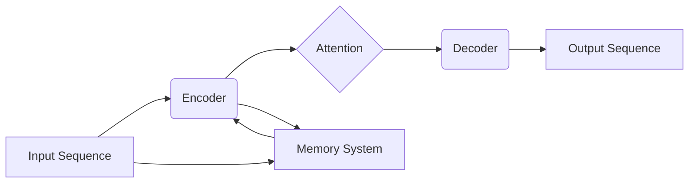

> Memory System, Chain, Transformer, Large Language Model, Attention Mechanism, Knowledge Representation, Data Structure, Algorithm, Deep Learning

## 1. 背景介绍

在现代人工智能领域，大型语言模型 (Large Language Model, LLM) 已经取得了令人瞩目的成就，例如在文本生成、翻译、问答等任务上展现出强大的能力。这些模型的成功离不开两个关键要素：**内存系统**和**链式结构**。

内存系统是 LLMs 处理和存储信息的基石，它决定了模型的容量和效率。链式结构，通常指 Transformer 架构中的自注意力机制 (Attention Mechanism)，赋予了 LLMs 理解上下文和捕捉长距离依赖的能力。

本文将深入探讨 Memory System 和 Chain 的关系，分析它们在 LLM 中的原理、架构、算法以及实际应用场景。

## 2. 核心概念与联系

### 2.1 Memory System

内存系统是计算机系统中存储和检索数据的核心部件。在 LLMs 中，内存系统扮演着至关重要的角色，它负责存储模型参数、中间计算结果以及外部知识。

**常见的 Memory System 类型：**

* **向量化存储:** 将数据表示为向量，并使用矩阵运算进行处理。
* **键值存储:** 使用键值对存储数据，方便快速检索。
* **图存储:** 将数据表示为图结构，适合存储和处理关系数据。

**Memory System 的关键特性：**

* **容量:** 存储数据的量级。
* **访问速度:** 检索数据的效率。
* **持久性:** 数据是否能够在系统重启后保持。

### 2.2 Chain (Transformer)

Transformer 是近年来深度学习领域中兴起的强大架构，它在自然语言处理任务上取得了突破性的进展。Transformer 的核心是自注意力机制，它允许模型关注输入序列中的不同位置，捕捉长距离依赖关系。

**Transformer 的基本结构：**

* **编码器 (Encoder):** 将输入序列编码为隐藏表示。
* **解码器 (Decoder):** 基于编码器的输出生成目标序列。
* **自注意力机制:** 允许模型关注输入序列中的不同位置，捕捉上下文信息。

**Chain 的优势：**

* **长距离依赖关系处理能力强:** 自注意力机制能够有效捕捉长距离依赖关系。
* **并行计算能力强:** Transformer 的结构允许并行计算，提高训练效率。

### 2.3 Memory System 与 Chain 的联系

Memory System 和 Chain 在 LLM 中相互关联，共同构成了模型的知识表示和推理能力。

* **Chain 利用 Memory System:** Chain 可以访问 Memory System 中存储的知识和信息，例如词向量、实体关系等，丰富模型的理解能力。
* **Memory System 受 Chain 影响:** Chain 的输出可以更新 Memory System 中的知识表示，例如通过训练生成新的词向量或实体关系。

**Mermaid 流程图:**



## 3. 核心算法原理 & 具体操作步骤

### 3.1 算法原理概述

LLMs 的训练过程本质上是一个优化过程，目标是找到最优的参数，使得模型能够生成最符合语义的输出。

**核心算法：**

* **反向传播算法 (Backpropagation):** 用于计算模型参数的梯度，并更新参数值。
* **优化算法 (Optimization Algorithm):** 用于更新模型参数，例如梯度下降法 (Gradient Descent) 和 Adam 算法。

### 3.2 算法步骤详解

1. **数据预处理:** 将原始文本数据转换为模型可以理解的格式，例如词嵌入和句子编码。
2. **模型初始化:** 为模型参数赋予初始值。
3. **前向传播:** 将输入数据通过模型进行处理，得到输出结果。
4. **损失函数计算:** 计算模型输出与真实值的差异，即损失值。
5. **反向传播:** 计算模型参数的梯度，并根据梯度更新参数值。
6. **重复步骤 3-5:** 迭代训练模型，直到损失值达到预设阈值。

### 3.3 算法优缺点

**优点:**

* **强大的泛化能力:** LLMs 可以应用于多种自然语言处理任务。
* **可解释性:** 通过分析模型的注意力机制，可以理解模型的决策过程。

**缺点:**

* **训练成本高:** LLMs 需要大量的计算资源和训练数据。
* **数据偏差:** LLMs 的训练数据可能存在偏差，导致模型输出存在偏见。

### 3.4 算法应用领域

* **文本生成:** 写作、翻译、对话系统等。
* **信息检索:** 搜索引擎、问答系统等。
* **代码生成:** 自动生成代码片段。
* **情感分析:** 分析文本的情感倾向。

## 4. 数学模型和公式 & 详细讲解 & 举例说明

### 4.1 数学模型构建

LLMs 的核心是神经网络模型，其数学模型基于线性变换、激活函数和损失函数。

**线性变换:**

$$
\mathbf{h} = \mathbf{W} \mathbf{x} + \mathbf{b}
$$

其中，$\mathbf{h}$ 是隐藏层输出，$\mathbf{x}$ 是输入数据，$\mathbf{W}$ 是权重矩阵，$\mathbf{b}$ 是偏置向量。

**激活函数:**

$$
\mathbf{a} = f(\mathbf{h})
$$

其中，$\mathbf{a}$ 是激活后的输出，$f$ 是激活函数，例如 ReLU 函数。

**损失函数:**

$$
L = \sum_{i=1}^{N} \mathcal{L}(y_i, \hat{y}_i)
$$

其中，$L$ 是损失值，$\mathcal{L}$ 是单个样本的损失函数，$y_i$ 是真实值，$\hat{y}_i$ 是模型预测值。

### 4.2 公式推导过程

反向传播算法的核心是计算梯度，并根据梯度更新参数值。

**梯度计算:**

$$
\frac{\partial L}{\partial \mathbf{W}} = \frac{\partial L}{\partial \mathbf{a}} \cdot \frac{\partial \mathbf{a}}{\partial \mathbf{h}} \cdot \frac{\partial \mathbf{h}}{\partial \mathbf{W}}
$$

### 4.3 案例分析与讲解

**举例说明:**

假设我们训练一个简单的文本分类模型，目标是将文本分类为正类或负类。

* **输入数据:** 文本序列
* **隐藏层:** 使用 ReLU 激活函数
* **输出层:** 使用 sigmoid 激活函数，输出概率值

损失函数可以使用交叉熵损失函数。

通过反向传播算法，我们可以计算模型参数的梯度，并更新参数值，最终训练出一个能够准确分类文本的模型。

## 5. 项目实践：代码实例和详细解释说明

### 5.1 开发环境搭建

* **操作系统:** Linux 或 macOS
* **编程语言:** Python
* **深度学习框架:** TensorFlow 或 PyTorch

### 5.2 源代码详细实现

```python
import tensorflow as tf

# 定义模型结构
model = tf.keras.Sequential([
    tf.keras.layers.Embedding(input_dim=vocab_size, output_dim=embedding_dim),
    tf.keras.layers.LSTM(units=hidden_size),
    tf.keras.layers.Dense(units=1, activation='sigmoid')
])

# 编译模型
model.compile(optimizer='adam', loss='binary_crossentropy', metrics=['accuracy'])

# 训练模型
model.fit(x_train, y_train, epochs=10)

# 评估模型
loss, accuracy = model.evaluate(x_test, y_test)
print('Loss:', loss)
print('Accuracy:', accuracy)
```

### 5.3 代码解读与分析

* **Embedding 层:** 将词向量化，将每个词映射到一个低维向量空间。
* **LSTM 层:** 用于处理文本序列，捕捉长距离依赖关系。
* **Dense 层:** 全连接层，用于分类。
* **Optimizer:** 用于更新模型参数。
* **Loss Function:** 用于计算模型预测值与真实值的差异。
* **Metrics:** 用于评估模型性能。

### 5.4 运行结果展示

训练完成后，我们可以使用测试数据评估模型的性能，例如计算准确率和损失值。

## 6. 实际应用场景

### 6.1 文本生成

* **机器翻译:** 将文本从一种语言翻译成另一种语言。
* **文本摘要:** 生成文本的简短摘要。
* **对话系统:** 创建能够与人类进行自然对话的系统。

### 6.2 信息检索

* **搜索引擎:** 根据用户查询，返回相关网页结果。
* **问答系统:** 根据用户问题，返回准确的答案。

### 6.3 代码生成

* **代码补全:** 根据代码上下文，自动补全代码片段。
* **代码生成:** 根据自然语言描述，自动生成代码。

### 6.4 未来应用展望

* **个性化教育:** 根据学生的学习情况，提供个性化的学习内容和辅导。
* **医疗诊断:** 辅助医生进行疾病诊断和治疗方案制定。
* **科学研究:** 加速科学研究的进展，例如药物研发和材料科学。

## 7. 工具和资源推荐

### 7.1 学习资源推荐

* **书籍:**
    * 《深度学习》
    * 《自然语言处理》
* **在线课程:**
    * Coursera
    * edX
* **博客和论坛:**
    * TensorFlow Blog
    * PyTorch Forum

### 7.2 开发工具推荐

* **深度学习框架:** TensorFlow, PyTorch
* **编程语言:** Python
* **文本处理工具:** NLTK, SpaCy

### 7.3 相关论文推荐

* **Attention Is All You Need:** https://arxiv.org/abs/1706.03762
* **BERT: Pre-training of Deep Bidirectional Transformers for Language Understanding:** https://arxiv.org/abs/1810.04805

## 8. 总结：未来发展趋势与挑战

### 8.1 研究成果总结

LLMs 在自然语言处理领域取得了显著进展，展现出强大的能力和潜力。

### 8.2 未来发展趋势

* **模型规模扩大:** 训练更大规模的 LLMs，提升模型能力。
* **多模态学习:** 将文本、图像、音频等多种模态数据融合，构建更全面的知识表示。
* **可解释性增强:** 研究 LLMs 的决策过程，提高模型的可解释性。

### 8.3 面临的挑战

* **数据偏差:** LLMs 的训练数据可能存在偏差，导致模型输出存在偏见。
* **计算资源:** 训练大型 LLMs 需要大量的计算资源。
* **安全性和隐私:** LLMs 可能被用于恶意目的，例如生成虚假信息和攻击系统。

### 8.4 研究展望

未来，LLMs 将继续朝着更强大、更安全、更可解释的方向发展，并在更多领域发挥重要作用。

## 9. 附录：常见问题与解答

**常见问题:**

* **什么是 LLMs?**
* **LLMs 的训练过程如何?**
* **LLMs 的应用场景有哪些?**
* **LLMs 的未来发展趋势是什么?**

**解答:**

* **什么是 LLMs?** LLMs 是指大型语言模型，是一种能够理解和生成人类语言的深度学习模型。
* **LLMs 的训练过程如何?** LLMs 的训练过程是一个优化过程，目标是找到最优的参数，使得模型能够生成最符合语义的输出。
* **LLMs 的应用场景有哪些?** LLMs 的应用场景非常广泛，例如文本生成、信息检索、代码生成等。
* **LLMs 的未来发展趋势是什么?** LLMs 将继续朝着更强大、更安全、更可解释的方向发展。

作者：禅与计算机程序设计艺术 / Zen and the Art of Computer Programming


<end_of_turn>