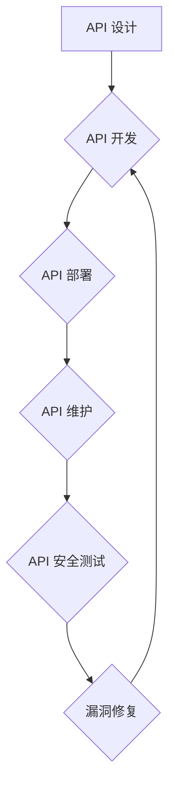

> OWASP, API 安全, API 风险清单, 安全测试, 应用程序安全, 网络安全, 漏洞扫描, 防御策略

## 1. 背景介绍

在当今数字化时代，应用程序接口 (API) 已成为构建现代软件架构和连接不同系统不可或缺的组件。API 的普及带来了许多便利，但也为应用程序安全带来了新的挑战。攻击者可以利用 API 的漏洞进行数据泄露、系统入侵、业务逻辑操纵等恶意活动。

OWASP (Open Web Application Security Project) 作为全球领先的 Web 应用安全组织，发布了 OWASP API 安全风险清单，旨在帮助开发人员和安全专业人员识别和缓解 API 相关的安全风险。该清单列出了 10 个最常见的 API 安全风险，并提供了详细的描述、缓解措施和最佳实践。

## 2. 核心概念与联系

### 2.1 API 安全风险

API 安全风险是指通过利用 API 的漏洞，攻击者可以对应用程序或系统造成损害的可能性。这些风险可能导致数据泄露、系统崩溃、业务中断等严重后果。

### 2.2 OWASP API 安全风险清单

OWASP API 安全风险清单是 OWASP 基于多年研究和实践经验总结出的 API 安全风险的分类和描述。该清单涵盖了 API 设计、开发、部署和维护各个阶段的潜在风险，并提供了相应的缓解措施和最佳实践。

### 2.3 API 安全测试

API 安全测试是指通过自动化工具和手工测试手段，识别和验证 API 中存在的安全漏洞。API 安全测试可以帮助开发人员和安全专业人员发现潜在的风险，并及时采取措施进行修复。

**Mermaid 流程图**



## 3. 核心算法原理 & 具体操作步骤

### 3.1  算法原理概述

API 安全测试算法通常基于以下核心原理：

* **漏洞扫描:** 利用自动化工具扫描 API 接口，识别常见的漏洞类型，例如 SQL 注入、跨站脚本攻击 (XSS) 等。
* **输入验证:** 对 API 接口的输入数据进行验证，确保数据格式正确、合法性，防止恶意输入导致漏洞。
* **授权验证:** 对 API 接口的访问进行授权验证，确保只有授权用户才能访问特定资源。
* **日志审计:** 记录 API 接口的访问日志，方便追踪异常行为和安全事件。

### 3.2  算法步骤详解

API 安全测试的具体步骤如下：

1. **目标识别:** 明确需要测试的 API 接口和目标范围。
2. **漏洞扫描:** 使用自动化工具扫描 API 接口，识别潜在的漏洞。
3. **漏洞验证:** 对扫描到的漏洞进行手工验证，确认漏洞的存在性和影响范围。
4. **漏洞修复:** 根据漏洞类型和影响范围，制定相应的修复方案。
5. **测试报告:** 生成 API 安全测试报告，记录测试结果、漏洞信息和修复建议。

### 3.3  算法优缺点

**优点:**

* **自动化程度高:** 自动化工具可以快速扫描大量 API 接口，提高测试效率。
* **覆盖面广:** 可以识别多种类型的 API 安全漏洞。
* **成本效益高:** 相比手工测试，自动化测试成本更低。

**缺点:**

* **无法发现所有漏洞:** 自动化工具可能无法识别所有类型的漏洞，需要结合手工测试进行验证。
* **需要专业知识:** 使用自动化工具进行 API 安全测试需要一定的专业知识和经验。
* **易受攻击者绕过:** 攻击者可以利用各种技巧绕过自动化工具的检测。

### 3.4  算法应用领域

API 安全测试算法广泛应用于以下领域:

* **金融行业:** 保护金融数据和交易安全。
* **医疗行业:** 保护患者隐私和医疗数据安全。
* **电商行业:** 保护用户数据和交易安全。
* **互联网公司:** 保护用户数据和系统安全。

## 4. 数学模型和公式 & 详细讲解 & 举例说明

### 4.1  数学模型构建

API 安全风险评估模型可以采用基于概率的数学模型，例如贝叶斯网络。该模型可以将 API 的安全风险因素作为节点，并将风险之间的依赖关系作为边，从而构建一个概率图模型。

### 4.2  公式推导过程

贝叶斯网络中的概率计算可以使用贝叶斯公式进行推导。贝叶斯公式描述了事件发生的概率在已知条件下如何变化。

$$P(A|B) = \frac{P(B|A)P(A)}{P(B)}$$

其中：

* $P(A|B)$ 是事件 A 在事件 B 发生的条件下的概率。
* $P(B|A)$ 是事件 B 在事件 A 发生的条件下的概率。
* $P(A)$ 是事件 A 的概率。
* $P(B)$ 是事件 B 的概率。

### 4.3  案例分析与讲解

假设我们构建了一个 API 安全风险评估模型，其中包含以下风险因素：

* $A$: API 代码质量
* $B$: API 授权验证机制
* $C$: API 日志审计机制

我们可以使用贝叶斯公式计算出 API 安全风险的概率，例如计算 API 遭受 SQL 注入攻击的概率。

$$P(SQL|A,B,C) = \frac{P(SQL|A)P(SQL|B)P(SQL|C)P(A)P(B)P(C)}{P(SQL)}$$

其中：

* $P(SQL|A)$ 是 API 代码质量对 SQL 注入攻击概率的影响。
* $P(SQL|B)$ 是 API 授权验证机制对 SQL 注入攻击概率的影响。
* $P(SQL|C)$ 是 API 日志审计机制对 SQL 注入攻击概率的影响。
* $P(A)$, $P(B)$, $P(C)$ 分别是 API 代码质量、授权验证机制和日志审计机制的概率。
* $P(SQL)$ 是 API 遭受 SQL 注入攻击的总概率。

## 5. 项目实践：代码实例和详细解释说明

### 5.1  开发环境搭建

* 操作系统: Ubuntu 20.04 LTS
* 编程语言: Python 3.8
* 工具: OWASP ZAP、Postman

### 5.2  源代码详细实现

```python
import requests

# API 接口地址
api_url = "https://api.example.com/users"

# API 接口请求头
headers = {
    "Authorization": "Bearer your_api_token"
}

# API 接口请求参数
params = {
    "limit": 10,
    "offset": 0
}

# 发送 API 接口请求
response = requests.get(api_url, headers=headers, params=params)

# 检查 API 接口响应状态码
if response.status_code == 200:
    # 解析 API 接口响应数据
    data = response.json()
    # 打印 API 接口响应数据
    print(data)
else:
    # 打印 API 接口响应错误信息
    print(f"API 接口请求失败: {response.status_code}")
```

### 5.3  代码解读与分析

* 该代码示例演示了如何使用 Python 的 `requests` 库发送 API 接口请求。
* `api_url` 变量存储了 API 接口地址。
* `headers` 变量存储了 API 接口请求头，其中包含授权令牌。
* `params` 变量存储了 API 接口请求参数。
* `requests.get()` 方法发送 GET 请求到 API 接口。
* `response.status_code` 属性返回 API 接口响应状态码。
* `response.json()` 方法解析 API 接口响应数据为 JSON 格式。

### 5.4  运行结果展示

如果 API 接口请求成功，则会打印 API 接口响应数据。如果 API 接口请求失败，则会打印 API 接口响应错误信息。

## 6. 实际应用场景

### 6.1  金融行业

API 安全测试可以帮助金融机构保护用户资金和个人信息安全。例如，可以测试银行应用程序的 API 接口，确保其能够防止 SQL 注入、跨站脚本攻击等漏洞。

### 6.2  医疗行业

API 安全测试可以帮助医疗机构保护患者隐私和医疗数据安全。例如，可以测试电子病历系统 API 接口，确保其能够防止未授权访问和数据泄露。

### 6.3  电商行业

API 安全测试可以帮助电商平台保护用户数据和交易安全。例如，可以测试支付系统 API 接口，确保其能够防止欺诈和数据泄露。

### 6.4  未来应用展望

随着 API 的普及和应用范围的不断扩大，API 安全测试将变得越来越重要。未来，API 安全测试技术将更加智能化、自动化和精准化，能够更有效地识别和缓解 API 安全风险。

## 7. 工具和资源推荐

### 7.1  学习资源推荐

* OWASP API 安全风险清单: https://owasp.org/www-project-api-security-top-ten/
* OWASP API 安全测试指南: https://owasp.org/www-project-api-security-testing-guide/

### 7.2  开发工具推荐

* OWASP ZAP: https://owasp.org/www-project-zap/
* Postman: https://www.postman.com/

### 7.3  相关论文推荐

* API Security Testing: A Survey
* Towards a Comprehensive Framework for API Security Testing

## 8. 总结：未来发展趋势与挑战

### 8.1  研究成果总结

OWASP API 安全风险清单和 API 安全测试指南为 API 安全提供了重要的指导和参考。API 安全测试技术不断发展，能够更有效地识别和缓解 API 安全风险。

### 8.2  未来发展趋势

* **人工智能驱动的 API 安全测试:** 利用人工智能技术自动识别和分析 API 安全漏洞。
* **无代码 API 安全测试:** 提供无需编程知识的 API 安全测试工具，方便非技术人员进行安全测试。
* **API 安全自动化:** 将 API 安全测试集成到软件开发流程中，实现自动化测试和漏洞修复。

### 8.3  面临的挑战

* **API 攻击手段的不断演变:** 攻击者不断开发新的攻击手段，挑战 API 安全测试技术的有效性。
* **API 的复杂性和多样性:** 不同的 API 具有不同的架构和功能，需要针对性地进行安全测试。
* **API 安全意识的提升:** 开发人员和安全专业人员需要提高 API 安全意识，重视 API 安全测试。

### 8.4  研究展望

未来，API 安全研究将继续关注以下方面:

* **开发更智能、更精准的 API 安全测试技术。**
* **建立 API 安全标准和规范，提高 API 安全整体水平。**
* **加强 API 安全教育和培训，提升 API 安全意识。**

## 9. 附录：常见问题与解答

### 9.1  常见问题

* **如何选择合适的 API 安全测试工具？**

* **如何进行 API 安全测试？**

* **如何缓解 API 安全风险？**

### 9.2  解答

* 选择 API 安全测试工具时，需要考虑工具的功能、易用性、价格等因素。

* API 安全测试包括漏洞扫描、输入验证、授权验证、日志审计等步骤。

* 缓解 API 安全风险的方法包括代码审查、输入验证、授权验证、日志审计、安全培训等。


作者：禅与计算机程序设计艺术 / Zen and the Art of Computer Programming 
<end_of_turn>