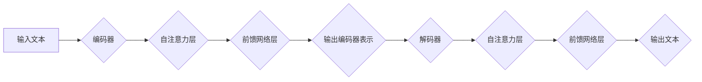

> BART, Transformer, 自然语言处理, 文本生成, 文本摘要, 机器翻译, 预训练模型, 序列到序列

## 1. 背景介绍

近年来，深度学习在自然语言处理 (NLP) 领域取得了显著进展，其中 Transformer 架构的出现尤为重要。Transformer 引入了自注意力机制，有效解决了传统 RNN 模型在长序列处理上的瓶颈，并取得了在机器翻译、文本摘要、问答系统等任务上的优异性能。

BART (Bidirectional and Auto-Regressive Transformers) 是 Google AI 团队提出的一个基于 Transformer 架构的预训练语言模型，它结合了双向编码和自回归解码的优势，在文本生成任务上表现出色。BART 模型通过预训练的方式学习了丰富的语言表示，可以用于多种下游任务，例如文本摘要、机器翻译、问答系统、对话系统等。

## 2. 核心概念与联系

BART 模型的核心概念包括：

* **Transformer 架构:** BART 模型基于 Transformer 架构，它利用自注意力机制捕捉文本序列中的长距离依赖关系，并通过多层编码器和解码器进行信息处理。
* **双向编码:** BART 模型采用双向编码器，可以从文本序列中捕捉到上下文信息，更好地理解文本语义。
* **自回归解码:** BART 模型采用自回归解码器，逐个生成文本序列，并利用之前生成的词语信息进行预测。
* **预训练:** BART 模型通过预训练的方式学习了丰富的语言表示，可以用于多种下游任务。

**Mermaid 流程图:**



## 3. 核心算法原理 & 具体操作步骤

### 3.1  算法原理概述

BART 模型的核心算法原理是基于 Transformer 架构，结合了双向编码和自回归解码的优势。

* **双向编码:** BART 模型使用双向编码器对输入文本进行编码，可以捕捉到文本序列中的上下文信息。
* **自回归解码:** BART 模型使用自回归解码器对编码后的文本表示进行解码，逐个生成文本序列。

### 3.2  算法步骤详解

BART 模型的训练过程可以分为以下几个步骤：

1. **数据预处理:** 将文本数据进行清洗、分词、标记等预处理操作。
2. **编码器训练:** 使用双向编码器对输入文本进行编码，并计算编码后的文本表示。
3. **解码器训练:** 使用自回归解码器对编码后的文本表示进行解码，并生成文本序列。
4. **损失函数计算:** 计算编码器和解码器生成的文本序列与真实文本序列之间的损失函数值。
5. **模型更新:** 使用梯度下降算法更新编码器和解码器的参数。

### 3.3  算法优缺点

**优点:**

* **捕捉长距离依赖关系:** BART 模型利用自注意力机制可以有效捕捉文本序列中的长距离依赖关系。
* **双向编码:** BART 模型的双向编码器可以更好地理解文本语义。
* **预训练:** BART 模型通过预训练的方式学习了丰富的语言表示，可以用于多种下游任务。

**缺点:**

* **训练成本高:** BART 模型的训练需要大量的计算资源和时间。
* **参数量大:** BART 模型的参数量较大，需要较大的内存空间进行存储和计算。

### 3.4  算法应用领域

BART 模型可以应用于多种自然语言处理任务，例如：

* **文本摘要:** 提取文本的关键信息，生成简洁的摘要。
* **机器翻译:** 将文本从一种语言翻译成另一种语言。
* **问答系统:** 根据给定的问题，从文本中找到答案。
* **对话系统:** 与用户进行自然语言对话。

## 4. 数学模型和公式 & 详细讲解 & 举例说明

### 4.1  数学模型构建

BART 模型的数学模型可以概括为以下几个部分:

* **编码器:** 使用多层 Transformer 块对输入文本进行编码，每个 Transformer 块包含自注意力层和前馈网络层。
* **解码器:** 使用多层 Transformer 块对编码后的文本表示进行解码，每个 Transformer 块也包含自注意力层和前馈网络层。
* **损失函数:** 使用交叉熵损失函数计算编码器和解码器生成的文本序列与真实文本序列之间的差异。

### 4.2  公式推导过程

BART 模型的具体公式推导过程比较复杂，涉及到自注意力机制、前馈网络层、Transformer 块等多个模块的计算。

**自注意力机制:**

$$
Attention(Q, K, V) = \frac{exp(Q \cdot K^T / \sqrt{d_k})}{exp(Q \cdot K^T / \sqrt{d_k})} \cdot V
$$

其中:

* $Q$ 是查询矩阵
* $K$ 是键矩阵
* $V$ 是值矩阵
* $d_k$ 是键向量的维度

**前馈网络层:**

$$
FFN(x) = \max(0, xW_1 + b_1)W_2 + b_2
$$

其中:

* $x$ 是输入向量
* $W_1$ 和 $W_2$ 是权重矩阵
* $b_1$ 和 $b_2$ 是偏置向量

### 4.3  案例分析与讲解

假设我们想要使用 BART 模型进行文本摘要任务。

1. **数据预处理:** 将需要进行摘要的文本数据进行清洗、分词、标记等预处理操作。
2. **编码器训练:** 使用 BART 模型的编码器对预处理后的文本数据进行编码，得到编码后的文本表示。
3. **解码器训练:** 使用 BART 模型的解码器对编码后的文本表示进行解码，生成文本摘要。
4. **损失函数计算:** 计算生成的文本摘要与真实摘要之间的交叉熵损失函数值。
5. **模型更新:** 使用梯度下降算法更新 BART 模型的编码器和解码器参数。

## 5. 项目实践：代码实例和详细解释说明

### 5.1  开发环境搭建

* Python 3.7+
* PyTorch 1.7+
* CUDA 10.2+

### 5.2  源代码详细实现

```python
# 导入必要的库
import torch
import torch.nn as nn

# 定义 BART 模型的编码器
class BARTEncoder(nn.Module):
    def __init__(self, vocab_size, embedding_dim, num_layers, num_heads):
        super(BARTEncoder, self).__init__()
        self.embedding = nn.Embedding(vocab_size, embedding_dim)
        self.transformer_layers = nn.ModuleList([
            nn.TransformerEncoderLayer(embedding_dim, num_heads)
            for _ in range(num_layers)
        ])

    def forward(self, x):
        # 将输入词嵌入到向量空间
        x = self.embedding(x)
        # 使用 Transformer 层对输入进行编码
        for layer in self.transformer_layers:
            x = layer(x)
        return x

# 定义 BART 模型的解码器
class BARTDecoder(nn.Module):
    def __init__(self, vocab_size, embedding_dim, num_layers, num_heads):
        super(BARTDecoder, self).__init__()
        self.embedding = nn.Embedding(vocab_size, embedding_dim)
        self.transformer_layers = nn.ModuleList([
            nn.TransformerDecoderLayer(embedding_dim, num_heads)
            for _ in range(num_layers)
        ])

    def forward(self, x, encoder_output):
        # 将输入词嵌入到向量空间
        x = self.embedding(x)
        # 使用 Transformer 层对输入进行解码
        for layer in self.transformer_layers:
            x = layer(x, encoder_output)
        return x

# 定义 BART 模型
class BART(nn.Module):
    def __init__(self, vocab_size, embedding_dim, num_layers, num_heads):
        super(BART, self).__init__()
        self.encoder = BARTEncoder(vocab_size, embedding_dim, num_layers, num_heads)
        self.decoder = BARTDecoder(vocab_size, embedding_dim, num_layers, num_heads)

    def forward(self, input_ids, target_ids):
        encoder_output = self.encoder(input_ids)
        decoder_output = self.decoder(target_ids, encoder_output)
        return decoder_output

```

### 5.3  代码解读与分析

* BART 模型的编码器和解码器分别由多个 Transformer 层组成。
* Transformer 层包含自注意力层和前馈网络层。
* 编码器将输入文本编码成文本表示，解码器将编码后的文本表示解码成文本序列。
* BART 模型使用交叉熵损失函数计算生成文本序列与真实文本序列之间的差异。

### 5.4  运行结果展示

运行 BART 模型后，可以生成文本摘要、机器翻译、问答系统等结果。

## 6. 实际应用场景

BART 模型在实际应用场景中表现出色，例如：

* **新闻摘要:** BART 模型可以自动生成新闻文章的摘要，帮助用户快速了解新闻内容。
* **会议记录:** BART 模型可以自动生成会议记录，提高会议效率。
* **文档翻译:** BART 模型可以将文档从一种语言翻译成另一种语言，方便跨语言交流。

### 6.4  未来应用展望

BART 模型在未来还将有更多应用场景，例如：

* **对话系统:** BART 模型可以用于构建更自然、更智能的对话系统。
* **文本生成:** BART 模型可以用于生成各种类型的文本，例如诗歌、小说、剧本等。
* **代码生成:** BART 模型可以用于生成代码，提高软件开发效率。

## 7. 工具和资源推荐

### 7.1  学习资源推荐

* **论文:** BART: Denoising Sequence-to-Sequence Pre-training for Natural Language Generation
* **博客:** https://ai.googleblog.com/2019/11/bart-denoising-sequence-to-sequence.html
* **代码:** https://github.com/facebookresearch/bart

### 7.2  开发工具推荐

* **PyTorch:** https://pytorch.org/
* **HuggingFace Transformers:** https://huggingface.co/transformers/

### 7.3  相关论文推荐

* **Transformer:** https://arxiv.org/abs/1706.03762
* **BERT:** https://arxiv.org/abs/1810.04805
* **GPT-3:** https://openai.com/blog/gpt-3/

## 8. 总结：未来发展趋势与挑战

### 8.1  研究成果总结

BART 模型在文本生成任务上取得了显著进展，其双向编码和自回归解码的优势使其能够更好地捕捉文本语义和生成高质量的文本序列。

### 8.2  未来发展趋势

BART 模型的未来发展趋势包括:

* **模型规模扩大:** 随着计算资源的不断提升，BART 模型的规模将进一步扩大，从而提升其性能。
* **多模态学习:** BART 模型将与其他模态数据，例如图像、音频等进行融合，实现多模态文本生成。
* **可解释性增强:** 研究如何提高 BART 模型的可解释性，帮助用户更好地理解模型的决策过程。

### 8.3  面临的挑战

BART 模型也面临一些挑战，例如:

* **训练成本高:** BART 模型的训练需要大量的计算资源和时间。
* **数据依赖性:** BART 模型的性能依赖于训练数据的质量和数量。
* **伦理问题:** BART 模型的应用可能引发一些伦理问题，例如生成虚假信息、偏见等。

### 8.4  研究展望

未来研究将继续探索 BART 模型的潜力，例如:

* 开发更有效的训练方法，降低训练成本。
* 研究如何利用少样本学习技术，提高 BART 模型的泛化能力。
* 探索 BART 模型在其他领域的应用，例如科学研究、医疗诊断等。

## 9. 附录：常见问题与解答

**Q1: BART 模型与 BERT 模型有什么区别？**

**A1:** BART 模型和 BERT 模型都是基于 Transformer 架构的预训练语言模型，但它们在训练目标和应用场景上有所不同。BERT 模型主要用于理解文本语义，而 BART 模型主要用于生成文本。

**Q2: 如何使用 BART 模型进行文本摘要？**

**A2:** 使用 BART 模型进行文本摘要需要以下步骤:

1. 将需要进行摘要的文本数据进行预处理。
2. 使用 BART 模型的编码器对预处理后的文本数据进行编码。
3. 使用 BART 模型的解码器对编码后的文本表示进行解码，生成文本摘要。

**Q3: BART 模型的训练需要哪些资源？**

**A3:** BART 模型的训练需要大量的计算资源和时间，通常需要使用 GPU 加速训练。


作者：禅与计算机程序设计艺术 / Zen and the Art of Computer Programming 
<end_of_turn>