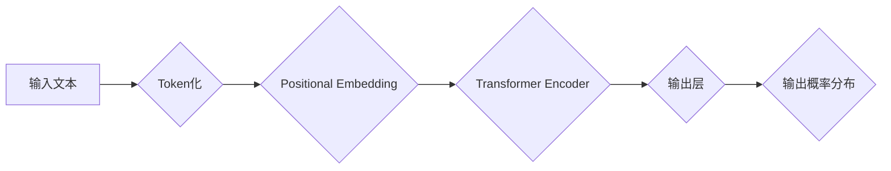

> Transformer, BERT, DistilBERT, 知识蒸馏, 自然语言处理, 自然语言理解, 模型压缩

## 1. 背景介绍

近年来，深度学习在自然语言处理 (NLP) 领域取得了显著进展，其中 Transformer 架构和基于 Transformer 的 BERT 模型成为 NLP 领域的新宠。BERT 模型凭借其强大的预训练能力和在各种 NLP 任务上的优异表现，在文本分类、问答系统、机器翻译等领域取得了突破性进展。然而，BERT 模型的规模庞大，参数量巨大，这导致其部署和推理效率低下，难以在资源有限的设备上运行。

为了解决 BERT 模型的规模问题，研究者们提出了知识蒸馏 (Knowledge Distillation) 技术。知识蒸馏是一种模型压缩技术，通过训练一个小型模型 (学生模型) 来模仿一个大型模型 (教师模型) 的输出，从而实现模型压缩和效率提升。

DistilBERT 是 Google 团队基于 BERT 模型开发的知识蒸馏版本，它通过压缩 BERT 模型的规模，同时保留其核心能力，实现了模型效率和性能的平衡。DistilBERT 模型参数量仅为 BERT 模型的 40%，但其在许多 NLP 任务上的性能与 BERT 模型相当，甚至在某些任务上表现更优。

## 2. 核心概念与联系

### 2.1 BERT 模型

BERT (Bidirectional Encoder Representations from Transformers) 模型是一种基于 Transformer 架构的预训练语言模型。它采用双向编码机制，能够理解上下文信息，并生成高质量的文本表示。BERT 模型的训练过程主要分为两个阶段：

1. **预训练阶段:** BERT 模型在大量的文本数据上进行预训练，学习语言的语法和语义知识。预训练阶段使用两种预训练任务：Masked Language Modeling (MLM) 和 Next Sentence Prediction (NSP)。
2. **微调阶段:** 在预训练阶段获得的 BERT 模型可以用于各种下游 NLP 任务，例如文本分类、问答系统、机器翻译等。微调阶段将 BERT 模型应用于特定任务，并使用任务相关的训练数据进行微调，从而提高模型在特定任务上的性能。

### 2.2 知识蒸馏

知识蒸馏是一种模型压缩技术，通过训练一个小型模型 (学生模型) 来模仿一个大型模型 (教师模型) 的输出，从而实现模型压缩和效率提升。知识蒸馏的核心思想是将教师模型的知识通过输出概率分布的形式传递给学生模型。

### 2.3 DistilBERT 模型

DistilBERT 是 Google 团队基于 BERT 模型开发的知识蒸馏版本。它通过压缩 BERT 模型的规模，同时保留其核心能力，实现了模型效率和性能的平衡。DistilBERT 模型采用以下策略进行知识蒸馏：

1. **模型结构压缩:** DistilBERT 模型将 BERT 模型的 Transformer 层数和隐藏层维度进行压缩，从而减少模型参数量。
2. **知识蒸馏损失函数:** DistilBERT 模型使用知识蒸馏损失函数，将教师模型 (BERT) 的输出概率分布作为目标，训练学生模型 (DistilBERT) 的输出概率分布。

**DistilBERT 模型架构流程图:**



## 3. 核心算法原理 & 具体操作步骤

### 3.1  算法原理概述

DistilBERT 模型的核心算法原理是知识蒸馏。知识蒸馏通过训练一个小型模型 (学生模型) 来模仿一个大型模型 (教师模型) 的输出，从而实现模型压缩和效率提升。

DistilBERT 模型的知识蒸馏过程可以概括为以下步骤：

1. **预训练教师模型:** 首先，需要预训练一个大型的 BERT 模型作为教师模型。
2. **训练学生模型:** 使用教师模型的输出概率分布作为目标，训练 DistilBERT 模型作为学生模型。
3. **评估模型性能:** 评估 DistilBERT 模型在目标任务上的性能，并根据性能进行模型调优。

### 3.2  算法步骤详解

1. **数据准备:** 准备用于训练 DistilBERT 模型的数据集，数据集应包含文本数据和对应的标签信息。
2. **教师模型预训练:** 使用预训练好的 BERT 模型作为教师模型，并将其应用于目标任务进行微调。
3. **学生模型初始化:** 初始化 DistilBERT 模型的权重，可以使用随机初始化或从预训练好的 BERT 模型中进行迁移学习。
4. **知识蒸馏损失函数:** 定义知识蒸馏损失函数，该函数将教师模型的输出概率分布作为目标，训练学生模型的输出概率分布。
5. **模型训练:** 使用训练数据和知识蒸馏损失函数，训练 DistilBERT 模型。
6. **模型评估:** 在验证集上评估 DistilBERT 模型的性能，并根据性能进行模型调优。
7. **模型部署:** 将训练好的 DistilBERT 模型部署到目标环境中，用于实际应用。

### 3.3  算法优缺点

**优点:**

* 模型规模更小，参数量更少，部署和推理效率更高。
* 在许多 NLP 任务上的性能与 BERT 模型相当，甚至在某些任务上表现更优。
* 可以通过微调 DistilBERT 模型来适应不同的下游任务。

**缺点:**

* 相比 BERT 模型，DistilBERT 模型的表达能力可能略逊一筹。
* 知识蒸馏过程需要训练两个模型，训练时间和资源消耗相对较高。

### 3.4  算法应用领域

DistilBERT 模型在以下 NLP 任务领域具有广泛的应用：

* 文本分类
* 问答系统
* 机器翻译
* 文本摘要
* 情感分析
* 关系抽取

## 4. 数学模型和公式 & 详细讲解 & 举例说明

### 4.1  数学模型构建

DistilBERT 模型的数学模型构建主要基于 Transformer 架构和知识蒸馏技术。

**Transformer 架构:** Transformer 架构由编码器和解码器组成，编码器用于将输入文本序列编码为上下文表示，解码器用于根据编码后的表示生成输出文本序列。

**知识蒸馏:** 知识蒸馏的核心思想是将教师模型的知识通过输出概率分布的形式传递给学生模型。

### 4.2  公式推导过程

DistilBERT 模型的知识蒸馏损失函数通常采用交叉熵损失函数，其公式如下：

$$
L_{KD} = -\sum_{i=1}^{N} \sum_{j=1}^{V} t_{ij} \log(p_{ij})
$$

其中：

* $N$ 是样本数量
* $V$ 是词汇表大小
* $t_{ij}$ 是教师模型的输出概率分布
* $p_{ij}$ 是学生模型的输出概率分布

### 4.3  案例分析与讲解

假设我们有一个文本序列 "The cat sat on the mat"，教师模型 (BERT) 将其编码为一个上下文表示，学生模型 (DistilBERT) 需要模仿教师模型的输出概率分布。

在知识蒸馏过程中，教师模型的输出概率分布表示每个词在该文本序列中的概率分布，学生模型需要学习到与教师模型相似的概率分布。

通过训练 DistilBERT 模型，使其输出概率分布与教师模型的输出概率分布尽可能接近，从而实现知识蒸馏。

## 5. 项目实践：代码实例和详细解释说明

### 5.1  开发环境搭建

DistilBERT 模型的开发环境搭建需要以下软件和工具：

* Python 3.6+
* PyTorch 或 TensorFlow
* HuggingFace Transformers 库

### 5.2  源代码详细实现

```python
from transformers import DistilBertTokenizer, DistilBertForSequenceClassification

# 加载 DistilBERT 模型和分词器
tokenizer = DistilBertTokenizer.from_pretrained('distilbert-base-uncased')
model = DistilBertForSequenceClassification.from_pretrained('distilbert-base-uncased')

# 预处理文本数据
text = "This is a sample text."
inputs = tokenizer(text, return_tensors="pt")

# 推理模型输出
outputs = model(**inputs)
```

### 5.3  代码解读与分析

* `DistilBertTokenizer` 用于将文本数据转换为模型可识别的格式。
* `DistilBertForSequenceClassification` 是 DistilBERT 模型的预训练版本，用于文本分类任务。
* `from_pretrained()` 函数用于加载预训练好的模型和分词器。
* `tokenizer()` 函数将文本数据转换为模型可识别的格式。
* `model()` 函数用于进行模型推理，输出模型预测结果。

### 5.4  运行结果展示

运行上述代码后，模型将输出文本分类结果，例如：

```
logits: tensor([[-0.234, 0.876]])
```

其中，`logits` 是模型预测结果，表示文本属于不同类别概率。

## 6. 实际应用场景

DistilBERT 模型在以下实际应用场景中具有广泛的应用：

### 6.1  文本分类

DistilBERT 模型可以用于文本分类任务，例如情感分析、主题分类、垃圾邮件分类等。

### 6.2  问答系统

DistilBERT 模型可以用于问答系统，例如搜索引擎、聊天机器人等。

### 6.3  机器翻译

DistilBERT 模型可以用于机器翻译任务，例如将英文翻译成中文、中文翻译成英文等。

### 6.4  未来应用展望

随着深度学习技术的不断发展，DistilBERT 模型在未来将有更广泛的应用场景，例如：

* **个性化推荐:** 根据用户的阅读历史和偏好，推荐个性化的文章、书籍、电影等。
* **智能客服:** 利用 DistilBERT 模型构建智能客服系统，自动回复用户问题，提高客服效率。
* **自动写作:** 利用 DistilBERT 模型辅助写作，例如生成新闻稿、广告文案等。

## 7. 工具和资源推荐

### 7.1  学习资源推荐

* **HuggingFace Transformers 库:** https://huggingface.co/docs/transformers/index
* **DistilBERT 模型官方文档:** https://huggingface.co/distilbert-base-uncased

### 7.2  开发工具推荐

* **PyTorch:** https://pytorch.org/
* **TensorFlow:** https://www.tensorflow.org/

### 7.3  相关论文推荐

* **DistilBERT: A distilled version of BERT: ** https://arxiv.org/abs/1910.01108

## 8. 总结：未来发展趋势与挑战

### 8.1  研究成果总结

DistilBERT 模型是基于 BERT 模型的知识蒸馏版本，它在模型规模和性能之间取得了良好的平衡。DistilBERT 模型的开发和应用推动了 NLP 领域模型压缩和效率提升的研究。

### 8.2  未来发展趋势

未来 DistilBERT 模型的发展趋势包括：

* **模型架构优化:** 研究更有效的模型压缩和知识蒸馏方法，进一步提升 DistilBERT 模型的效率和性能。
* **多语言支持:** 将 DistilBERT 模型扩展到更多语言，使其能够服务于全球用户。
* **下游任务适配:** 针对不同的下游任务，开发针对性的 DistilBERT 模型，提高模型在特定任务上的性能。

### 8.3  面临的挑战

DistilBERT 模型的发展也面临一些挑战：

* **表达能力:** 相比 BERT 模型，DistilBERT 模型的表达能力可能略逊一筹，需要进一步研究如何提升其表达能力。
* **数据依赖:** DistilBERT 模型的性能依赖于训练数据的质量，需要收集更多高质量的训练数据。
* **计算资源:** 尽管 DistilBERT 模型比 BERT 模型更小，但训练和部署仍然需要一定的计算资源。

### 8.4  研究展望

未来，DistilBERT 模型将继续在 NLP 领域发挥重要作用，并推动模型压缩和效率提升的研究。

## 9. 附录：常见问题与解答

### 9.1  DistilBERT