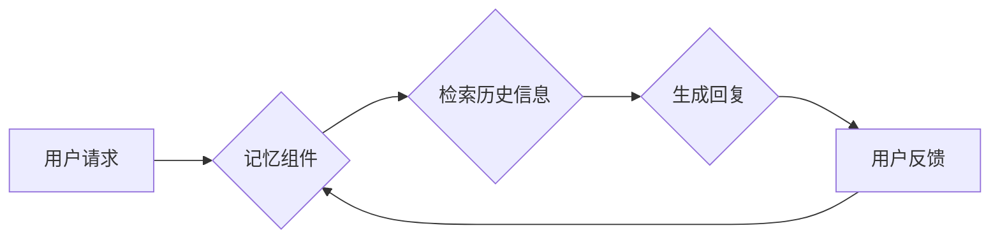

> LangChain, 记忆组件, 应用程序, 自然语言处理, 知识图谱, 嵌入式模型, 检索式模型

## 1. 背景介绍

近年来，大型语言模型（LLM）在自然语言处理（NLP）领域取得了显著进展，展现出强大的文本生成、理解和对话能力。然而，LLM通常缺乏记忆能力，无法记住之前对话中的信息，这限制了其在实际应用中的表现。为了解决这个问题，LangChain 框架引入了记忆组件的概念，赋予 LLM 持久的记忆，使其能够更好地理解和响应用户请求。

记忆组件是 LangChain 中一个重要的模块，它负责存储和检索 LLM 的历史对话信息。通过记忆组件，LLM 可以访问之前对话中的上下文，从而提供更准确、更连贯的回复。

## 2. 核心概念与联系

### 2.1 记忆组件的类型

LangChain 提供多种类型的记忆组件，包括：

* **ListMemory:** 基于列表存储历史对话信息，简单易用，但无法进行高效的检索。
* **SQLDatabase:** 使用 SQL 数据库存储信息，支持高效的查询和检索，但需要额外的数据库配置。
* **VectorStoreMemory:** 使用向量数据库存储信息，可以进行语义搜索，检索与用户请求最相关的历史对话片段。

### 2.2 记忆组件的架构

记忆组件通常由以下几个部分组成：

* **存储层:** 用于存储历史对话信息。
* **检索层:** 用于根据用户请求检索相关信息。
* **更新层:** 用于更新历史对话信息。

**Mermaid 流程图:**



## 3. 核心算法原理 & 具体操作步骤

### 3.1  算法原理概述

记忆组件的核心算法原理是根据用户请求检索与之相关的历史对话信息。不同的记忆组件使用不同的算法进行检索。例如，ListMemory 使用线性搜索算法，SQLDatabase 使用 SQL 查询语句，VectorStoreMemory 使用向量相似度计算算法。

### 3.2  算法步骤详解

**VectorStoreMemory 算法步骤详解:**

1. 将用户请求转换为向量表示。
2. 使用向量相似度计算算法，检索与用户请求向量最相似的历史对话向量。
3. 从检索到的历史对话向量中提取相关信息，生成回复。

### 3.3  算法优缺点

**VectorStoreMemory 算法的优缺点:**

* **优点:** 能够进行语义搜索，检索与用户请求最相关的历史对话片段。
* **缺点:** 需要额外的向量数据库配置，计算成本较高。

### 3.4  算法应用领域

记忆组件广泛应用于各种 NLP 应用程序，例如：

* **聊天机器人:** 赋予聊天机器人记忆能力，使其能够记住用户历史对话，提供更个性化的服务。
* **问答系统:** 帮助问答系统理解用户问题上下文，提供更准确的答案。
* **文本摘要:** 使用历史对话信息，生成更完整的文本摘要。

## 4. 数学模型和公式 & 详细讲解 & 举例说明

### 4.1  数学模型构建

**向量表示模型:**

将文本转换为向量表示，可以使用预训练的词嵌入模型，例如 Word2Vec 或 BERT。

**向量相似度计算:**

可以使用余弦相似度或欧几里得距离等算法计算两个向量的相似度。

### 4.2  公式推导过程

**余弦相似度公式:**

$$
\text{cosine similarity}(A, B) = \frac{A \cdot B}{||A|| ||B||}
$$

其中:

* $A$ 和 $B$ 是两个向量。
* $A \cdot B$ 是两个向量的点积。
* $||A||$ 和 $||B||$ 是两个向量的模长。

### 4.3  案例分析与讲解

**举例说明:**

假设我们有两个文本：

* 文本 1: "今天天气很好"
* 文本 2: "天气晴朗"

使用 Word2Vec 模型将这两个文本转换为向量表示，假设得到的向量分别为 $A$ 和 $B$。

使用余弦相似度公式计算 $A$ 和 $B$ 的相似度，得到结果为 0.85。

说明这两个文本在语义上非常相似。

## 5. 项目实践：代码实例和详细解释说明

### 5.1  开发环境搭建

* Python 3.7+
* LangChain 0.0.20+
* Transformers 4.10+
* Faiss 1.7.0+

### 5.2  源代码详细实现

```python
from langchain.memory import ConversationBufferMemory
from langchain.llms import OpenAI
from langchain.chains import ConversationChain

# 初始化 LLM 和记忆组件
llm = OpenAI(temperature=0)
memory = ConversationBufferMemory()

# 创建对话链
conversation = ConversationChain(
    llm=llm,
    memory=memory,
    prompt=f"你好，我是你的助手。请问有什么可以帮你的吗？"
)

# 与 LLM 进行对话
while True:
    user_input = input("用户: ")
    if user_input.lower() == "exit":
        break
    response = conversation.run(user_input)
    print("助手:", response)
```

### 5.3  代码解读与分析

* `ConversationBufferMemory` 是一个简单的记忆组件，它使用列表存储历史对话信息。
* `ConversationChain` 是一个对话链，它将 LLM 和记忆组件组合在一起，实现对话功能。
* `prompt` 参数定义了对话的初始提示信息。

### 5.4  运行结果展示

```
用户: 你好
助手: 你好，我是你的助手。请问有什么可以帮你的吗？
用户: 你叫什么名字？
助手: 我叫助手。
用户: 你能告诉我今天的天气吗？
助手: 我不知道今天的天气。
用户: 退出
```

## 6. 实际应用场景

### 6.1  聊天机器人

记忆组件可以赋予聊天机器人记忆能力，使其能够记住用户历史对话，提供更个性化的服务。例如，一个购物网站的聊天机器人可以使用记忆组件记住用户的购物偏好，并推荐相关的商品。

### 6.2  问答系统

记忆组件可以帮助问答系统理解用户问题上下文，提供更准确的答案。例如，一个医疗问答系统可以使用记忆组件记住用户的病史，并提供更精准的医疗建议。

### 6.3  文本摘要

记忆组件可以利用历史对话信息，生成更完整的文本摘要。例如，一个会议记录系统可以使用记忆组件生成会议的详细摘要，包括讨论内容、决策结果等。

### 6.4  未来应用展望

随着人工智能技术的不断发展，记忆组件将在更多领域得到应用，例如：

* **教育:** 个性化学习辅导系统
* **医疗:** 智能诊断系统
* **金融:** 风险评估系统

## 7. 工具和资源推荐

### 7.1  学习资源推荐

* **LangChain 官方文档:** https://python.langchain.com/en/latest/
* **HuggingFace Transformers:** https://huggingface.co/docs/transformers/index

### 7.2  开发工具推荐

* **Python:** https://www.python.org/
* **Jupyter Notebook:** https://jupyter.org/

### 7.3  相关论文推荐

* **Retrieval Augmented Generation for Text Summarization:** https://arxiv.org/abs/2107.09697

## 8. 总结：未来发展趋势与挑战

### 8.1  研究成果总结

记忆组件是 LangChain 框架的重要组成部分，它为 LLM 提供了持久记忆能力，使其能够更好地理解和响应用户请求。

### 8.2  未来发展趋势

未来，记忆组件的发展趋势包括：

* **更强大的记忆能力:** 开发能够存储和检索更大规模数据的记忆组件。
* **更智能的记忆管理:** 自动识别和过滤无关信息，提高记忆效率。
* **多模态记忆:** 支持存储和检索不同类型的数据，例如文本、图像、音频等。

### 8.3  面临的挑战

记忆组件的发展也面临一些挑战，例如：

* **数据隐私和安全:** 如何保护用户隐私数据，防止信息泄露。
* **计算成本:** 存储和检索大量数据需要消耗大量的计算资源。
* **模型可解释性:** 如何解释记忆组件的决策过程，提高模型透明度。

### 8.4  研究展望

未来，我们将继续研究和开发更先进的记忆组件，使其能够更好地服务于人工智能应用。

## 9. 附录：常见问题与解答

### 9.1  常见问题

* 如何选择合适的记忆组件？
* 如何训练自己的记忆组件？
* 如何解决记忆组件的计算成本问题？

### 9.2  解答

* 选择合适的记忆组件取决于具体的应用场景和数据规模。
* 可以使用预训练的模型或使用自己的数据进行训练。
* 可以使用更有效的算法和硬件加速技术来降低计算成本。


作者：禅与计算机程序设计艺术 / Zen and the Art of Computer Programming 
<end_of_turn>