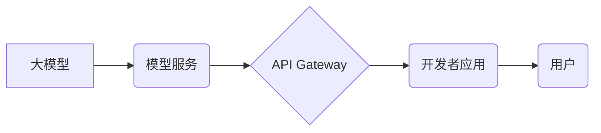

> 大模型、AI Agent、Agent即服务、应用开发、模型部署、微服务架构

## 1. 背景介绍

近年来，大模型技术取得了飞速发展，其强大的泛化能力和知识表示能力为人工智能的广泛应用提供了基础。然而，将大模型应用于实际场景仍然面临着诸多挑战，例如模型部署、资源消耗、可解释性等。

为了解决这些问题，"Agent即服务" (Agent-as-a-Service, AaaS) 应运而生。AaaS 将大模型封装成可复用的服务，通过标准化的接口提供给开发者，简化了模型的部署和调用过程，降低了开发门槛，并促进了大模型的协同应用。

## 2. 核心概念与联系

**2.1  AI Agent**

AI Agent 是一个能够感知环境、做出决策并执行行动的智能体。它通常由以下几个部分组成：

* **感知模块:** 收集环境信息，例如传感器数据、文本、图像等。
* **推理模块:** 对收集到的信息进行分析和理解，做出决策。
* **执行模块:** 执行决策，与环境进行交互。

**2.2  Agent即服务 (AaaS)**

AaaS 是将 AI Agent 封装成可复用的服务，通过标准化的接口提供给开发者。开发者可以通过调用 AaaS 接口，轻松地集成 AI Agent 到自己的应用中，无需关心模型的训练、部署和维护等细节。

**2.3  核心架构**



**2.4  AaaS 的优势**

* **简化开发流程:** 开发者无需关心模型的训练和部署，只需通过 API 调用即可使用 AI Agent。
* **提高效率:** AaaS 可以复用现有的模型，降低开发成本和时间。
* **增强灵活性:** AaaS 可以根据不同的应用场景定制不同的 AI Agent，满足多样化的需求。
* **促进协同应用:** AaaS 可以将不同的 AI Agent 集成在一起，构建更复杂的智能系统。

## 3. 核心算法原理 & 具体操作步骤

**3.1  算法原理概述**

AaaS 的核心算法通常基于强化学习 (Reinforcement Learning, RL) 或图神经网络 (Graph Neural Networks, GNN)。

* **强化学习:** AI Agent 通过与环境交互，学习最优的策略，以获得最大的奖励。
* **图神经网络:** AI Agent 可以利用图结构数据，学习节点之间的关系，并进行推理和决策。

**3.2  算法步骤详解**

1. **环境建模:** 将应用场景建模为一个状态空间和动作空间。
2. **模型训练:** 使用 RL 或 GNN 算法，训练 AI Agent，使其能够在环境中学习最优策略。
3. **模型部署:** 将训练好的模型部署到 AaaS 平台上。
4. **API 调用:** 开发者可以通过 API 调用 AaaS，获取 AI Agent 的决策结果。

**3.3  算法优缺点**

* **优点:** 能够学习复杂的行为，适应动态环境。
* **缺点:** 训练过程复杂，需要大量的数据和计算资源。

**3.4  算法应用领域**

* **机器人控制:** 训练机器人完成复杂的任务，例如导航、抓取等。
* **游戏 AI:** 开发智能游戏对手，提高游戏体验。
* **个性化推荐:** 根据用户的行为数据，推荐个性化的商品或服务。

## 4. 数学模型和公式 & 详细讲解 & 举例说明

**4.1  数学模型构建**

假设一个环境状态为 $s$, 动作为 $a$, 奖励为 $r$, 则可以构建一个马尔可夫决策过程 (Markov Decision Process, MDP) 模型:

* $S$: 状态空间
* $A$: 动作空间
* $P(s', r | s, a)$: 从状态 $s$ 执行动作 $a$ 转换到状态 $s'$ 的概率，并获得奖励 $r$。
* $\gamma$: 折扣因子，控制未来奖励的权重。

**4.2  公式推导过程**

目标是找到最优策略 $\pi(s)$，使得期望回报最大化:

$$
\max_{\pi} \mathbb{E}_{\pi} \sum_{t=0}^{\infty} \gamma^t r_t
$$

其中，$\mathbb{E}_{\pi}$ 表示对策略 $\pi$ 下的期望。

**4.3  案例分析与讲解**

例如，训练一个 AI Agent 导航机器人，可以将环境状态定义为机器人位置，动作定义为移动方向，奖励定义为到达目标位置的奖励。

通过 RL 算法，例如 Q-learning，可以训练 AI Agent 学习最优的导航策略，使得机器人能够高效地到达目标位置。

## 5. 项目实践：代码实例和详细解释说明

**5.1  开发环境搭建**

* Python 3.x
* TensorFlow 或 PyTorch
* Docker

**5.2  源代码详细实现**

```python
# 训练一个简单的 Q-learning Agent
import numpy as np

# 定义环境
class Environment:
    def __init__(self):
        self.state = 0

    def step(self, action):
        # 根据动作更新状态
        if action == 0:
            self.state = (self.state - 1) % 10
        elif action == 1:
            self.state = (self.state + 1) % 10
        # 返回新的状态和奖励
        return self.state, 1 if self.state == 9 else 0

# 定义 Q-learning Agent
class Agent:
    def __init__(self, state_size, action_size):
        self.q_table = np.zeros((state_size, action_size))

    def choose_action(self, state):
        # 使用 epsilon-greedy 策略选择动作
        if np.random.rand() < 0.1:
            return np.random.randint(0, 2)
        else:
            return np.argmax(self.q_table[state])

    def update_q_table(self, state, action, reward, next_state):
        # 更新 Q-table
        self.q_table[state, action] = (1 - 0.9) * reward + 0.9 * np.max(self.q_table[next_state])

# 主程序
if __name__ == "__main__":
    env = Environment()
    agent = Agent(state_size=10, action_size=2)

    # 训练
    for episode in range(1000):
        state = env.reset()
        done = False
        while not done:
            action = agent.choose_action(state)
            next_state, reward = env.step(action)
            agent.update_q_table(state, action, reward, next_state)
            state = next_state
            done = state == 9

    # 测试
    state = env.reset()
    while True:
        action = agent.choose_action(state)
        next_state, reward = env.step(action)
        print(f"State: {state}, Action: {action}, Reward: {reward}")
        state = next_state
```

**5.3  代码解读与分析**

* 该代码实现了一个简单的 Q-learning Agent，用于训练机器人导航。
* 环境类定义了机器人状态和动作空间，以及环境的转移规则和奖励函数。
* Agent 类定义了 Q-table 和选择动作的策略。
* 主程序中，首先训练 Agent，然后测试 Agent 的性能。

**5.4  运行结果展示**

运行代码后，可以观察到 Agent 在环境中学习导航，并最终到达目标位置。

## 6. 实际应用场景

**6.1  智能客服**

AaaS 可以用于构建智能客服系统，帮助企业自动处理客户咨询，提高服务效率。

**6.2  个性化教育**

AaaS 可以用于构建个性化教育系统，根据学生的学习情况，提供个性化的学习内容和辅导。

**6.3  医疗诊断**

AaaS 可以用于辅助医生进行医疗诊断，例如分析病历数据，预测疾病风险。

**6.4  未来应用展望**

随着大模型技术的不断发展，AaaS 将在更多领域得到应用，例如自动驾驶、金融风险管理、城市管理等。

## 7. 工具和资源推荐

**7.1  学习资源推荐**

* **书籍:**
    * Deep Reinforcement Learning Hands-On
    * Reinforcement Learning: An Introduction
* **在线课程:**
    * Coursera: Reinforcement Learning Specialization
    * Udacity: Deep Learning Nanodegree

**7.2  开发工具推荐**

* **TensorFlow:** 开源深度学习框架
* **PyTorch:** 开源深度学习框架
* **HuggingFace Transformers:** 大模型库

**7.3  相关论文推荐**

* **AlphaGo:** Mastering the Game of Go with Deep Neural Networks and Tree Search
* **GPT-3:** Language Models are Few-Shot Learners

## 8. 总结：未来发展趋势与挑战

**8.1  研究成果总结**

AaaS 作为一种新型的 AI 应用开发模式，具有简化开发流程、提高效率、增强灵活性等优势。

**8.2  未来发展趋势**

* **模型规模和能力提升:** 大模型的规模和能力将不断提升，从而使 AaaS 提供更强大的功能。
* **多模态融合:** AaaS 将支持多模态数据，例如文本、图像、音频等，从而提供更丰富的应用场景。
* **联邦学习:** 联邦学习技术将被应用于 AaaS，使得模型训练更加安全和隐私保护。

**8.3  面临的挑战**

* **模型解释性和可信度:** 大模型的决策过程往往难以解释，这可能会影响 AaaS 的可信度。
* **数据安全和隐私保护:** AaaS 需要处理大量的数据，因此数据安全和隐私保护是一个重要的挑战。
* **模型部署和维护成本:** 部署和维护大模型的成本较高，这可能会限制 AaaS 的普及。

**8.4  研究展望**

未来研究将集中在解决 AaaS 面临的挑战，例如提高模型解释性和可信度，保障数据安全和隐私保护，降低模型部署和维护成本。


## 9. 附录：常见问题与解答

**9.1  Q: 如何选择合适的 AaaS 平台？**

**A:** 选择 AaaS 平台时，需要考虑以下因素：

* 平台提供的模型类型和功能
* 平台的性能和稳定性
* 平台的安全性
* 平台的成本

**9.2  Q: 如何部署我的模型到 AaaS 平台？**

**A:** 不同的 AaaS 平台部署模型的方式可能有所不同，建议参考平台的官方文档。

**9.3  Q: 如何评估 AaaS 的性能？**

**A:** AaaS 的性能可以根据具体的应用场景进行评估，例如准确率、召回率、效率等。

作者：禅与计算机程序设计艺术 / Zen and the Art of Computer Programming


<end_of_turn>