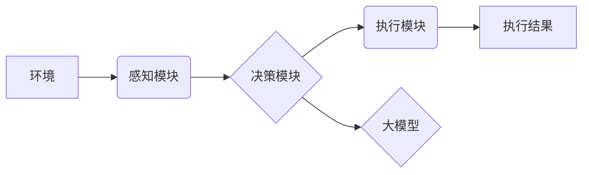

> 大模型、AI Agent、科研论文、应用开发、下一代Agent、智能化、自动化、决策推理、知识图谱

## 1. 背景介绍

近年来，大模型技术取得了飞速发展，其强大的泛化能力和表示能力为人工智能领域带来了革命性的变革。大模型的应用场景也日益广泛，涵盖了自然语言处理、计算机视觉、语音识别等多个领域。然而，大模型的应用仍然面临着一些挑战，例如：

* **缺乏针对性：** 大模型通常是通用的，缺乏针对特定应用场景的定制化能力。
* **部署成本高：** 大模型的规模庞大，部署和维护成本较高。
* **可解释性差：** 大模型的决策过程难以理解，缺乏可解释性。

为了解决这些问题，研究者们提出了新的思路，即利用大模型构建下一代AI Agent。AI Agent是一种能够自主学习、决策和执行任务的智能体，它可以将大模型的强大能力与特定应用场景相结合，从而实现更智能化、自动化和高效的应用。

## 2. 核心概念与联系

**2.1 AI Agent**

AI Agent是一种能够感知环境、做出决策并执行行动的智能体。它通常由以下几个核心组件组成：

* **感知模块：** 用于获取环境信息，例如传感器数据、文本数据、图像数据等。
* **决策模块：** 用于根据环境信息做出决策，例如选择行动、制定策略等。
* **执行模块：** 用于执行决策，例如控制机器人运动、生成文本、识别图像等。

**2.2 大模型**

大模型是指参数量巨大、训练数据量庞大的深度学习模型。它具有强大的泛化能力和表示能力，能够学习复杂的模式和关系。常见的类型包括：

* **语言模型：** 例如GPT-3、BERT、LaMDA等，擅长处理自然语言文本。
* **图像模型：** 例如DALL-E 2、Stable Diffusion、Imagen等，擅长处理图像数据。
* **多模态模型：** 例如FLAN-T5、PaLM等，能够处理多种类型的数据，例如文本、图像、音频等。

**2.3 核心概念联系**

大模型可以作为AI Agent的核心组件，例如：

* **决策模块：** 利用大模型的强大的表示能力和决策推理能力，构建更智能的决策模块。
* **感知模块：** 利用大模型的文本理解、图像识别等能力，构建更强大的感知模块。
* **执行模块：** 利用大模型的文本生成、图像合成等能力，构建更灵活的执行模块。

**2.4 架构图**



## 3. 核心算法原理 & 具体操作步骤

**3.1 算法原理概述**

构建下一代AI Agent的核心算法原理是将大模型与强化学习算法相结合。强化学习是一种机器学习方法，它通过奖励机制来训练智能体，使其在特定环境中学习最优策略。

**3.2 算法步骤详解**

1. **环境建模：** 将目标应用场景建模为一个环境，定义状态、动作、奖励等要素。
2. **大模型初始化：** 使用预训练的大模型作为AI Agent的决策模块，并对其进行微调，使其能够理解环境信息并做出决策。
3. **强化学习训练：** 使用强化学习算法，例如DQN、PPO等，训练AI Agent，使其在环境中学习最优策略。
4. **策略评估：** 在训练完成后，评估AI Agent在环境中的性能，例如成功率、效率等。
5. **迭代优化：** 根据评估结果，对AI Agent进行迭代优化，例如调整模型参数、修改奖励机制等。

**3.3 算法优缺点**

**优点：**

* **智能化：** 可以学习复杂的决策策略，实现更智能化的行为。
* **自动化：** 可以自动执行任务，提高效率。
* **适应性强：** 可以适应不断变化的环境。

**缺点：**

* **训练成本高：** 强化学习训练需要大量的计算资源和时间。
* **数据依赖性强：** 需要大量的训练数据才能训练出有效的AI Agent。
* **可解释性差：** 强化学习模型的决策过程难以理解。

**3.4 算法应用领域**

* **机器人控制：** 训练机器人完成复杂的任务，例如导航、抓取、组装等。
* **游戏AI：** 训练游戏中的AI对手，使其更具挑战性和智能性。
* **自动驾驶：** 训练自动驾驶系统，使其能够安全地驾驶车辆。
* **医疗诊断：** 训练AI系统辅助医生进行诊断，提高诊断准确率。

## 4. 数学模型和公式 & 详细讲解 & 举例说明

**4.1 数学模型构建**

AI Agent可以被建模为一个马尔可夫决策过程 (MDP)，其中：

* **状态空间 S:** 环境可能存在的各种状态。
* **动作空间 A:** AI Agent可以执行的各种动作。
* **转移概率 P(s' | s, a):** 从状态 s 执行动作 a 后转移到状态 s' 的概率。
* **奖励函数 R(s, a):** 在状态 s 执行动作 a 后获得的奖励。
* **折扣因子 γ:** 用于权衡未来奖励的价值。

**4.2 公式推导过程**

目标是找到一个策略 π(s) ，它可以根据当前状态 s 选择最优的动作，使得累积奖励最大化。可以使用动态规划或蒙特卡罗方法来求解最优策略。

**Bellman 方程:**

$$
V^*(s) = \max_a \left[ R(s, a) + \gamma \sum_{s'} P(s' | s, a) V^*(s') \right]
$$

其中，V*(s) 是状态 s 的最优价值函数。

**4.3 案例分析与讲解**

例如，训练一个AI Agent玩游戏，我们可以将游戏状态定义为游戏中的棋盘布局，动作定义为玩家可以执行的棋步，奖励定义为玩家获得的分数。通过强化学习算法，AI Agent可以学习到最优的棋步策略，从而提高游戏胜率。

## 5. 项目实践：代码实例和详细解释说明

**5.1 开发环境搭建**

* Python 3.7+
* TensorFlow 或 PyTorch
* OpenAI Gym 或其他强化学习库

**5.2 源代码详细实现**

```python
import gym
import tensorflow as tf

# 定义环境
env = gym.make('CartPole-v1')

# 定义模型
model = tf.keras.Sequential([
    tf.keras.layers.Dense(128, activation='relu'),
    tf.keras.layers.Dense(env.action_space.n)
])

# 定义损失函数和优化器
loss_fn = tf.keras.losses.CategoricalCrossentropy()
optimizer = tf.keras.optimizers.Adam()

# 训练循环
for episode in range(1000):
    state = env.reset()
    done = False
    total_reward = 0

    while not done:
        # 选择动作
        action = model.predict(state[None, :])[0]
        action = tf.argmax(action).numpy()

        # 执行动作
        next_state, reward, done, _ = env.step(action)

        # 更新模型
        with tf.GradientTape() as tape:
            prediction = model(state[None, :])
            loss = loss_fn(tf.one_hot(action, depth=env.action_space.n), prediction)
        gradients = tape.gradient(loss, model.trainable_variables)
        optimizer.apply_gradients(zip(gradients, model.trainable_variables))

        # 更新状态
        state = next_state
        total_reward += reward

    print(f"Episode {episode+1}, Total Reward: {total_reward}")

# 保存模型
model.save('cartpole_agent.h5')
```

**5.3 代码解读与分析**

* 代码首先定义了游戏环境和模型架构。
* 然后，使用强化学习算法训练模型，通过不断地与环境交互，学习最优的策略。
* 最后，保存训练好的模型，以便后续使用。

**5.4 运行结果展示**

训练完成后，AI Agent能够在游戏中获得较高的分数，并且能够完成任务。

## 6. 实际应用场景

**6.1 智能客服**

利用大模型构建的AI Agent可以作为智能客服，自动回答用户问题，提供24小时在线服务。

**6.2 个性化推荐**

AI Agent可以根据用户的行为数据和偏好，提供个性化的商品推荐，提高用户体验。

**6.3 自动化办公**

AI Agent可以自动完成一些重复性的办公任务，例如邮件回复、日程安排等，提高工作效率。

**6.4 未来应用展望**

随着大模型技术的不断发展，AI Agent的应用场景将会更加广泛，例如：

* **医疗辅助诊断：** AI Agent可以辅助医生进行诊断，提高诊断准确率。
* **教育个性化学习：** AI Agent可以根据学生的学习情况提供个性化的学习方案。
* **金融风险管理：** AI Agent可以帮助金融机构识别和管理风险。

## 7. 工具和资源推荐

**7.1 学习资源推荐**

* **书籍:**
    * 《Reinforcement Learning: An Introduction》
    * 《Deep Learning》
* **在线课程:**
    * Coursera: Reinforcement Learning Specialization
    * Udacity: Deep Learning Nanodegree

**7.2 开发工具推荐**

* **TensorFlow:** https://www.tensorflow.org/
* **PyTorch:** https://pytorch.org/
* **OpenAI Gym:** https://gym.openai.com/

**7.3 相关论文推荐**

* **AlphaGo:** https://arxiv.org/abs/1607.02883
* **DeepMind's DQN:** https://arxiv.org/abs/1312.5602
* **PPO:** https://arxiv.org/abs/1707.06347

## 8. 总结：未来发展趋势与挑战

**8.1 研究成果总结**

近年来，大模型与强化学习的结合取得了显著成果，构建了更智能、更灵活的AI Agent。

**8.2 未来发展趋势**

* **模型规模和能力提升:** 大模型的规模和能力将继续提升，从而使AI Agent能够处理更复杂的任务。
* **多模态学习:** AI Agent将能够处理多种类型的数据，例如文本、图像、音频等，从而更好地理解和交互于世界。
* **可解释性增强:** 研究者将致力于提高AI Agent的可解释性，使其决策过程更加透明和可理解。

**8.3 面临的挑战**

* **数据安全和隐私:** 大模型的训练需要大量的训练数据，如何保证数据安全和隐私是一个重要的挑战。
* **算法效率:** 强化学习训练通常需要大量的计算资源和时间，如何提高算法效率是一个重要的研究方向。
* **伦理问题:** AI Agent的应用可能会带来一些伦理问题，例如算法偏见、责任归属等，需要认真思考和解决。

**8.4 研究展望**

未来，AI Agent将成为人工智能领域的重要发展方向，它将深刻地改变我们的生活和工作方式。


## 9. 附录：常见问题与解答

**9.1 如何选择合适的强化学习算法？**

选择合适的强化学习算法取决于具体的应用场景和任务需求。例如，对于离散动作空间的任务，可以使用Q-learning或SARSA算法；对于连续动作空间的任务，可以使用策略梯度算法或深度强化学习算法。

**9.2 如何解决数据稀疏问题？**

数据稀疏是强化学习训练中常见的问题。可以采用一些方法解决，例如：

* 使用经验回放技术，将训练过程中收集到的经验存储起来，并随机采样使用。
* 使用迁移学习技术，将预训练模型应用于新的任务。

**9.3 如何评估AI Agent的性能？**

AI Agent的性能可以根据具体的应用场景进行评估。例如，对于游戏AI，可以评估其游戏胜率；对于智能客服，可以评估其回答准确率和用户满意度。


作者：禅与计算机程序设计艺术 / Zen and the Art of Computer Programming 
<end_of_turn>