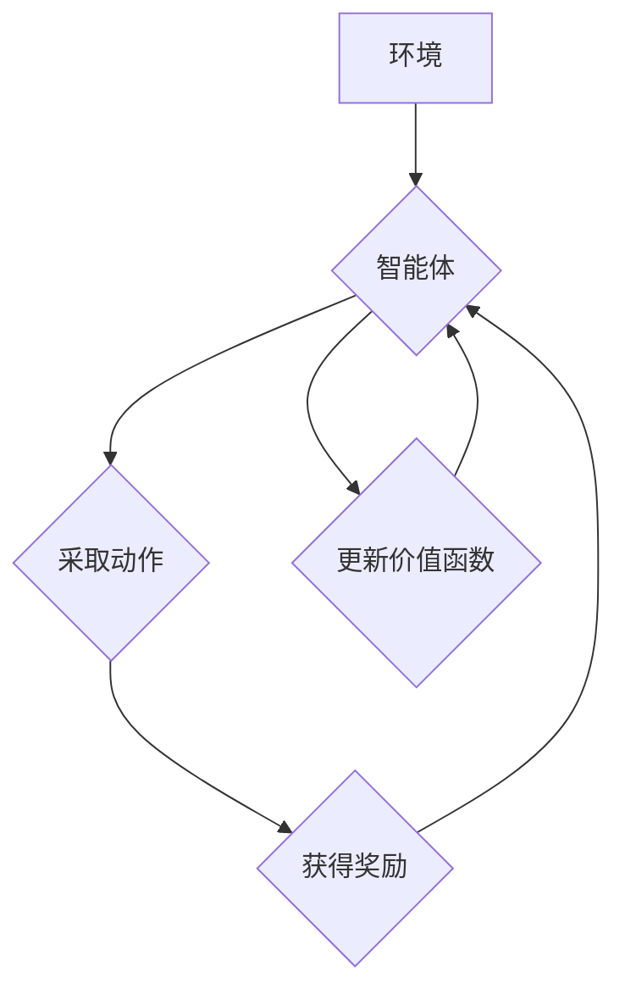

> Deep Q-Network (DQN), 强化学习, 价值函数, 经验回放, 稳定性, 收敛性, 贪婪策略

## 1. 背景介绍

在机器学习领域，强化学习 (Reinforcement Learning, RL) 作为一种学习智能体与环境交互并通过奖励信号优化行为策略的范式，近年来取得了显著进展。其中，Deep Q-Network (DQN) 算法作为一种将深度神经网络与 Q-learning 算法相结合的经典方法，在解决复杂决策问题方面展现出强大的能力。DQN 算法能够学习复杂的价值函数，并通过贪婪策略选择最优动作，从而实现智能体的目标。

然而，DQN 算法在训练过程中也面临着一些挑战，例如：

* **训练不稳定性:** DQN 算法容易出现震荡和发散，导致训练过程不稳定。
* **过拟合问题:** 当深度神经网络的复杂度过高时，DQN 算法容易出现过拟合现象，导致在未知环境中表现不佳。
* **收敛性问题:** DQN 算法的收敛性尚未得到充分研究，其收敛速度和最终解的质量仍存在疑问。

为了解决这些问题，研究者们提出了许多改进方案，例如经验回放 (Experience Replay)、目标网络 (Target Network) 和双重DQN (Double DQN) 等。这些改进方案有效提高了 DQN 算法的稳定性和收敛性，但也存在一些局限性。

## 2. 核心概念与联系

DQN 算法的核心概念包括：

* **价值函数 (Value Function):** 价值函数用来评估一个状态下采取某个动作的长期回报。DQN 算法的目标是学习一个能够准确估计价值函数的深度神经网络。
* **Q-learning:** Q-learning 是一种基于价值函数的强化学习算法，通过迭代更新 Q-值来学习最优策略。
* **深度神经网络 (Deep Neural Network):** 深度神经网络是一种能够学习复杂函数关系的机器学习模型，在 DQN 算法中用于逼近价值函数。

DQN 算法将 Q-learning 算法与深度神经网络相结合，通过深度神经网络学习价值函数，并利用 Q-learning 算法更新 Q-值。

**Mermaid 流程图:**



## 3. 核心算法原理 & 具体操作步骤

### 3.1  算法原理概述

DQN 算法的核心思想是利用深度神经网络逼近价值函数，并通过 Q-learning 算法更新 Q-值。具体来说，DQN 算法的训练过程可以分为以下几个步骤：

1. **初始化:** 初始化深度神经网络的权重和偏差。
2. **收集经验:** 智能体与环境交互，收集一系列状态、动作、奖励和下一个状态的经验数据。
3. **经验回放:** 从经验数据集中随机采样一批数据，用于训练深度神经网络。
4. **价值函数估计:** 将采样的状态输入深度神经网络，得到对应的 Q-值估计。
5. **目标值计算:** 计算目标值，即最大化 Q-值估计的下一个状态的价值函数。
6. **损失函数计算:** 计算深度神经网络的损失函数，该函数衡量 Q-值估计与目标值的差异。
7. **参数更新:** 使用梯度下降算法更新深度神经网络的权重和偏差，以最小化损失函数。
8. **重复步骤 3-7:** 重复上述步骤，直到训练完成。

### 3.2  算法步骤详解

1. **初始化:**

   * 初始化深度神经网络的权重和偏差，可以使用随机初始化或预训练模型。
   * 初始化经验回放缓冲区，用于存储智能体与环境交互的经验数据。

2. **收集经验:**

   * 智能体与环境交互，根据当前状态选择动作。
   * 执行动作后，获得奖励和下一个状态。
   * 将状态、动作、奖励和下一个状态存储到经验回放缓冲区中。

3. **经验回放:**

   * 从经验回放缓冲区中随机采样一批数据，每个数据包含一个状态、动作、奖励和下一个状态。
   * 将这些数据作为训练样本，用于训练深度神经网络。

4. **价值函数估计:**

   * 将采样的状态输入深度神经网络，得到对应的 Q-值估计。
   * Q-值估计表示在当前状态下采取每个动作的预期回报。

5. **目标值计算:**

   * 计算目标值，即最大化 Q-值估计的下一个状态的价值函数。
   * 目标值表示在当前状态下采取最优动作的预期回报。

6. **损失函数计算:**

   * 计算深度神经网络的损失函数，该函数衡量 Q-值估计与目标值的差异。
   * 常见的损失函数是均方误差 (MSE)。

7. **参数更新:**

   * 使用梯度下降算法更新深度神经网络的权重和偏差，以最小化损失函数。
   * 梯度下降算法通过计算损失函数的梯度，调整权重和偏差，使损失函数逐渐减小。

8. **重复步骤 3-7:**

   * 重复上述步骤，直到训练完成。

### 3.3  算法优缺点

**优点:**

* **能够学习复杂价值函数:** 深度神经网络能够学习复杂函数关系，因此 DQN 算法能够学习复杂决策问题的价值函数。
* **能够处理高维状态空间:** 深度神经网络能够处理高维数据，因此 DQN 算法能够处理高维状态空间的问题。
* **能够离线学习:** DQN 算法可以使用经验回放技术进行离线学习，即不需要实时与环境交互即可学习。

**缺点:**

* **训练不稳定性:** DQN 算法容易出现震荡和发散，导致训练过程不稳定。
* **过拟合问题:** 当深度神经网络的复杂度过高时，DQN 算法容易出现过拟合现象。
* **收敛性问题:** DQN 算法的收敛性尚未得到充分研究，其收敛速度和最终解的质量仍存在疑问。

### 3.4  算法应用领域

DQN 算法在许多领域都有应用，例如：

* **游戏 AI:** DQN 算法被广泛应用于游戏 AI，例如 AlphaGo 和 Atari 游戏。
* **机器人控制:** DQN 算法可以用于训练机器人控制策略，例如自主导航和物抓取。
* **推荐系统:** DQN 算法可以用于个性化推荐，例如电影推荐和商品推荐。
* **医疗诊断:** DQN 算法可以用于辅助医疗诊断，例如疾病分类和治疗方案推荐。

## 4. 数学模型和公式 & 详细讲解 & 举例说明

### 4.1  数学模型构建

DQN 算法的核心数学模型是价值函数，它用来评估一个状态下采取某个动作的长期回报。

**价值函数定义:**

$$
V^{\pi}(s) = E_{\pi}[R_{t+1} + \gamma R_{t+2} + \gamma^2 R_{t+3} + ... | S_t = s]
$$

其中：

* $V^{\pi}(s)$ 表示在状态 $s$ 下，按照策略 $\pi$ 获得的期望回报。
* $R_t$ 表示在时间步 $t$ 获得的奖励。
* $\gamma$ 表示折扣因子，控制未来奖励的权重。

**Q-函数定义:**

$$
Q^{\pi}(s, a) = E_{\pi}[R_{t+1} + \gamma \max_{a'} Q^{\pi}(S_{t+1}, a') | S_t = s, A_t = a]
$$

其中：

* $Q^{\pi}(s, a)$ 表示在状态 $s$ 下采取动作 $a$ 后，按照策略 $\pi$ 获得的期望回报。

### 4.2  公式推导过程

DQN 算法的目标是学习一个能够逼近 Q-函数的深度神经网络。

**损失函数定义:**

$$
L(w) = \frac{1}{N} \sum_{i=1}^{N} (y_i - Q(s_i, a_i; w))^2
$$

其中：

* $L(w)$ 表示损失函数。
* $w$ 表示深度神经网络的权重。
* $N$ 表示训练样本的数量。
* $y_i$ 表示目标值，即最大化 Q-值估计的下一个状态的价值函数。
* $Q(s_i, a_i; w)$ 表示深度神经网络对状态 $s_i$ 和动作 $a_i$ 的 Q-值估计。

**梯度下降算法:**

$$
w = w - \alpha \nabla_w L(w)
$$

其中：

* $\alpha$ 表示学习率。
* $\nabla_w L(w)$ 表示损失函数对权重 $w$ 的梯度。

### 4.3  案例分析与讲解

假设我们有一个简单的游戏环境，智能体需要在两个状态之间切换，每个状态都有两个动作可以选择。

* 状态 1: 智能体位于左边的区域。
* 状态 2: 智能体位于右边的区域。
* 动作 1: 向左移动。
* 动作 2: 向右移动。

奖励函数如下：

* 从状态 1 到状态 2 移动获得奖励 1。
* 从状态 2 到状态 1 移动获得奖励 -1。

DQN 算法可以学习一个 Q-函数，该函数可以估计在每个状态下采取每个动作的预期回报。例如，DQN 算法可能会学习到：

* 在状态 1 下采取动作 2 的预期回报为 1。
* 在状态 2 下采取动作 1 的预期回报为 -1。

根据学习到的 Q-函数，智能体可以选择最优动作，从而最大化其总回报。

## 5. 项目实践：代码实例和详细解释说明

### 5.1  开发环境搭建

* **操作系统:** Ubuntu 18.04
* **Python 版本:** 3.7
* **深度学习框架:** TensorFlow 2.0

### 5.2  源代码详细实现

```python
import tensorflow as tf

# 定义深度神经网络模型
class DQN(tf.keras.Model):
    def __init__(self, state_size, action_size):
        super(DQN, self).__init__()
        self.dense1 = tf.keras.layers.Dense(64, activation='relu')
        self.dense2 = tf.keras.layers.Dense(64, activation='relu')
        self.output = tf.keras.layers.Dense(action_size)

    def call(self, state):
        x = self.dense1(state)
        x = self.dense2(x)
        return self.output(x)

# 定义 DQN 算法
class DQNAgent:
    def __init__(self, state_size, action_size, learning_rate=0.001):
        self.state_size = state_size
        self.action_size = action_size
        self.learning_rate = learning_rate
        self.model = DQN(state_size, action_size)
        self.optimizer = tf.keras.optimizers.Adam(learning_rate=self.learning_rate)

    def train(self, states, actions, rewards, next_states, dones):
        with tf.GradientTape() as tape:
            q_values = self.model(states)
            target_q_values = rewards + tf.where(
                dones, 0, self.gamma * tf.reduce_max(self.model(next_states), axis=1)
            )
            loss = tf.keras.losses.MeanSquaredError()(target_q_values, q_values[tf.range(len(states)), actions])
        gradients = tape.gradient(loss, self.model.trainable_variables)
        self.optimizer.apply_gradients(zip(gradients, self.model.trainable_variables))

    def predict(self, state):
        return tf.argmax(self.model(state), axis=1)

# ... (其他代码)
```

### 5.3  代码解读与分析

* **DQN 模型:** 代码中定义了一个 DQN 模型，它是一个简单的深度神经网络，包含两层全连接层和一层输出层。
* **DQN 算法:** 代码中定义了一个 DQNAgent 类，它包含了 DQN 算法的核心逻辑，包括训练和预测。
* **训练过程:** 训练过程使用经验回放技术，从经验回放缓冲区中随机采样数据进行训练。
* **预测过程:** 预测过程使用训练好的模型对输入状态进行预测，并选择最优动作。

### 5.4  运行结果展示

运行代码后，可以观察到智能体在游戏环境中学习和改进其策略。例如，智能体可能会从最初的随机行为逐渐过渡到能够有效地完成游戏目标的行为。

## 6. 实际应用场景

DQN 算法在许多实际应用场景中取得了成功，例如：

* **AlphaGo:** DeepMind 使用 DQN 算法训练了 AlphaGo，一个能够战胜人类围棋冠军的 AI。
* **Atari 游戏:** OpenAI 使用 DQN 算法训练了多个能够玩出人类水平的 Atari 游戏 AI。
* **机器人控制:** DQN 算法被用于训练机器人控制策略，例如自主导航和物抓取。

### 6.4  未来应用展望

DQN 算法在未来仍有很大的发展潜力，例如：

* **更复杂的决策问题:** DQN 算法可以应用于更复杂的决策问题，例如自动驾驶和医疗诊断。
* **多智能体强化学习:** DQN 算法可以扩展到多智能体强化学习场景，例如协作机器人和无人机编队。
* **迁移学习:** DQN 算法可以利用迁移学习技术，将已学习到的知识应用于新的任务。

## 7. 工具和资源推荐

### 7.1  学习资源推荐

* **书籍:**
    * Reinforcement Learning: An Introduction by Richard S. Sutton and Andrew G. Barto
    * Deep Reinforcement Learning Hands-On by Maxim Lapan
* **在线课程:**
    * Deep Reinforcement Learning Specialization by DeepLearning.AI
    * Reinforcement Learning by David Silver (University of DeepMind)

### 7.2  开发工具推荐

* **深度学习框架:** TensorFlow, PyTorch
* **游戏引擎:** Unity, Unreal Engine
* **仿真环境:** OpenAI Gym, MuJoCo

### 7.3  相关论文推荐

* Deep Q-Network (DQN) by Volodymyr Mnih et al. (2015)
* Double Deep Q-Network (DDQN) by Hasselt et al. (2015)
* Dueling Network Architectures for Deep Reinforcement Learning by Wang et al. (2015)

## 8. 总结：未来发展趋势与挑战

### 8.1  研究成果总结

DQN 算法及其变种算法取得了显著的成果，在游戏 AI、机器人控制、推荐系统等领域取得了突破。

### 8.2  未来发展趋势

* **更强大的模型架构:** 研究者们正在探索更强大的深度神经网络架构，例如 Transformer 和 Graph Neural Networks，以提高 DQN 算法的性能。
* **更有效的训练方法:** 研究者们正在探索更有效的训练方法，例如分布式训练和强化学习算法的结合，以加速 DQN 算法的训练过程。
* **更广泛的应用场景:** DQN 算法有潜力应用于更广泛的领域，例如自动驾驶、医疗诊断和金融交易。

### 8.3  面临的挑战

* **训练不稳定性:** DQN 算法仍然容易出现训练不稳定性问题，需要进一步研究解决方法。
* **过拟合问题:** DQN 算法容易出现过拟合问题，需要进一步研究防止过拟合的方法。
* **数据效率:** DQN 算法对数据需求量大，需要进一步研究提高数据效率的方法。

### 8.4  研究展望

未来，DQN 算法的研究将继续深入，探索更强大的模型架构、更有效的训练方法和更广泛的应用场景。


## 9. 附录：常见问题与解答

**Q1: DQN 算法与 Q-learning 算法有什么区别？**

**A1:** DQN 算法将 Q-learning 算法与深度神经网络相结合，利用深度神经网络逼近 Q-函数，而 Q-learning 算法通常使用表格存储 Q-值。

**Q2: DQN 算法的收敛性如何？**

**A2:** DQN 算法的收敛性尚未得到充分研究，其收敛速度和最终解的质量仍存在疑问。

**Q3: DQN 算法有哪些改进方案？**

**A3:** DQN 算法的改进方案包括经验回放、目标网络、双重DQN 等。

**Q4: DQN 算法有哪些应用场景？**

**A4:** DQN 算法应用于游戏 AI、机器人控制、推荐系统等领域。


作者：禅与计算机程序设计艺术 / Zen and the Art of Computer Programming<end_of_turn>
<end_of_turn>
