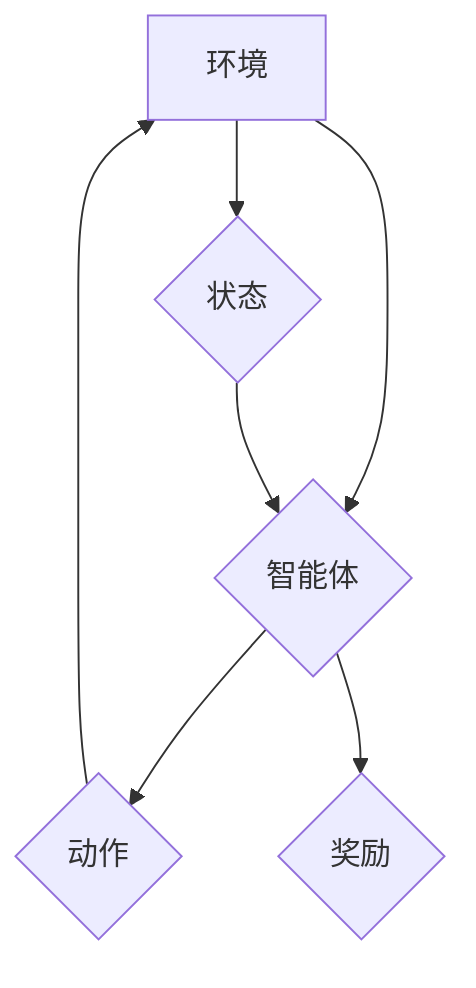

> 强化学习，工业自动化，机器人控制，智能制造，深度学习，模型预测，状态空间，奖励函数

## 1. 背景介绍

工业自动化一直是推动经济发展和社会进步的重要力量。随着人工智能技术的快速发展，强化学习（Reinforcement Learning，RL）作为一种能够使智能体通过与环境交互学习最优策略的机器学习方法，在工业自动化领域展现出巨大的潜力。

传统工业自动化系统通常依赖于预先编程的规则和逻辑，难以应对复杂、动态变化的环境。而强化学习则能够通过不断与环境交互，学习最优的控制策略，从而实现更灵活、更智能的自动化控制。

## 2. 核心概念与联系

**2.1 强化学习的基本概念**

强化学习的核心概念是“智能体-环境-奖励”三者之间的交互。智能体是一个能够感知环境并采取行动的代理，环境是一个包含状态和奖励的外部世界，奖励是智能体采取行动后获得的反馈信号。

智能体的目标是通过与环境交互，学习一个能够最大化长期奖励的策略。

**2.2 强化学习与工业自动化的联系**

在工业自动化领域，智能体可以是机器人、控制系统或其他自动化设备，环境可以是生产线、工厂或其他工业场景，奖励可以是完成任务的成功、提高效率或降低成本等。

通过强化学习，我们可以训练智能体在工业环境中执行各种任务，例如：

* **机器人控制:** 训练机器人完成复杂的任务，例如物料搬运、装配、焊接等。
* **过程控制:** 优化生产过程参数，提高生产效率和产品质量。
* **预测维护:** 通过分析设备运行数据，预测设备故障，提前进行维护。

**2.3 强化学习架构**



## 3. 核心算法原理 & 具体操作步骤

**3.1 算法原理概述**

强化学习的核心算法是Q-学习算法。Q-学习算法通过学习一个Q表来评估每个状态-动作对的价值，并选择能够最大化未来奖励的动作。

**3.2 算法步骤详解**

1. 初始化Q表，将所有状态-动作对的价值设置为0。
2. 在环境中进行交互，观察当前状态和获得奖励。
3. 根据当前状态和动作，更新Q表中的价值。
4. 重复步骤2和3，直到Q表收敛。

**3.3 算法优缺点**

**优点:**

* 能够学习复杂的策略。
* 不需要明确的奖励函数。
* 可以应用于离散和连续状态空间。

**缺点:**

* 学习过程可能很慢。
* 需要大量的训练数据。
* 容易陷入局部最优解。

**3.4 算法应用领域**

Q-学习算法广泛应用于机器人控制、游戏 AI、推荐系统等领域。

## 4. 数学模型和公式 & 详细讲解 & 举例说明

**4.1 数学模型构建**

强化学习的数学模型可以表示为一个马尔可夫决策过程（Markov Decision Process，MDP）。

MDP由以下几个组成部分组成：

* 状态空间 S：所有可能的系统状态的集合。
* 动作空间 A：在每个状态下可以采取的所有动作的集合。
* 转移概率矩阵 P：表示从一个状态到另一个状态的概率。
* 奖励函数 R：表示在每个状态采取某个动作后获得的奖励。
* 折扣因子 γ：表示未来奖励的权重。

**4.2 公式推导过程**

Q-学习算法的目标是学习一个Q函数，Q(s, a)，表示在状态s下采取动作a的期望回报。

Q函数的更新公式为：

$$Q(s, a) = Q(s, a) + \alpha [r + \gamma \max_{a'} Q(s', a') - Q(s, a)]$$

其中：

* α：学习率，控制着学习速度。
* r：在状态s采取动作a后获得的奖励。
* s'：采取动作a后进入的下一个状态。
* a'：在下一个状态s'可以采取的动作。

**4.3 案例分析与讲解**

例如，训练一个机器人学会在迷宫中找到出口。

* 状态空间 S：迷宫中的所有位置。
* 动作空间 A：向上、向下、向左、向右四个方向。
* 转移概率矩阵 P：表示机器人移动到不同位置的概率。
* 奖励函数 R：到达出口时获得最大奖励，其他情况下获得较小的奖励。

通过Q-学习算法，机器人可以学习一个Q函数，表示在每个位置采取每个方向的动作的期望回报。最终，机器人可以找到一条通往出口的最优路径。

## 5. 项目实践：代码实例和详细解释说明

**5.1 开发环境搭建**

* Python 3.x
* TensorFlow 或 PyTorch 深度学习框架
* OpenAI Gym 或其他强化学习环境

**5.2 源代码详细实现**

```python
import gym
import numpy as np

# 定义环境
env = gym.make('CartPole-v1')

# 定义学习率
alpha = 0.1

# 定义折扣因子
gamma = 0.99

# 定义Q表
q_table = np.zeros((env.observation_space.n, env.action_space.n))

# 训练循环
for episode in range(1000):
    # 初始化状态
    state = env.reset()

    # 训练一个回合
    done = False
    while not done:
        # 选择动作
        action = np.argmax(q_table[state])

        # 执行动作
        next_state, reward, done, _ = env.step(action)

        # 更新Q表
        q_table[state, action] = q_table[state, action] + alpha * (reward + gamma * np.max(q_table[next_state]) - q_table[state, action])

        # 更新状态
        state = next_state

    # 打印进度
    print(f"Episode {episode+1} completed")

# 测试
state = env.reset()
while True:
    # 选择动作
    action = np.argmax(q_table[state])

    # 执行动作
    next_state, reward, done, _ = env.step(action)

    # 显示状态
    env.render()

    # 更新状态
    state = next_state

    # 如果完成一个回合，则退出循环
    if done:
        break

env.close()
```

**5.3 代码解读与分析**

* 代码首先定义了环境和学习参数。
* 然后，代码使用一个循环来训练Q表。
* 在每个回合中，代码选择一个动作，执行动作，并根据奖励更新Q表。
* 最后，代码测试训练好的Q表，并显示机器人完成任务的过程。

**5.4 运行结果展示**

运行代码后，机器人将在环境中学习并完成任务。

## 6. 实际应用场景

**6.1 工厂自动化**

* **机器人协作:** 利用强化学习训练机器人协作完成复杂的任务，例如装配、焊接等。
* **生产线优化:** 通过强化学习优化生产线参数，提高生产效率和产品质量。
* **预测性维护:** 利用强化学习分析设备运行数据，预测设备故障，提前进行维护。

**6.2 智能制造**

* **个性化定制:** 利用强化学习训练模型，根据客户需求进行个性化定制生产。
* **自适应生产:** 利用强化学习使生产系统能够根据市场需求和生产环境的变化进行自适应调整。
* **智能供应链:** 利用强化学习优化供应链管理，提高效率和降低成本。

**6.3 其他应用场景**

* **能源管理:** 利用强化学习优化能源消耗，提高能源效率。
* **交通管理:** 利用强化学习优化交通流量，减少拥堵。
* **医疗保健:** 利用强化学习辅助医生诊断疾病，制定治疗方案。

**6.4 未来应用展望**

随着人工智能技术的不断发展，强化学习在工业自动化领域的应用将更加广泛和深入。未来，强化学习将能够帮助我们构建更加智能、高效、可持续的工业系统。

## 7. 工具和资源推荐

**7.1 学习资源推荐**

* **书籍:**
    * Reinforcement Learning: An Introduction by Richard S. Sutton and Andrew G. Barto
    * Deep Reinforcement Learning Hands-On by Maxim Lapan
* **在线课程:**
    * Coursera: Reinforcement Learning Specialization by David Silver
    * Udacity: Deep Reinforcement Learning Nanodegree

**7.2 开发工具推荐**

* **TensorFlow:** https://www.tensorflow.org/
* **PyTorch:** https://pytorch.org/
* **OpenAI Gym:** https://gym.openai.com/

**7.3 相关论文推荐**

* Deep Reinforcement Learning for Robotics: A Survey
* Proximal Policy Optimization Algorithms
* Asynchronous Methods for Deep Reinforcement Learning

## 8. 总结：未来发展趋势与挑战

**8.1 研究成果总结**

近年来，强化学习在工业自动化领域取得了显著的成果，例如机器人控制、过程控制、预测维护等方面都取得了突破。

**8.2 未来发展趋势**

* **深度强化学习:** 将深度学习与强化学习相结合，提高算法的学习能力和泛化能力。
* **多智能体强化学习:** 研究多个智能体协同学习的算法，解决复杂多智能体系统的问题。
* **安全强化学习:** 研究安全可靠的强化学习算法，确保工业自动化系统安全运行。

**8.3 面临的挑战**

* **数据获取和标注:** 强化学习算法需要大量的训练数据，获取和标注这些数据成本高昂。
* **算法效率:** 强化学习算法的训练过程可能很慢，需要更高效的算法和硬件支持。
* **安全性和可靠性:** 强化学习算法的安全性与可靠性需要得到进一步保证，确保工业自动化系统的安全运行。

**8.4 研究展望**

未来，强化学习将在工业自动化领域发挥越来越重要的作用。我们需要继续加强对强化学习算法的研究，解决算法效率、安全性和可靠性等问题，推动强化学习技术在工业自动化领域的应用。

## 9. 附录：常见问题与解答

**9.1 Q: 强化学习与监督学习的区别是什么？**

**A:** 强化学习和监督学习都是机器学习的范畴，但它们的目标和训练方式不同。

* **监督学习:** 利用标记数据训练模型，预测输入数据的输出值。
* **强化学习:** 利用奖励信号训练模型，学习一个能够最大化长期奖励的策略。

**9.2 Q: 强化学习的应用场景有哪些？**

**A:** 强化学习的应用场景非常广泛，例如：

* 机器人控制
* 游戏 AI
* 推荐系统
* 自动驾驶
* 医疗保健

**9.3 Q: 如何选择合适的强化学习算法？**

**A:** 选择合适的强化学习算法需要考虑以下因素：

* 状态空间和动作空间的大小
* 奖励函数的复杂度
* 训练数据量
* 算法的效率和稳定性


作者：禅与计算机程序设计艺术 / Zen and the Art of Computer Programming 
<end_of_turn>