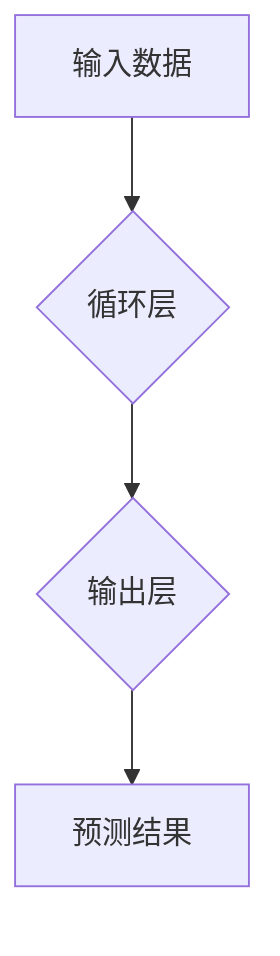

> 循环神经网络(RNN)、序列预测、自然语言处理(NLP)、时间序列分析、深度学习、长短期记忆网络(LSTM)、梯度消失问题

## 1. 背景介绍

在当今数据爆炸的时代，处理和预测序列数据成为了一个至关重要的任务。从股票价格的波动预测到自然语言的理解，从语音识别的准确率提升到机器翻译的流畅度提高，序列预测在各个领域都扮演着越来越重要的角色。而循环神经网络(RNN)作为一种专门设计用于处理序列数据的深度学习模型，凭借其强大的能力和灵活的架构，成为了序列预测领域最热门的研究方向之一。

传统的机器学习模型难以有效地处理序列数据，因为它们无法捕获序列中时间依赖关系。而RNN则通过引入循环连接，使得模型能够记住之前的信息，从而更好地理解序列的上下文和趋势。

## 2. 核心概念与联系

**2.1 序列数据**

序列数据是指按照时间或顺序排列的一系列数据点。例如，股票价格的日历记录、自然语言中的单词序列、语音信号的时间变化等都是典型的序列数据。

**2.2 循环神经网络(RNN)**

循环神经网络(RNN)是一种特殊的深度神经网络结构，其核心特点是引入循环连接。循环连接允许信息在网络中循环传递，从而使得模型能够捕获序列中时间依赖关系。

**2.3 序列预测**

序列预测是指根据已有的序列数据，预测未来序列的某些元素。例如，根据历史股票价格预测未来价格走势、根据输入文本预测下一个单词等。

**2.4 RNN 与 序列预测 的联系**

RNN 的循环连接结构使其能够有效地处理序列数据，并学习序列中的时间依赖关系。因此，RNN 成为序列预测领域最常用的模型之一。



## 3. 核心算法原理 & 具体操作步骤

**3.1 算法原理概述**

RNN 的核心思想是通过循环连接，使得模型能够记住之前的信息，从而更好地理解序列的上下文和趋势。

RNN 的每个时间步长都会接收一个输入数据，并将其与之前隐藏状态进行结合，生成新的隐藏状态和输出。隐藏状态可以看作是模型对序列的理解，它会随着时间推移而不断更新，并最终用于预测序列的未来元素。

**3.2 算法步骤详解**

1. **初始化隐藏状态:** 在开始处理序列之前，需要先初始化隐藏状态。隐藏状态是一个向量，它代表模型对序列的初始理解。

2. **循环处理每个时间步长:** 对于序列中的每个时间步长，模型都会执行以下步骤:
    * **计算隐藏状态:** 将当前输入数据与之前隐藏状态进行结合，通过激活函数计算新的隐藏状态。
    * **计算输出:** 将新的隐藏状态与输出层进行连接，通过激活函数计算输出。

3. **更新隐藏状态:** 将计算出的新的隐藏状态作为下一个时间步长的输入隐藏状态。

4. **预测序列:** 在处理完整个序列之后，模型的输出可以用于预测序列的未来元素。

**3.3 算法优缺点**

**优点:**

* 能够有效地处理序列数据，并捕获序列中的时间依赖关系。
* 灵活的架构，可以应用于各种序列预测任务。

**缺点:**

* 容易出现梯度消失问题，难以训练长序列数据。
* 计算复杂度较高，训练时间较长。

**3.4 算法应用领域**

* 自然语言处理 (NLP)：文本分类、机器翻译、文本摘要、情感分析等。
* 时间序列分析：股票价格预测、天气预报、异常检测等。
* 语音识别：语音转文本、语音合成等。
* 机器人控制：运动规划、行为识别等。

## 4. 数学模型和公式 & 详细讲解 & 举例说明

**4.1 数学模型构建**

RNN 的数学模型可以表示为以下公式：

$$h_t = f(W_{hh}h_{t-1} + W_{xh}x_t + b_h)$$

$$y_t = g(W_{hy}h_t + b_y)$$

其中：

* $h_t$ 是时间步长 $t$ 的隐藏状态。
* $x_t$ 是时间步长 $t$ 的输入数据。
* $y_t$ 是时间步长 $t$ 的输出。
* $W_{hh}$、$W_{xh}$、$W_{hy}$ 是权重矩阵。
* $b_h$、$b_y$ 是偏置项。
* $f$ 和 $g$ 是激活函数。

**4.2 公式推导过程**

RNN 的公式推导过程主要基于以下几个假设：

* 隐藏状态 $h_t$ 可以表示模型对序列前 $t$ 个元素的理解。
* 隐藏状态 $h_t$ 可以通过之前隐藏状态 $h_{t-1}$ 和当前输入数据 $x_t$ 计算得到。
* 输出 $y_t$ 可以通过当前隐藏状态 $h_t$ 计算得到。

**4.3 案例分析与讲解**

假设我们有一个简单的 RNN 模型，用于预测一个序列的下一个元素。序列数据为：

[1, 2, 3, 4]

模型的输入为每个元素，输出为下一个元素的预测值。

在第一个时间步长，模型的输入为 1，隐藏状态初始化为 0。通过公式计算，得到新的隐藏状态和输出。

在第二个时间步长，模型的输入为 2，隐藏状态为之前时间步长的输出。通过公式计算，得到新的隐藏状态和输出。

以此类推，直到处理完整个序列。最终，模型的输出可以用于预测序列的下一个元素。

## 5. 项目实践：代码实例和详细解释说明

**5.1 开发环境搭建**

* Python 3.6+
* TensorFlow 或 PyTorch

**5.2 源代码详细实现**

```python
import tensorflow as tf

# 定义 RNN 模型
model = tf.keras.Sequential([
    tf.keras.layers.Embedding(input_dim=10000, output_dim=128),
    tf.keras.layers.LSTM(units=128),
    tf.keras.layers.Dense(units=10000, activation='softmax')
])

# 编译模型
model.compile(optimizer='adam',
              loss='sparse_categorical_crossentropy',
              metrics=['accuracy'])

# 训练模型
model.fit(x_train, y_train, epochs=10)

# 评估模型
loss, accuracy = model.evaluate(x_test, y_test)
print('Loss:', loss)
print('Accuracy:', accuracy)
```

**5.3 代码解读与分析**

* `Embedding` 层将单词转换为稠密的向量表示。
* `LSTM` 层是循环神经网络的核心，用于处理序列数据。
* `Dense` 层是一个全连接层，用于将隐藏状态映射到输出。
* `adam` 是一个常用的优化器，用于更新模型参数。
* `sparse_categorical_crossentropy` 是一个用于分类任务的损失函数。
* `accuracy` 是一个用于评估模型性能的指标。

**5.4 运行结果展示**

训练完成后，模型可以用于预测新的序列数据。

## 6. 实际应用场景

**6.1 自然语言处理 (NLP)**

* **机器翻译:** RNN 可以用于将一种语言翻译成另一种语言。
* **文本摘要:** RNN 可以用于生成文本的简短摘要。
* **情感分析:** RNN 可以用于分析文本的情感倾向。

**6.2 时间序列分析**

* **股票价格预测:** RNN 可以用于预测股票价格的未来走势。
* **天气预报:** RNN 可以用于预测未来几天的天气情况。
* **异常检测:** RNN 可以用于检测时间序列中的异常值。

**6.3 其他应用场景**

* **语音识别:** RNN 可以用于将语音信号转换为文本。
* **音乐生成:** RNN 可以用于生成新的音乐旋律。
* **机器人控制:** RNN 可以用于控制机器人的运动和行为。

**6.4 未来应用展望**

随着深度学习技术的不断发展，RNN 在未来将有更广泛的应用场景。例如，RNN 可以用于处理更长序列数据，并更好地理解复杂的关系。

## 7. 工具和资源推荐

**7.1 学习资源推荐**

* **书籍:**
    * 《深度学习》
    * 《自然语言处理》
* **在线课程:**
    * Coursera: 深度学习
    * Udacity: 自然语言处理

**7.2 开发工具推荐**

* **TensorFlow:** 一个开源的深度学习框架。
* **PyTorch:** 另一个开源的深度学习框架。
* **Keras:** 一个基于 TensorFlow 或 Theano 的高层深度学习 API。

**7.3 相关论文推荐**

* **Long Short-Term Memory**
* **Gated Recurrent Unit**
* **Attention Is All You Need**

## 8. 总结：未来发展趋势与挑战

**8.1 研究成果总结**

RNN 在序列预测领域取得了显著的成果，并在自然语言处理、时间序列分析等领域得到了广泛应用。

**8.2 未来发展趋势**

* **更长序列数据的处理:** 研究更有效的 RNN 架构，能够处理更长序列数据。
* **更强大的解释性:** 研究更具解释性的 RNN 模型，能够更好地理解模型的决策过程。
* **更广泛的应用场景:** 将 RNN 应用到更多新的领域，例如医疗、金融等。

**8.3 面临的挑战**

* **梯度消失问题:** RNN 容易出现梯度消失问题，难以训练长序列数据。
* **计算复杂度:** RNN 的计算复杂度较高，训练时间较长。
* **数据稀疏性:** 许多序列数据是稀疏的，难以训练有效的 RNN 模型。

**8.4 研究展望**

未来，研究人员将继续探索新的 RNN 架构和训练方法，以克服现有挑战，并进一步提高 RNN 的性能和应用范围。

## 9. 附录：常见问题与解答

**9.1 什么是梯度消失问题？**

梯度消失问题是指在训练 RNN 时，随着时间步长的增加，梯度会逐渐减小，最终导致模型无法学习长序列数据中的信息。

**9.2 如何解决梯度消失问题？**

一些方法可以用来解决梯度消失问题，例如：

* 使用 LSTM 或 GRU 等门控单元结构。
* 使用残差连接。
* 使用梯度裁剪。

**9.3 RNN 的应用场景有哪些？**

RNN 的应用场景非常广泛，包括：

* 自然语言处理 (NLP)
* 时间序列分析
* 语音识别
* 音乐生成
* 机器人控制

作者：禅与计算机程序设计艺术 / Zen and the Art of Computer Programming


<end_of_turn>