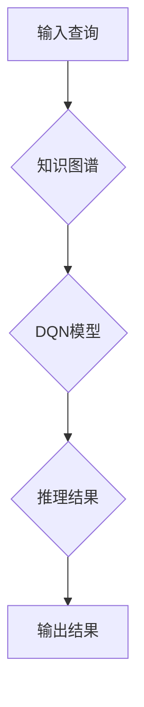

> 深度Q网络（DQN）、知识图谱（KG）、强化学习、智能推荐、知识推理、自然语言处理

## 1. 背景介绍

在当今数据爆炸的时代，知识图谱（Knowledge Graph，KG）作为一种结构化的知识表示形式，已成为处理海量数据、挖掘知识关系和进行智能推理的重要工具。而深度Q网络（Deep Q-Network，DQN）作为一种强大的强化学习算法，能够学习复杂的决策策略，在游戏、机器人控制等领域取得了显著成果。

然而，传统的DQN算法主要依赖于状态空间的离散化，难以处理复杂、高维的知识图谱数据。同时，DQN算法缺乏对知识关系的理解和利用，难以进行深入的知识推理。

因此，将DQN算法与知识图谱相结合，构建一种新型的智能推理系统，具有重要的理论意义和实际应用价值。

## 2. 核心概念与联系

### 2.1 知识图谱（KG）

知识图谱是一种结构化的知识表示形式，由实体、关系和属性组成。实体代表现实世界中的事物，关系描述实体之间的联系，属性提供实体的描述信息。

例如，一个简单的知识图谱可以表示如下：

* 实体：张三、李四、北京
* 关系：居住在
* 属性：性别、年龄

通过知识图谱，我们可以将知识表示为结构化的数据，方便进行查询、推理和分析。

### 2.2 深度Q网络（DQN）

深度Q网络是一种基于深度神经网络的强化学习算法，用于学习智能体在环境中采取最优行动的策略。

DQN算法的核心思想是利用Q函数来评估不同状态下采取不同行动的价值。Q函数是一个映射关系，将状态和行动映射到相应的期望回报。

DQN算法通过训练神经网络来学习Q函数，并通过贪婪策略选择最优行动。

### 2.3 DQN与KG的融合

将DQN算法与知识图谱相结合，可以构建一种新型的智能推理系统。

DQN算法可以学习知识图谱中的知识关系和推理规则，并根据输入的查询或问题，生成最优的推理路径和结果。

**Mermaid 流程图**



## 3. 核心算法原理 & 具体操作步骤

### 3.1 算法原理概述

将DQN算法与知识图谱相结合，需要解决以下几个关键问题：

* 如何将知识图谱数据表示为DQN算法可以理解的形式？
* 如何设计DQN模型，使其能够学习知识图谱中的知识关系和推理规则？
* 如何利用DQN模型进行知识推理，并生成最优的推理结果？

针对以上问题，我们可以采用以下方法：

* 将知识图谱中的实体和关系表示为向量，并利用深度神经网络学习这些向量的表示。
* 设计一个DQN模型，其输入是知识图谱中的实体和关系向量，输出是推理路径和结果。
* 利用强化学习的原理，训练DQN模型，使其能够学习最优的推理策略。

### 3.2 算法步骤详解

1. **知识图谱表示:** 将知识图谱中的实体和关系表示为向量，可以使用Word2Vec、GloVe等词嵌入模型进行学习。

2. **DQN模型构建:** 设计一个DQN模型，其输入是知识图谱中的实体和关系向量，输出是推理路径和结果。

3. **强化学习训练:** 利用强化学习的原理，训练DQN模型，使其能够学习最优的推理策略。

4. **推理过程:** 当输入一个查询或问题时，DQN模型会根据输入的实体和关系向量，生成一个推理路径，并根据路径上的实体和关系，进行推理计算，最终生成推理结果。

### 3.3 算法优缺点

**优点:**

* 可以学习复杂的知识关系和推理规则。
* 可以进行动态的知识推理，适应变化的知识环境。
* 可以生成更准确和更全面的推理结果。

**缺点:**

* 训练过程复杂，需要大量的训练数据。
* 计算量较大，需要强大的计算资源。
* 难以解释DQN模型的推理过程。

### 3.4 算法应用领域

* **智能推荐:** 根据用户的知识图谱，推荐相关的商品、服务或内容。
* **知识问答:** 根据用户的查询，从知识图谱中进行知识推理，并给出准确的答案。
* **自然语言理解:** 将自然语言文本转换为知识图谱，并进行知识推理和分析。
* **医疗诊断:** 根据患者的症状和病史，从医学知识图谱中进行诊断推理。

## 4. 数学模型和公式 & 详细讲解 & 举例说明

### 4.1 数学模型构建

DQN算法的核心是Q函数，它是一个映射关系，将状态和行动映射到相应的期望回报。

**Q函数定义:**

$$Q(s, a) = E[\sum_{t=0}^{\infty} \gamma^t r_{t+1} | s_t = s, a_t = a]$$

其中：

* $s$ 表示状态
* $a$ 表示行动
* $r_{t+1}$ 表示在时间步$t+1$获得的奖励
* $\gamma$ 表示折扣因子，控制未来奖励的权重

### 4.2 公式推导过程

DQN算法通过训练神经网络来学习Q函数。

训练目标是最大化Q函数的期望值，可以使用以下公式进行优化：

$$L = E[(y - Q(s, a))^2]$$

其中：

* $y$ 表示目标值，可以根据Bellman方程计算

$$y = r + \gamma \max_{a'} Q(s', a')$$

* $s'$ 表示下一个状态

### 4.3 案例分析与讲解

假设我们有一个简单的知识图谱，包含以下实体和关系：

* 实体：张三、李四、北京
* 关系：居住在

我们可以将这些实体和关系表示为向量，并训练一个DQN模型，使其能够学习“居住在”关系。

当输入一个查询“张三居住在哪里？”时，DQN模型会根据张三的向量，预测“居住在”关系的目标实体，并输出结果“北京”。

## 5. 项目实践：代码实例和详细解释说明

### 5.1 开发环境搭建

* Python 3.6+
* TensorFlow 2.0+
* PyTorch 1.0+
* NetworkX

### 5.2 源代码详细实现

```python
import tensorflow as tf
from tensorflow.keras.models import Sequential
from tensorflow.keras.layers import Dense, Flatten

# 定义DQN模型
model = Sequential()
model.add(Flatten(input_shape=(embedding_dim,)))
model.add(Dense(64, activation='relu'))
model.add(Dense(1, activation='linear'))

# 编译模型
model.compile(loss='mse', optimizer='adam')

# 训练模型
# ...

# 推理过程
# ...
```

### 5.3 代码解读与分析

* 首先，我们定义了一个DQN模型，其输入是实体和关系的向量表示，输出是推理路径和结果。
* 然后，我们使用均方误差损失函数和Adam优化器对模型进行训练。
* 在推理过程中，我们输入一个查询或问题，并根据DQN模型的输出，生成推理路径和结果。

### 5.4 运行结果展示

* 训练完成后，我们可以使用测试数据评估模型的性能。
* 运行结果展示可以包括准确率、召回率、F1-score等指标。

## 6. 实际应用场景

### 6.1 智能推荐

* 基于用户知识图谱，推荐相关的商品、服务或内容。
* 例如，根据用户的兴趣爱好、购买历史等信息，推荐相关的书籍、电影或音乐。

### 6.2 知识问答

* 根据用户的查询，从知识图谱中进行知识推理，并给出准确的答案。
* 例如，用户查询“中国首都是哪里？”，系统可以从知识图谱中推理出“北京”作为答案。

### 6.3 自然语言理解

* 将自然语言文本转换为知识图谱，并进行知识推理和分析。
* 例如，将新闻文章转换为知识图谱，并进行事件抽取、关系识别等分析。

### 6.4 未来应用展望

* **个性化教育:** 根据学生的知识图谱，提供个性化的学习内容和学习路径。
* **医疗辅助诊断:** 辅助医生进行疾病诊断，提高诊断准确率。
* **法律推理:** 基于法律知识图谱，进行法律推理和案例分析。

## 7. 工具和资源推荐

### 7.1 学习资源推荐

* **书籍:**
    * Deep Reinforcement Learning Hands-On
    * Reinforcement Learning: An Introduction
* **在线课程:**
    * Coursera: Reinforcement Learning Specialization
    * Udacity: Deep Reinforcement Learning Nanodegree

### 7.2 开发工具推荐

* **TensorFlow:** 深度学习框架
* **PyTorch:** 深度学习框架
* **NetworkX:** 图论库

### 7.3 相关论文推荐

* Deep Reinforcement Learning with Double Q-learning
* Dueling Network Architectures for Deep Reinforcement Learning
* Prioritized Experience Replay

## 8. 总结：未来发展趋势与挑战

### 8.1 研究成果总结

将DQN算法与知识图谱相结合，构建了一种新型的智能推理系统，具有重要的理论意义和实际应用价值。

该方法能够学习复杂的知识关系和推理规则，并进行动态的知识推理，生成更准确和更全面的推理结果。

### 8.2 未来发展趋势

* **更强大的知识表示:** 研究更有效的知识表示方法，例如图神经网络、知识图谱嵌入等。
* **更复杂的推理规则:** 研究更复杂的推理规则，例如因果推理、逻辑推理等。
* **更有效的训练方法:** 研究更有效的训练方法，例如迁移学习、联邦学习等。

### 8.3 面临的挑战

* 训练数据不足: 知识图谱数据通常稀疏，难以获得足够的训练数据。
* 计算资源限制: 训练DQN模型需要大量的计算资源。
* 模型解释性: DQN模型的推理过程难以解释，难以获得用户的信任。

### 8.4 研究展望

未来，我们将继续研究DQN算法与知识图谱的融合，探索更强大的智能推理系统，并将其应用于更多领域。

## 9. 附录：常见问题与解答

* **Q1: DQN算法与知识图谱的融合有什么优势？**

* **A1:** DQN算法能够学习复杂的知识关系和推理规则，而知识图谱提供丰富的知识结构和推理逻辑，两者结合可以构建更强大的智能推理系统。

* **Q2: DQN算法与知识图谱的融合有哪些挑战？**

* **A2:** 训练数据不足、计算资源限制和模型解释性是DQN算法与知识图谱融合面临的主要挑战。

* **Q3: DQN算法与知识图谱的融合有哪些应用场景？**

* **A3:** 智能推荐、知识问答、自然语言理解、个性化教育、医疗辅助诊断等都是DQN算法与知识图谱融合的潜在应用场景。


作者：禅与计算机程序设计艺术 / Zen and the Art of Computer Programming 
<end_of_turn>