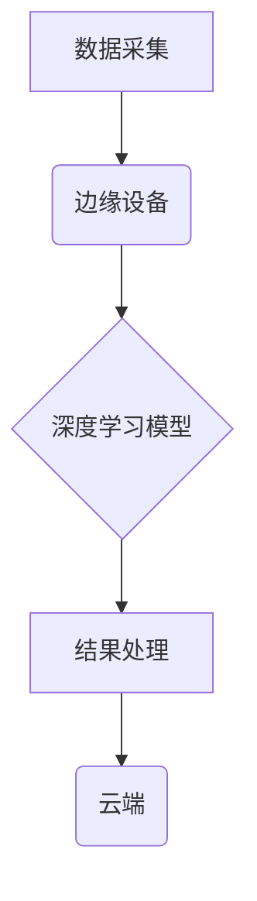

> 深度学习、边缘计算、模型压缩、推理加速、数据隐私

## 1. 背景介绍

随着物联网、人工智能等技术的蓬勃发展，海量数据在各个领域无处不在。传统的云计算架构面临着数据传输延迟高、网络带宽压力大、数据安全风险等挑战。边缘计算应运而生，将计算资源和数据存储部署到网络边缘，实现数据本地处理，从而降低延迟、提升效率、保障数据安全。

深度学习作为人工智能的核心技术，在图像识别、自然语言处理、语音识别等领域取得了突破性进展。然而，深度学习模型通常体积庞大、计算资源需求高，难以直接部署在资源受限的边缘设备上。因此，如何将深度学习模型高效地部署到边缘计算环境中，成为一个重要的研究课题。

## 2. 核心概念与联系

**2.1 深度学习**

深度学习是一种基于多层神经网络的机器学习方法，能够自动学习数据中的特征表示，并进行复杂的模式识别和预测。深度学习模型通常由多个神经网络层组成，每层神经元之间通过权重连接，通过前向传播和反向传播算法进行训练。

**2.2 边缘计算**

边缘计算是指将计算资源和数据存储部署到网络边缘，靠近数据源，实现数据本地处理的计算模式。边缘计算可以分为以下几个层次：

* **设备层:** 包括传感器、摄像头、微控制器等设备，负责数据采集和预处理。
* **边缘节点层:** 包括边缘服务器、网关等设备，负责数据存储、计算和控制。
* **云端层:** 提供全局数据存储、计算和管理服务。

**2.3 深度学习在边缘计算中的应用**

将深度学习模型部署到边缘计算环境中，可以实现以下优势：

* **降低延迟:** 数据可以在边缘设备上本地处理，减少数据传输时间，从而降低延迟。
* **提升效率:** 将计算任务卸载到边缘设备，可以减轻云端服务器的负担，提高整体系统效率。
* **保障数据安全:** 数据可以在边缘设备上本地处理，减少数据传输风险，提高数据安全。
* **支持离线操作:** 边缘设备可以离线工作，即使网络中断也能继续执行任务。

**2.4 架构图**



## 3. 核心算法原理 & 具体操作步骤

**3.1 算法原理概述**

深度学习模型在边缘计算环境中的部署主要面临以下挑战：

* **模型大小:** 深度学习模型通常体积庞大，难以存储在资源受限的边缘设备上。
* **计算资源:** 边缘设备的计算资源有限，难以运行大型深度学习模型。
* **功耗:** 深度学习模型的推理过程消耗大量电能，不利于边缘设备的续航时间。

为了解决这些问题，需要对深度学习模型进行压缩和优化，使其能够高效地部署在边缘计算环境中。

**3.2 算法步骤详解**

深度学习模型压缩和优化主要包括以下步骤：

1. **模型选择:** 选择适合边缘计算环境的深度学习模型，例如轻量级模型、可微调模型等。
2. **模型量化:** 将模型参数的精度降低，例如将32位浮点数转换为8位整数，从而减少模型大小和计算量。
3. **模型剪枝:** 删除模型中不重要的参数和连接，从而减少模型大小和计算量。
4. **模型蒸馏:** 使用一个小的学生模型学习一个大的教师模型的知识，从而获得一个更小的模型。
5. **模型加速:** 使用硬件加速器或算法优化技术，提高模型推理速度。

**3.3 算法优缺点**

* **优点:** 可以有效地压缩和优化深度学习模型，使其能够高效地部署在边缘计算环境中。
* **缺点:** 模型压缩和优化可能会导致模型精度下降。

**3.4 算法应用领域**

深度学习模型压缩和优化技术广泛应用于以下领域：

* **智能手机:** 用于部署语音识别、图像识别等应用。
* **物联网设备:** 用于部署传感器数据分析、设备故障诊断等应用。
* **自动驾驶:** 用于部署图像识别、目标跟踪等应用。

## 4. 数学模型和公式 & 详细讲解 & 举例说明

**4.1 数学模型构建**

深度学习模型的压缩和优化可以看作是一个优化问题，目标是找到一个满足特定条件的模型，例如最小化模型大小、最大化模型精度等。

**4.2 公式推导过程**

例如，模型量化可以看作是一个离散化问题，将模型参数的精度降低到一个有限的取值范围。

假设模型参数为连续值，量化后将其转换为离散值，可以使用以下公式进行量化：

$$
q(x) = \text{round}(x / \Delta) * \Delta
$$

其中，$x$ 是模型参数的连续值，$\Delta$ 是量化步长。

**4.3 案例分析与讲解**

例如，将一个32位浮点数模型参数量化为8位整数，可以将模型大小减少到原来的1/4，同时保持一定的精度。

## 5. 项目实践：代码实例和详细解释说明

**5.1 开发环境搭建**

* 操作系统: Ubuntu 20.04
* 深度学习框架: TensorFlow Lite
* 硬件平台: Raspberry Pi 4

**5.2 源代码详细实现**

```python
import tensorflow as tf

# 加载预训练模型
model = tf.keras.models.load_model('model.h5')

# 将模型转换为 TensorFlow Lite 模型
converter = tf.lite.TFLiteConverter.from_keras_model(model)
tflite_model = converter.convert()

# 保存 TensorFlow Lite 模型
with open('model.tflite', 'wb') as f:
    f.write(tflite_model)
```

**5.3 代码解读与分析**

* 使用 TensorFlow Keras 加载预训练模型。
* 使用 TensorFlow Lite Converter 将模型转换为 TensorFlow Lite 模型。
* 将 TensorFlow Lite 模型保存到本地文件。

**5.4 运行结果展示**

将 TensorFlow Lite 模型部署到 Raspberry Pi 4 上，可以实现实时图像识别等应用。

## 6. 实际应用场景

**6.1 智能家居**

* 使用深度学习模型识别用户的语音指令，控制智能家居设备。
* 使用深度学习模型识别用户的身份，实现智能门锁和智能照明。

**6.2 工业自动化**

* 使用深度学习模型检测产品缺陷，提高生产效率。
* 使用深度学习模型识别机器故障，降低维护成本。

**6.3 医疗保健**

* 使用深度学习模型分析医学图像，辅助医生诊断疾病。
* 使用深度学习模型识别患者的生理特征，监测患者的健康状况。

**6.4 未来应用展望**

随着边缘计算技术的不断发展，深度学习在边缘计算中的应用将更加广泛。例如，可以实现更加智能的无人驾驶汽车、更加安全的智能城市、更加高效的工业生产等。

## 7. 工具和资源推荐

**7.1 学习资源推荐**

* TensorFlow Lite 官方文档: https://www.tensorflow.org/lite
* PyTorch Mobile 官方文档: https://pytorch.org/mobile/

**7.2 开发工具推荐**

* TensorFlow Lite Model Maker: https://www.tensorflow.org/lite/model_maker
* PyTorch Mobile: https://pytorch.org/mobile/

**7.3 相关论文推荐**

* MobileBERT: https://arxiv.org/abs/1909.09408
* EfficientNet: https://arxiv.org/abs/1905.11946

## 8. 总结：未来发展趋势与挑战

**8.1 研究成果总结**

深度学习在边缘计算中的应用取得了显著进展，例如模型压缩、推理加速、数据隐私保护等技术取得了突破性进展。

**8.2 未来发展趋势**

* **模型自适应:** 模型能够根据边缘设备的资源和任务需求进行自适应调整。
* **联邦学习:** 模型训练可以在多个边缘设备上进行，保护数据隐私。
* **异构计算:** 模型能够利用不同类型的边缘设备资源进行协同计算。

**8.3 面临的挑战**

* **模型精度:** 模型压缩和优化可能会导致模型精度下降。
* **安全性和可靠性:** 边缘设备的安全性需要得到保障，模型的可靠性需要得到验证。
* **标准化和生态建设:** 需要建立统一的标准和生态系统，促进深度学习在边缘计算中的应用。

**8.4 研究展望**

未来，深度学习在边缘计算中的研究将更加注重模型的效率、安全性和可靠性，以及与其他技术的融合，例如物联网、云计算、区块链等。


## 9. 附录：常见问题与解答

**9.1 如何选择适合边缘计算的深度学习模型？**

选择适合边缘计算的深度学习模型需要考虑以下因素：

* 模型大小: 模型大小应该尽量小，以便能够存储在边缘设备上。
* 计算量: 模型的计算量应该尽量低，以便能够在边缘设备上高效运行。
* 精度: 模型的精度应该满足应用需求。

**9.2 如何进行深度学习模型的压缩和优化？**

深度学习模型的压缩和优化主要包括以下方法：

* 模型量化
* 模型剪枝
* 模型蒸馏
* 模型加速

**9.3 如何部署深度学习模型到边缘设备上？**

可以使用 TensorFlow Lite、PyTorch Mobile 等深度学习框架将模型转换为边缘设备可执行的格式，然后部署到边缘设备上。


作者：禅与计算机程序设计艺术 / Zen and the Art of Computer Programming 
<end_of_turn>