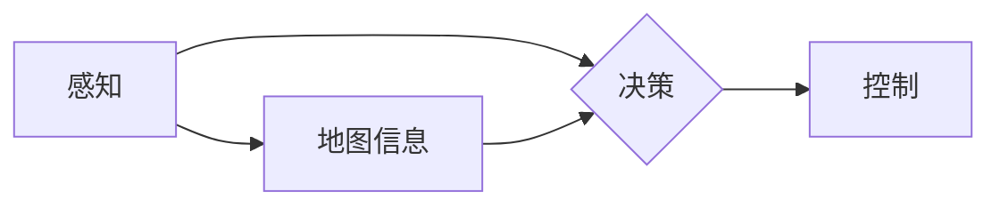

> 自动驾驶, AI算法, 深度学习, 计算机视觉, 预测建模, 路径规划, 决策控制

## 1. 背景介绍

自动驾驶技术作为未来交通运输的重要发展方向，近年来取得了显著进展。其核心在于利用人工智能 (AI) 算法，使车辆能够感知周围环境、理解道路规则、做出安全可靠的驾驶决策。自动驾驶技术的发展离不开 AI 算法的不断创新和完善。

传统的驾驶模式依赖于人类的经验和直觉，而 AI 算法则通过学习和分析海量数据，建立起对驾驶环境的理解模型，从而实现自动化驾驶。

## 2. 核心概念与联系

自动驾驶技术的核心概念包括感知、决策和控制。

* **感知:**  车辆通过传感器 (如摄像头、雷达、激光雷达) 收集周围环境的信息，包括道路状况、车辆位置、行人信息等。
* **决策:**  基于感知到的信息，AI 算法分析路况、预测未来场景，并做出驾驶决策，例如加速、减速、转向、停车等。
* **控制:**  AI 算法将决策指令传递给车辆的控制系统，实现车辆的运动控制。

**核心概念架构图:**



## 3. 核心算法原理 & 具体操作步骤

### 3.1  算法原理概述

自动驾驶技术中常用的 AI 算法包括深度学习、计算机视觉、预测建模和路径规划等。

* **深度学习:**  通过多层神经网络，学习数据中的复杂特征，实现图像识别、物体检测、场景理解等功能。
* **计算机视觉:**  利用图像处理和计算机视觉技术，分析图像信息，识别道路标志、交通信号灯、行人等。
* **预测建模:**  基于历史数据和当前环境信息，预测未来车辆运动轨迹、行人行为等。
* **路径规划:**  根据目标位置和周围环境信息，规划车辆行驶路径，避免碰撞和违规行驶。

### 3.2  算法步骤详解

以深度学习算法为例，其具体操作步骤如下：

1. **数据收集:**  收集大量驾驶场景图像、视频和传感器数据。
2. **数据预处理:**  对数据进行清洗、格式化、增强等处理，提高数据质量。
3. **模型构建:**  选择合适的深度学习模型架构，例如卷积神经网络 (CNN) 或循环神经网络 (RNN)。
4. **模型训练:**  利用训练数据训练深度学习模型，调整模型参数，使其能够准确识别和理解驾驶场景。
5. **模型评估:**  使用测试数据评估模型性能，例如识别准确率、物体检测精度等。
6. **模型部署:**  将训练好的模型部署到自动驾驶系统中，用于感知和决策。

### 3.3  算法优缺点

**深度学习算法的优点:**

* 能够学习数据中的复杂特征，实现高精度识别和预测。
* 具有良好的泛化能力，能够适应不同的驾驶场景。

**深度学习算法的缺点:**

* 需要大量数据进行训练，训练成本较高。
* 模型解释性较差，难以理解模型的决策过程。

### 3.4  算法应用领域

深度学习算法在自动驾驶技术中广泛应用，例如：

* **物体检测:**  识别道路上的车辆、行人、障碍物等。
* **场景理解:**  理解驾驶场景的整体情况，例如道路类型、交通流量等。
* **路径规划:**  规划车辆行驶路径，避免碰撞和违规行驶。
* **驾驶决策:**  根据感知到的信息和预测结果，做出驾驶决策，例如加速、减速、转向等。

## 4. 数学模型和公式 & 详细讲解 & 举例说明

### 4.1  数学模型构建

自动驾驶技术中常用的数学模型包括：

* **状态空间模型:**  描述车辆运动状态的数学模型，包括位置、速度、加速度等。
* **预测模型:**  基于历史数据和当前环境信息，预测未来车辆运动轨迹、行人行为等。
* **路径规划模型:**  根据目标位置和周围环境信息，规划车辆行驶路径。

### 4.2  公式推导过程

以状态空间模型为例，其状态方程可以表示为：

$$
x(k+1) = A(k)x(k) + B(k)u(k) + w(k)
$$

其中：

* $x(k)$: 车辆状态向量，包括位置、速度、加速度等。
* $u(k)$: 控制输入，例如加速度、转向角等。
* $w(k)$: 过程噪声，表示系统模型的误差。
* $A(k)$: 状态转移矩阵，描述车辆运动状态的演变规律。
* $B(k)$: 控制输入矩阵，描述控制输入对车辆运动状态的影响。

### 4.3  案例分析与讲解

假设一辆汽车的初始状态为：位置为 0 米，速度为 0 米/秒。控制输入为加速度为 1 米/秒²。根据状态空间模型，可以计算汽车在不同时刻的状态。

## 5. 项目实践：代码实例和详细解释说明

### 5.1  开发环境搭建

自动驾驶项目开发环境通常包括：

* 操作系统：Linux 或 Windows
* 编程语言：Python 或 C++
* 深度学习框架：TensorFlow 或 PyTorch
* 仿真平台：Gazebo 或 CARLA

### 5.2  源代码详细实现

以下是一个使用 TensorFlow 实现物体检测的简单代码示例：

```python
import tensorflow as tf

# 定义模型架构
model = tf.keras.models.Sequential([
    tf.keras.layers.Conv2D(32, (3, 3), activation='relu', input_shape=(64, 64, 3)),
    tf.keras.layers.MaxPooling2D((2, 2)),
    tf.keras.layers.Conv2D(64, (3, 3), activation='relu'),
    tf.keras.layers.MaxPooling2D((2, 2)),
    tf.keras.layers.Flatten(),
    tf.keras.layers.Dense(10, activation='softmax')
])

# 编译模型
model.compile(optimizer='adam',
              loss='sparse_categorical_crossentropy',
              metrics=['accuracy'])

# 训练模型
model.fit(x_train, y_train, epochs=10)

# 评估模型
loss, accuracy = model.evaluate(x_test, y_test)
print('Loss:', loss)
print('Accuracy:', accuracy)
```

### 5.3  代码解读与分析

这段代码定义了一个简单的卷积神经网络模型，用于图像分类任务。

* `tf.keras.models.Sequential`: 创建一个顺序模型，层级结构清晰。
* `tf.keras.layers.Conv2D`: 卷积层，用于提取图像特征。
* `tf.keras.layers.MaxPooling2D`: 最大池化层，用于降维和提高模型鲁棒性。
* `tf.keras.layers.Flatten`: 将多维特征转换为一维向量。
* `tf.keras.layers.Dense`: 全连接层，用于分类。
* `model.compile`: 编译模型，指定优化器、损失函数和评价指标。
* `model.fit`: 训练模型，使用训练数据进行迭代训练。
* `model.evaluate`: 评估模型，使用测试数据计算损失和准确率。

### 5.4  运行结果展示

训练完成后，可以将模型应用于新的图像数据，进行物体检测。

## 6. 实际应用场景

自动驾驶技术在多个领域都有实际应用场景：

* **自动驾驶汽车:**  实现车辆自动驾驶，提高交通安全和效率。
* **无人机:**  实现无人机自动飞行，用于物流运输、农业监测等。
* **机器人:**  实现机器人自主导航和任务执行，用于工业自动化、服务机器人等。

### 6.4  未来应用展望

未来，自动驾驶技术将更加智能化、安全可靠，应用场景也将更加广泛，例如：

* **智能交通系统:**  实现车辆与基础设施的协同控制，优化交通流量。
* **智慧城市:**  利用自动驾驶技术构建智慧城市，提高城市管理效率。
* **个性化出行:**  提供定制化的出行服务，满足不同用户的需求。

## 7. 工具和资源推荐

### 7.1  学习资源推荐

* **书籍:**
    * 《深度学习》
    * 《自动驾驶汽车》
* **在线课程:**
    * Coursera: 深度学习
    * Udacity: 自动驾驶工程师
* **开源项目:**
    * TensorFlow
    * PyTorch
    * CARLA

### 7.2  开发工具推荐

* **仿真平台:**
    * Gazebo
    * CARLA
* **编程语言:**
    * Python
    * C++
* **深度学习框架:**
    * TensorFlow
    * PyTorch

### 7.3  相关论文推荐

* **论文:**
    * 《End to End Learning for Self-Driving Cars》
    * 《Deep Reinforcement Learning for Autonomous Driving》

## 8. 总结：未来发展趋势与挑战

### 8.1  研究成果总结

自动驾驶技术取得了显著进展，AI 算法在感知、决策和控制等方面发挥着关键作用。

### 8.2  未来发展趋势

未来，自动驾驶技术将朝着更加智能化、安全可靠、个性化方向发展。

* **增强感知能力:**  利用多传感器融合技术，提高感知精度和可靠性。
* **提升决策能力:**  开发更强大的决策算法，能够应对复杂和突发情况。
* **加强安全性:**  完善安全保障机制，确保自动驾驶系统的安全可靠性。
* **个性化定制:**  提供个性化的出行服务，满足不同用户的需求。

### 8.3  面临的挑战

自动驾驶技术还面临着一些挑战：

* **数据获取和标注:**  自动驾驶算法需要海量数据进行训练，数据获取和标注成本较高。
* **算法鲁棒性:**  自动驾驶算法需要能够应对各种复杂和突发情况，提高算法鲁棒性。
* **法律法规:**  自动驾驶技术的法律法规尚不完善，需要制定相应的法律法规。
* **公众接受度:**  公众对自动驾驶技术的接受度还需要提高。

### 8.4  研究展望

未来，需要继续加强自动驾驶技术的研究和开发，解决技术难题，推动自动驾驶技术更快、更安全地应用于现实生活。

## 9. 附录：常见问题与解答

### 9.1  常见问题

* **自动驾驶技术是否安全可靠？**

自动驾驶技术目前已经取得了显著进展，但仍处于发展阶段，安全性还需要进一步提高。

* **自动驾驶汽车何时能够普及？**

自动驾驶汽车的普及时间取决于技术发展、政策法规和公众接受度等因素。

* **自动驾驶技术会取代人类驾驶员吗？**

自动驾驶技术可以辅助驾驶员，提高驾驶效率和安全性，但不会完全取代人类驾驶员。

### 9.2  解答

自动驾驶技术的发展是一个循序渐进的过程，需要不断地技术创新、政策支持和公众参与。


作者：禅与计算机程序设计艺术 / Zen and the Art of Computer Programming 
<end_of_turn>