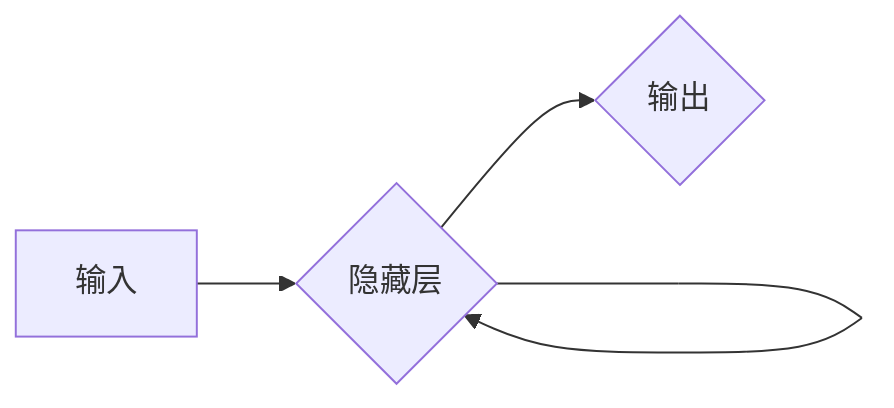
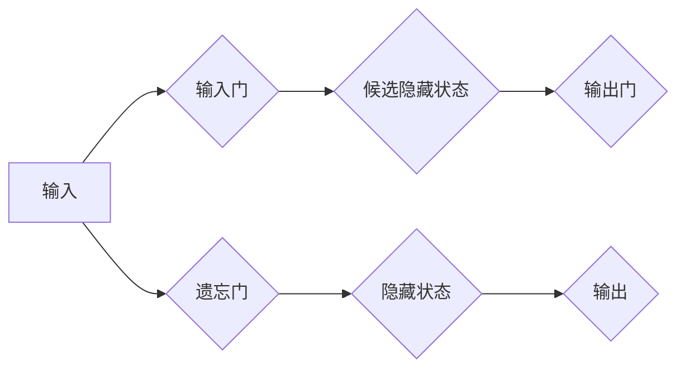

> 长短时记忆网络(LSTM)，文本生成，自然语言处理(NLP)，深度学习，循环神经网络(RNN)，序列模型

## 1. 背景介绍

在当今数据爆炸的时代，文本数据已成为重要的信息资源。如何有效地理解、生成和处理文本信息，是自然语言处理 (NLP) 领域的核心挑战。传统的文本处理方法往往依赖于手工设计的特征工程，难以捕捉文本中的复杂语义关系。随着深度学习的兴起，循环神经网络 (RNN) 和其变体，如长短时记忆网络 (LSTM)，为文本处理带来了革命性的变革。

LSTM 是一种特殊的 RNN 结构，能够有效地解决 RNN 在处理长序列数据时出现的梯度消失问题。它通过引入门控机制，控制信息的流动，从而更好地记忆长期的依赖关系。LSTM 的强大能力使其在文本生成领域展现出巨大的潜力，例如机器翻译、文本摘要、对话系统等。

## 2. 核心概念与联系

### 2.1 RNN 的局限性

循环神经网络 (RNN) 是一种能够处理序列数据的网络结构。其核心特点是隐藏状态的循环传递，使得网络能够记忆过去的输入信息，从而理解序列中的上下文关系。然而，传统的 RNN 在处理长序列数据时存在梯度消失问题。

当序列长度过长时，梯度在反向传播过程中会不断衰减，导致网络难以学习长期的依赖关系。



### 2.2 LSTM 的优势

长短时记忆网络 (LSTM) 是一种改进的 RNN 结构，通过引入门控机制，有效地解决了梯度消失问题。LSTM 包含三个主要门控：输入门、遗忘门和输出门。

* **输入门:** 控制新信息的输入。
* **遗忘门:** 控制旧信息的遗忘。
* **输出门:** 控制隐藏状态的输出。

通过这些门控机制，LSTM 可以选择性地保留和更新信息，从而更好地记忆长期的依赖关系。



## 3. 核心算法原理 & 具体操作步骤

### 3.1 算法原理概述

LSTM 的核心原理是通过门控机制控制信息的流动，从而更好地记忆长期的依赖关系。

* **输入门:** 计算一个值，决定哪些新信息应该被添加到隐藏状态中。
* **遗忘门:** 计算一个值，决定哪些旧信息应该被遗忘。
* **输出门:** 计算一个值，决定哪些信息应该被输出到下一个时间步。

### 3.2 算法步骤详解

1. **计算输入门:** 使用输入数据和前一个隐藏状态计算一个值，决定哪些新信息应该被添加到隐藏状态中。
2. **计算遗忘门:** 使用输入数据和前一个隐藏状态计算一个值，决定哪些旧信息应该被遗忘。
3. **更新隐藏状态:** 将遗忘门应用于前一个隐藏状态，并将输入门应用于候选隐藏状态，然后将两者相加得到新的隐藏状态。
4. **计算输出门:** 使用输入数据和当前隐藏状态计算一个值，决定哪些信息应该被输出到下一个时间步。
5. **输出结果:** 将输出门应用于当前隐藏状态，得到最终的输出结果。

### 3.3 算法优缺点

**优点:**

* 能够有效地解决梯度消失问题，处理长序列数据。
* 能够捕捉文本中的长距离依赖关系。
* 在文本生成任务中表现出色。

**缺点:**

* 计算复杂度较高，训练时间较长。
* 参数量较大，需要大量的训练数据。

### 3.4 算法应用领域

* **机器翻译:** 将一种语言翻译成另一种语言。
* **文本摘要:** 生成文本的简短摘要。
* **对话系统:** 创建能够与人类进行自然对话的系统。
* **文本生成:** 生成新的文本内容，例如诗歌、小说、新闻等。

## 4. 数学模型和公式 & 详细讲解 & 举例说明

### 4.1 数学模型构建

LSTM 的数学模型可以表示为以下公式：

* **输入门:** $i_t = \sigma(W_{xi}x_t + W_{hi}h_{t-1} + b_i)$
* **遗忘门:** $f_t = \sigma(W_{xf}x_t + W_{hf}h_{t-1} + b_f)$
* **候选隐藏状态:** $\tilde{h}_t = \tanh(W_{xh}x_t + W_{hh}h_{t-1} + b_h)$
* **隐藏状态:** $h_t = f_t \odot h_{t-1} + i_t \odot \tilde{h}_t$
* **输出门:** $o_t = \sigma(W_{xo}x_t + W_{ho}h_{t} + b_o)$
* **输出:** $y_t = o_t \odot \tanh(h_t)$

其中:

* $x_t$ 是当前时间步的输入数据。
* $h_t$ 是当前时间步的隐藏状态。
* $y_t$ 是当前时间步的输出结果。
* $W$ 是权重矩阵。
* $b$ 是偏置项。
* $\sigma$ 是 sigmoid 函数。
* $\tanh$ 是 tanh 函数。
* $\odot$ 是元素相乘运算。

### 4.2 公式推导过程

LSTM 的公式推导过程较为复杂，涉及到矩阵运算和微积分。

### 4.3 案例分析与讲解

通过以上公式，我们可以构建 LSTM 模型，并将其应用于文本生成任务。例如，我们可以使用 LSTM 模型生成诗歌。

## 5. 项目实践：代码实例和详细解释说明

### 5.1 开发环境搭建

* Python 3.x
* TensorFlow 或 PyTorch

### 5.2 源代码详细实现

```python
import tensorflow as tf

# 定义 LSTM 模型
model = tf.keras.Sequential([
    tf.keras.layers.Embedding(input_dim=vocab_size, output_dim=embedding_dim),
    tf.keras.layers.LSTM(units=lstm_units),
    tf.keras.layers.Dense(units=vocab_size, activation='softmax')
])

# 编译模型
model.compile(loss='sparse_categorical_crossentropy', optimizer='adam')

# 训练模型
model.fit(x_train, y_train, epochs=epochs)

# 生成文本
text = model.predict(x_test)
```

### 5.3 代码解读与分析

* **Embedding 层:** 将单词转换为稠密的向量表示。
* **LSTM 层:** 处理文本序列，捕捉长距离依赖关系。
* **Dense 层:** 将 LSTM 输出转换为概率分布，预测下一个单词。

### 5.4 运行结果展示

训练完成后，我们可以使用模型生成新的文本。

## 6. 实际应用场景

### 6.1 机器翻译

LSTM 可以用于机器翻译，将一种语言翻译成另一种语言。例如，可以使用 LSTM 模型将英文翻译成中文。

### 6.2 文本摘要

LSTM 可以用于文本摘要，生成文本的简短摘要。例如，可以使用 LSTM 模型生成新闻文章的摘要。

### 6.3 对话系统

LSTM 可以用于对话系统，创建能够与人类进行自然对话的系统。例如，可以使用 LSTM 模型构建聊天机器人。

### 6.4 未来应用展望

* **个性化推荐:** 根据用户的阅读历史和偏好，推荐个性化的内容。
* **自动写作:** 自动生成新闻报道、小说、诗歌等文本内容。
* **代码生成:** 根据自然语言描述，自动生成代码。

## 7. 工具和资源推荐

### 7.1 学习资源推荐

* **书籍:**
    * 《深度学习》
    * 《自然语言处理》
* **在线课程:**
    * Coursera: 自然语言处理
    * Udacity: 深度学习

### 7.2 开发工具推荐

* **TensorFlow:** 开源深度学习框架。
* **PyTorch:** 开源深度学习框架。
* **Keras:** 高级深度学习 API。

### 7.3 相关论文推荐

* **Long Short-Term Memory**
* **Attention Is All You Need**

## 8. 总结：未来发展趋势与挑战

### 8.1 研究成果总结

LSTM 是一种强大的文本处理模型，在文本生成领域取得了显著的成果。

### 8.2 未来发展趋势

* **更强大的模型架构:** 研究更强大的 LSTM 变体，例如双向 LSTM、门控循环单元 (GRU)。
* **更有效的训练方法:** 研究更有效的训练方法，例如迁移学习、自监督学习。
* **更广泛的应用场景:** 将 LSTM 应用于更多领域，例如医疗、金融、教育等。

### 8.3 面临的挑战

* **数据稀缺性:** 许多领域的数据稀缺，难以训练有效的 LSTM 模型。
* **计算资源限制:** 训练大型 LSTM 模型需要大量的计算资源。
* **可解释性问题:** LSTM 模型的决策过程难以解释，难以理解模型的内部机制。

### 8.4 研究展望

未来，LSTM 模型将继续发展，并应用于更多领域。研究人员将致力于解决 LSTM 模型面临的挑战，使其更加强大、高效和可解释。

## 9. 附录：常见问题与解答

* **什么是 LSTM？**

LSTM 是一种特殊的 RNN 结构，能够有效地解决 RNN 在处理长序列数据时出现的梯度消失问题。

* **LSTM 的优势是什么？**

LSTM 能够有效地解决梯度消失问题，处理长序列数据。

* **LSTM 的应用场景有哪些？**

LSTM 的应用场景包括机器翻译、文本摘要、对话系统等。


作者：禅与计算机程序设计艺术 / Zen and the Art of Computer Programming 
<end_of_turn>