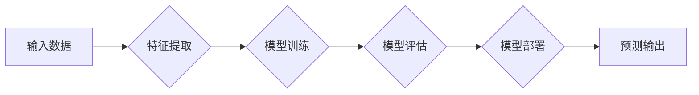

> 人工智能，机器学习，深度学习，神经网络，算法，代码实例，实践应用

## 1. 背景介绍

人工智能 (AI) 作为一项前沿科技，近年来发展迅速，已渗透到生活的方方面面。从智能手机的语音助手到自动驾驶汽车，从医疗诊断到金融风险评估，AI 正在改变着我们的世界。

然而，对于许多人来说，AI 仍然是一个神秘而难以理解的概念。他们可能知道 AI 可以做一些神奇的事情，但对它的原理和实现方式却知之甚少。

本书旨在通过通俗易懂的语言和代码实例，深入浅出地讲解人工智能的原理和实现方法，帮助读者理解 AI 的本质，并掌握一些基本的 AI 开发技能。

## 2. 核心概念与联系

人工智能的核心概念包括：

* **机器学习 (Machine Learning)**：让计算机从数据中学习，无需明确编程。
* **深度学习 (Deep Learning)**：一种更高级的机器学习方法，使用多层神经网络模拟人类大脑的学习过程。
* **神经网络 (Neural Network)**：由相互连接的神经元组成的网络结构，能够学习复杂的模式和关系。

**Mermaid 流程图:**



## 3. 核心算法原理 & 具体操作步骤

### 3.1  算法原理概述

**线性回归 (Linear Regression)** 是一种基本的监督学习算法，用于预测连续值。它假设数据之间存在线性关系，并通过最小化误差来找到最佳的拟合直线。

### 3.2  算法步骤详解

1. **数据准备**: 收集并预处理数据，包括特征选择、数据清洗和数据标准化。
2. **模型构建**: 使用线性回归模型，定义目标变量和特征变量之间的关系。
3. **模型训练**: 使用训练数据，通过最小二乘法或梯度下降法，找到最佳的模型参数。
4. **模型评估**: 使用测试数据，评估模型的预测精度，例如使用均方误差 (MSE) 或 R-squared 值。
5. **模型部署**: 将训练好的模型部署到实际应用场景中，用于预测新的数据。

### 3.3  算法优缺点

**优点**:

* 算法简单易懂，易于实现。
* 计算效率高，适合处理大规模数据。

**缺点**:

* 只能处理线性关系，对于非线性关系的预测效果较差。
* 对异常值敏感，容易受到异常值的影响。

### 3.4  算法应用领域

* 房价预测
* 股票价格预测
* 销售额预测
* 医疗诊断

## 4. 数学模型和公式 & 详细讲解 & 举例说明

### 4.1  数学模型构建

线性回归模型的数学表达式为：

$$y = w_0 + w_1x_1 + w_2x_2 + ... + w_nx_n + \epsilon$$

其中：

* $y$ 是目标变量
* $x_1, x_2, ..., x_n$ 是特征变量
* $w_0, w_1, w_2, ..., w_n$ 是模型参数
* $\epsilon$ 是误差项

### 4.2  公式推导过程

最小二乘法是一种常用的模型训练方法，其目标是找到使误差平方和最小的模型参数。

误差平方和为：

$$SSE = \sum_{i=1}^{n}(y_i - \hat{y}_i)^2$$

其中：

* $y_i$ 是第 $i$ 个样本的目标变量
* $\hat{y}_i$ 是模型预测的第 $i$ 个样本的目标变量

通过对误差平方和求导，并令导数为零，可以得到模型参数的解。

### 4.3  案例分析与讲解

假设我们想要预测房屋价格，特征变量包括房屋面积、房间数量和地理位置。我们可以使用线性回归模型，将这些特征变量与房屋价格建立线性关系。

通过训练模型，我们可以得到最佳的模型参数，并使用这些参数预测新的房屋价格。

## 5. 项目实践：代码实例和详细解释说明

### 5.1  开发环境搭建

本项目使用 Python 语言和 scikit-learn 库进行开发。

需要安装 Python 和 scikit-learn 库。

### 5.2  源代码详细实现

```python
import pandas as pd
from sklearn.linear_model import LinearRegression
from sklearn.model_selection import train_test_split

# 加载数据
data = pd.read_csv('house_price.csv')

# 选择特征变量和目标变量
X = data[['area', 'rooms', 'location']]
y = data['price']

# 将数据分为训练集和测试集
X_train, X_test, y_train, y_test = train_test_split(X, y, test_size=0.2, random_state=42)

# 创建线性回归模型
model = LinearRegression()

# 训练模型
model.fit(X_train, y_train)

# 预测测试集数据
y_pred = model.predict(X_test)

# 评估模型性能
from sklearn.metrics import mean_squared_error
mse = mean_squared_error(y_test, y_pred)
print(f'Mean Squared Error: {mse}')
```

### 5.3  代码解读与分析

* 首先，我们加载数据并选择特征变量和目标变量。
* 然后，我们将数据分为训练集和测试集，用于训练和评估模型。
* 创建线性回归模型并使用训练数据进行训练。
* 训练完成后，使用模型预测测试集数据。
* 最后，使用均方误差 (MSE) 评估模型的预测精度。

### 5.4  运行结果展示

运行代码后，会输出模型的均方误差值。

## 6. 实际应用场景

### 6.1  金融领域

* 欺诈检测
* 风险评估
* 投资预测

### 6.2  医疗领域

* 疾病诊断
* 药物研发
* 患者个性化治疗

### 6.3  零售领域

* 商品推荐
* 销售预测
* 客户关系管理

### 6.4  未来应用展望

随着人工智能技术的不断发展，其应用场景将更加广泛，例如：

* 自动驾驶汽车
* 人机交互
* 智能家居

## 7. 工具和资源推荐

### 7.1  学习资源推荐

* **书籍**:
    * 《深度学习》
    * 《机器学习实战》
* **在线课程**:
    * Coursera
    * edX
    * Udacity

### 7.2  开发工具推荐

* **Python**: 
* **scikit-learn**: 机器学习库
* **TensorFlow**: 深度学习库
* **PyTorch**: 深度学习库

### 7.3  相关论文推荐

* **《ImageNet Classification with Deep Convolutional Neural Networks》**
* **《Attention Is All You Need》**

## 8. 总结：未来发展趋势与挑战

### 8.1  研究成果总结

人工智能技术取得了长足的进步，在各个领域都取得了显著的应用成果。

### 8.2  未来发展趋势

* **模型更加强大**: 模型规模和复杂度将进一步提高，能够处理更复杂的任务。
* **数据更加丰富**: 数据的获取和处理能力将进一步增强，为模型训练提供更多数据支持。
* **应用更加广泛**: 人工智能将应用于更多领域，改变人们的生活方式。

### 8.3  面临的挑战

* **数据安全**: 人工智能模型的训练需要大量数据，如何保证数据的安全和隐私是一个重要挑战。
* **算法可解释性**: 许多人工智能模型的决策过程难以理解，如何提高算法的可解释性是一个重要的研究方向。
* **伦理问题**: 人工智能的应用可能会带来一些伦理问题，例如算法偏见和工作岗位替代，需要认真思考和解决。

### 8.4  研究展望

未来，人工智能研究将继续朝着更强大、更智能、更安全的方向发展。

## 9. 附录：常见问题与解答

**Q1: 什么是机器学习？**

**A1:** 机器学习是一种人工智能技术，它让计算机从数据中学习，无需明确编程。

**Q2: 什么是深度学习？**

**A2:** 深度学习是一种更高级的机器学习方法，它使用多层神经网络模拟人类大脑的学习过程。

**Q3: 如何选择合适的机器学习算法？**

**A3:** 选择合适的机器学习算法取决于具体任务和数据特点。

**Q4: 如何评估机器学习模型的性能？**

**A4:** 可以使用各种指标来评估机器学习模型的性能，例如准确率、召回率、F1-score 等。

**Q5: 人工智能技术会取代人类工作吗？**

**A5:** 人工智能技术可能会改变一些工作岗位，但它也将会创造新的工作机会。


作者：禅与计算机程序设计艺术 / Zen and the Art of Computer Programming 
<end_of_turn>