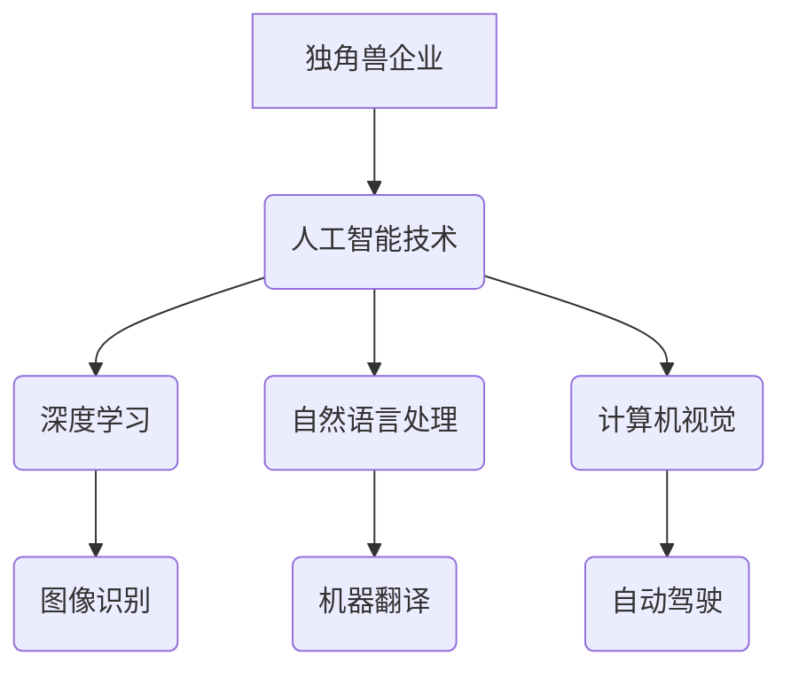

> 人工智能、独角兽企业、深度学习、自然语言处理、计算机视觉、机器学习、数据科学

## 1. 背景介绍

人工智能（AI）正以惊人的速度发展，其应用领域不断扩展，深刻地改变着我们的生活和工作方式。在这一蓬勃发展的领域中，涌现出一批独角兽企业，它们凭借着创新的技术、强大的商业模式和雄厚的市场潜力，迅速崛起，成为行业领军者。

近年来，全球范围内对人工智能的投资持续增长，涌现出许多高估值、高增长率的独角兽企业。这些企业在深度学习、自然语言处理、计算机视觉等关键领域取得了突破性进展，为各行各业带来了革命性的变革。

## 2. 核心概念与联系

**2.1 独角兽企业**

独角兽企业是指估值超过10亿美元的私营公司，通常具有快速增长、高市场潜力和创新技术等特点。

**2.2 人工智能**

人工智能是指模拟人类智能行为的计算机系统。人工智能技术涵盖了多个领域，包括机器学习、深度学习、自然语言处理、计算机视觉等。

**2.3 核心概念联系**

独角兽企业和人工智能之间存在着密切的联系。人工智能技术的快速发展为独角兽企业的崛起提供了强大的技术支撑。独角兽企业则通过对人工智能技术的创新应用，推动了人工智能产业的快速发展。

**2.4 核心概念架构**



## 3. 核心算法原理 & 具体操作步骤

**3.1 算法原理概述**

深度学习是人工智能领域的重要分支，它利用多层神经网络来模拟人类大脑的学习过程。深度学习算法能够从海量数据中自动提取特征，并进行复杂的模式识别和预测。

**3.2 算法步骤详解**

1. **数据预处理:** 将原始数据进行清洗、转换和格式化，使其适合深度学习模型的训练。
2. **网络结构设计:** 根据具体任务需求，设计深度神经网络的结构，包括层数、节点数量、激活函数等。
3. **模型训练:** 使用训练数据对深度学习模型进行训练，调整模型参数，使其能够准确地进行预测。
4. **模型评估:** 使用测试数据评估模型的性能，并根据评估结果进行模型调优。
5. **模型部署:** 将训练好的模型部署到实际应用场景中，用于进行预测或决策。

**3.3 算法优缺点**

**优点:**

* 能够自动提取特征，无需人工特征工程。
* 能够处理海量数据，学习复杂模式。
* 在图像识别、语音识别、自然语言处理等领域取得了突破性进展。

**缺点:**

* 训练数据量大，计算资源消耗高。
* 模型解释性差，难以理解模型的决策过程。
* 对数据质量要求高，数据偏差会影响模型性能。

**3.4 算法应用领域**

* **图像识别:** 人脸识别、物体检测、图像分类
* **语音识别:** 语音转文本、语音助手
* **自然语言处理:** 机器翻译、文本摘要、情感分析
* **推荐系统:** 商品推荐、内容推荐
* **自动驾驶:** 路线规划、障碍物识别

## 4. 数学模型和公式 & 详细讲解 & 举例说明

**4.1 数学模型构建**

深度学习模型通常采用多层感知机（MLP）或卷积神经网络（CNN）等结构。

**4.2 公式推导过程**

深度学习模型的训练过程基于梯度下降算法，其核心公式为：

$$
\theta = \theta - \alpha \nabla L(\theta)
$$

其中：

* $\theta$：模型参数
* $\alpha$：学习率
* $\nabla L(\theta)$：损失函数对参数的梯度

**4.3 案例分析与讲解**

假设我们训练一个图像分类模型，目标是将图像分类为猫或狗。损失函数可以定义为交叉熵损失函数，其公式为：

$$
L = -\sum_{i=1}^{N} y_i \log(p_i)
$$

其中：

* $N$：图像数量
* $y_i$：真实标签（0或1）
* $p_i$：模型预测的概率

通过梯度下降算法，不断更新模型参数，使得损失函数最小化，从而实现图像分类任务。

## 5. 项目实践：代码实例和详细解释说明

**5.1 开发环境搭建**

使用Python语言和深度学习框架TensorFlow或PyTorch进行开发。

**5.2 源代码详细实现**

```python
import tensorflow as tf

# 定义模型结构
model = tf.keras.models.Sequential([
    tf.keras.layers.Conv2D(32, (3, 3), activation='relu', input_shape=(28, 28, 1)),
    tf.keras.layers.MaxPooling2D((2, 2)),
    tf.keras.layers.Conv2D(64, (3, 3), activation='relu'),
    tf.keras.layers.MaxPooling2D((2, 2)),
    tf.keras.layers.Flatten(),
    tf.keras.layers.Dense(10, activation='softmax')
])

# 编译模型
model.compile(optimizer='adam',
              loss='sparse_categorical_crossentropy',
              metrics=['accuracy'])

# 训练模型
model.fit(x_train, y_train, epochs=10)

# 评估模型
loss, accuracy = model.evaluate(x_test, y_test)
print('Test loss:', loss)
print('Test accuracy:', accuracy)
```

**5.3 代码解读与分析**

这段代码定义了一个简单的卷积神经网络模型，用于图像分类任务。模型包含两层卷积层、两层最大池化层、一层全连接层和一层softmax输出层。

**5.4 运行结果展示**

训练完成后，模型可以用于预测新的图像类别。

## 6. 实际应用场景

**6.1 图像识别**

* **人脸识别:** 用于身份验证、安全监控等场景。
* **物体检测:** 用于自动驾驶、安防监控等场景。
* **图像分类:** 用于医疗诊断、产品识别等场景。

**6.2 语音识别**

* **语音助手:** 用于智能家居、移动设备等场景。
* **语音转文本:** 用于会议记录、语音输入等场景。

**6.3 自然语言处理**

* **机器翻译:** 用于跨语言沟通、信息获取等场景。
* **文本摘要:** 用于信息提炼、阅读理解等场景。
* **情感分析:** 用于市场调研、用户体验分析等场景。

**6.4 未来应用展望**

人工智能技术将继续发展，并应用于更多领域，例如：

* **个性化推荐:** 基于用户行为和偏好，提供个性化的产品和服务推荐。
* **医疗诊断:** 利用人工智能辅助医生进行疾病诊断和治疗方案制定。
* **教育教学:** 提供个性化学习方案，提高教育效率。

## 7. 工具和资源推荐

**7.1 学习资源推荐**

* **在线课程:** Coursera、edX、Udacity等平台提供丰富的深度学习课程。
* **书籍:** 《深度学习》、《动手学深度学习》等书籍对深度学习原理和应用进行了详细介绍。
* **开源代码:** TensorFlow、PyTorch等深度学习框架提供了丰富的开源代码示例。

**7.2 开发工具推荐**

* **深度学习框架:** TensorFlow、PyTorch、Keras等框架提供了高效的深度学习开发工具。
* **数据处理工具:** Pandas、NumPy等工具用于数据清洗、转换和分析。
* **可视化工具:** Matplotlib、Seaborn等工具用于数据可视化。

**7.3 相关论文推荐**

* **AlexNet:** 《ImageNet Classification with Deep Convolutional Neural Networks》
* **VGGNet:** 《Very Deep Convolutional Networks for Large-Scale Image Recognition》
* **ResNet:** 《Deep Residual Learning for Image Recognition》

## 8. 总结：未来发展趋势与挑战

**8.1 研究成果总结**

近年来，人工智能技术取得了显著进展，深度学习算法在图像识别、语音识别、自然语言处理等领域取得了突破性成果。

**8.2 未来发展趋势**

* **模型规模和复杂度提升:** 模型参数量和层数将继续增加，实现更强大的学习能力。
* **跨模态学习:** 将不同模态数据（图像、文本、音频等）融合在一起，实现更全面的理解和分析。
* **可解释性增强:** 研究更易于理解和解释的深度学习模型，提高模型的信任度。

**8.3 面临的挑战**

* **数据获取和标注:** 深度学习模型需要海量数据进行训练，数据获取和标注成本高昂。
* **计算资源需求:** 训练大型深度学习模型需要大量的计算资源，成本高昂。
* **伦理和安全问题:** 人工智能技术可能带来伦理和安全问题，需要谨慎考虑和规避。

**8.4 研究展望**

未来，人工智能研究将继续朝着更智能、更安全、更可解释的方向发展，为人类社会带来更多福祉。

## 9. 附录：常见问题与解答

**9.1 什么是深度学习？**

深度学习是一种机器学习的子领域，它利用多层神经网络来模拟人类大脑的学习过程。

**9.2 深度学习有哪些应用场景？**

深度学习应用场景广泛，包括图像识别、语音识别、自然语言处理、推荐系统等。

**9.3 如何学习深度学习？**

可以通过在线课程、书籍、开源代码等方式学习深度学习。

作者：禅与计算机程序设计艺术 / Zen and the Art of Computer Programming


<end_of_turn>