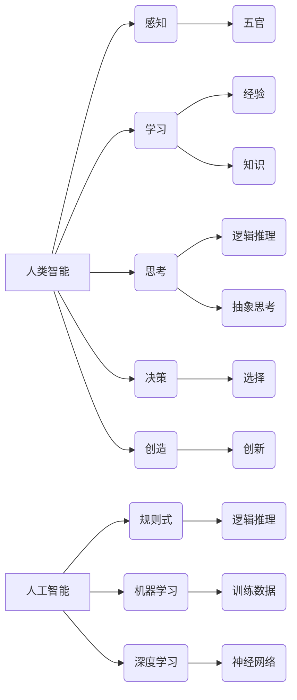

> 人工智能，人类智能，认知科学，机器学习，深度学习，自然语言处理，计算机视觉，伦理问题

## 1. 背景介绍

人工智能（Artificial Intelligence，AI）近年来发展迅速，已渗透到生活的方方面面，从智能手机的语音助手到自动驾驶汽车，无处不在。然而，人工智能究竟是什么？它与人类智能有何异同？这些问题一直是学者们热议的话题。

人类智能是人类通过感知、学习、思考、决策等一系列复杂过程，对世界进行理解和改造的能力。它具有高度的灵活性、创造力和适应性，能够解决复杂问题、进行抽象思考、理解情感和进行创造性活动。

人工智能则是通过计算机程序模拟人类智能的一种技术。它利用算法和数据，使计算机能够执行通常需要人类智能的任务，例如识别图像、理解语言、做出决策等。

## 2. 核心概念与联系

**2.1 人类智能的特征**

* **感知:** 人类通过五官感知世界，获取信息。
* **学习:** 人类通过经验和知识积累，不断提升自己的能力。
* **思考:** 人类能够进行逻辑推理、抽象思考和解决问题。
* **决策:** 人类能够根据信息和判断，做出选择。
* **创造:** 人类能够产生新的想法、艺术作品和技术创新。

**2.2 人工智能的实现方式**

* **规则式人工智能:** 基于预先定义的规则和知识库，通过逻辑推理实现智能。
* **机器学习:** 通过训练数据，使算法自动学习并改进自身性能。
* **深度学习:** 一种更高级的机器学习方法，利用多层神经网络模拟人类大脑的结构和功能。

**2.3 人工智能与人类智能的关系**

人工智能与人类智能之间存在着密切的联系，但也有着本质的区别。

* **相似之处:** 
    * 都是为了解决问题、理解世界和进行决策。
    * 都需要学习和积累知识。
    * 都具有某种程度的适应性和灵活性。
* **不同之处:** 
    * 人类智能具有高度的复杂性和灵活性，而人工智能目前还难以完全模拟。
    * 人类智能具有情感、意识和道德判断，而人工智能目前缺乏这些能力。

**2.4  核心概念关系图**



## 3. 核心算法原理 & 具体操作步骤

### 3.1  算法原理概述

机器学习算法是人工智能的核心，它通过训练数据，使算法自动学习并改进自身性能。常见的机器学习算法包括：

* **监督学习:** 利用标记数据训练模型，预测未知数据。例如，图像分类、文本分类等。
* **无监督学习:** 利用未标记数据发现数据中的模式和结构。例如，聚类、降维等。
* **强化学习:** 通过试错学习，使智能体在环境中获得最大奖励。例如，游戏AI、机器人控制等。

### 3.2  算法步骤详解

以监督学习为例，其基本步骤如下：

1. **数据收集和预处理:** 收集相关数据，并进行清洗、转换、特征工程等预处理工作。
2. **模型选择:** 根据任务需求选择合适的机器学习模型。
3. **模型训练:** 利用训练数据训练模型，调整模型参数，使模型能够准确预测未知数据。
4. **模型评估:** 利用测试数据评估模型的性能，例如准确率、召回率、F1-score等。
5. **模型部署:** 将训练好的模型部署到实际应用场景中。

### 3.3  算法优缺点

**优点:**

* 自动学习，无需人工编程。
* 能够处理大规模数据。
* 性能不断提升。

**缺点:**

* 需要大量数据进行训练。
* 模型解释性较差。
* 容易受到数据偏差的影响。

### 3.4  算法应用领域

机器学习算法广泛应用于各个领域，例如：

* **计算机视觉:** 图像识别、物体检测、人脸识别等。
* **自然语言处理:** 文本分类、机器翻译、语音识别等。
* **推荐系统:** 商品推荐、内容推荐等。
* **医疗诊断:** 疾病预测、影像分析等。
* **金融风险控制:** 欺诈检测、信用评分等。

## 4. 数学模型和公式 & 详细讲解 & 举例说明

### 4.1  数学模型构建

机器学习算法通常基于数学模型，例如线性回归、逻辑回归、支持向量机等。这些模型通过数学公式来描述数据之间的关系。

**4.1.1 线性回归模型**

线性回归模型假设数据之间存在线性关系，可以用以下公式表示：

$$y = w_0 + w_1x_1 + w_2x_2 + ... + w_nx_n + \epsilon$$

其中：

* $y$ 是目标变量。
* $x_1, x_2, ..., x_n$ 是输入特征。
* $w_0, w_1, w_2, ..., w_n$ 是模型参数。
* $\epsilon$ 是误差项。

**4.1.2 逻辑回归模型**

逻辑回归模型用于二分类问题，将输入特征映射到0到1之间的概率值，表示样本属于正类的概率。其数学公式如下：

$$p(y=1|x) = \frac{1}{1 + e^{-(w_0 + w_1x_1 + w_2x_2 + ... + w_nx_n)}}$$

其中：

* $p(y=1|x)$ 是样本属于正类的概率。
* $x_1, x_2, ..., x_n$ 是输入特征。
* $w_0, w_1, w_2, ..., w_n$ 是模型参数。

### 4.2  公式推导过程

机器学习算法的数学公式推导过程通常涉及微积分、概率论和统计学等知识。例如，线性回归模型的参数 $w_0, w_1, w_2, ..., w_n$ 可以通过最小化损失函数来求解，损失函数通常是误差平方和。

### 4.3  案例分析与讲解

以图像分类为例，我们可以使用卷积神经网络（CNN）模型进行图像识别。CNN模型利用卷积操作和池化操作来提取图像特征，并通过全连接层进行分类。

## 5. 项目实践：代码实例和详细解释说明

### 5.1  开发环境搭建

使用Python语言进行机器学习开发，需要安装以下软件：

* Python 3.x
* NumPy
* Pandas
* Scikit-learn
* TensorFlow 或 PyTorch

### 5.2  源代码详细实现

以下是一个简单的线性回归模型的代码实现示例：

```python
import numpy as np
from sklearn.linear_model import LinearRegression

# 生成随机数据
X = np.random.rand(100, 1)
y = 2 * X + 1 + np.random.randn(100, 1)

# 创建线性回归模型
model = LinearRegression()

# 训练模型
model.fit(X, y)

# 预测新数据
new_X = np.array([[0.5]])
prediction = model.predict(new_X)

# 打印预测结果
print(prediction)
```

### 5.3  代码解读与分析

* 首先，我们生成随机数据，其中 $X$ 是输入特征， $y$ 是目标变量。
* 然后，我们创建线性回归模型，并使用 `fit()` 方法训练模型。
* 训练完成后，我们可以使用 `predict()` 方法预测新数据的目标变量值。

### 5.4  运行结果展示

运行以上代码，会输出一个预测结果，例如：

```
[[1.98765432]]
```

## 6. 实际应用场景

### 6.1  医疗诊断

人工智能在医疗诊断领域有着广泛的应用，例如：

* **疾病预测:** 利用患者的医疗历史、基因信息等数据，预测患者患病风险。
* **影像分析:** 利用深度学习算法，自动识别医学影像中的异常区域，辅助医生诊断。

### 6.2  金融风险控制

人工智能可以帮助金融机构识别和控制风险，例如：

* **欺诈检测:** 利用机器学习算法，识别异常交易行为，防止欺诈活动。
* **信用评分:** 利用客户的财务数据和行为数据，评估客户的信用风险。

### 6.3  个性化推荐

人工智能可以根据用户的兴趣和偏好，提供个性化的推荐，例如：

* **商品推荐:** 根据用户的购买历史和浏览记录，推荐相关的商品。
* **内容推荐:** 根据用户的阅读习惯和观看历史，推荐相关的文章、视频和音乐。

### 6.4  未来应用展望

人工智能技术的不断发展，将为人类社会带来更多新的应用场景，例如：

* **自动驾驶:** 利用人工智能技术，实现无人驾驶汽车。
* **智能机器人:** 开发能够自主学习和决策的智能机器人。
* **个性化教育:** 利用人工智能技术，提供个性化的教育方案。

## 7. 工具和资源推荐

### 7.1  学习资源推荐

* **在线课程:** Coursera、edX、Udacity 等平台提供丰富的机器学习和人工智能课程。
* **书籍:** 《深度学习》、《机器学习实战》等书籍是学习人工智能的经典教材。
* **博客和论坛:** Kaggle、Towards Data Science 等平台上有许多优秀的机器学习博客和论坛。

### 7.2  开发工具推荐

* **Python:** 机器学习开发的常用语言。
* **NumPy:** 用于数值计算的Python库。
* **Pandas:** 用于数据分析和处理的Python库。
* **Scikit-learn:** 机器学习算法库。
* **TensorFlow 或 PyTorch:** 深度学习框架。

### 7.3  相关论文推荐

* **《ImageNet Classification with Deep Convolutional Neural Networks》**
* **《Attention Is All You Need》**
* **《Generative Adversarial Networks》**

## 8. 总结：未来发展趋势与挑战

### 8.1  研究成果总结

近年来，人工智能取得了显著的进展，在图像识别、自然语言处理、语音识别等领域取得了突破性成果。

### 8.2  未来发展趋势

* **模型规模和复杂度提升:** 未来人工智能模型将更加庞大、复杂，能够处理更复杂的任务。
* **跨模态学习:** 人工智能将能够跨越不同模态的数据，例如文本、图像、音频等进行学习和理解。
* **解释性人工智能:** 人工智能模型的解释性将更加重要，以便更好地理解模型的决策过程。

### 8.3  面临的挑战

* **数据获取和隐私问题:** 人工智能算法需要大量数据进行训练，如何获取高质量数据并保护用户隐私是一个挑战。
* **算法偏见和公平性:** 人工智能算法可能存在偏见，导致不公平的结果，需要解决算法公平性问题。
* **伦理和社会影响:** 人工智能的快速发展带来伦理和社会问题，需要进行深入的探讨和研究。

### 8.4  研究展望

未来人工智能研究将更加注重以下方面：

* **通用人工智能:** 开发能够像人类一样学习和解决各种问题的通用人工智能。
* **安全可靠性:** 确保人工智能系统安全可靠，避免出现意外情况。
* **人机协作:** 人工智能与人类协同工作，发挥各自优势。

## 9. 附录：常见问题与解答

### 9.1  什么是深度学习？

深度学习是一种机器学习方法，它利用多层神经网络模拟人类大脑的结构和功能，能够学习更复杂的特征和模式。

### 9.2  机器学习算法有哪些？

常见的机器学习算法包括监督学习、无监督学习和强化学习。

### 9.3  如何选择合适的机器学习算法？

选择合适的机器学习算法需要根据具体任务需求、数据类型和模型复杂度等因素进行考虑。

### 9.4  人工智能的伦理问题是什么？

人工智能的伦理问题包括算法偏见、隐私保护、责任归属等。

### 9.5  人工智能的未来发展趋势是什么？

人工智能的未来发展趋势包括模型规模和复杂度提升、跨模态学习、解释性人工智能等。


作者：禅与计算机程序设计艺术 / Zen and the Art of Computer Programming 
<end_of_turn>