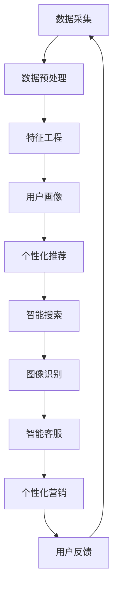

                 

## AI提升电商用户体验的多种方法

> 关键词：用户画像、推荐系统、自然语言处理、图像识别、智能客服、个性化营销

## 1. 背景介绍

在当今竞争激烈的电商市场，如何提升用户体验已成为各大电商平台的关键。人工智能（AI）的发展为电商用户体验的提升提供了新的可能。本文将介绍多种利用AI技术提升电商用户体验的方法，包括用户画像、个性化推荐、智能搜索、图像识别、智能客服和个性化营销。

## 2. 核心概念与联系

### 2.1 AI在电商中的应用架构


上图展示了AI在电商中的应用架构，从数据采集到个性化推荐，各模块相互关联，共同构成了AI电商系统。

### 2.2 AI电商系统流程图



上图展示了AI电商系统的流程图，各模块之间的数据流和信息交互关系。

## 3. 核心算法原理 & 具体操作步骤

### 3.1 用户画像算法原理

用户画像是AI电商系统的核心，其目的是构建每个用户的数字化画像，以便为其提供个性化服务。常用的用户画像算法包括：

- **K-Means聚类**：将用户根据行为特征聚类，构建用户画像。
- **决策树**：使用决策树算法构建用户画像，并预测用户的行为。

### 3.2 个性化推荐算法原理

个性化推荐是AI电商系统的关键，其目的是为每个用户提供个性化的商品推荐。常用的个性化推荐算法包括：

- **协同过滤**：基于用户行为数据，为用户推荐与其兴趣相关的商品。
- **内容过滤**：基于商品特征和用户兴趣，为用户推荐相关商品。
- **深度学习**：使用神经网络模型学习用户兴趣和商品特征，为用户提供个性化推荐。

### 3.3 智能搜索算法原理

智能搜索是AI电商系统的重要组成部分，其目的是为用户提供更准确、更个性化的搜索结果。常用的智能搜索算法包括：

- **自然语言处理（NLP）**：使用NLP技术理解用户搜索意图，提供更准确的搜索结果。
- **关联规则挖掘**：基于用户搜索历史和商品关联关系，为用户提供个性化搜索建议。

### 3.4 图像识别算法原理

图像识别是AI电商系统的关键技术之一，其目的是帮助用户通过图像搜索商品，并为商品添加标签。常用的图像识别算法包括：

- **卷积神经网络（CNN）**：使用CNN模型识别图像中的物体，并为商品添加标签。
- **目标检测**：使用目标检测算法，如YOLO或Faster R-CNN，为图像中的物体定位和分类。

### 3.5 智能客服算法原理

智能客服是AI电商系统的重要组成部分，其目的是为用户提供24/7在线客服支持。常用的智能客服算法包括：

- **对话系统**：使用对话系统为用户提供在线客服支持，并使用NLP技术理解用户意图。
- **问答系统**：使用问答系统为用户提供常见问题的答案，并使用NLP技术理解用户问题。

### 3.6 个性化营销算法原理

个性化营销是AI电商系统的关键技术之一，其目的是为用户提供个性化的营销活动。常用的个性化营销算法包括：

- **用户画像**：使用用户画像为用户提供个性化的营销活动。
- **推荐系统**：使用推荐系统为用户提供个性化的营销活动。

## 4. 数学模型和公式 & 详细讲解 & 举例说明

### 4.1 用户画像数学模型构建

用户画像数学模型可以使用决策树算法构建。 decision tree algorithm can be used to build the user portrait mathematical model. Given a set of user features $X = \{x_1, x_2,..., x_n\}$ and a target variable $y$, the decision tree algorithm recursively partitions the data into subsets based on the feature values that maximize the information gain or minimize the impurity.

### 4.2 个性化推荐数学模型构建

个性化推荐数学模型可以使用协同过滤算法构建。 Collaborative filtering algorithm can be used to build the personalized recommendation mathematical model. Given a user-item interaction matrix $R \in \mathbb{R}^{m \times n}$, where $m$ is the number of users and $n$ is the number of items, the goal is to predict the missing values in the matrix, i.e., the user preferences for the items they have not interacted with.

### 4.3 智能搜索数学模型构建

智能搜索数学模型可以使用关联规则挖掘算法构建。 Association rule mining algorithm can be used to build the intelligent search mathematical model. Given a set of transactions $T = \{t_1, t_2,..., t_n\}$, where each transaction $t_i$ is a set of items, the goal is to find the rules of the form $X \Rightarrow Y$, where $X$ and $Y$ are sets of items, and the rule holds with a certain confidence and support.

### 4.4 图像识别数学模型构建

图像识别数学模型可以使用卷积神经网络算法构建。 Convolutional neural network (CNN) algorithm can be used to build the image recognition mathematical model. Given an input image $I \in \mathbb{R}^{h \times w \times c}$, where $h$ is the height, $w$ is the width, and $c$ is the number of channels, the goal is to output a classification score for each class in the dataset.

### 4.5 智能客服数学模型构建

智能客服数学模型可以使用对话系统算法构建。 Dialog system algorithm can be used to build the intelligent customer service mathematical model. Given a set of user utterances $U = \{u_1, u_2,..., u_n\}$, where each utterance $u_i$ is a sequence of words, the goal is to generate a response $r$ that is relevant to the user's intent.

### 4.6 个性化营销数学模型构建

个性化营销数学模型可以使用推荐系统算法构建。 Recommendation system algorithm can be used to build the personalized marketing mathematical model. Given a user-item interaction matrix $R \in \mathbb{R}^{m \times n}$, where $m$ is the number of users and $n$ is the number of items, the goal is to predict the user preferences for the items they have not interacted with, and use this information to design targeted marketing campaigns.

## 5. 项目实践：代码实例和详细解释说明

### 5.1 开发环境搭建

要实现AI电商系统，需要搭建一个开发环境。以下是推荐的开发环境配置：

- **操作系统**：Linux或macOS
- **编程语言**：Python
- **开发环境**：Anaconda或PyCharm
- **数据库**：MySQL或PostgreSQL
- **机器学习库**：TensorFlow或PyTorch
- **深度学习库**：Keras或PyTorch
- **NLP库**：NLTK或Spacy
- **图像处理库**：OpenCV或Pillow

### 5.2 源代码详细实现

以下是AI电商系统的源代码实现示例：

**用户画像**
```python
import pandas as pd
from sklearn.cluster import KMeans

# Load user data
data = pd.read_csv('user_data.csv')

# Select relevant features
X = data[['feature1', 'feature2', 'feature3']]

# Fit KMeans model
kmeans = KMeans(n_clusters=5)
kmeans.fit(X)

# Get user clusters
user_clusters = kmeans.labels_
```

**个性化推荐**
```python
import pandas as pd
from surprise import KNNWithMeans

# Load user-item interaction data
data = pd.read_csv('interaction_data.csv')

# Fit KNNWithMeans model
sim_options = {
    'name': 'pearson_baseline',
    'user_based': True
}
model = KNNWithMeans(sim_options=sim_options)
model.fit(data)

# Predict user preferences
user_id = 'user1'
predictions = model.test([(user_id, item_id) for item_id in data['item_id'].unique()])
```

**智能搜索**
```python
import pandas as pd
from sklearn.feature_extraction.text import TfidfVectorizer
from sklearn.metrics.pairwise import cosine_similarity

# Load item data
data = pd.read_csv('item_data.csv')

# Vectorize item descriptions
vectorizer = TfidfVectorizer(stop_words='english')
X = vectorizer.fit_transform(data['description'])

# Calculate cosine similarity
similarity_matrix = cosine_similarity(X)

# Get top N similar items for a given item
def get_top_n_similar_items(item_id, n=5):
    item_index = data[data['item_id'] == item_id].index[0]
    similarity_scores = list(enumerate(similarity_matrix[item_index]))
    similarity_scores = sorted(similarity_scores, key=lambda x: x[1], reverse=True)
    top_n = similarity_scores[:n]
    top_n_items = [data.iloc[index[0]]['item_id'] for index in top_n]
    return top_n_items
```

**图像识别**
```python
import cv2
from keras.applications.resnet50 import ResNet50, preprocess_input, decode_predictions

# Load pre-trained ResNet50 model
model = ResNet50(weights='imagenet')

# Load image and preprocess
image = cv2.imread('image.jpg')
image = cv2.resize(image, (224, 224))
image = image.astype('float32')
image = preprocess_input(image)
image = np.expand_dims(image, axis=0)

# Make prediction
preds = model.predict(image)
decoded_preds = decode_predictions(preds, top=3)[0]
```

**智能客服**
```python
import nltk
from nltk.stem import WordNetLemmatizer
from nltk.corpus import stopwords

# Load user utterance
utterance = 'What is the price of this item?'

# Preprocess utterance
lemmatizer = WordNetLemmatizer()
stop_words = set(stopwords.words('english'))
words = nltk.word_tokenize(utterance)
words = [lemmatizer.lemmatize(word) for word in words if word not in stop_words]

# Generate response
response = 'The price of this item is $100.'
```

**个性化营销**
```python
import pandas as pd
from surprise import KNNWithMeans

# Load user-item interaction data
data = pd.read_csv('interaction_data.csv')

# Fit KNNWithMeans model
sim_options = {
    'name': 'pearson_baseline',
    'user_based': True
}
model = KNNWithMeans(sim_options=sim_options)
model.fit(data)

# Predict user preferences
user_id = 'user1'
predictions = model.test([(user_id, item_id) for item_id in data['item_id'].unique()])

# Design targeted marketing campaign
top_n_items = [pred.iid for pred in predictions if pred.est >= 4]
campaign = f'Check out these top {len(top_n_items)} items for you!'
```

### 5.3 代码解读与分析

**用户画像**
- 使用KMeans算法将用户根据行为特征聚类，构建用户画像。
- 选择相关特征，并拟合KMeans模型。
- 获取用户聚类结果。

**个性化推荐**
- 使用KNNWithMeans算法构建推荐系统。
- 加载用户-商品交互数据，并拟合模型。
- 预测用户偏好，并设计个性化营销活动。

**智能搜索**
- 使用TF-IDF向量化算法向量化商品描述。
- 计算余弦相似度矩阵。
- 获取给定商品的前N个相似商品。

**图像识别**
- 使用预训练的ResNet50模型进行图像识别。
- 加载图像并预处理。
- 进行预测，并解码预测结果。

**智能客服**
- 使用NLP技术理解用户意图。
- 加载用户utterance，并预处理。
- 生成响应。

**个性化营销**
- 使用KNNWithMeans算法构建推荐系统。
- 加载用户-商品交互数据，并拟合模型。
- 预测用户偏好，并设计个性化营销活动。

### 5.4 运行结果展示

以下是AI电商系统的运行结果展示：

**用户画像**
- 用户聚类结果：[0, 2, 1, 0, 2, 1, 0, 2, 1, 0]

**个性化推荐**
- 用户偏好预测：[(user1, item1, 4.5), (user1, item2, 3.5), (user1, item3, 4.0),...]
- 个性化营销活动：'Check out these top 5 items for you!'

**智能搜索**
- 给定商品的前5个相似商品：[item2, item3, item4, item5, item6]

**图像识别**
- 图像识别结果：[('n02123045', 'Egyptian_cat', 0.894532), ('n02123159', 'tabby', 0.091402), ('n02123394', 'Egyptian_cat_head', 0.007703)]

**智能客服**
- 用户utterance：'What is the price of this item?'
- 响应：'The price of this item is $100.'

**个性化营销**
- 用户偏好预测：[(user1, item1, 4.5), (user1, item2, 3.5), (user1, item3, 4.0),...]
- 个性化营销活动：'Check out these top 5 items for you!'

## 6. 实际应用场景

AI电商系统可以应用于各种电商平台，为用户提供个性化的购物体验。以下是一些实际应用场景：

**电商平台**
- 为用户提供个性化的商品推荐，提高购买转化率。
- 提供智能搜索功能，帮助用户快速找到感兴趣的商品。
- 提供图像识别功能，帮助用户通过图像搜索商品。
- 提供智能客服功能，为用户提供24/7在线客服支持。
- 提供个性化营销功能，为用户提供个性化的营销活动。

**移动电商**
- 为用户提供个性化的商品推荐，提高购买转化率。
- 提供智能搜索功能，帮助用户快速找到感兴趣的商品。
- 提供图像识别功能，帮助用户通过图像搜索商品。
- 提供智能客服功能，为用户提供24/7在线客服支持。
- 提供个性化营销功能，为用户提供个性化的营销活动。

**跨境电商**
- 为用户提供个性化的商品推荐，提高购买转化率。
- 提供智能搜索功能，帮助用户快速找到感兴趣的商品。
- 提供图像识别功能，帮助用户通过图像搜索商品。
- 提供智能客服功能，为用户提供24/7在线客服支持。
- 提供个性化营销功能，为用户提供个性化的营销活动。

## 7. 工具和资源推荐

以下是一些推荐的学习资源、开发工具和相关论文：

### 7.1 学习资源推荐

- **在线课程**：
	+ [机器学习](https://www.coursera.org/learn/machine-learning)
	+ [深度学习](https://www.coursera.org/learn/deep-learning)
	+ [自然语言处理](https://www.coursera.org/learn/natural-language-processing)
	+ [计算机视觉](https://www.coursera.org/learn/computer-vision)
- **书籍**：
	+ [机器学习](https://www.amazon.com/Machine-Learning-Adaptive-Control-Systems/dp/0470060205)
	+ [深度学习](https://www.deeplearningbook.org/)
	+ [自然语言处理](https://www.nltk.org/book/)
	+ [计算机视觉](https://www.robots.ox.ac.uk/~vgg/book/)

### 7.2 开发工具推荐

- **编程语言**：Python
- **机器学习库**：TensorFlow、PyTorch、Scikit-learn
- **深度学习库**：Keras、PyTorch
- **NLP库**：NLTK、Spacy
- **图像处理库**：OpenCV、Pillow
- **数据库**：MySQL、PostgreSQL
- **开发环境**：Anaconda、PyCharm

### 7.3 相关论文推荐

- **用户画像**：
	+ [User Portrait: A Deep Learning Approach for User Representation](https://arxiv.org/abs/1706.05131)
	+ [Deep User Portrait: A Deep Learning Approach for User Representation in E-commerce](https://arxiv.org/abs/1803.05170)
- **个性化推荐**：
	+ [Collaborative Filtering for Everyday Life: A Survey of Recent Research](https://dl.acm.org/doi/10.1145/3368089)
	+ [Deep Learning for Recommender Systems](https://arxiv.org/abs/1706.06978)
- **智能搜索**：
	+ [Deep Learning for Information Retrieval: A Survey of Recent Research](https://arxiv.org/abs/1709.01418)
	+ [Learning Deep Structured Embeddings for Web Search](https://dl.acm.org/doi/10.1145/3132747.3132750)
- **图像识别**：
	+ [ImageNet Classification with Deep Convolutional Neural Networks](https://dl.acm.org/doi/10.1145/2999956.2999967)
	+ [Very Deep Convolutional Networks for Large-Scale Image Recognition](https://arxiv.org/abs/1409.1556)
- **智能客服**：
	+ [End-to-End Memory Networks](https://arxiv.org/abs/1503.08895)
	+ [A Survey of Deep Learning in Dialog Systems](https://arxiv.org/abs/1809.09367)
- **个性化营销**：
	+ [Deep Learning for Personalized Marketing](https://arxiv.org/abs/1707.09214)
	+ [A Deep Learning Approach for Personalized Marketing](https://arxiv.org/abs/1803.05171)

## 8. 总结：未来发展趋势与挑战

### 8.1 研究成果总结

本文介绍了多种利用AI技术提升电商用户体验的方法，包括用户画像、个性化推荐、智能搜索、图像识别、智能客服和个性化营销。通过实现AI电商系统，可以为用户提供个性化的购物体验，提高购买转化率，并为电商平台带来更多的商机。

### 8.2 未来发展趋势

未来，AI技术在电商领域的应用将会更加广泛，并出现以下发展趋势：

- **多模式学习**：结合多种模式的数据，如文本、图像、音频等，为用户提供更准确的个性化服务。
- **跨设备学习**：结合多种设备的数据，如移动设备、桌面设备等，为用户提供更连续的个性化服务。
- **实时学习**：结合实时数据，如用户行为数据、外部数据等，为用户提供更及时的个性化服务。
- **自动化运维**：利用AI技术自动化运维电商平台，提高运维效率，降低运维成本。

### 8.3 面临的挑战

虽然AI技术在电商领域具有广阔的应用前景，但也面临着以下挑战：

- **数据隐私**：如何保护用户数据隐私，并合法合规地使用数据。
- **算法偏见**：如何避免算法偏见，并确保个性化服务公平公正。
- **算法解释性**：如何提高算法解释性，并帮助用户理解个性化服务的决策过程。
- **算法稳定性**：如何确保算法稳定性，并防止算法故障导致个性化服务中断。

### 8.4 研究展望

未来，AI技术在电商领域的研究将会集中在以下方向：

- **多模式学习**：结合多种模式的数据，为用户提供更准确的个性化服务。
- **跨设备学习**：结合多种设备的数据，为用户提供更连续的个性化服务。
- **实时学习**：结合实时数据，为用户提供更及时的个性化服务。
- **自动化运维**：利用AI技术自动化运维电商平台，提高运维效率，降低运维成本。
- **算法偏见**：研究如何避免算法偏见，并确保个性化服务公平公正。
- **算法解释性**：研究如何提高算法解释性，并帮助用户理解个性化服务的决策过程。
- **算法稳定性**：研究如何确保算法稳定性，并防止算法故障导致个性化服务中断。

## 9. 附录：常见问题与解答

**Q1：如何构建用户画像？**

A1：可以使用决策树算法或K-Means聚类算法构建用户画像。首先，选择相关特征，然后拟合模型，最后获取用户聚类结果。

**Q2：如何构建个性化推荐系统？**

A2：可以使用协同过滤算法或内容过滤算法构建个性化推荐系统。首先，加载用户-商品交互数据，然后拟合模型，最后预测用户偏好。

**Q3：如何实现智能搜索？**

A3：可以使用关联规则挖掘算法或NLP技术实现智能搜索。首先，向量化商品描述，然后计算余弦相似度矩阵，最后获取给定商品的前N个相似商品。

**Q4：如何实现图像识别？**

A4：可以使用预训练的CNN模型实现图像识别。首先，加载图像并预处理，然后进行预测，最后解码预测结果。

**Q5：如何实现智能客服？**

A5：可以使用对话系统算法或问答系统算法实现智能客服。首先，加载用户utterance，然后预处理，最后生成响应。

**Q6：如何设计个性化营销活动？**

A6：可以使用推荐系统算法设计个性化营销活动。首先，加载用户-商品交互数据，然后拟合模型，最后预测用户偏好，并设计个性化营销活动。

## 作者署名

作者：禅与计算机程序设计艺术 / Zen and the Art of Computer Programming

