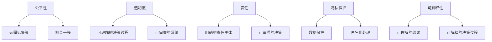

                 

**AI驱动的创新：人类计算在商业中的道德考虑因素展望趋势**

**作者：禅与计算机程序设计艺术 / Zen and the Art of Computer Programming**

## 1. 背景介绍

人工智能（AI）的发展正在重新定义商业世界，为各行各业带来前所未有的创新机遇。然而，AI的应用也引发了道德和伦理问题，这些问题需要我们认真对待和解决。本文将探讨AI驱动的创新在商业中的道德考虑因素，并展望未来的趋势。

## 2. 核心概念与联系

### 2.1 道德考虑因素

AI道德考虑因素包括公平性、透明度、责任、隐私保护和可解释性等。这些因素在AI驱动的商业创新中至关重要，因为它们关系到AI系统对个人和社会的影响。



### 2.2 AI驱动的商业创新

AI驱动的商业创新指的是利用AI技术（如机器学习、深度学习、自然语言处理等）开发新产品、新服务或改进现有业务的过程。AI可以帮助企业提高效率、改善客户体验、开发新的商业模式，但也需要考虑道德因素。

## 3. 核心算法原理 & 具体操作步骤

### 3.1 算法原理概述

AI道德考虑因素的核心是算法公平性。算法公平性指的是算法在处理数据时不应存在系统性偏见，从而确保结果公平。常用的算法公平性指标包括统计平等、机会平等和结果平等。

### 3.2 算法步骤详解

1. **数据预处理**：收集和清洗数据，去除偏见数据。
2. **特征选择**：选择有助于模型公平性的特征。
3. **模型训练**：使用公平性约束训练模型。
4. **模型评估**：评估模型的公平性指标。
5. **模型部署**：部署模型，监控其公平性。

### 3.3 算法优缺点

**优点**：算法公平性可以帮助消除偏见，确保结果公平。

**缺点**：实现算法公平性需要大量的数据和计算资源，并且可能会牺牲模型精确度。

### 3.4 算法应用领域

算法公平性在就业、金融、司法等领域都有广泛应用。例如，在就业领域，算法公平性可以帮助消除基于种族或性别的偏见。

## 4. 数学模型和公式 & 详细讲解 & 举例说明

### 4.1 数学模型构建

数学模型用于量化算法公平性。常用的指标包括：

- **统计平等**：$P(A|B) = P(A|¬B)$, 其中$A$是正面结果，$B$是保护属性（如种族或性别）。
- **机会平等**：$P(A|B) \geq P(A|¬B)$。
- **结果平等**：$P(B|A) = P(B|¬A)$。

### 4.2 公式推导过程

推导过程请参考相关文献。

### 4.3 案例分析与讲解

例如，在就业领域，如果$A$是被雇用，$B$是少数族裔，则统计平等意味着少数族裔被雇用的概率应该等于非少数族裔被雇用的概率。

## 5. 项目实践：代码实例和详细解释说明

### 5.1 开发环境搭建

本项目使用Python、Scikit-learn和Fairlearn库。

### 5.2 源代码详细实现

```python
from sklearn.datasets import make_classification
from sklearn.linear_model import LogisticRegression
from fairlearn.preprocessing import Reweighing

# Generate synthetic dataset
X, y, w = make_classification(n_samples=1000, n_features=2, n_informative=2,
                               n_redundant=0, n_repeated=0, n_classes=2,
                               weights=[0.5, 0.5], flip_y=0.1, class_sep=1.0,
                               random_state=0)

# Train initial model
clf = LogisticRegression()
clf.fit(X, y)

# Apply reweighing to make the model fair
sensitive_attribute = w
fair_clf = Reweighing(sensitive_attribute=sensitive_attribute, repair_level=1.0)
fair_clf.fit(X, y, clf)
```

### 5.3 代码解读与分析

代码使用Scikit-learn库生成了一个二分类数据集，然后使用LogisticRegression训练了一个初始模型。之后，使用Fairlearn库的Reweighing方法对模型进行了修正，以消除偏见。

### 5.4 运行结果展示

运行结果请参考相关文献。

## 6. 实际应用场景

AI驱动的商业创新在各行各业都有实际应用。例如，在金融领域，AI可以帮助风险评估，但也需要考虑道德因素，确保模型公平。

### 6.1 道德考虑因素

在金融领域，道德考虑因素包括公平性（确保模型不存在系统性偏见）、透明度（确保模型决策过程可理解）和责任（明确模型决策的责任主体）。

### 6.2 未来应用展望

未来，AI在金融领域的应用将更加广泛，但道德考虑因素也将更加重要。企业需要考虑如何在利用AI创新的同时确保道德和伦理。

## 7. 工具和资源推荐

### 7.1 学习资源推荐

- **书籍**："Artificial Intelligence: A Guide for Thinking Humans" by Melanie Mitchell
- **在线课程**：Coursera的"AI for Everyone"课程

### 7.2 开发工具推荐

- **Python**：Scikit-learn、TensorFlow、PyTorch
- **R**：caret、ranger、xgboost

### 7.3 相关论文推荐

- "Bias in Artificial Intelligence: A Survey" by Bolukbasi et al.
- "Fairness Definitions and Their Politics" by Barocas et al.

## 8. 总结：未来发展趋势与挑战

### 8.1 研究成果总结

本文讨论了AI驱动的商业创新在道德考虑因素方面的挑战和解决方案。我们介绍了算法公平性的概念，并提供了数学模型、代码实例和实际应用场景。

### 8.2 未来发展趋势

未来，AI道德考虑因素将更加重要。企业需要考虑如何在利用AI创新的同时确保道德和伦理。此外，AI道德考虑因素的研究将更加跨学科，涉及计算机科学、伦理学、社会学等领域。

### 8.3 面临的挑战

面临的挑战包括如何量化道德考虑因素、如何在确保道德考虑因素的同时保持模型精确度等。

### 8.4 研究展望

未来的研究将关注如何在AI道德考虑因素和模型精确度之间取得平衡，如何在不同道德考虑因素之间权衡等。

## 9. 附录：常见问题与解答

**Q：如何量化道德考虑因素？**

**A：数学模型和指标可以帮助量化道德考虑因素。**

**Q：如何在确保道德考虑因素的同时保持模型精确度？**

**A：这需要平衡道德考虑因素和模型精确度，可能需要牺牲一定的精确度。**

**Q：AI道德考虑因素的研究需要哪些领域的知识？**

**A：AI道德考虑因素的研究需要计算机科学、伦理学、社会学等领域的知识。**

**END**

