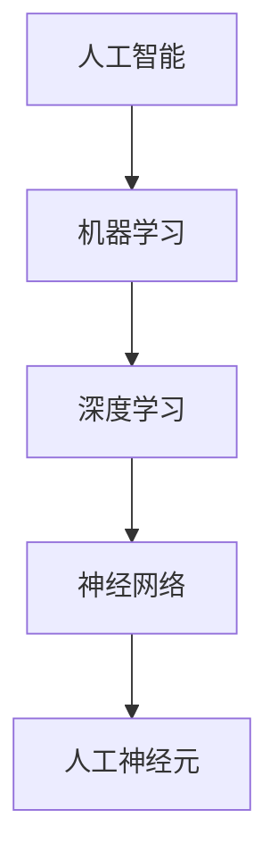

                 

**人工智能的未来发展机遇**

**作者：禅与计算机程序设计艺术 / Zen and the Art of Computer Programming**

## 1. 背景介绍

人工智能（AI）自诞生以来，就一直是计算机科学领域最具前途的研究方向之一。随着技术的不断发展，AI正在各行各业中发挥着越来越重要的作用。本文将从技术、应用和未来发展的角度，探讨人工智能的未来发展机遇。

## 2. 核心概念与联系

### 2.1 关键概念

- **机器学习（ML）**：一种使得计算机有能力自动学习而无需被明确编程的技术。
- **深度学习（DL）**：一种机器学习方法，其结构受人类大脑结构的启发。
- **神经网络（NN）**：一种模拟人类神经系统的计算模型。
- **人工神经元（ANN）**：神经网络的基本单位，模拟人类神经元的功能。

### 2.2 关键概念联系

机器学习是人工智能的一个分支，而深度学习则是机器学习的一个子集。神经网络是深度学习的核心，它由人工神经元组成。下图展示了这些概念的关系：



## 3. 核心算法原理 & 具体操作步骤

### 3.1 算法原理概述

本节将介绍一种常用的深度学习算法：前向传播（Forward Propagation）。前向传播是神经网络的核心算法，用于计算网络的输出。

### 3.2 算法步骤详解

1. **初始化权重**：为每个神经元随机分配权重。
2. **正向传播**：从输入层开始，计算每层神经元的输出，直到输出层。
   - 对于每个神经元，计算其输入值：$z = \sum_i w_i x_i + b$
   - 将输入值通过激活函数（如ReLU）转换为输出值：$a = f(z)$
3. **计算误差**：比较网络的输出和真实值，计算误差。
4. **反向传播**：从输出层开始，计算每层神经元的误差项，直到输入层。
   - 计算每个神经元的误差项：$\delta = (w^T \delta_{next}) \odot f'(z)$
   - 其中，$f'$是激活函数的导数，$w^T$是下一层神经元的权重，$odot$表示Hadamard乘积。
5. **更新权重**：使用梯度下降法更新每个神经元的权重和偏置项。
   - 计算梯度：$\nabla J = \frac{\partial J}{\partial w} = \delta x$
   - 更新权重：$w := w - \eta \nabla J$
   - 其中，$\eta$是学习率。

### 3.3 算法优缺点

**优点**：前向传播是一种简单有效的算法，可以学习复杂的非线性函数。它是当前人工智能领域最成功的算法之一。

**缺点**：前向传播需要大量的计算资源，并且容易陷入局部最小值。此外，它也容易受到过拟合和欠拟合的影响。

### 3.4 算法应用领域

前向传播广泛应用于图像识别、自然语言处理、推荐系统等领域。它是构建深度学习模型的基础。

## 4. 数学模型和公式 & 详细讲解 & 举例说明

### 4.1 数学模型构建

神经网络的数学模型可以表示为：

$$y = f(wx + b)$$

其中，$x$是输入，$y$是输出，$w$是权重，$b$是偏置项，$f$是激活函数。

### 4.2 公式推导过程

神经网络的目标是最小化误差函数$J(w,b)$。误差函数通常是均方误差（MSE）：

$$J(w,b) = \frac{1}{2} \sum_i (y_i - \hat{y}_i)^2$$

其中，$y_i$是真实值，$hat{y}_i$是网络的输出。梯度下降法用于更新权重和偏置项，以最小化误差函数：

$$w := w - \eta \nabla_w J$$
$$b := b - \eta \nabla_b J$$

### 4.3 案例分析与讲解

例如，考虑一个简单的二层神经网络，用于预测房价。输入$x$是房屋的面积，输出$y$是房屋的价格。假设真实值为$y = 1000x + 50000$。我们可以使用前向传播算法训练这个网络，并使用梯度下降法更新权重和偏置项。通过迭代，网络可以学习到真实值，并预测房屋的价格。

## 5. 项目实践：代码实例和详细解释说明

### 5.1 开发环境搭建

本项目使用Python和TensorFlow框架。首先，安装必要的库：

```bash
pip install tensorflow numpy matplotlib
```

### 5.2 源代码详细实现

以下是一个简单的二层神经网络的实现：

```python
import numpy as np
import tensorflow as tf
import matplotlib.pyplot as plt

# 真实值
x = np.array([1, 2, 3, 4, 5])
y = 1000 * x + 50000

# 初始化权重和偏置项
w = tf.Variable(0.44)
b = tf.Variable(0.87)

# 定义模型
def model(x):
    return w * x + b

# 定义误差函数
def error(y_true, y_pred):
    return ((y_true - y_pred) ** 2).mean()

# 定义优化器
optimizer = tf.train.GradientDescentOptimizer(learning_rate=0.001)

# 定义训练步骤
train = optimizer.minimize(error, var_list=[w, b])

# 训练模型
epochs = 100
for i in range(epochs):
    with tf.GradientTape() as tape:
        predictions = model(x)
        loss = error(y, predictions)
    gradients = tape.gradient(loss, [w, b])
    optimizer.apply_gradients(zip(gradients, [w, b]))
    if i % 10 == 0:
        print(f'Epoch {i}, Loss {loss.numpy()}')

# 绘制结果
plt.scatter(x, y)
plt.plot(x, model(x).numpy(), color='red')
plt.show()
```

### 5.3 代码解读与分析

代码首先定义了真实值$x$和$y$。然后，它初始化权重$w$和偏置项$b$。模型函数`model(x)`定义了神经网络的输出。误差函数`error(y_true, y_pred)`计算均方误差。优化器`optimizer`使用梯度下降法更新权重和偏置项。训练步骤`train`最小化误差函数。最后，代码训练模型，并绘制结果。

### 5.4 运行结果展示

运行代码后，绘制的结果应该显示真实值和模型的预测值。随着训练的进行，模型的预测值应该越来越接近真实值。

## 6. 实际应用场景

### 6.1 当前应用

人工智能已经广泛应用于各行各业。例如，在图像识别领域，深度学习模型可以识别图像中的物体，并用于自动驾驶、安防等领域。在自然语言处理领域，人工智能可以理解和生成人类语言，用于客服聊天机器人、语音助手等。

### 6.2 未来应用展望

未来，人工智能将继续渗透到更多领域。例如，在医疗领域，人工智能可以帮助医生诊断疾病，并预测病情。在工业领域，人工智能可以优化生产过程，并预测设备故障。在交通领域，人工智能可以优化交通路线，并预测交通拥堵。

## 7. 工具和资源推荐

### 7.1 学习资源推荐

- **书籍**：《深度学习》作者：Ian Goodfellow、Yoshua Bengio、Aaron Courville
- **在线课程**：Coursera、Udacity、edX等平台上的深度学习课程
- **博客**：KDnuggets、Towards Data Science等技术博客

### 7.2 开发工具推荐

- **编程语言**：Python、R
- **框架**：TensorFlow、PyTorch、Keras
- **开发环境**：Jupyter Notebook、Google Colab

### 7.3 相关论文推荐

- **经典论文**：LeCun、Y. Bengio、G. Hinton. Deep learning. Nature, 521(7553):436–444, 2015.
- **最新论文**：查阅arXiv等学术期刊网站

## 8. 总结：未来发展趋势与挑战

### 8.1 研究成果总结

本文介绍了人工智能的未来发展机遇，并详细介绍了前向传播算法的原理、步骤、优缺点和应用领域。此外，本文还提供了数学模型、代码实例和实际应用场景。

### 8.2 未来发展趋势

未来，人工智能将继续发展，并渗透到更多领域。随着技术的发展，人工智能将变得更加智能、更加自动化。此外，人工智能还将与其他技术（如物联网、区块链等）结合，创造更多的应用场景。

### 8.3 面临的挑战

然而，人工智能也面临着许多挑战。例如，数据隐私和安全是人工智能发展的主要障碍之一。此外，人工智能还面临着解释性（interpretability）、公平性（fairness）和可靠性（reliability）等挑战。

### 8.4 研究展望

未来，人工智能研究将继续关注这些挑战，并寻求解决方案。此外，人工智能还将与其他学科（如心理学、神经科学等）结合，创造更多的可能性。

## 9. 附录：常见问题与解答

**Q：人工智能是否会取代人类？**

**A：**人工智能将改变人类的工作方式，但不会取代人类。人工智能更多的是辅助人类工作，而不是取代人类。

**Q：人工智能是否会导致失业？**

**A：**人工智能将创造新的工作岗位，但也会取代一些传统岗位。总体而言，人工智能将改变就业市场，而不是导致失业。

**Q：人工智能是否会导致不平等？**

**A：**人工智能将扩大贫富差距，但也有可能缩小差距。关键在于如何使用人工智能技术，以及如何分配其收益。

## 结束语

人工智能是当今最具前途的技术之一。它将改变我们的生活方式，并创造无数的机遇。然而，人工智能也面临着挑战，需要我们共同努力解决。未来，人工智能将继续发展，并为我们带来更多的可能性。

**作者：禅与计算机程序设计艺术 / Zen and the Art of Computer Programming**

