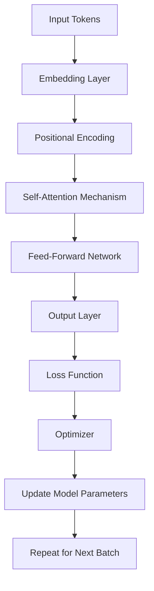

                 

## BERT 原理与代码实例讲解

> 关键词：BERT, Transformer, Attention Mechanism, Masked Language Model, Next Sentence Prediction, Transfer Learning, Natural Language Processing, Deep Learning

## 1. 背景介绍

BERT (Bidirectional Encoder Representations from Transformers) 是由Google研究院开发的一种预训练的深度学习模型，用于自然语言处理 (NLP) 任务。它于2018年10月份在Nature上发表，并迅速成为NLP领域的一个里程碑式的成果。BERT通过在大规模文本语料库上进行预训练，学习到语言的上下文相关性，从而生成更好的语言表示，大大提高了各种NLP任务的性能。

## 2. 核心概念与联系

BERT的核心是Transformer模型，它使用自注意力机制 (Self-Attention Mechanism) 来处理输入序列。以下是BERT的核心概念及其联系的Mermaid流程图：



### 2.1 Embedding Layer

BERT使用WordPiece算法将文本转换为tokens，然后为每个token生成对应的嵌入向量。此外，BERT还添加了[CLS]和[SEP]两个特殊token，用于表示序列的开始和结束。

### 2.2 Positional Encoding

Transformer模型本身是无法获取序列中token的相对或绝对位置信息的，因此需要添加位置编码来提供位置信息。

### 2.3 Self-Attention Mechanism

自注意力机制允许模型关注输入序列中的其他位置，从而捕获上下文信息。BERT使用多头自注意力机制 (Multi-Head Self-Attention) 来并行关注多个位置。

### 2.4 Feed-Forward Network

每个自注意力层后面都跟着一个简单的两层全连接网络，用于进一步提取特征。

### 2.5 Output Layer

BERT的输出层生成每个token的表示，以及[CLS] token的表示，后者用于分类任务。

### 2.6 Loss Function & Optimizer

BERT使用交叉熵损失函数和Adam优化器来训练模型。

## 3. 核心算法原理 & 具体操作步骤

### 3.1 算法原理概述

BERT的预训练过程包括两个任务：掩码语言模型 (Masked Language Model) 和下一句预测 (Next Sentence Prediction)。预训练后，BERT可以在各种NLP任务上进行微调，实现更好的性能。

### 3.2 算法步骤详解

1. **预处理**：将文本转换为tokens，并添加[CLS]和[SEP] tokens。
2. **嵌入**：为每个token生成嵌入向量，并添加位置编码。
3. **编码**：使用多层Transformer编码器对输入序列进行编码。
4. **预训练**：在掩码语言模型和下一句预测任务上进行预训练。
5. **微调**：在特定的NLP任务上进行微调。

### 3.3 算法优缺点

**优点**：
- BERT学习到的表示可以在各种NLP任务上进行转移，大大提高了模型的性能。
- BERT可以处理上下文相关的任务，因为它是双向的。
- BERT的预训练过程可以在大规模的、无标签的文本语料库上进行，从而利用海量的数据。

**缺点**：
- BERT的训练和推理过程需要大量的计算资源。
- BERT的模型参数量很大，导致模型的存储需求也很大。
- BERT的预训练过程需要大量的时间和计算资源。

### 3.4 算法应用领域

BERT已经在各种NLP任务上取得了state-of-the-art的性能，包括文本分类、命名实体识别、问答系统、文本生成等。此外，BERT还可以用于跨语言的NLP任务，因为它可以学习到语言无关的表示。

## 4. 数学模型和公式 & 详细讲解 & 举例说明

### 4.1 数学模型构建

BERT的数学模型可以表示为：

$$h_{i} = \text{FFN}( \text{Self-Attention}(h_{i-1}))$$

其中，$h_{i}$是第$i$层的输出，$\text{FFN}$是前向网络，$\text{Self-Attention}$是自注意力机制。

### 4.2 公式推导过程

自注意力机制的推导过程如下：

1. 为每个token生成查询、键和值向量：$Q = XW^Q$, $K = XW^K$, $V = XW^V$, 其中$X$是输入序列的嵌入向量，$W^Q$, $W^K$, $W^V$是学习参数。
2. 计算注意力分数：$A = \text{softmax}(\frac{QK^T}{\sqrt{d_k}})$, 其中$d_k$是键向量的维度。
3. 计算注意力加权和：$Z = AV$.

### 4.3 案例分析与讲解

例如，在文本分类任务中，BERT的输出可以表示为：

$$y = \text{softmax}(W^Oh_{[CLS]})$$

其中，$h_{[CLS]}$是[CLS] token的表示，$W^O$是学习参数，$y$是预测的类别分布。

## 5. 项目实践：代码实例和详细解释说明

### 5.1 开发环境搭建

要使用BERT，需要安装Hugging Face的Transformers库：

```bash
pip install transformers
```

### 5.2 源代码详细实现

以下是一个简单的文本分类示例：

```python
from transformers import BertForSequenceClassification, BertTokenizerFast, Trainer, TrainingArguments

# 加载预训练模型和分词器
model = BertForSequenceClassification.from_pretrained('bert-base-uncased', num_labels=2)
tokenizer = BertTokenizerFast.from_pretrained('bert-base-uncased')

# 准备数据
train_encodings = tokenizer(train_texts, truncation=True, padding=True)
val_encodings = tokenizer(val_texts, truncation=True, padding=True)

# 定义训练参数
training_args = TrainingArguments(
    output_dir='./results',
    num_train_epochs=3,
    per_device_train_batch_size=16,
    per_device_eval_batch_size=64,
    warmup_steps=500,
    weight_decay=0.01,
    logging_dir='./logs',
)

# 定义Trainer
trainer = Trainer(
    model=model,
    args=training_args,
    train_dataset=train_dataset,
    eval_dataset=val_dataset,
)

# 训练模型
trainer.train()

# 保存模型
model.save_pretrained("./saved_model")
```

### 5.3 代码解读与分析

- `BertForSequenceClassification`是BERT的分类版本。
- `BertTokenizerFast`是BERT的分词器。
- `Trainer`是Hugging Face的训练器，它简化了模型的训练过程。
- `TrainingArguments`定义了训练的参数，如学习率、批处理大小等。

### 5.4 运行结果展示

训练完成后，模型会保存到`./saved_model`目录中。可以使用这个模型在新的文本上进行预测。

## 6. 实际应用场景

BERT已经在各种实际应用中得到广泛的应用，包括搜索引擎、对话系统、机器翻译等。此外，BERT还可以用于生成式任务，如文本生成和机器人对话。

### 6.1 未来应用展望

未来，BERT的应用领域可能会扩展到更多的任务，如视觉任务和跨模态任务。此外，BERT的预训练过程可能会得到改进，从而学习到更好的表示。

## 7. 工具和资源推荐

### 7.1 学习资源推荐

- [BERT: Pre-training of Deep Bidirectional Transformers for Language Understanding](https://arxiv.org/abs/1810.04805)
- [Hugging Face Transformers](https://huggingface.co/transformers/)
- [BERT 文档](https://huggingface.co/transformers/model_doc/bert.html)

### 7.2 开发工具推荐

- [Google Colab](https://colab.research.google.com/)
- [Jupyter Notebook](https://jupyter.org/)
- [PyTorch](https://pytorch.org/)

### 7.3 相关论文推荐

- [RoBERTa: A Robustly Optimized BERT Pretraining Approach](https://arxiv.org/abs/1907.11692)
- [ALBERT: A Lite BERT for Self-supervised Learning of Language Representations](https://arxiv.org/abs/1909.11942)
- [DistilBERT, a distilled version of BERT: smaller, faster, cheaper and lighter](https://arxiv.org/abs/1910.01108)

## 8. 总结：未来发展趋势与挑战

### 8.1 研究成果总结

BERT的成功展示了预训练的有效性，并开辟了NLP领域的新方向。它的成功也带来了许多新的研究方向，如模型压缩、模型增强等。

### 8.2 未来发展趋势

未来，BERT的预训练过程可能会得到改进，从而学习到更好的表示。此外，BERT的应用领域可能会扩展到更多的任务，如视觉任务和跨模态任务。

### 8.3 面临的挑战

BERT的训练和推理过程需要大量的计算资源，这是一个需要解决的挑战。此外，BERT的模型参数量很大，导致模型的存储需求也很大。

### 8.4 研究展望

未来的研究可能会关注模型压缩、模型增强、预训练过程的改进等方向。

## 9. 附录：常见问题与解答

**Q：BERT的预训练过程需要多长时间？**

**A：BERT的预训练过程需要数天甚至数周的时间，这取决于硬件配置和训练参数。**

**Q：BERT可以用于哪些NLP任务？**

**A：BERT可以用于各种NLP任务，包括文本分类、命名实体识别、问答系统、文本生成等。**

**Q：BERT的开源版本是否免费？**

**A：是的，BERT的开源版本是免费的。**

## 作者：禅与计算机程序设计艺术 / Zen and the Art of Computer Programming

