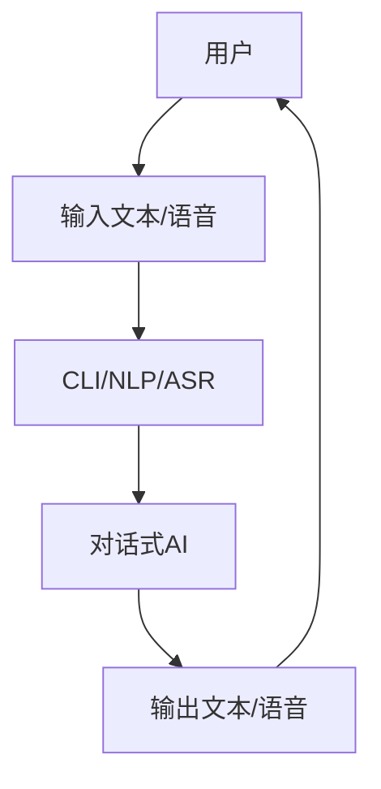

                 

**CUI如何彻底改变数字产品的交互方式**

**作者：禅与计算机程序设计艺术 / Zen and the Art of Computer Programming**

## 1. 背景介绍

在数字时代，用户与产品的交互方式正在发生革命性的变化。传统的图形用户界面（GUI）和命令行界面（CLI）已经无法满足用户日益增长的需求。人工智能、自然语言处理、语音识别等技术的发展，使得计算机理解和响应人类语言变得更加简单。因此，计算机用户界面（CUI）重新回到了人们的视野，并有望彻底改变数字产品的交互方式。

## 2. 核心概念与联系

### 2.1 核心概念

- **命令行界面（CLI）**：用户通过输入文本命令与计算机交互的界面。
- **自然语言处理（NLP）**：计算机理解和生成人类语言的技术。
- **语音识别（ASR）**：将语音转换为文本的技术。
- **文本到言语（TTS）**：将文本转换为语音的技术。
- **对话式人工智能（Conversational AI）**：模拟人类对话的AI系统。

### 2.2 核心概念联系



## 3. 核心算法原理 & 具体操作步骤

### 3.1 算法原理概述

CUI的核心是自然语言理解（NLU）和对话管理（DM）算法。NLU负责将用户的输入转换为计算机可理解的意图，DM则负责管理对话流程。

### 3.2 算法步骤详解

1. **输入预处理**：清理用户输入，去除无意义的字符和单词。
2. **意图识别**：使用NLP技术（如神经网络）识别用户意图。
3. **实体提取**：从用户输入中提取关键实体（如人名、地名、时间等）。
4. **对话管理**：根据用户意图和实体，选择合适的回复，并更新对话状态。
5. **输出生成**：使用TTS技术将文本转换为语音，或直接输出文本。

### 3.3 算法优缺点

**优点**：CUI提供了更自然的交互方式，可以帮助用户更快速、更方便地完成任务。

**缺点**：CUI系统对NLP和ASR技术的依赖性高，如果这些技术出现错误，CUI系统的准确性和可用性会受到影响。

### 3.4 算法应用领域

CUI可以应用于各种数字产品，如虚拟助手（如Siri、Alexa）、智能客服、游戏、教育等。

## 4. 数学模型和公式 & 详细讲解 & 举例说明

### 4.1 数学模型构建

CUI的数学模型可以表示为一个有向图，其中节点表示对话状态，边表示可能的转移。

### 4.2 公式推导过程

给定用户输入$u$和当前状态$s$，CUI系统的目标是选择最可能的下一个状态$t$。这可以表示为一个条件概率分布$P(t|u,s)$。

### 4.3 案例分析与讲解

例如，在一个简单的CUI系统中，用户可以询问天气。如果用户输入"什么天气？"，系统可以识别出意图为"查询天气"，并转移到"查询天气"状态。然后，系统可以根据用户的位置信息生成天气预报，并转移到"等待用户反应"状态。

## 5. 项目实践：代码实例和详细解释说明

### 5.1 开发环境搭建

本示例使用Python和Rasa框架来构建一个简单的CUI系统。首先，安装Rasa：

```bash
pip install rasa
```

### 5.2 源代码详细实现

创建一个新的Rasa项目，并编写域文件（`domain.yml`），意图文件（`nlu.yml`），故事文件（`stories.yml`），和模型文件（`models.yml`）。

**domain.yml**

```yaml
intents:
  - greet
  - goodbye
  - ask_weather

entities:
  - location

slots:
  location:
    type: text

forms:
  weather_form:
    required_slots:
      - location

actions:
  - utter_greet
  - utter_goodbye
  - utter_ask_location
  - action_weather
```

**nlu.yml**

```yaml
version: "2.0"

nlu:
- intent: greet
  examples: |
    - 你好
    - 您好
    - 嗨

- intent: goodbye
  examples: |
    - 再见
    - bye
    - 告辞

- intent: ask_weather
  examples: |
    - 什么天气？
    - 天气怎么样？
    - 现在天气怎么样？
```

**stories.yml**

```yaml
version: "2.0"

stories:
- story: ask weather
  steps:
  - intent: greet
  - action: utter_greet
  - intent: ask_weather
  - action: weather_form
  - active_loop: weather_form
  - slot_was_set:
    - location: "beijing"
  - action: action_weather
  - intent: goodbye
  - action: utter_goodbye
```

**models.yml**

```yaml
version: "2.0"

nlu:
- name: "weather_nlu"
  files:
  - "nlu.yml"

dialogue:
- name: "weather_dialogue"
  files:
  - "stories.yml"
```

### 5.3 代码解读与分析

在域文件中，我们定义了意图、实体、槽、表单和动作。在意图文件中，我们定义了用户可能输入的意图及其示例。在故事文件中，我们定义了对话的流程。在模型文件中，我们指定了NLU和对话模型的位置。

### 5.4 运行结果展示

运行Rasa服务器：

```bash
rasa train
rasa run actions
```

然后，你可以通过聊天机器人与CUI系统交互：

```
用户：你好
机器人：嗨，有什么可以帮到你吗？
用户：什么天气？
机器人：请告诉我你想查询的位置。
用户：北京
机器人：北京的天气是晴朗的。
用户：再见
机器人：再见！
```

## 6. 实际应用场景

### 6.1 当前应用

CUI已经广泛应用于虚拟助手（如Siri、Alexa）、智能客服、游戏、教育等领域。

### 6.2 未来应用展望

未来，CUI有望应用于更多领域，如自动驾驶、物联网、工业控制等。随着NLP和ASR技术的发展，CUI系统的准确性和可用性也将得到提高。

## 7. 工具和资源推荐

### 7.1 学习资源推荐

- Rasa文档：<https://rasa.com/docs/rasa/>
- Natural Language Processing with Python：<https://www.nltk.org/book/>
- SpeechRecognition库文档：<https://speechrecognition.readthedocs.io/en/latest/>

### 7.2 开发工具推荐

- Rasa：<https://rasa.com/>
- Dialogflow：<https://dialogflow.com/>
- Microsoft Bot Framework：<https://dev.botframework.com/>
- IBM Watson Assistant：<https://www.ibm.com/cloud/watson-assistant>

### 7.3 相关论文推荐

- "End-to-End Dialog Management for Task-Oriented Dialog Systems"：<https://arxiv.org/abs/1708.00499>
- "Neural Dialogue Management with Hierarchical Recurrent Neural Networks"：<https://arxiv.org/abs/1708.00498>

## 8. 总结：未来发展趋势与挑战

### 8.1 研究成果总结

本文介绍了CUI的核心概念、算法原理、数学模型、项目实践，并推荐了相关学习资源、开发工具和论文。

### 8.2 未来发展趋势

未来，CUI将继续发展，并有望应用于更多领域。随着NLP和ASR技术的发展，CUI系统的准确性和可用性也将得到提高。

### 8.3 面临的挑战

CUI系统面临的挑战包括NLP和ASR技术的准确性、对话管理的复杂性、安全和隐私等问题。

### 8.4 研究展望

未来的研究方向包括提高NLP和ASR技术的准确性、开发更复杂的对话管理算法、研究CUI系统的安全和隐私等问题。

## 9. 附录：常见问题与解答

**Q：CUI与GUI有什么区别？**

**A：CUI使用文本或语音输入，而GUI使用图形输入。CUI提供了更自然的交互方式，而GUI提供了更直观的交互方式。**

**Q：CUI的优缺点是什么？**

**A：CUI的优点包括更自然的交互方式，更快速的任务完成。CUI的缺点包括对NLP和ASR技术的依赖性高，准确性和可用性受限。**

**Q：CUI有哪些应用领域？**

**A：CUI可以应用于虚拟助手、智能客服、游戏、教育等领域。未来，CUI有望应用于自动驾驶、物联网、工业控制等领域。**

**作者：禅与计算机程序设计艺术 / Zen and the Art of Computer Programming**

