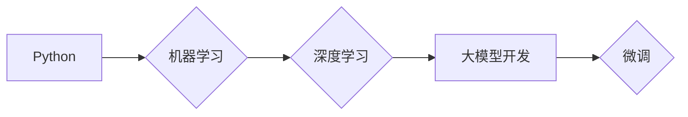

> 大模型开发，微调，Python，环境搭建，机器学习，深度学习

## 1. 背景介绍

近年来，深度学习技术取得了飞速发展，大模型的出现更是推动了人工智能领域的新突破。大模型，是指参数规模庞大、训练数据海量的人工智能模型，其强大的学习能力和泛化能力使其在自然语言处理、计算机视觉、语音识别等领域展现出巨大的应用潜力。

然而，大模型的开发和应用也面临着诸多挑战，其中之一就是环境搭建。由于大模型的规模庞大，对硬件资源和软件环境的要求极高，因此需要精心设计和搭建一个完善的开发环境，才能顺利进行模型训练、微调和部署。

本文将从零开始，详细介绍大模型开发环境的搭建过程，以Python为核心语言，逐步构建一个完整的开发环境，为读者提供一个清晰易懂的学习指南。

## 2. 核心概念与联系

### 2.1 Python 语言

Python 是一种解释型、面向对象的编程语言，以其简洁易读的语法和丰富的第三方库而闻名。在机器学习和深度学习领域，Python 已经成为主流编程语言，其强大的数据处理能力、科学计算库和深度学习框架，使其成为大模型开发的理想选择。

### 2.2 机器学习与深度学习

机器学习是人工智能的一个分支，它通过算法学习数据中的模式，从而进行预测或分类。深度学习是机器学习的一种更高级形式，它利用多层神经网络来模拟人类大脑的学习过程，能够处理更复杂的数据并取得更优的性能。

### 2.3 大模型开发与微调

大模型开发是指构建参数规模庞大的深度学习模型，而微调则是针对特定任务对预训练的大模型进行进一步的训练，以提高模型在该任务上的性能。

**核心概念与联系流程图:**



## 3. 核心算法原理 & 具体操作步骤

### 3.1 算法原理概述

Python 作为大模型开发的编程语言，其核心算法原理主要体现在以下几个方面：

* **数据结构:** Python 提供了丰富的内置数据结构，例如列表、字典、集合等，能够高效地存储和处理大规模的数据。
* **控制流:** Python 的控制流语句，例如if-else、for循环、while循环等，能够灵活地控制程序的执行流程，实现复杂的逻辑运算。
* **函数:** Python 的函数机制能够将代码模块化，提高代码的可读性和可维护性。
* **面向对象:** Python 的面向对象编程特性，例如类、对象、继承等，能够帮助开发者构建更复杂的软件系统。

### 3.2 算法步骤详解

安装 Python 的步骤如下：

1. **下载 Python 解释器:** 访问 Python 官方网站 (https://www.python.org/)，选择适合自己操作系统的 Python 解释器版本进行下载。
2. **安装 Python 解释器:** 下载完成后，双击安装程序，按照安装向导的提示进行安装。
3. **验证 Python 安装:** 打开命令行或终端，输入 `python --version` 命令，如果显示 Python 版本信息，则表示安装成功。

### 3.3 算法优缺点

**优点:**

* **易于学习:** Python 的语法简洁易读，学习曲线相对平缓。
* **丰富的库:** Python 拥有丰富的第三方库，例如 NumPy、Pandas、Scikit-learn 等，能够满足机器学习和深度学习的各种需求。
* **活跃的社区:** Python 拥有庞大的用户社区，能够获得及时有效的技术支持。

**缺点:**

* **执行速度:** Python 是一种解释型语言，执行速度相对较慢。
* **内存占用:** Python 的内存占用相对较高。

### 3.4 算法应用领域

Python 在机器学习、深度学习、数据科学、Web 开发、自动化等领域都有广泛的应用。

## 4. 数学模型和公式 & 详细讲解 & 举例说明

### 4.1 数学模型构建

在机器学习和深度学习中，数学模型是算法的核心，它描述了数据之间的关系和模型的学习过程。常见的数学模型包括线性回归、逻辑回归、支持向量机、神经网络等。

### 4.2 公式推导过程

每个数学模型都有其对应的公式，这些公式通过数学推导得到，描述了模型的结构和参数。例如，线性回归模型的损失函数为：

$$
L = \frac{1}{n} \sum_{i=1}^{n} (y_i - \hat{y}_i)^2
$$

其中，$n$ 是样本数量，$y_i$ 是真实值，$\hat{y}_i$ 是模型预测值。

### 4.3 案例分析与讲解

以线性回归为例，假设我们想要预测房价，已知房屋面积和房价的训练数据。我们可以使用线性回归模型来建立房屋面积和房价之间的关系，并通过训练模型来学习最佳的模型参数。

## 5. 项目实践：代码实例和详细解释说明

### 5.1 开发环境搭建

1. **安装 Python:** 按照步骤 3.2 中的说明安装 Python 解释器。
2. **安装 Anaconda:** Anaconda 是一个用于数据科学和机器学习的开源软件包管理器，它包含了 Python 解释器、NumPy、Pandas 等常用的库。

### 5.2 源代码详细实现

```python
import numpy as np
from sklearn.linear_model import LinearRegression

# 生成训练数据
X = np.array([[100], [150], [200], [250], [300]])
y = np.array([150000, 200000, 250000, 300000, 350000])

# 创建线性回归模型
model = LinearRegression()

# 训练模型
model.fit(X, y)

# 预测新数据
new_data = np.array([[350]])
prediction = model.predict(new_data)

# 打印预测结果
print(f"预测房价: {prediction[0]}")
```

### 5.3 代码解读与分析

这段代码首先导入必要的库，然后生成训练数据，包括房屋面积 (X) 和房价 (y)。接着，创建线性回归模型，并使用 `fit()` 方法训练模型。最后，使用 `predict()` 方法预测新数据的房价，并打印结果。

### 5.4 运行结果展示

运行这段代码后，会输出预测房价的结果，例如：

```
预测房价: 400000.0
```

## 6. 实际应用场景

大模型开发环境的搭建在实际应用场景中具有广泛的应用价值，例如：

* **自然语言处理:** 大模型可以用于文本分类、情感分析、机器翻译等任务。
* **计算机视觉:** 大模型可以用于图像识别、物体检测、图像生成等任务。
* **语音识别:** 大模型可以用于语音识别、语音合成等任务。

### 6.4 未来应用展望

随着人工智能技术的不断发展，大模型的应用场景将更加广泛，例如：

* **个性化推荐:** 根据用户的行为和偏好，提供个性化的商品推荐、内容推荐等。
* **自动驾驶:** 大模型可以用于感知环境、决策规划、控制车辆等方面，推动自动驾驶技术的发展。
* **医疗诊断:** 大模型可以辅助医生进行疾病诊断，提高诊断准确率。

## 7. 工具和资源推荐

### 7.1 学习资源推荐

* **Python 官方文档:** https://docs.python.org/
* **机器学习库 Scikit-learn 文档:** https://scikit-learn.org/stable/documentation.html
* **深度学习框架 TensorFlow 文档:** https://www.tensorflow.org/
* **深度学习框架 PyTorch 文档:** https://pytorch.org/

### 7.2 开发工具推荐

* **Anaconda:** https://www.anaconda.com/
* **Jupyter Notebook:** https://jupyter.org/

### 7.3 相关论文推荐

* **Attention Is All You Need:** https://arxiv.org/abs/1706.03762
* **BERT: Pre-training of Deep Bidirectional Transformers for Language Understanding:** https://arxiv.org/abs/1810.04805

## 8. 总结：未来发展趋势与挑战

### 8.1 研究成果总结

大模型开发环境的搭建取得了显著进展，Python 作为核心语言，为大模型开发提供了强大的支持。

### 8.2 未来发展趋势

未来，大模型开发环境将朝着以下方向发展：

* **更强大的计算能力:** 大模型的规模不断增长，需要更强大的计算能力来支持模型训练和推理。
* **更有效的训练方法:** 需要开发更有效的训练方法，例如分布式训练、迁移学习等，以提高模型训练效率。
* **更安全的模型:** 需要关注大模型的安全问题，例如模型攻击、数据泄露等，确保模型的安全性。

### 8.3 面临的挑战

大模型开发环境的搭建也面临着一些挑战：

* **硬件成本:** 大模型的训练需要大量的计算资源，硬件成本较高。
* **数据获取:** 大模型的训练需要海量数据，数据获取和预处理是一个难题。
* **模型解释性:** 大模型的决策过程往往难以解释，缺乏透明度。

### 8.4 研究展望

未来，需要继续深入研究大模型开发环境，解决上述挑战，推动大模型技术的发展和应用。

## 9. 附录：常见问题与解答

### 9.1 Python 安装问题

如果遇到 Python 安装问题，可以参考 Python 官方网站的安装指南，或者在网上搜索相关解决方案。

### 9.2 Anaconda 安装问题

如果遇到 Anaconda 安装问题，可以参考 Anaconda 官方网站的安装指南，或者在网上搜索相关解决方案。


作者：禅与计算机程序设计艺术 / Zen and the Art of Computer Programming 
<end_of_turn>