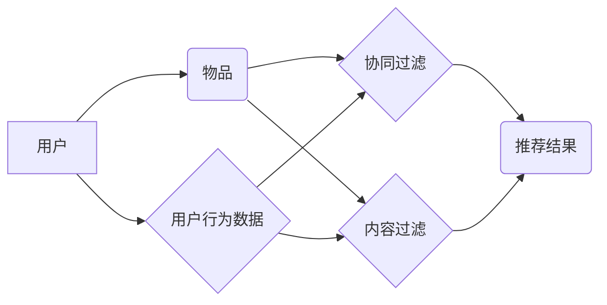

> 搜索推荐系统,结果提供,传统算法,协同过滤,内容过滤,排序算法,推荐引擎

## 1. 背景介绍

在信息爆炸的时代，海量数据和信息涌现，用户面临着信息过载的困境。如何有效地从海量数据中找到用户感兴趣的信息，并提供个性化的推荐，成为了一个重要的挑战。搜索推荐系统应运而生，它结合了搜索引擎和推荐系统的优势，旨在为用户提供更精准、更相关的搜索结果和推荐内容。

传统搜索推荐系统主要依赖于以下两种核心算法：协同过滤和内容过滤。协同过滤算法基于用户的历史行为和物品的相似性进行推荐，而内容过滤算法则根据用户的兴趣偏好和物品的特征进行推荐。

## 2. 核心概念与联系

**2.1 协同过滤**

协同过滤算法的核心思想是：如果用户A喜欢物品X，而用户B也喜欢物品X，那么用户A可能也喜欢用户B喜欢的其他物品。

**2.2 内容过滤**

内容过滤算法的核心思想是：根据用户的兴趣偏好和物品的特征进行推荐。例如，如果用户喜欢阅读科技类文章，那么系统会推荐其他科技类文章。

**2.3 系统架构**



## 3. 核心算法原理 & 具体操作步骤

### 3.1 算法原理概述

**3.1.1 协同过滤算法原理**

协同过滤算法主要分为两种：基于用户的协同过滤和基于物品的协同过滤。

* **基于用户的协同过滤:** 
    * 计算用户之间的相似度，例如使用余弦相似度或皮尔逊相关系数。
    * 找到与目标用户相似度高的用户，并推荐目标用户没有评分或评分低的物品。
* **基于物品的协同过滤:**
    * 计算物品之间的相似度，例如使用余弦相似度或皮尔逊相关系数。
    * 找到与目标物品相似度高的物品，并推荐目标用户没有评分或评分低的物品。

**3.1.2 内容过滤算法原理**

内容过滤算法主要基于以下步骤：

* **特征提取:** 从物品中提取特征，例如文章的主题、作者、关键词等。
* **用户兴趣建模:** 根据用户的历史行为数据，构建用户的兴趣模型，例如使用向量空间模型或隐语义模型。
* **推荐生成:** 计算物品特征与用户兴趣模型的相似度，并推荐相似度高的物品。

### 3.2 算法步骤详解

**3.2.1 协同过滤算法步骤详解**

1. 收集用户行为数据，例如用户对物品的评分、点击、购买等行为。
2. 计算用户之间的相似度或物品之间的相似度。
3. 根据相似度，推荐目标用户没有评分或评分低的物品。

**3.2.2 内容过滤算法步骤详解**

1. 从物品中提取特征。
2. 根据用户的历史行为数据，构建用户的兴趣模型。
3. 计算物品特征与用户兴趣模型的相似度。
4. 推荐相似度高的物品。

### 3.3 算法优缺点

**3.3.1 协同过滤算法优缺点**

* **优点:** 可以发现用户之间的隐性关系，推荐个性化结果。
* **缺点:** 数据稀疏性问题，冷启动问题，容易受到恶意评分的影响。

**3.3.2 内容过滤算法优缺点**

* **优点:** 不需要用户历史行为数据，可以推荐新物品。
* **缺点:** 难以捕捉用户之间的隐性关系，推荐结果可能缺乏个性化。

### 3.4 算法应用领域

* **电子商务:** 商品推荐、用户画像
* **社交网络:** 朋友推荐、内容推荐
* **音乐平台:** 歌曲推荐、音乐人推荐
* **视频平台:** 视频推荐、用户兴趣分析

## 4. 数学模型和公式 & 详细讲解 & 举例说明

### 4.1 数学模型构建

**4.1.1 协同过滤模型**

协同过滤模型通常使用矩阵分解技术，将用户-物品交互矩阵分解成两个低维矩阵，分别表示用户特征和物品特征。

**4.1.2 内容过滤模型**

内容过滤模型通常使用向量空间模型，将用户兴趣和物品特征表示为向量，并计算它们的余弦相似度。

### 4.2 公式推导过程

**4.2.1 余弦相似度公式**

$$
\text{相似度} = \frac{\mathbf{u} \cdot \mathbf{v}}{\|\mathbf{u}\| \|\mathbf{v}\|}
$$

其中，$\mathbf{u}$ 和 $\mathbf{v}$ 分别表示用户兴趣向量和物品特征向量，$\cdot$ 表示点积，$\|\mathbf{u}\|$ 和 $\|\mathbf{v}\|$ 分别表示向量 $\mathbf{u}$ 和 $\mathbf{v}$ 的模长。

**4.2.2 矩阵分解公式**

$$
\mathbf{R} \approx \mathbf{U} \mathbf{V}^T
$$

其中，$\mathbf{R}$ 是用户-物品交互矩阵，$\mathbf{U}$ 是用户特征矩阵，$\mathbf{V}$ 是物品特征矩阵，$T$ 表示转置。

### 4.3 案例分析与讲解

**4.3.1 余弦相似度案例分析**

假设有两个用户，用户A喜欢电影A、B、C，用户B喜欢电影B、C、D。我们可以计算用户A和用户B之间的余弦相似度，发现它们喜欢电影B和C，因此相似度较高。

**4.3.2 矩阵分解案例分析**

我们可以使用矩阵分解技术对用户-物品交互矩阵进行分解，得到用户特征和物品特征矩阵。然后，我们可以根据这些特征矩阵，预测用户对物品的评分，并进行推荐。

## 5. 项目实践：代码实例和详细解释说明

### 5.1 开发环境搭建

* Python 3.x
* scikit-learn
* numpy
* pandas

### 5.2 源代码详细实现

```python
import pandas as pd
from sklearn.metrics.pairwise import cosine_similarity

# 加载用户-物品交互数据
data = pd.read_csv('user_item_data.csv')

# 计算用户之间的余弦相似度
user_similarity = cosine_similarity(data.T)

# 获取目标用户的ID
target_user_id = 1

# 找到与目标用户相似度高的用户
similar_users = user_similarity[target_user_id].argsort()[::-1][1:10]

# 获取目标用户没有评分的物品
unrated_items = data[data.iloc[target_user_id] == 0].index

# 推荐目标用户可能喜欢的物品
recommendations = []
for similar_user in similar_users:
    for item in unrated_items:
        if data.iloc[similar_user, item] > 0:
            recommendations.append(item)

# 打印推荐结果
print(f'推荐给用户 {target_user_id} 的物品：{recommendations}')
```

### 5.3 代码解读与分析

* 该代码首先加载用户-物品交互数据，然后计算用户之间的余弦相似度。
* 然后，代码获取目标用户的ID，并找到与目标用户相似度高的用户。
* 接着，代码获取目标用户没有评分的物品，并根据相似用户的评分进行推荐。
* 最后，代码打印推荐结果。

### 5.4 运行结果展示

运行该代码后，会输出一个包含目标用户可能喜欢的物品的列表。

## 6. 实际应用场景

**6.1 电子商务**

* 商品推荐：根据用户的浏览历史、购买记录等行为数据，推荐用户可能感兴趣的商品。
* 用户画像：根据用户的购买行为、浏览记录等数据，构建用户的兴趣画像，为用户提供个性化的服务。

**6.2 社交网络**

* 朋友推荐：根据用户的兴趣爱好、社交关系等数据，推荐用户可能认识的朋友。
* 内容推荐：根据用户的兴趣爱好、阅读历史等数据，推荐用户可能感兴趣的内容。

**6.3 音乐平台**

* 歌曲推荐：根据用户的播放历史、收藏歌曲等数据，推荐用户可能喜欢的歌曲。
* 音乐人推荐：根据用户的音乐偏好、关注音乐人等数据，推荐用户可能喜欢的音乐人。

**6.4 视频平台**

* 视频推荐：根据用户的观看历史、点赞记录等数据，推荐用户可能感兴趣的视频。
* 用户兴趣分析：根据用户的观看记录、评论等数据，分析用户的兴趣爱好，为用户提供个性化的服务。

**6.5 未来应用展望**

随着人工智能技术的不断发展，搜索推荐系统将更加智能化、个性化。未来，搜索推荐系统将能够：

* 更准确地理解用户的需求，提供更精准的推荐结果。
* 更加个性化地推荐内容，满足用户的个性化需求。
* 更加智能地学习用户的行为模式，提供更主动的推荐服务。

## 7. 工具和资源推荐

### 7.1 学习资源推荐

* **书籍:**
    * 《推荐系统》
    * 《机器学习》
* **在线课程:**
    * Coursera: Recommender Systems
    * edX: Machine Learning

### 7.2 开发工具推荐

* **Python:** 
    * scikit-learn
    * numpy
    * pandas
* **Spark:** 
    * MLlib

### 7.3 相关论文推荐

* **协同过滤:**
    * "Collaborative Filtering for Implicit Feedback Datasets"
* **内容过滤:**
    * "Content-Based Recommendation Systems"
* **混合推荐:**
    * "Hybrid Recommender Systems: A Survey"

## 8. 总结：未来发展趋势与挑战

### 8.1 研究成果总结

传统搜索推荐系统已经取得了显著的成果，在电子商务、社交网络、音乐平台等领域得到了广泛应用。

### 8.2 未来发展趋势

* **深度学习:** 深度学习技术将被应用于搜索推荐系统，提高推荐的准确性和个性化程度。
* **多模态推荐:** 将文本、图像、音频等多模态数据融合到推荐系统中，提供更加丰富的推荐结果。
* **解释性推荐:** 使推荐结果更加透明可解释，帮助用户理解推荐的依据。

### 8.3 面临的挑战

* **数据稀疏性:** 用户-物品交互数据往往是稀疏的，这使得推荐系统的性能难以提升。
* **冷启动问题:** 新用户和新物品难以获得推荐，需要新的算法和策略来解决。
* **公平性问题:** 推荐系统可能存在偏见，导致某些用户或物品获得不公平的推荐。

### 8.4 研究展望

未来，搜索推荐系统将朝着更加智能化、个性化、公平化的方向发展。需要进一步研究新的算法和技术，解决数据稀疏性、冷启动问题和公平性问题，为用户提供更加优质的推荐服务。

## 9. 附录：常见问题与解答

**9.1 Q: 如何解决数据稀疏性问题？**

**A:** 可以使用矩阵分解、协同过滤等算法，将稀疏数据进行降维和表示，提高推荐系统的性能。

**9.2 Q: 如何解决冷启动问题？**

**A:** 可以使用基于内容过滤、基于知识图谱等方法，为新用户和新物品提供推荐。

**9.3 Q: 如何保证推荐系统的公平性？**

**A:** 可以使用公平性算法，避免推荐系统对某些用户或物品产生偏见。


作者：禅与计算机程序设计艺术 / Zen and the Art of Computer Programming 
<end_of_turn>