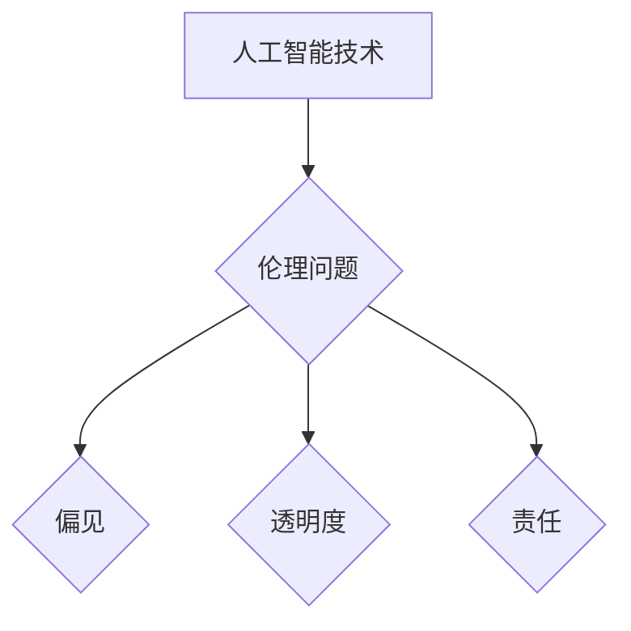

>人工智能，伦理，道德，偏见，透明度，责任

## 1. 背景介绍

人工智能 (AI) 技术的飞速发展，为人类社会带来了前所未有的机遇和挑战。AI 算法能够自动学习和决策，在医疗、金融、交通等领域展现出巨大的潜力。然而，随着 AI 系统的日益复杂化和自主性增强，其潜在的伦理问题也日益凸显。

AI 伦理问题涉及到 AI 系统的设计、开发、部署和使用各个环节，其核心在于如何确保 AI 技术的应用符合人类的价值观和道德规范。

## 2. 核心概念与联系

**2.1 核心概念**

* **人工智能 (AI):** 指能够模拟人类智能行为的计算机系统，例如学习、推理、决策、感知和语言理解等。
* **伦理 (Ethics):** 指关于什么是对的和什么是错的，以及如何应该行为的道德准则和原则。
* **道德 (Morality):** 指个人或社会群体基于伦理原则所形成的价值观和行为规范。

**2.2 联系**

AI 伦理问题是 AI 技术与人类价值观之间相互交织的复杂议题。AI 系统的设计和开发必须遵循伦理原则，以确保其应用符合人类的道德规范和社会利益。

**2.3 Mermaid 流程图**



## 3. 核心算法原理 & 具体操作步骤

**3.1 算法原理概述**

AI 算法的伦理问题主要体现在以下几个方面：

* **偏见 (Bias):** AI 算法的训练数据可能包含社会偏见，导致 AI 系统产生歧视性决策。
* **透明度 (Transparency):** 许多 AI 算法过于复杂，难以理解其决策过程，这使得 AI 系统的决策结果难以解释和监督。
* **责任 (Responsibility):** 当 AI 系统产生负面后果时，责任归属问题难以界定。

**3.2 算法步骤详解**

* **数据收集和预处理:** 确保训练数据具有代表性，并进行去偏见处理。
* **模型选择和训练:** 选择合适的 AI 算法模型，并进行训练，以最小化算法偏见。
* **模型评估和测试:** 对训练好的 AI 模型进行评估和测试，以确保其性能和公平性。
* **部署和监控:** 将 AI 系统部署到实际应用场景，并持续监控其运行情况，及时发现和解决潜在的伦理问题。

**3.3 算法优缺点**

* **优点:** 可以帮助识别和减少 AI 算法中的偏见，提高 AI 系统的公平性和可解释性。
* **缺点:** 

**3.4 算法应用领域**

* **医疗保健:** 确保 AI 辅助诊断系统不产生种族或性别歧视。
* **金融服务:** 避免 AI 驱动的贷款审批系统对特定群体产生不公平的待遇。
* **司法系统:** 确保 AI 辅助判决系统不受到个人偏见的影响。

## 4. 数学模型和公式 & 详细讲解 & 举例说明

**4.1 数学模型构建**

可以使用数学模型来量化 AI 算法中的偏见。例如，可以使用偏差度量指标来衡量 AI 系统对不同群体预测结果的差异。

**4.2 公式推导过程**

偏差度量指标的计算公式如下：

$$Bias = \frac{1}{N} \sum_{i=1}^{N} |P(y_i | x_i) - E(y_i | x_i)|$$

其中：

* $P(y_i | x_i)$ 是 AI 系统对样本 $x_i$ 的预测结果。
* $E(y_i | x_i)$ 是样本 $x_i$ 的真实标签。
* $N$ 是样本总数。

**4.3 案例分析与讲解**

假设我们有一个 AI 系统用于预测学生的考试成绩。如果该系统对不同种族学生的预测结果存在差异，则说明该系统存在种族偏见。可以使用上述公式计算该系统的偏差度量指标，并进行分析。

## 5. 项目实践：代码实例和详细解释说明

**5.1 开发环境搭建**

使用 Python 语言和 TensorFlow 库进行 AI 模型开发。

**5.2 源代码详细实现**

```python
import tensorflow as tf

# 定义模型
model = tf.keras.models.Sequential([
    tf.keras.layers.Dense(64, activation='relu', input_shape=(10,)),
    tf.keras.layers.Dense(1)
])

# 编译模型
model.compile(optimizer='adam', loss='mse')

# 训练模型
model.fit(X_train, y_train, epochs=10)

# 评估模型
loss = model.evaluate(X_test, y_test)
```

**5.3 代码解读与分析**

这段代码定义了一个简单的深度学习模型，用于预测学生的考试成绩。模型包含两层全连接神经网络层，并使用均方误差损失函数进行训练。

**5.4 运行结果展示**

训练完成后，可以评估模型的性能，并分析模型的预测结果是否存在偏见。

## 6. 实际应用场景

**6.1 医疗保健**

AI 辅助诊断系统可以帮助医生更快、更准确地诊断疾病。

**6.2 金融服务**

AI 驱动的风险评估系统可以帮助金融机构更好地管理风险。

**6.3 交通运输**

自动驾驶汽车可以提高道路安全性和交通效率。

**6.4 未来应用展望**

AI 技术将在未来各个领域发挥越来越重要的作用，例如教育、娱乐、制造业等。

## 7. 工具和资源推荐

**7.1 学习资源推荐**

* **在线课程:** Coursera, edX, Udacity
* **书籍:** "Artificial Intelligence: A Modern Approach" by Stuart Russell and Peter Norvig

**7.2 开发工具推荐**

* **Python:** 广泛用于 AI 开发
* **TensorFlow:** 开源深度学习框架
* **PyTorch:** 开源深度学习框架

**7.3 相关论文推荐**

* "On the Dangers of Stochastic Parrots: Can Language Models Be Too Big?" by Emily M. Bender et al.
* "Algorithmic Fairness" by Solon Barocas and Andrew Selbst

## 8. 总结：未来发展趋势与挑战

**8.1 研究成果总结**

AI 伦理研究取得了重要进展，例如开发了多种算法和工具来识别和减少 AI 算法中的偏见。

**8.2 未来发展趋势**

* **更注重 AI 系统的解释性和透明度。**
* **加强 AI 伦理规范和法律法规的制定。**
* **促进 AI 伦理教育和公众参与。**

**8.3 面临的挑战**

* **AI 算法的复杂性使得其决策过程难以理解。**
* **缺乏统一的 AI 伦理标准和规范。**
* **公众对 AI 技术的认知和接受度不足。**

**8.4 研究展望**

未来 AI 伦理研究需要更加深入地探讨 AI 系统的价值观和社会影响，并寻求更加有效的解决方案来应对 AI 伦理挑战。

## 9. 附录：常见问题与解答

**9.1 如何识别 AI 算法中的偏见？**

可以使用偏差度量指标来衡量 AI 系统对不同群体预测结果的差异。

**9.2 如何减少 AI 算法中的偏见？**

* 确保训练数据具有代表性，并进行去偏见处理。
* 选择合适的 AI 算法模型，并进行训练，以最小化算法偏见。
* 对训练好的 AI 模型进行评估和测试，以确保其性能和公平性。

**9.3 当 AI 系统产生负面后果时，责任归属问题如何解决？**

需要根据具体情况进行分析，并制定相应的责任机制。

作者：禅与计算机程序设计艺术 / Zen and the Art of Computer Programming


<end_of_turn>