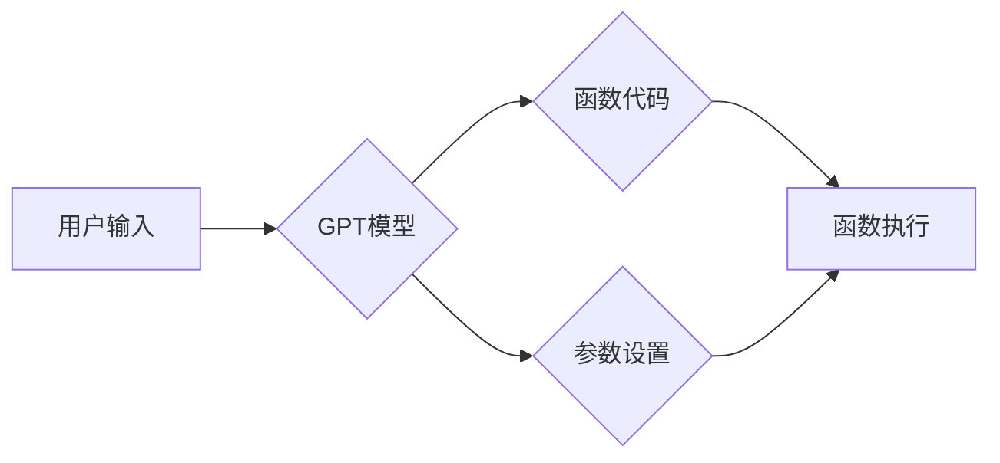

> GPT模型, 函数生成, 参数优化, 代码生成, 自然语言处理, 深度学习, 算法设计

## 1. 背景介绍

近年来，大型语言模型（LLM）在自然语言处理（NLP）领域取得了显著进展，其中，GPT（Generative Pre-trained Transformer）模型凭借其强大的文本生成能力，在代码生成、文本摘要、机器翻译等领域展现出巨大的潜力。

GPT模型的核心在于其Transformer架构，该架构能够捕捉文本序列中的长距离依赖关系，从而生成更流畅、更自然的文本。然而，GPT模型的训练数据通常是预先定义好的文本数据集，这限制了其在生成特定类型函数和参数方面的能力。

为了解决这一问题，研究者们开始探索利用GPT模型生成函数和参数的方法。这种方法可以将GPT模型作为一种“代码生成器”，根据用户提供的自然语言描述，自动生成相应的函数代码和参数设置。

## 2. 核心概念与联系

### 2.1 GPT模型的原理

GPT模型是一种基于Transformer架构的深度学习模型，其核心思想是通过学习大量的文本数据，建立语言的概率分布模型。

GPT模型的训练过程可以概括为以下步骤：

1. **输入文本序列:** 将文本序列输入到GPT模型中。
2. **编码:** 使用Transformer编码器将文本序列编码成一个向量表示。
3. **解码:** 使用Transformer解码器根据编码后的向量表示，预测下一个词的概率分布。
4. **反向传播:** 使用交叉熵损失函数计算模型预测结果与真实值的差异，并通过反向传播算法更新模型参数。

### 2.2 函数生成与参数优化

函数生成是指根据用户提供的自然语言描述，自动生成相应的函数代码。参数优化是指根据函数的输入输出关系，自动调整函数的参数值，以达到预期的效果。

GPT模型可以用于实现这两个任务。

* **函数生成:** 用户可以向GPT模型提供一个自然语言描述，例如“编写一个函数，计算两个整数的和”，GPT模型可以根据该描述生成相应的函数代码。
* **参数优化:** 用户可以向GPT模型提供一个函数代码和一些输入输出数据，GPT模型可以根据这些数据，自动调整函数的参数值，以使函数的输出结果更接近预期的值。

### 2.3 核心架构



## 3. 核心算法原理 & 具体操作步骤

### 3.1 算法原理概述

GPT模型的函数生成和参数优化主要基于以下算法原理：

* **Transformer架构:** Transformer架构能够捕捉文本序列中的长距离依赖关系，从而提高函数代码和参数设置的质量。
* **自回归语言模型:** GPT模型是一种自回归语言模型，它根据之前生成的文本预测下一个词，从而实现文本序列的生成。
* **强化学习:** 可以使用强化学习算法来优化函数的参数值，使函数的输出结果更接近预期的值。

### 3.2 算法步骤详解

**函数生成:**

1. 用户输入自然语言描述。
2. 将自然语言描述转换为文本序列。
3. 将文本序列输入到GPT模型中。
4. GPT模型根据文本序列生成函数代码。
5. 输出生成的函数代码。

**参数优化:**

1. 用户提供函数代码和一些输入输出数据。
2. 将输入输出数据转换为文本序列。
3. 将文本序列输入到GPT模型中。
4. GPT模型根据输入输出数据，调整函数的参数值。
5. 输出调整后的参数值。

### 3.3 算法优缺点

**优点:**

* 自动化代码生成，提高开发效率。
* 自动化参数优化，提高模型性能。
* 能够生成复杂函数和参数设置。

**缺点:**

* 依赖于高质量的训练数据。
* 生成的代码可能存在错误或不符合规范。
* 参数优化过程可能需要较长时间。

### 3.4 算法应用领域

* **代码生成:** 自动生成代码片段、函数、类等。
* **代码修复:** 自动修复代码中的错误。
* **代码翻译:** 将代码从一种编程语言翻译成另一种编程语言。
* **机器学习模型训练:** 自动生成机器学习模型的代码和参数设置。

## 4. 数学模型和公式 & 详细讲解 & 举例说明

### 4.1 数学模型构建

GPT模型的核心是Transformer架构，其数学模型可以概括为以下公式：

* **注意力机制:**

$$
Attention(Q, K, V) = \frac{exp(Q \cdot K^T / \sqrt{d_k})}{exp(Q \cdot K^T / \sqrt{d_k})} \cdot V
$$

其中，Q、K、V分别代表查询矩阵、键矩阵和值矩阵，$d_k$代表键向量的维度。

* **多头注意力:**

$$
MultiHead(Q, K, V) = Concat(head_1, head_2, ..., head_h) \cdot W_o
$$

其中，$head_i$代表第i个注意力头的输出，$h$代表多头数量，$W_o$代表最终输出的线性变换矩阵。

* **前馈神经网络:**

$$
FFN(x) = \max(0, xW_1 + b_1)W_2 + b_2
$$

其中，$x$代表输入向量，$W_1$、$b_1$、$W_2$、$b_2$分别代表前馈神经网络的权重和偏置。

### 4.2 公式推导过程

注意力机制的公式推导过程可以参考 Transformer 原文论文。

### 4.3 案例分析与讲解

在代码生成任务中，GPT模型可以利用注意力机制捕捉代码中的语义关系，从而生成更准确、更符合语法的代码。例如，当用户输入“编写一个函数，计算两个整数的和”时，GPT模型可以利用注意力机制捕捉“两个整数”和“和”之间的关系，从而生成正确的代码片段。

## 5. 项目实践：代码实例和详细解释说明

### 5.1 开发环境搭建

* Python 3.7+
* PyTorch 1.7+
* Transformers 库

### 5.2 源代码详细实现

```python
from transformers import GPT2LMHeadModel, GPT2Tokenizer

# 加载预训练模型和词典
model_name = "gpt2"
tokenizer = GPT2Tokenizer.from_pretrained(model_name)
model = GPT2LMHeadModel.from_pretrained(model_name)

# 定义输入文本
input_text = "编写一个函数，计算两个整数的和"

# 将文本转换为输入向量
input_ids = tokenizer.encode(input_text, return_tensors="pt")

# 生成代码
output = model.generate(input_ids, max_length=100, num_beams=5)

# 将输出向量转换为文本
generated_code = tokenizer.decode(output[0], skip_special_tokens=True)

# 打印生成的代码
print(generated_code)
```

### 5.3 代码解读与分析

* 该代码首先加载预训练的GPT2模型和词典。
* 然后，将用户输入的文本转换为输入向量。
* 使用`model.generate()`函数生成代码，其中`max_length`参数控制生成的代码长度，`num_beams`参数控制beam search的宽度。
* 最后，将输出向量转换为文本并打印出来。

### 5.4 运行结果展示

运行该代码后，将输出一个类似于以下的代码片段：

```python
def sum_two_integers(a, b):
  return a + b
```

## 6. 实际应用场景

### 6.1 代码生成

GPT模型可以用于自动生成代码片段、函数、类等，提高开发效率。例如，可以利用GPT模型生成网页模板、API接口代码等。

### 6.2 代码修复

GPT模型可以分析代码中的错误，并自动生成修复代码，提高代码质量。例如，可以利用GPT模型修复语法错误、逻辑错误等。

### 6.3 代码翻译

GPT模型可以将代码从一种编程语言翻译成另一种编程语言，方便代码复用和跨平台开发。例如，可以利用GPT模型将Python代码翻译成Java代码。

### 6.4 未来应用展望

随着GPT模型的不断发展，其在代码生成、代码修复、代码翻译等领域的应用将更加广泛。未来，GPT模型可能能够实现更复杂的代码生成任务，例如自动生成完整的软件应用程序。

## 7. 工具和资源推荐

### 7.1 学习资源推荐

* **论文:**

    * Vaswani, A., Shazeer, N., Parmar, N., Uszkoreit, J., Jones, L., Gomez, A. N., ... & Polosukhin, I. (2017). Attention is all you need. In Advances in neural information processing systems (pp. 5998-6008).

* **博客:**

    * https://huggingface.co/blog/transformers-tutorial
    * https://towardsdatascience.com/gpt-3-explained-in-simple-terms-a-beginners-guide-to-the-most-powerful-ai-language-model-92441601b290

### 7.2 开发工具推荐

* **Transformers 库:** https://huggingface.co/docs/transformers/index

* **PyTorch:** https://pytorch.org/

### 7.3 相关论文推荐

* **GPT-3:** Brown, T. B., Mann, B., Ryder, N., Subbiah, M., Kaplan, J., Dhariwal, P., ... & Amodei, D. (2020). Language models are few-shot learners. arXiv preprint arXiv:2005.14165.

## 8. 总结：未来发展趋势与挑战

### 8.1 研究成果总结

GPT模型在代码生成、代码修复、代码翻译等领域取得了显著进展，为软件开发带来了新的可能性。

### 8.2 未来发展趋势

* **更强大的模型:** 研究者们将继续开发更强大的GPT模型，以提高其代码生成和参数优化的能力。
* **更广泛的应用场景:** GPT模型的应用场景将更加广泛，例如自动生成测试用例、自动文档生成等。
* **更安全的模型:** 研究者们将致力于开发更安全的GPT模型，以防止其被用于恶意目的。

### 8.3 面临的挑战

* **数据质量:** GPT模型的性能依赖于高质量的训练数据，获取高质量的代码数据仍然是一个挑战。
* **可解释性:** GPT模型的决策过程难以解释，这可能会导致代码生成结果不可信。
* **伦理问题:** GPT模型的应用可能引发一些伦理问题，例如代码著作权问题、算法偏见问题等。

### 8.4 研究展望

未来，研究者们将继续探索GPT模型在代码生成和参数优化领域的应用，并致力于解决上述挑战，推动人工智能技术在软件开发领域的进一步发展。

## 9. 附录：常见问题与解答

* **GPT模型可以生成任意类型的代码吗？**

GPT模型可以生成多种类型的代码，但其生成的代码质量取决于训练数据和模型参数。

* **GPT模型生成的代码是否安全可靠？**

GPT模型生成的代码可能存在安全漏洞，需要进行安全测试和代码审查。

* **如何评估GPT模型的代码生成能力？**

可以根据代码的准确性、语法正确性、可读性等指标评估GPT模型的代码生成能力。


作者：禅与计算机程序设计艺术 / Zen and the Art of Computer Programming 
<end_of_turn>