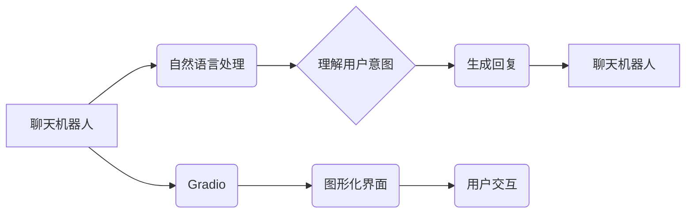

> Gradio, 聊天机器人, 图形化界面, 自然语言处理, Python

## 1. 背景介绍

在当今数据爆炸的时代，自然语言处理（NLP）技术蓬勃发展，聊天机器人作为其重要应用之一，已逐渐走进人们的生活。从智能客服到陪伴型机器人，聊天机器人以其便捷、高效的交互方式，为用户提供了全新的体验。然而，传统的聊天机器人往往依赖于命令行或文本界面，缺乏直观、友好的交互方式。

Gradio是一个开源的Python库，旨在简化机器学习模型的部署和演示。它提供了一个易于使用的API，可以快速构建交互式图形化界面，让用户可以直观地与机器学习模型进行交互。结合Gradio的强大功能，我们可以轻松地将聊天机器人部署为图形化界面，提升用户体验，并使其更易于推广和应用。

## 2. 核心概念与联系

### 2.1 聊天机器人

聊天机器人是一种能够通过自然语言与用户进行对话的计算机程序。它通常基于自然语言处理技术，能够理解用户的意图，并生成相应的回复。

### 2.2 Gradio

Gradio是一个开源的Python库，用于快速构建交互式机器学习演示。它提供了一个简单的API，可以将任何Python函数转换为一个可交互的Web应用程序。

### 2.3 图形化界面

图形化界面是指使用图形、图标、按钮等视觉元素来与用户进行交互的界面。与文本界面相比，图形化界面更直观、易于理解，能够提升用户体验。

**核心概念与联系流程图**



## 3. 核心算法原理 & 具体操作步骤

### 3.1 算法原理概述

聊天机器人的核心算法通常基于以下几个方面：

* **自然语言理解（NLU）：** 理解用户的输入文本，识别其意图和实体。
* **对话管理（Dialogue Management）：** 根据用户的意图，选择合适的回复，并维护对话上下文。
* **自然语言生成（NLG）：** 生成自然流畅的文本回复。

### 3.2 算法步骤详解

1. **用户输入:** 用户向聊天机器人发送文本消息。
2. **文本预处理:** 对用户输入进行预处理，例如去除停用词、分词等。
3. **意图识别:** 使用NLU模型识别用户的意图，例如查询信息、预约服务等。
4. **实体识别:** 识别用户输入中的关键实体，例如时间、地点、人物等。
5. **对话状态跟踪:** 根据用户的历史对话记录，跟踪对话状态，并理解对话上下文。
6. **回复生成:** 根据用户的意图、实体和对话状态，使用NLG模型生成合适的回复。
7. **回复输出:** 将生成的回复发送给用户。

### 3.3 算法优缺点

**优点:**

* **交互性强:** 能够与用户进行自然、流畅的对话。
* **自动化程度高:** 可以自动处理用户请求，提高效率。
* **个性化定制:** 可以根据用户的需求进行个性化定制。

**缺点:**

* **理解能力有限:** 对于复杂、模糊的语言，理解能力可能有限。
* **对话能力不足:** 难以进行复杂的对话，例如推理、推论等。
* **数据依赖性强:** 需要大量的训练数据才能达到较好的效果。

### 3.4 算法应用领域

* **客服机器人:** 自动处理客户咨询、投诉等问题。
* **教育机器人:** 为学生提供个性化的学习辅导。
* **陪伴机器人:** 提供情感支持和陪伴。
* **娱乐机器人:** 提供游戏、聊天等娱乐服务。

## 4. 数学模型和公式 & 详细讲解 & 举例说明

### 4.1 数学模型构建

在聊天机器人中，常用的数学模型包括：

* **词嵌入模型:** 将单词映射到向量空间，捕捉单词之间的语义关系。例如Word2Vec、GloVe等。
* **循环神经网络（RNN）：** 用于处理序列数据，例如文本。例如LSTM、GRU等。
* **Transformer:** 基于注意力机制的模型，能够捕捉长距离依赖关系。例如BERT、GPT等。

### 4.2 公式推导过程

由于篇幅限制，这里只列举一些常用的公式，并简要解释其含义：

* **词嵌入模型的损失函数:**

$$
L = \sum_{i=1}^{N} \left\| \mathbf{w}_i - \mathbf{v}_i \right\|^2
$$

其中，$\mathbf{w}_i$ 是单词 $i$ 的词向量，$\mathbf{v}_i$ 是单词 $i$ 的目标向量，$N$ 是单词总数。

* **RNN的激活函数:**

$$
h_t = f(W_h x_t + U_h h_{t-1} + b_h)
$$

其中，$h_t$ 是时间步 $t$ 的隐藏状态，$x_t$ 是时间步 $t$ 的输入，$W_h$ 和 $U_h$ 是权重矩阵，$b_h$ 是偏置项，$f$ 是激活函数。

### 4.3 案例分析与讲解

例如，使用BERT模型进行文本分类任务，可以将文本序列编码为向量表示，然后将向量输入到分类器中进行预测。

## 5. 项目实践：代码实例和详细解释说明

### 5.1 开发环境搭建

* Python 3.7+
* Gradio 3.0+
* Transformers 4.0+

### 5.2 源代码详细实现

```python
import gradio as gr
from transformers import pipeline

# 加载预训练模型
classifier = pipeline("sentiment-analysis", model="bert-base-uncased")

# 定义Gradio界面
def predict_sentiment(text):
    result = classifier(text)[0]
    return {"label": result["label"], "score": result["score"]}

iface = gr.Interface(
    fn=predict_sentiment,
    inputs="text",
    outputs="json",
    title="Sentiment Analysis with Gradio",
    description="Enter text to analyze sentiment.",
)

# 启动界面
iface.launch()
```

### 5.3 代码解读与分析

* 首先，我们导入必要的库，包括Gradio和Transformers。
* 然后，我们使用Transformers库加载预训练的BERT模型，用于进行情感分析任务。
* 接下来，我们定义一个函数`predict_sentiment`，该函数接受用户输入的文本作为参数，并使用BERT模型进行情感分析，返回情感标签和置信度分数。
* 最后，我们使用Gradio库构建一个交互式界面，将`predict_sentiment`函数作为接口，用户可以通过文本输入框输入文本，并获得情感分析结果。

### 5.4 运行结果展示

运行代码后，会启动一个Gradio界面，用户可以在界面中输入文本，并查看相应的 Sentiment Analysis 结果。

## 6. 实际应用场景

### 6.1 客户服务

聊天机器人可以用于自动处理客户咨询、投诉等问题，提高客服效率，降低人工成本。

### 6.2 教育培训

聊天机器人可以作为个性化的学习辅导工具，为学生提供一对一学习支持，帮助学生更好地理解知识。

### 6.3 娱乐休闲

聊天机器人可以作为游戏伙伴、聊天对象，为用户提供娱乐休闲服务。

### 6.4 未来应用展望

随着人工智能技术的不断发展，聊天机器人的应用场景将更加广泛，例如：

* **医疗保健:** 辅助医生诊断疾病、提供医疗咨询。
* **金融服务:** 提供理财建议、办理金融业务。
* **智能家居:** 控制家电设备、提供生活服务。

## 7. 工具和资源推荐

### 7.1 学习资源推荐

* **Gradio官方文档:** https://gradio.app/docs/
* **Transformers官方文档:** https://huggingface.co/docs/transformers/index

### 7.2 开发工具推荐

* **Python:** https://www.python.org/
* **Jupyter Notebook:** https://jupyter.org/

### 7.3 相关论文推荐

* **BERT: Pre-training of Deep Bidirectional Transformers for Language Understanding:** https://arxiv.org/abs/1810.04805
* **GPT-3: Language Models are Few-Shot Learners:** https://arxiv.org/abs/2005.14165

## 8. 总结：未来发展趋势与挑战

### 8.1 研究成果总结

近年来，聊天机器人技术取得了显著进展，特别是深度学习技术的应用，使得聊天机器人的理解能力和对话能力得到了大幅提升。

### 8.2 未来发展趋势

* **更强大的模型:** 研究更强大的深度学习模型，例如Transformer变体，提升聊天机器人的理解和生成能力。
* **更个性化的体验:** 基于用户数据，提供更个性化的聊天体验，例如定制化回复、个性化对话风格。
* **多模态交互:** 支持多模态交互，例如文本、语音、图像等，提供更丰富的交互体验。

### 8.3 面临的挑战

* **理解复杂语言:** 对于复杂、模糊、含歧义的语言，聊天机器人的理解能力仍然有限。
* **对话流畅度:** 聊天机器人的对话仍然缺乏自然流畅度，难以进行复杂的对话。
* **伦理问题:** 聊天机器人的应用可能带来一些伦理问题，例如隐私泄露、信息误导等，需要引起重视。

### 8.4 研究展望

未来，聊天机器人技术将继续发展，并应用于更广泛的领域。研究者将继续探索更强大的模型、更个性化的体验、更丰富的交互方式，以及解决伦理问题等挑战，推动聊天机器人技术向更智能、更安全、更可持续的方向发展。

## 9. 附录：常见问题与解答

### 9.1 如何选择合适的聊天机器人模型？

选择合适的聊天机器人模型取决于具体的应用场景和需求。例如，对于情感分析任务，可以使用预训练的BERT模型；对于对话系统，可以使用预训练的GPT模型。

### 9.2 如何训练自己的聊天机器人模型？

训练自己的聊天机器人模型需要大量的训练数据和计算资源。可以使用开源的训练框架，例如TensorFlow或PyTorch，进行模型训练。

### 9.3 如何部署聊天机器人模型？

可以使用Gradio、Flask等框架将聊天机器人模型部署为Web应用程序，或者将其集成到其他应用程序中。

作者：禅与计算机程序设计艺术 / Zen and the Art of Computer Programming


<end_of_turn>