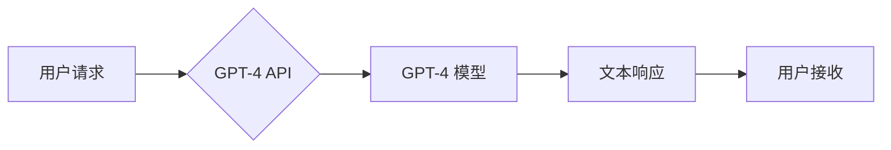

> GPT-4, API, 自然语言处理, 大语言模型, 应用程序开发, 创新应用

## 1. 背景介绍

近年来，人工智能（AI）技术取得了飞速发展，特别是大语言模型（LLM）的出现，为我们带来了前所未有的可能性。GPT-4，作为OpenAI最新推出的强大LLM，拥有更强大的文本生成、理解和推理能力，其应用场景已扩展到各个领域。

GPT-4 API（应用程序编程接口）的发布，为开发者提供了直接访问GPT-4模型的能力，使得其应用场景更加广泛。通过API，开发者可以将GPT-4集成到自己的应用程序中，从而构建出更智能、更具交互性的产品和服务。

## 2. 核心概念与联系

### 2.1 GPT-4 模型

GPT-4是一个基于Transformer架构的深度学习模型，拥有数十亿个参数。它通过学习海量文本数据，掌握了丰富的语言知识和模式，能够进行文本生成、翻译、摘要、问答等多种任务。

### 2.2 API 接口

API是一种软件接口，允许不同软件系统之间进行通信和数据交换。GPT-4 API提供了一系列接口，开发者可以通过这些接口向GPT-4发送文本请求，并接收其生成的文本响应。

### 2.3 应用场景

GPT-4 API的应用场景非常广泛，包括：

* **聊天机器人:** 开发更智能、更自然对话的聊天机器人。
* **内容创作:** 自动生成文章、故事、诗歌等文本内容。
* **代码生成:** 根据自然语言描述生成代码。
* **翻译:** 实现更准确、更流畅的文本翻译。
* **教育:** 提供个性化的学习辅导和智能答疑。

**GPT-4 API 架构流程图**



## 3. 核心算法原理 & 具体操作步骤

### 3.1 算法原理概述

GPT-4模型的核心算法是基于Transformer架构的深度学习模型。Transformer模型通过自注意力机制，能够捕捉文本序列中长距离依赖关系，从而实现更准确的文本理解和生成。

GPT-4模型通过训练大量的文本数据，学习了语言的语法、语义和上下文关系。当用户输入文本请求时，模型会根据其输入序列，预测下一个词，并以此类推，最终生成完整的文本响应。

### 3.2 算法步骤详解

1. **输入处理:** 将用户输入的文本转换为模型可理解的数字表示。
2. **编码:** 使用Transformer编码器将文本序列编码成隐藏状态向量，捕捉文本序列中的语义信息。
3. **解码:** 使用Transformer解码器根据编码后的隐藏状态向量，预测下一个词，并生成文本响应。
4. **输出处理:** 将模型生成的数字表示转换为文本格式，并返回给用户。

### 3.3 算法优缺点

**优点:**

* 强大的文本生成能力
* 能够理解和生成复杂文本结构
* 具备一定的推理和逻辑能力

**缺点:**

* 训练成本高
* 容易受到训练数据偏差的影响
* 缺乏对真实世界知识的理解

### 3.4 算法应用领域

GPT-4模型的应用领域非常广泛，包括：

* **自然语言处理:** 文本分类、情感分析、问答系统等。
* **机器翻译:** 实现更准确、更流畅的文本翻译。
* **代码生成:** 根据自然语言描述生成代码。
* **创意写作:** 自动生成故事、诗歌、剧本等创意内容。

## 4. 数学模型和公式 & 详细讲解 & 举例说明

### 4.1 数学模型构建

GPT-4模型的核心是Transformer架构，其数学模型主要基于以下几个关键组件：

* **自注意力机制:** 用于捕捉文本序列中词之间的依赖关系。
* **多头注意力:** 使用多个注意力头，可以捕捉不同层次的语义信息。
* **前馈神经网络:** 用于对隐藏状态向量进行非线性变换。

### 4.2 公式推导过程

自注意力机制的核心公式如下：

$$
Attention(Q, K, V) = softmax(\frac{QK^T}{\sqrt{d_k}})V
$$

其中：

* $Q$：查询矩阵
* $K$：键矩阵
* $V$：值矩阵
* $d_k$：键向量的维度
* $softmax$：softmax函数，用于归一化注意力权重

### 4.3 案例分析与讲解

假设我们有一个文本序列“我爱学习编程”，其词向量表示为：

$$
Q = \begin{bmatrix} q_1 & q_2 & q_3 & q_4 & q_5 \end{bmatrix}
$$

$$
K = \begin{bmatrix} k_1 & k_2 & k_3 & k_4 & k_5 \end{bmatrix}
$$

$$
V = \begin{bmatrix} v_1 & v_2 & v_3 & v_4 & v_5 \end{bmatrix}
$$

通过自注意力机制，我们可以计算出每个词对其他词的注意力权重，并根据这些权重对值向量进行加权求和，得到每个词的上下文表示。

## 5. 项目实践：代码实例和详细解释说明

### 5.1 开发环境搭建

* Python 3.7+
* OpenAI API 
* 库依赖：requests, json

### 5.2 源代码详细实现

```python
import requests
import json

# OpenAI API key
api_key = "YOUR_API_KEY"

# GPT-4 API endpoint
endpoint = "https://api.openai.com/v1/completions"

# 请求参数
params = {
    "model": "gpt-4",
    "prompt": "写一首关于春天的诗",
    "max_tokens": 100,
    "temperature": 0.7,
}

# 发送 API 请求
headers = {"Authorization": f"Bearer {api_key}"}
response = requests.post(endpoint, headers=headers, json=params)

# 处理响应结果
response_json = response.json()
generated_text = response_json["choices"][0]["text"]

# 打印生成结果
print(generated_text)
```

### 5.3 代码解读与分析

* 代码首先导入必要的库，并设置 OpenAI API key。
* 然后定义 GPT-4 API endpoint 和请求参数，包括模型名称、输入提示、最大生成长度和温度参数。
* 使用 requests 库发送 POST 请求到 API endpoint，并将请求参数作为 JSON 格式的数据发送。
* 处理 API 返回的 JSON 数据，提取生成文本。
* 最后打印生成文本。

### 5.4 运行结果展示

```
春风拂面暖如春，
花开满园香飘远。
小鸟歌唱枝头俏，
万物复苏生机新。
```

## 6. 实际应用场景

### 6.1 聊天机器人

GPT-4 API可以用于开发更智能、更自然对话的聊天机器人。例如，可以构建一个可以进行自然语言对话的客服机器人，帮助用户解决问题，提供信息。

### 6.2 内容创作

GPT-4 API可以用于自动生成各种文本内容，例如文章、故事、诗歌等。例如，可以利用 GPT-4 API自动生成新闻报道、产品描述、博客文章等。

### 6.3 代码生成

GPT-4 API可以根据自然语言描述生成代码。例如，可以利用 GPT-4 API根据用户描述生成 Python 代码、JavaScript 代码等。

### 6.4 未来应用展望

GPT-4 API的应用场景还在不断扩展，未来可能应用于：

* **个性化教育:** 提供个性化的学习辅导和智能答疑。
* **医疗诊断:** 辅助医生进行疾病诊断和治疗方案制定。
* **法律服务:** 帮助律师进行法律研究和文件撰写。

## 7. 工具和资源推荐

### 7.1 学习资源推荐

* **OpenAI 官方文档:** https://platform.openai.com/docs/api-reference
* **Hugging Face Transformers:** https://huggingface.co/docs/transformers/index

### 7.2 开发工具推荐

* **Python:** https://www.python.org/
* **VS Code:** https://code.visualstudio.com/

### 7.3 相关论文推荐

* **Attention Is All You Need:** https://arxiv.org/abs/1706.03762
* **Language Models are Few-Shot Learners:** https://arxiv.org/abs/2005.14165

## 8. 总结：未来发展趋势与挑战

### 8.1 研究成果总结

GPT-4模型的发布标志着大语言模型技术取得了新的突破，其强大的文本生成能力和理解能力为人工智能的应用带来了新的可能性。

### 8.2 未来发展趋势

未来，大语言模型技术将继续发展，朝着以下方向发展：

* **模型规模更大:** 模型参数量将继续增加，从而提升模型的性能。
* **多模态理解:** 模型将能够理解和生成多种模态数据，例如文本、图像、音频等。
* **更强的推理能力:** 模型将具备更强的逻辑推理和问题解决能力。

### 8.3 面临的挑战

大语言模型技术也面临着一些挑战，例如：

* **数据安全和隐私:** 大模型训练需要大量数据，如何保证数据安全和隐私是一个重要问题。
* **模型偏见:** 模型的训练数据可能存在偏见，导致模型输出结果存在偏差。
* **可解释性:** 大模型的决策过程难以理解，如何提高模型的可解释性是一个重要挑战。

### 8.4 研究展望

未来，我们需要继续研究大语言模型的原理和应用，解决其面临的挑战，并将其应用于更多领域，为人类社会带来更多福祉。

## 9. 附录：常见问题与解答

* **如何获取 OpenAI API key?**

  您可以访问 OpenAI 官网，注册账号并申请 API key。

* **GPT-4 API 的收费标准是什么?**

  GPT-4 API 的收费标准根据使用量而定，您可以参考 OpenAI 官网的收费政策。

* **GPT-4 API 是否支持中文?**

  GPT-4 模型支持多种语言，包括中文。

* **如何解决 GPT-4 API 生成的文本存在错误或偏差的问题?**

  您可以通过调整模型参数、提供更精细的提示文本、使用数据增强等方法来解决这个问题。


作者：禅与计算机程序设计艺术 / Zen and the Art of Computer Programming 
<end_of_turn>