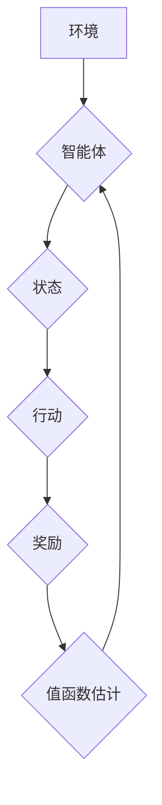

> 值函数估计，强化学习，蒙特卡罗方法，时间差分学习，深度强化学习，价值函数

## 1. 背景介绍

强化学习 (Reinforcement Learning, RL) 作为机器学习的一个重要分支，旨在训练智能体在与环境交互的过程中学习最优策略，以最大化累积奖励。在强化学习算法中，值函数扮演着至关重要的角色。值函数估计是指通过学习和预测智能体在特定状态下或采取特定策略时的未来累积奖励的过程。

值函数估计是强化学习的核心技术之一，它为智能体提供决策依据，帮助其选择最优行动。值函数估计的准确性直接影响着强化学习算法的性能。

## 2. 核心概念与联系

**2.1 强化学习基本概念**

* **智能体 (Agent):** 与环境交互并做出决策的实体。
* **环境 (Environment):** 智能体所处的外部世界，它会根据智能体的行动产生新的状态和奖励。
* **状态 (State):** 环境的当前描述，例如游戏中的棋盘状态或机器人的位置。
* **行动 (Action):** 智能体在特定状态下可以采取的可选动作。
* **奖励 (Reward):** 环境对智能体行动的反馈，通常是一个标量值，表示智能体行为的好坏。
* **策略 (Policy):** 智能体在不同状态下选择行动的规则。

**2.2 值函数概念**

* **状态值函数 (State-Value Function):**  表示智能体在特定状态下采取最优策略的预期累积奖励。
* **动作值函数 (Action-Value Function):** 表示智能体在特定状态下采取特定动作的预期累积奖励。

**2.3 值函数估计方法**

* **蒙特卡罗方法 (Monte Carlo Methods):** 基于对完整轨迹的奖励总和进行估计。
* **时间差分学习 (Temporal Difference Learning):** 基于对当前状态的奖励预测和未来状态的价值估计进行迭代更新。

**2.4 Mermaid 流程图**



## 3. 核心算法原理 & 具体操作步骤

### 3.1 算法原理概述

值函数估计的核心思想是通过学习和预测智能体在特定状态下或采取特定策略时的未来累积奖励。

* **蒙特卡罗方法:** 
    * 收集完整的轨迹数据，即从初始状态到终止状态的所有状态、行动和奖励。
    * 计算每个状态的平均奖励，作为该状态的值函数估计。
* **时间差分学习:**
    * 利用当前状态的奖励和未来状态的价值估计进行迭代更新。
    * 通过不断更新值函数估计，逼近最优值函数。

### 3.2 算法步骤详解

**3.2.1 蒙特卡罗方法**

1. 初始化值函数估计为零。
2. 收集完整的轨迹数据。
3. 对于每个状态，计算其平均奖励作为该状态的值函数估计。
4. 更新值函数估计。

**3.2.2 时间差分学习**

1. 初始化值函数估计为零。
2. 在环境中进行交互，收集状态、行动和奖励数据。
3. 利用当前状态的奖励和未来状态的价值估计进行迭代更新。
4. 重复步骤3，直到值函数估计收敛。

### 3.3 算法优缺点

**3.3.1 蒙特卡罗方法**

* **优点:** 
    * 理论上可以收敛到最优值函数。
    * 算法简单易懂。
* **缺点:** 
    * 需要收集完整的轨迹数据，效率较低。
    * 对稀疏奖励场景不适用。

**3.3.2 时间差分学习**

* **优点:** 
    * 不需要收集完整的轨迹数据，可以在线学习。
    * 对稀疏奖励场景适用。
* **缺点:** 
    * 可能出现震荡和不稳定性。
    * 需要选择合适的学习率和更新策略。

### 3.4 算法应用领域

值函数估计在强化学习领域有着广泛的应用，例如：

* **游戏 AI:** 训练游戏 AI 策略，例如 AlphaGo 和 AlphaZero。
* **机器人控制:** 训练机器人控制策略，例如自主导航和抓取。
* **推荐系统:** 训练推荐系统策略，例如个性化推荐和内容过滤。
* **医疗保健:** 训练医疗诊断和治疗策略。

## 4. 数学模型和公式 & 详细讲解 & 举例说明

### 4.1 数学模型构建

**4.1.1 状态值函数**

状态值函数 $V^\pi(s)$ 表示智能体在状态 $s$ 下，采取策略 $\pi$ 的预期累积奖励。

$$V^\pi(s) = E_{\pi}[R_{t+1} + \gamma R_{t+2} + \gamma^2 R_{t+3} + ... | S_t = s]$$

其中:

* $R_t$ 是在时间步 $t$ 的奖励。
* $\gamma$ 是折扣因子，控制未来奖励的权重。

**4.1.2 动作值函数**

动作值函数 $Q^\pi(s,a)$ 表示智能体在状态 $s$ 下采取动作 $a$ 后，采取策略 $\pi$ 的预期累积奖励。

$$Q^\pi(s,a) = E_{\pi}[R_{t+1} + \gamma R_{t+2} + \gamma^2 R_{t+3} + ... | S_t = s, A_t = a]$$

### 4.2 公式推导过程

**4.2.1 时间差分学习公式**

时间差分学习利用当前状态的奖励和未来状态的价值估计进行迭代更新。

$$Q(s,a) \leftarrow Q(s,a) + \alpha [R_{t+1} + \gamma \max_{a'} Q(s',a') - Q(s,a)]$$

其中:

* $\alpha$ 是学习率。
* $s'$ 是状态 $s$ 下采取动作 $a$ 后到达的状态。

### 4.3 案例分析与讲解

**4.3.1 简单的迷宫问题**

假设有一个简单的迷宫问题，智能体需要找到迷宫出口。我们可以使用值函数估计来训练智能体找到最优路径。

* 状态空间：迷宫中的每个格子。
* 动作空间：向上、向下、向左、向右四个方向。
* 奖励：到达出口时获得最大奖励，其他情况下获得较小的奖励。

我们可以使用蒙特卡罗方法或时间差分学习来估计值函数，并根据值函数估计选择最优行动。

## 5. 项目实践：代码实例和详细解释说明

### 5.1 开发环境搭建

* Python 3.x
* TensorFlow 或 PyTorch

### 5.2 源代码详细实现

```python
import numpy as np

# 定义环境
class Environment:
    def __init__(self):
        # ...

    def step(self, action):
        # ...

# 定义值函数估计器
class ValueEstimator:
    def __init__(self, learning_rate=0.1):
        self.learning_rate = learning_rate
        # ...

    def update(self, state, reward, next_state):
        # ...

# 主程序
if __name__ == "__main__":
    env = Environment()
    value_estimator = ValueEstimator()
    # ...
```

### 5.3 代码解读与分析

* **环境类:** 定义了环境的规则和状态转移函数。
* **值函数估计器类:** 实现值函数估计算法，例如蒙特卡罗方法或时间差分学习。
* **主程序:** 创建环境和值函数估计器，并进行强化学习训练。

### 5.4 运行结果展示

* 通过训练，值函数估计器会学习到每个状态的价值，并帮助智能体选择最优行动。
* 可以通过观察智能体的行为和奖励变化来评估训练效果。

## 6. 实际应用场景

### 6.1 游戏 AI

* 训练游戏 AI 策略，例如 AlphaGo 和 AlphaZero。
* 提高游戏 AI 的策略性和适应性。

### 6.2 机器人控制

* 训练机器人控制策略，例如自主导航和抓取。
* 提高机器人的效率和安全性。

### 6.3 推荐系统

* 训练推荐系统策略，例如个性化推荐和内容过滤。
* 提高推荐系统的准确性和用户体验。

### 6.4 未来应用展望

* **深度强化学习:** 将深度神经网络与强化学习结合，训练更强大的智能体。
* **多智能体强化学习:** 研究多个智能体在同一环境中交互和合作的强化学习算法。
* **迁移学习:** 将已训练好的强化学习模型迁移到新的任务或环境中。

## 7. 工具和资源推荐

### 7.1 学习资源推荐

* **书籍:**
    * Reinforcement Learning: An Introduction by Richard S. Sutton and Andrew G. Barto
    * Deep Reinforcement Learning Hands-On by Maxim Lapan
* **在线课程:**
    * Coursera: Reinforcement Learning Specialization
    * Udacity: Deep Reinforcement Learning Nanodegree

### 7.2 开发工具推荐

* **TensorFlow:** 开源深度学习框架，支持强化学习算法的实现。
* **PyTorch:** 开源深度学习框架，支持强化学习算法的实现。
* **OpenAI Gym:** 强化学习环境库，提供各种标准的强化学习任务。

### 7.3 相关论文推荐

* **Deep Q-Network (DQN):** Mnih et al., 2015
* **Proximal Policy Optimization (PPO):** Schulman et al., 2017
* **Trust Region Policy Optimization (TRPO):** Schulman et al., 2015

## 8. 总结：未来发展趋势与挑战

### 8.1 研究成果总结

值函数估计是强化学习的核心技术之一，近年来取得了显著进展。深度强化学习的出现，使得强化学习能够解决更复杂的任务，例如游戏 AI 和机器人控制。

### 8.2 未来发展趋势

* **更强大的深度强化学习算法:** 探索更有效的深度强化学习算法，例如基于模型的强化学习和强化学习与进化算法的结合。
* **更广泛的应用场景:** 将强化学习应用到更多领域，例如医疗保健、金融和自动驾驶。
* **更安全的强化学习系统:** 研究强化学习系统的安全性问题，例如避免智能体出现不可预知的行为。

### 8.3 面临的挑战

* **样本效率:** 强化学习算法通常需要大量的样本数据进行训练，这在现实世界中可能难以实现。
* **可解释性:** 强化学习模型的决策过程往往难以解释，这可能会阻碍其在安全关键领域中的应用。
* **伦理问题:** 强化学习算法可能会产生不可预知的行为，需要考虑其潜在的伦理问题。

### 8.4 研究展望

未来，值函数估计将在强化学习领域继续发挥重要作用，并推动人工智能技术的发展。


## 9. 附录：常见问题与解答

**9.1 什么是值函数？**

值函数是强化学习中用来评估状态或状态-动作对价值的函数。

**9.2 蒙特卡罗方法和时间差分学习有什么区别？**

蒙特卡罗方法需要收集完整的轨迹数据，而时间差分学习可以在线学习，不需要完整的轨迹数据。

**9.3 如何选择合适的学习率？**

学习率过大可能会导致训练不稳定，学习率过小可能会导致训练速度过慢。需要根据具体问题和算法进行调整