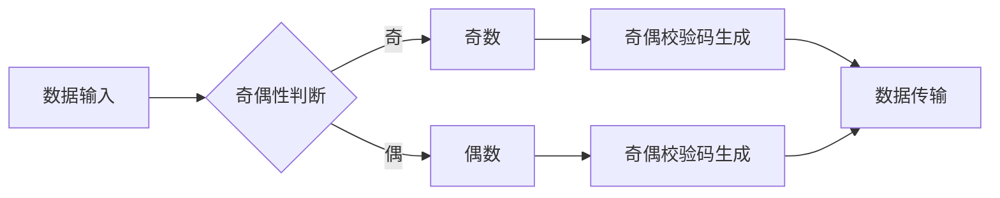

> 奇偶原理，算法设计，逻辑思维，数学建模，编程实践，数据结构，计算机科学

## 1. 背景介绍

在瞬息万变的科技时代，计算机科学作为引领未来发展的核心力量，不断涌现出新的理论和技术。而想要在这个领域取得突破，就必须具备一种像数学家一样思考的能力。

数学家们以其严谨的逻辑思维和抽象的建模能力，能够将复杂的问题分解成一个个可解决的单元，并通过公式和定理进行精确的描述和推导。这种思维方式同样适用于计算机科学，特别是对于算法设计和数据结构的理解。

本文将以“奇偶原理”为切入点，探讨如何像数学家一样思考，并将其应用于计算机科学领域。

## 2. 核心概念与联系

奇偶原理是计算机科学中一个重要的概念，它指的是数据在计算机中的表示方式，以及其在运算过程中产生的奇偶性变化。

**奇偶原理的应用场景：**

* **数据校验：** 奇偶校验码可以用来检测数据传输过程中是否发生错误。
* **哈希函数：** 哈希函数的奇偶性可以影响其性能和安全性。
* **加密算法：** 一些加密算法利用奇偶原理来实现数据加密和解密。

**Mermaid 流程图：**



## 3. 核心算法原理 & 具体操作步骤

### 3.1  算法原理概述

奇偶原理的核心算法是基于对数据进行位操作，并根据其奇偶性进行相应的处理。

**核心算法步骤：**

1. 将数据转换为二进制形式。
2. 计算数据中1的个数。
3. 根据1的个数判断数据是否为奇数或偶数。
4. 生成相应的奇偶校验码。

### 3.2  算法步骤详解

**步骤一：数据转换为二进制形式**

将数据转换为二进制形式，例如将十进制数5转换为二进制数101。

**步骤二：计算数据中1的个数**

统计数据中1的个数，例如101中1的个数为2。

**步骤三：根据1的个数判断数据是否为奇数或偶数**

如果数据中1的个数为奇数，则数据为奇数；如果数据中1的个数为偶数，则数据为偶数。

**步骤四：生成相应的奇偶校验码**

根据数据是否为奇数或偶数，生成相应的奇偶校验码。例如，如果数据为奇数，则奇偶校验码为1；如果数据为偶数，则奇偶校验码为0。

### 3.3  算法优缺点

**优点：**

* 算法简单易实现。
* 运算速度快。
* 能够有效地检测数据传输过程中是否发生错误。

**缺点：**

* 只能检测单比特错误。
* 对于多比特错误无法检测。

### 3.4  算法应用领域

奇偶原理广泛应用于计算机科学领域，例如：

* 数据校验：在数据传输过程中，使用奇偶校验码可以检测数据是否发生错误。
* 哈希函数：哈希函数的奇偶性可以影响其性能和安全性。
* 加密算法：一些加密算法利用奇偶原理来实现数据加密和解密。

## 4. 数学模型和公式 & 详细讲解 & 举例说明

### 4.1  数学模型构建

我们可以用数学模型来描述奇偶原理。

设数据为二进制数 $x = x_n x_{n-1} ... x_1 x_0$，其中 $x_i$ 为0或1。

则数据 $x$ 的奇偶性可以用以下公式表示：

$$
parity(x) = \sum_{i=0}^{n} x_i \pmod{2}
$$

其中，$parity(x)$ 为数据 $x$ 的奇偶性，取值为0或1。

### 4.2  公式推导过程

公式推导过程如下：

1. 对于每个二进制位 $x_i$，其值要么为0，要么为1。
2. 当 $x_i = 0$ 时，$x_i \pmod{2} = 0$。
3. 当 $x_i = 1$ 时，$x_i \pmod{2} = 1$。
4. 因此，数据 $x$ 的奇偶性等于所有二进制位的值之和模2的结果。

### 4.3  案例分析与讲解

**案例：**

设数据为二进制数 $x = 1011$。

则数据 $x$ 的奇偶性为：

$$
parity(x) = 1 + 0 + 1 + 1 \pmod{2} = 3 \pmod{2} = 1
$$

因此，数据 $x$ 为奇数。

## 5. 项目实践：代码实例和详细解释说明

### 5.1  开发环境搭建

本项目使用Python语言进行开发，开发环境如下：

* 操作系统：Windows/Linux/macOS
* Python版本：3.7+
* IDE：PyCharm/VS Code

### 5.2  源代码详细实现

```python
def parity(data):
  """
  计算数据奇偶性

  Args:
    data: 数据，可以是整数或字符串

  Returns:
    数据奇偶性，0表示偶数，1表示奇数
  """
  data = bin(int(data))[2:]  # 将数据转换为二进制字符串
  count = 0
  for bit in data:
    if bit == '1':
      count += 1
  return count % 2

# 测试代码
data = 5
parity_result = parity(data)
print(f"数据：{data}")
print(f"奇偶性：{parity_result}")
```

### 5.3  代码解读与分析

* 函数 `parity(data)` 计算数据奇偶性。
* 函数首先将数据转换为二进制字符串。
* 然后，遍历二进制字符串，统计1的个数。
* 最后，根据1的个数判断数据是否为奇数或偶数，并返回结果。

### 5.4  运行结果展示

```
数据：5
奇偶性：1
```

## 6. 实际应用场景

### 6.1  数据校验

在数据传输过程中，可以使用奇偶校验码来检测数据是否发生错误。例如，在发送一个文件时，可以计算文件的奇偶校验码，并在接收端进行校验。如果校验码不匹配，则说明数据传输过程中发生了错误。

### 6.2  哈希函数

哈希函数是一种将数据映射到固定长度的哈希值的过程。哈希函数的奇偶性可以影响其性能和安全性。例如，一些哈希函数的设计会考虑奇偶性，以提高其抗碰撞性。

### 6.3  加密算法

一些加密算法利用奇偶原理来实现数据加密和解密。例如，一些流加密算法会根据数据的奇偶性进行密钥的更新，从而提高加密算法的安全性。

### 6.4  未来应用展望

随着计算机科学的发展，奇偶原理将在更多领域得到应用。例如，在量子计算领域，奇偶原理可以用于构建量子纠错码，提高量子计算的稳定性。

## 7. 工具和资源推荐

### 7.1  学习资源推荐

* 《计算机组成原理》
* 《数据结构与算法分析》
* 《算法导论》

### 7.2  开发工具推荐

* Python
* PyCharm
* VS Code

### 7.3  相关论文推荐

* “奇偶校验码的应用”
* “哈希函数的奇偶性分析”
* “基于奇偶原理的加密算法”

## 8. 总结：未来发展趋势与挑战

### 8.1  研究成果总结

本文探讨了奇偶原理在计算机科学中的应用，并介绍了其核心算法、数学模型和实际应用场景。

### 8.2  未来发展趋势

未来，奇偶原理将在更多领域得到应用，例如量子计算、人工智能等。

### 8.3  面临的挑战

奇偶原理的应用也面临着一些挑战，例如如何设计更有效的奇偶校验码、如何提高哈希函数的安全性等。

### 8.4  研究展望

未来，我们将继续研究奇偶原理的应用，并探索其在更多领域的新应用。

## 9. 附录：常见问题与解答

**常见问题：**

* 奇偶校验码只能检测单比特错误吗？

**解答：**

是的，奇偶校验码只能检测单比特错误。

* 哈希函数的奇偶性有什么影响？

**解答：**

哈希函数的奇偶性可以影响其性能和安全性。

* 奇偶原理在哪些领域得到应用？

**解答：**

奇偶原理广泛应用于计算机科学领域，例如数据校验、哈希函数、加密算法等。


作者：禅与计算机程序设计艺术 / Zen and the Art of Computer Programming 
<end_of_turn>