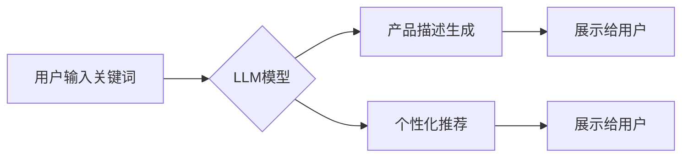

> AI LLM,电商,自然语言处理,文本生成,产品描述,用户体验,个性化推荐

## 1. 背景介绍

电商平台作为现代商业的重要组成部分，其核心竞争力之一在于提供丰富、精准的产品信息。传统的静态产品描述往往难以满足用户多样化的需求，无法充分展现产品的价值和特点。近年来，随着人工智能（AI）技术的快速发展，特别是大型语言模型（LLM）的涌现，为电商平台的产品描述带来了革命性的变革。

LLM 是一种能够理解和生成人类语言的强大AI模型，它拥有海量文本数据训练，具备强大的文本生成、理解和分析能力。将 LLM 应用于电商平台，可以实现从关键词到富有洞见的描述的转变，为用户提供更精准、更个性化的购物体验。

## 2. 核心概念与联系

### 2.1  LLM 的核心概念

LLM 是指通过深度学习技术训练，能够理解和生成人类语言的强大人工智能模型。其核心特点包括：

* **规模庞大:** LLM 通常拥有数十亿甚至数千亿个参数，训练数据量也十分庞大。
* **文本理解能力强:** LLM 可以理解复杂的句子结构、语义关系和上下文信息。
* **文本生成能力强:** LLM 可以生成流畅、自然的文本，包括文章、故事、对话等。

### 2.2  电商平台与LLM的联系

电商平台需要提供丰富、精准的产品信息，而 LLM 可以帮助电商平台实现以下目标：

* **自动生成产品描述:** LLM 可以根据产品的特征、属性和用户评论自动生成高质量的产品描述，节省人工成本，提高效率。
* **个性化产品推荐:** LLM 可以根据用户的浏览历史、购买记录和兴趣偏好，生成个性化的产品推荐，提升用户体验和转化率。
* **智能客服:** LLM 可以用于构建智能客服系统，自动回答用户常见问题，提高客户服务效率。

### 2.3  LLM 应用架构



## 3. 核心算法原理 & 具体操作步骤

### 3.1  算法原理概述

LLM 的核心算法是基于 Transformer 架构的深度神经网络。Transformer 模型通过自注意力机制，能够捕捉文本序列中长距离依赖关系，从而实现更精准的文本理解和生成。

### 3.2  算法步骤详解

1. **文本预处理:** 将输入文本进行清洗、分词、词向量化等预处理操作，以便模型能够理解文本内容。
2. **编码阶段:** 将预处理后的文本输入 Transformer 模型的编码器，编码器会将文本序列转换为一系列隐藏状态向量，这些向量包含了文本的语义信息。
3. **解码阶段:** 将编码器输出的隐藏状态向量输入 Transformer 模型的解码器，解码器会根据隐藏状态向量生成目标文本序列。
4. **输出结果:** 将生成的文本序列进行后处理，例如去除非法字符、格式化输出等，最终输出给用户。

### 3.3  算法优缺点

**优点:**

* 能够理解和生成流畅自然的文本。
* 能够捕捉文本序列中的长距离依赖关系。
* 训练数据量大，泛化能力强。

**缺点:**

* 训练成本高，需要大量的计算资源和数据。
* 模型参数量大，部署成本高。
* 容易受到训练数据偏差的影响，可能生成不准确或有偏见的文本。

### 3.4  算法应用领域

LLM 的应用领域非常广泛，包括：

* 自然语言处理：文本分类、情感分析、机器翻译等。
* 人机交互：聊天机器人、语音助手等。
* 内容创作：文章写作、故事生成等。
* 代码生成：自动生成代码片段。

## 4. 数学模型和公式 & 详细讲解 & 举例说明

### 4.1  数学模型构建

LLM 的数学模型主要基于 Transformer 架构，其核心是自注意力机制和多头注意力机制。

**自注意力机制:**

自注意力机制能够计算每个词在句子中与其他词之间的相关性，从而捕捉文本序列中的长距离依赖关系。其计算公式如下：

$$
Attention(Q, K, V) = softmax(\frac{QK^T}{\sqrt{d_k}})V
$$

其中：

* $Q$：查询矩阵
* $K$：键矩阵
* $V$：值矩阵
* $d_k$：键向量的维度
* $softmax$：softmax 函数

**多头注意力机制:**

多头注意力机制是将多个自注意力机制并行执行，并对结果进行融合，从而提高模型的表达能力。其计算公式如下：

$$
MultiHead(Q, K, V) = Concat(head_1, head_2, ..., head_h)W_o
$$

其中：

* $head_i$：第 $i$ 个自注意力头的输出
* $h$：注意力头的数量
* $W_o$：最终融合层的权重矩阵

### 4.2  公式推导过程

自注意力机制的公式推导过程可以参考 Transformer 原文论文。

### 4.3  案例分析与讲解

假设我们有一个句子 "The cat sat on the mat"，使用自注意力机制计算每个词与其他词之间的相关性，可以发现 "cat" 与 "sat" 之间存在强相关性，因为它们描述了同一件事。

## 5. 项目实践：代码实例和详细解释说明

### 5.1  开发环境搭建

* Python 3.7+
* PyTorch 或 TensorFlow
* CUDA 和 cuDNN

### 5.2  源代码详细实现

```python
import torch
import torch.nn as nn

class Attention(nn.Module):
    def __init__(self, d_model, num_heads):
        super(Attention, self).__init__()
        self.d_model = d_model
        self.num_heads = num_heads
        self.head_dim = d_model // num_heads

        self.query = nn.Linear(d_model, d_model)
        self.key = nn.Linear(d_model, d_model)
        self.value = nn.Linear(d_model, d_model)
        self.fc_out = nn.Linear(d_model, d_model)

    def forward(self, query, key, value, mask=None):
        batch_size = query.size(0)

        # Linear projections
        Q = self.query(query).view(batch_size, -1, self.num_heads, self.head_dim).transpose(1, 2)
        K = self.key(key).view(batch_size, -1, self.num_heads, self.head_dim).transpose(1, 2)
        V = self.value(value).view(batch_size, -1, self.num_heads, self.head_dim).transpose(1, 2)

        # Scaled dot-product attention
        scores = torch.matmul(Q, K.transpose(-2, -1)) / torch.sqrt(torch.tensor(self.head_dim, dtype=torch.float))

        if mask is not None:
            scores = scores.masked_fill(mask == 0, -1e9)

        attention_weights = torch.softmax(scores, dim=-1)

        # Weighted sum of values
        context = torch.matmul(attention_weights, V)

        # Concatenate heads and project
        context = context.transpose(1, 2).contiguous().view(batch_size, -1, self.d_model)
        output = self.fc_out(context)

        return output, attention_weights
```

### 5.3  代码解读与分析

这段代码实现了自注意力机制，其中：

* `Attention` 类定义了自注意力机制的结构。
* `forward` 方法计算了自注意力机制的输出和注意力权重。
* `query`, `key`, `value` 分别表示查询矩阵、键矩阵和值矩阵。
* `mask` 用于屏蔽无效的注意力计算。

### 5.4  运行结果展示

运行上述代码可以得到自注意力机制的输出和注意力权重，可以观察到注意力权重如何集中在与当前词语相关联的词语上。

## 6. 实际应用场景

### 6.1  电商产品描述生成

LLM 可以根据产品的特征、属性和用户评论自动生成高质量的产品描述，例如：

* **智能生成产品标题:** 根据产品的名称、功能和卖点，自动生成吸引用户的标题。
* **描述产品功能和特点:** 根据产品的技术参数和用户评价，自动生成详细的产品功能和特点描述。
* **撰写产品故事:** 根据产品的背景故事和品牌理念，自动撰写感人或有趣的产品故事。

### 6.2  个性化产品推荐

LLM 可以根据用户的浏览历史、购买记录和兴趣偏好，生成个性化的产品推荐，例如：

* **基于用户的兴趣推荐:** 根据用户的浏览历史和购买记录，推荐与用户兴趣相关的产品。
* **基于用户的行为推荐:** 根据用户的浏览行为和购买行为，推荐用户可能感兴趣的产品。
* **基于用户的偏好推荐:** 根据用户的评价和反馈，推荐用户喜欢的产品类型。

### 6.3  智能客服

LLM 可以用于构建智能客服系统，自动回答用户常见问题，例如：

* **产品信息查询:** 回答用户关于产品价格、规格、功能等方面的疑问。
* **订单状态查询:** 查询用户的订单状态和物流信息。
* **退换货流程:** 指导用户进行退换货操作。

### 6.4  未来应用展望

LLM 在电商领域的应用前景广阔，未来可能应用于：

* **更精准的产品搜索:** 理解用户的搜索意图，提供更精准的产品搜索结果。
* **更个性化的购物体验:** 根据用户的喜好和需求，提供更个性化的产品推荐和购物体验。
* **更智能的营销活动:** 利用 LLMs 生成更精准、更个性化的营销文案和广告。

## 7. 工具和资源推荐

### 7.1  学习资源推荐

* **论文:**
    * Vaswani, A., Shazeer, N., Parmar, N., Uszkoreit, J., Jones, L., Gomez, A. N., ... & Polosukhin, I. (2017). Attention is all you need. In Advances in neural information processing systems (pp. 5998-6008).
* **博客:**
    * https://huggingface.co/blog/
    * https://www.tensorflow.org/blog

### 7.2  开发工具推荐

* **PyTorch:** https://pytorch.org/
* **TensorFlow:** https://www.tensorflow.org/
* **HuggingFace Transformers:** https://huggingface.co/transformers/

### 7.3  相关论文推荐

* **BERT:** Devlin, J., Chang, M. W., Lee, K., & Toutanova, K. (2018). BERT: Pre-training of deep bidirectional transformers for language understanding. arXiv preprint arXiv:1810.04805.
* **GPT-3:** Brown, T. B., Mann, B., Ryder, N., Subbiah, M., Kaplan, J., Dhariwal, P., ... & Amodei, D. (2020). Language models are few-shot learners. arXiv preprint arXiv:2005.14165.

## 8. 总结：未来发展趋势与挑战

### 8.1  研究成果总结

LLM 在电商领域的应用取得了显著成果，例如：

* 自动生成高质量的产品描述，提高用户体验。
* 提供个性化的产品推荐，提升转化率。
* 构建智能客服系统，提高客户服务效率。

### 8.2  未来发展趋势

LLM 在电商领域的未来发展趋势包括：

* **更强大的模型:** 训练更大规模、更强大的 LLMs，提升模型的理解和生成能力。
* **更精准的应用:** 将 LLMs 应用于更细粒度的电商场景，例如产品分类、价格预测等。
* **更个性化的体验:** 利用 LLMs 提供更个性化的购物体验，例如个性化推荐、个性化客服等。

### 8.3  面临的挑战

LLM 在电商领域的应用也面临一些挑战，例如：

* **数据安全和隐私:** LLMs 需要大量的数据进行训练，如何保证数据安全和用户隐私是一个重要问题。
* **模型可解释性:** LLMs 的决策过程往往难以理解，如何提高模型的可解释性是一个重要的研究方向。
* **伦理问题:** LLMs 可能被用于生成虚假信息或进行恶意攻击，如何解决 LLMs 的伦理问题是一个需要认真思考的问题。

### 8.4  研究展望

未来，LLM 在电商领域的应用将更加广泛和深入，需要进一步研究以下问题：

* 如何训练更安全、更可靠的 LLMs。
* 如何提高 LLMs 的可解释性和透明度。
* 如何解决 LLMs 的伦理问题。


## 9. 附录：常见问题与解答

**Q1: LLMs 的训练成本很高吗？**

A1: 确实，LLMs 的训练成本很高，需要大量的计算资源和数据。

**Q2: LLMs 是否会生成虚假信息？**

A2: LLMs 可能会生成虚假信息，因为它们是根据训练数据学习的，如果训练数据中存在错误或偏差，LLMs 就可能生成错误或有偏见的文本。

**Q3: 如何保证 LLMs 的安全性？**

A3: 为了保证 LLMs 的安全性，需要采取多种措施，例如：

* 使用高质量的训练数据。
* 对模型进行安全评估和测试。
* 开发安全机制，防止模型被恶意利用。

**Q4: LLMs 是否会取代人类工作？**

A4: LLMs 可以自动化一些工作，但它们并不会完全取代人类工作。人类仍然需要发挥创造力、批判性思维和情感智能等方面的优势。


作者：禅与计算机程序设计艺术 / Zen and the Art of Computer Programming 
<end_of_turn>