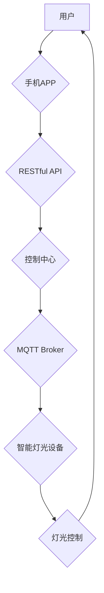

> 智能家居, Java, 灯光控制, 网络通信, 物联网, MQTT, RESTful API

## 1. 背景介绍

智能家居正以惊人的速度发展，它将我们的生活变得更加便捷、舒适和安全。智能灯光控制作为智能家居的核心应用之一，能够根据用户的需求和环境自动调节灯光亮度和颜色，为用户提供更加个性化的体验。

传统的灯光控制方式通常依赖于物理开关，操作不便，缺乏灵活性。而基于Java的智能灯光控制系统，则可以利用网络通信技术和物联网平台，实现远程控制、定时开关、场景联动等功能，为用户带来更加智能化的灯光体验。

## 2. 核心概念与联系

### 2.1 智能家居系统架构

智能家居系统通常由以下几个核心组件组成：

* **传感器:** 用于感知环境信息，例如光线强度、温度、湿度等。
* **执行器:** 用于控制智能设备，例如灯光、窗帘、空调等。
* **控制中心:** 用于处理传感器数据，执行用户指令，并协调各个设备之间的协作。
* **用户界面:** 用于用户与智能家居系统进行交互，例如手机APP、语音助手等。

### 2.2  MQTT协议

MQTT（Message Queuing Telemetry Transport）是一种轻量级的消息传输协议，特别适用于物联网场景。它采用发布/订阅模式，使得设备之间可以进行高效、可靠的通信。

### 2.3 RESTful API

RESTful API（Representational State Transfer Application Programming Interface）是一种基于HTTP协议的软件架构风格，用于构建Web服务。它采用资源和操作的模式，使得不同系统之间可以进行数据交换和功能调用。

### 2.4  Java语言

Java是一种面向对象、跨平台的编程语言，具有良好的可移植性和安全性。它广泛应用于企业级应用、Web开发、移动开发等领域。

**核心架构流程图**



## 3. 核心算法原理 & 具体操作步骤

### 3.1  算法原理概述

智能灯光控制系统通常采用以下算法原理：

* **场景模式:** 用户可以预先定义不同的灯光场景，例如“阅读模式”、“聚会模式”等，并通过手机APP或语音助手一键切换。
* **定时控制:** 用户可以设置灯光在特定时间段自动开关，例如每天晚上8点自动关闭灯光。
* **环境感知:** 系统可以利用传感器数据，例如光线强度、人体检测等，自动调节灯光亮度和颜色。

### 3.2  算法步骤详解

**场景模式控制算法:**

1. 用户通过手机APP或语音助手选择一个场景模式。
2. 控制中心接收用户指令，并根据场景模式的定义，发送相应的控制指令到智能灯光设备。
3. 智能灯光设备根据控制指令，调整灯光亮度、颜色和闪烁模式。

**定时控制算法:**

1. 用户通过手机APP设置灯光定时开关的时间。
2. 控制中心将定时任务添加到任务队列中。
3. 系统定时器根据任务队列中的时间信息，发送控制指令到智能灯光设备。
4. 智能灯光设备根据控制指令，在指定时间自动开关。

**环境感知控制算法:**

1. 传感器收集环境信息，例如光线强度、人体检测等。
2. 控制中心接收传感器数据，并根据预设规则，计算出合适的灯光亮度和颜色。
3. 控制中心发送控制指令到智能灯光设备。
4. 智能灯光设备根据控制指令，调整灯光亮度和颜色。

### 3.3  算法优缺点

**优点:**

* **智能化:** 可以根据用户需求和环境自动调节灯光，提供更加个性化的体验。
* **便捷性:** 用户可以通过手机APP或语音助手远程控制灯光，更加方便快捷。
* **安全性:** 系统可以利用传感器数据，例如人体检测，实现灯光安全控制。

**缺点:**

* **成本:** 智能灯光设备和控制中心等硬件成本相对较高。
* **复杂性:** 系统架构复杂，需要专业的技术人员进行开发和维护。
* **网络依赖:** 系统需要依赖网络通信，网络故障可能会影响灯光控制功能。

### 3.4  算法应用领域

智能灯光控制算法广泛应用于以下领域:

* **家庭:** 智能家居系统，提供更加舒适、便捷的灯光体验。
* **商业:** 商场、酒店、办公楼等场所，实现灯光节能、场景控制等功能。
* **工业:** 工厂、仓库等场所，实现灯光安全控制、环境监测等功能。

## 4. 数学模型和公式 & 详细讲解 & 举例说明

### 4.1  数学模型构建

智能灯光控制系统中，可以利用数学模型来描述灯光亮度、颜色和场景模式之间的关系。例如，我们可以使用RGB模型来描述灯光颜色，其中R、G、B分别代表红色、绿色和蓝色分量。

**RGB模型:**

$$
R = r_1 \cdot I_1 + r_2 \cdot I_2 + ... + r_n \cdot I_n
$$

$$
G = g_1 \cdot I_1 + g_2 \cdot I_2 + ... + g_n \cdot I_n
$$

$$
B = b_1 \cdot I_1 + b_2 \cdot I_2 + ... + b_n \cdot I_n
$$

其中：

* $R$, $G$, $B$ 分别代表红色、绿色和蓝色分量。
* $r_i$, $g_i$, $b_i$ 分别代表每个光源的红色、绿色和蓝色分量。
* $I_i$ 代表每个光源的亮度。

### 4.2  公式推导过程

我们可以根据用户需求和环境信息，调整每个光源的亮度，从而实现灯光亮度和颜色的控制。例如，如果用户需要调暗灯光，我们可以将每个光源的亮度减小。

### 4.3  案例分析与讲解

假设我们有一个智能灯光系统，包含三个RGB灯泡。用户希望将灯光调成红色，亮度为50%。我们可以根据RGB模型和公式，计算出每个灯泡的亮度和颜色分量。

* 红色灯泡：亮度为50%，颜色分量为(1, 0, 0)。
* 绿色灯泡：亮度为0%，颜色分量为(0, 1, 0)。
* 蓝色灯泡：亮度为0%，颜色分量为(0, 0, 1)。

## 5. 项目实践：代码实例和详细解释说明

### 5.1  开发环境搭建

* **操作系统:** Windows/Linux/macOS
* **JDK:** Java Development Kit 1.8 或以上版本
* **IDE:** Eclipse/IntelliJ IDEA
* **MQTT Broker:** Mosquitto/HiveMQ
* **RESTful API框架:** Spring Boot

### 5.2  源代码详细实现

```java
// 智能灯光控制类
public class SmartLight {

    private String deviceId;
    private String mqttTopic;
    private String apiEndpoint;

    public SmartLight(String deviceId, String mqttTopic, String apiEndpoint) {
        this.deviceId = deviceId;
        this.mqttTopic = mqttTopic;
        this.apiEndpoint = apiEndpoint;
    }

    // 发送MQTT消息控制灯光
    public void controlLight(String command) {
        // 使用MQTT客户端发送消息
        // ...
    }

    // 通过RESTful API控制灯光
    public void controlLightApi(String command) {
        // 使用RestTemplate发送HTTP请求
        // ...
    }
}
```

### 5.3  代码解读与分析

* **SmartLight类:** 代表一个智能灯光设备，包含设备ID、MQTT主题和RESTful API端点。
* **controlLight()方法:** 使用MQTT协议控制灯光，发送消息到指定的MQTT主题。
* **controlLightApi()方法:** 使用RESTful API控制灯光，发送HTTP请求到指定的API端点。

### 5.4  运行结果展示

* 用户可以通过手机APP或语音助手发送控制指令，例如“打开灯光”、“关闭灯光”、“调暗灯光”等。
* 系统会根据指令，通过MQTT协议或RESTful API控制智能灯光设备，实现灯光控制功能。

## 6. 实际应用场景

### 6.1 家庭场景

* **智能家居控制:** 用户可以通过手机APP或语音助手，远程控制家中所有灯光，实现场景联动，例如“阅读模式”、“聚会模式”等。
* **定时开关:** 用户可以设置灯光在特定时间段自动开关，例如每天晚上8点自动关闭灯光。
* **环境感知:** 系统可以利用传感器数据，例如光线强度、人体检测等，自动调节灯光亮度和颜色，提供更加舒适的照明体验。

### 6.2 商业场景

* **商场灯光控制:** 商场可以根据不同区域、时间段，设置不同的灯光场景，营造不同的氛围，吸引顾客。
* **酒店灯光控制:** 酒店可以根据客房类型、入住时间，设置不同的灯光场景，提供更加个性化的服务。
* **办公楼灯光控制:** 办公楼可以根据工作时间、会议室使用情况，设置不同的灯光场景，提高工作效率。

### 6.3 工业场景

* **工厂灯光控制:** 工厂可以根据生产线、操作区域，设置不同的灯光场景，提高生产效率和安全性。
* **仓库灯光控制:** 仓库可以利用传感器数据，自动控制灯光亮度，节省能源消耗。
* **安全监控:** 智能灯光系统可以与安全监控系统集成，实现灯光报警、人脸识别等功能。

### 6.4  未来应用展望

随着物联网、人工智能等技术的不断发展，智能灯光控制系统将更加智能化、个性化和安全化。未来，智能灯光系统将能够：

* **更精准的场景控制:** 根据用户的行为习惯和环境信息，自动识别场景并进行灯光控制。
* **更丰富的功能体验:** 支持语音控制、手势控制、远程控制等多种交互方式，提供更加便捷的体验。
* **更强的安全性:** 利用人工智能技术，实现灯光异常检测、入侵报警等功能，提高安全保障。

## 7. 工具和资源推荐

### 7.1  学习资源推荐

* **书籍:**
    * 《Java编程思想》
    * 《Spring Boot实战》
    * 《MQTT协议入门》
* **在线课程:**
    * Coursera: Java Programming
    * Udemy: Spring Boot Development
    * edX: Introduction to MQTT

### 7.2  开发工具推荐

* **IDE:** Eclipse/IntelliJ IDEA
* **MQTT客户端:** Mosquitto/HiveMQ
* **RESTful API框架:** Spring Boot
* **数据库:** MySQL/PostgreSQL

### 7.3  相关论文推荐

* **智能家居灯光控制系统研究**
* **基于MQTT协议的智能灯光控制系统设计**
* **智能灯光控制算法研究**

## 8. 总结：未来发展趋势与挑战

### 8.1  研究成果总结

本文介绍了基于Java的智能灯光控制系统的设计原理、核心算法、代码实现以及实际应用场景。系统利用MQTT协议和RESTful API，实现灯光远程控制、定时开关、场景联动等功能，为用户提供更加智能化的灯光体验。

### 8.2  未来发展趋势

智能灯光控制系统将朝着更加智能化、个性化和安全化的方向发展。未来，系统将能够：

* **更精准的场景控制:** 利用人工智能技术，根据用户的行为习惯和环境信息，自动识别场景并进行灯光控制。
* **更丰富的功能体验:** 支持语音控制、手势控制、远程控制等多种交互方式，提供更加便捷的体验。
* **更强的安全性:** 利用人工智能技术，实现灯光异常检测、入侵报警等功能，提高安全保障。

### 8.3  面临的挑战

智能灯光控制系统的发展也面临着一些挑战：

* **技术复杂性:** 系统架构复杂，需要专业的技术人员进行开发和维护。
* **成本问题:** 智能灯光设备和控制中心等硬件成本相对较高。
* **网络依赖:** 系统需要依赖网络通信，网络故障可能会影响灯光控制功能。

### 8.4  研究展望

未来，我们将继续研究智能灯光控制系统的相关技术，例如：

* **更先进的场景识别算法:** 利用深度学习等人工智能技术，实现更加精准的场景识别。
* **更安全的通信协议:** 研究更加安全的通信协议，提高系统安全性。
* **更低成本的硬件方案:** 开发更加低成本的硬件方案，降低系统成本。

## 9. 附录：常见问题与解答

**Q1: 如何连接智能灯光设备到MQTT Broker？**

**A1:** 需要根据设备的具体型号和说明书，配置MQTT客户端，并连接到指定的MQTT Broker地址和端口。

**Q2: 如何通过RESTful API控制智能灯光设备？**

**A2:** 需要使用RESTful API框架，例如Spring Boot，开发API接口，并根据设备的API文档，发送相应的HTTP请求。

**Q3: 如何实现灯光场景联动？**

**A3:** 可以通过在控制中心定义场景模式，并将灯光设备添加到场景中，用户可以通过手机APP或语音助手，一键切换场景，实现灯光场景联动。


作者：禅与计算机程序设计艺术 / Zen and the Art of Computer Programming 
<end_of_turn>