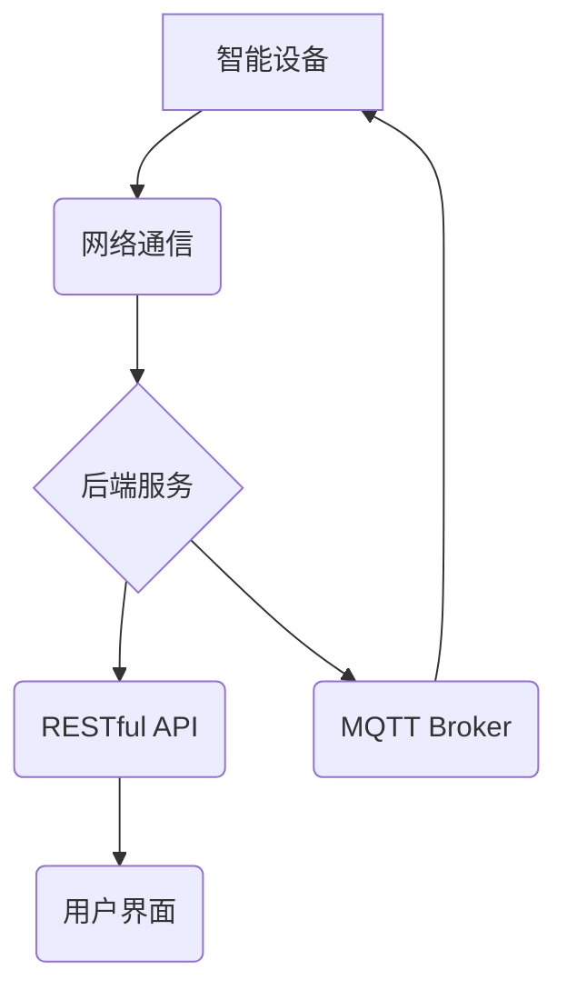

> 智能家居, Spring Boot, Java, 微服务, RESTful API, MQTT, 物联网

## 1. 背景介绍

智能家居已成为现代生活的重要组成部分，它通过将各种智能设备连接到网络，实现对家居环境的自动化控制和智能化管理。随着物联网技术的快速发展，智能家居市场呈现出爆发式增长，对智能家居后端服务的需求也日益增加。

传统的智能家居后端服务往往采用单体架构，难以满足日益增长的功能需求和扩展性要求。微服务架构作为一种新的软件架构模式，能够有效解决这些问题。微服务架构将大型应用程序拆分成多个小型、独立的服务，每个服务负责特定的功能，并通过轻量级的通信协议进行交互。这种架构模式具有以下优点：

* **可扩展性:**  每个微服务可以独立部署和扩展，无需影响其他服务。
* **弹性:**  单个微服务出现故障时，不会影响整个系统的运行。
* **开发效率:**  开发人员可以专注于单个服务，提高开发效率。
* **技术多样性:**  每个微服务可以使用不同的技术栈，满足不同的功能需求。

## 2. 核心概念与联系

### 2.1 智能家居系统架构

智能家居系统通常由以下几个主要部分组成：

* **智能设备:**  包括各种传感器、执行器、控制中心等，负责感知环境信息和执行控制指令。
* **网络通信:**  负责智能设备之间的数据传输，常见的协议包括Wi-Fi、蓝牙、Zigbee等。
* **后端服务:**  负责处理数据、控制设备、提供用户界面等功能。

### 2.2 微服务架构

微服务架构是一种将大型应用程序拆分成多个小型、独立的服务的架构模式。每个微服务负责特定的功能，并通过轻量级的通信协议进行交互。

### 2.3 Spring Boot

Spring Boot 是一个基于 Spring 框架的快速开发工具，它简化了 Spring 应用的开发过程，并提供了许多常用的功能组件。

### 2.4 RESTful API

RESTful API 是一个基于 HTTP 协议的 Web 服务架构，它使用标准的 HTTP 方法（GET、POST、PUT、DELETE）来访问资源。

### 2.5 MQTT

MQTT 是一个轻量级的消息传输协议，它特别适合物联网应用场景，因为它具有低功耗、高可靠性和低延迟的特点。

**Mermaid 流程图**



## 3. 核心算法原理 & 具体操作步骤

### 3.1  算法原理概述

智能家居后端服务需要处理大量的传感器数据和用户指令，并根据这些信息进行决策和控制。常用的算法包括：

* **数据分析算法:**  用于分析传感器数据，识别模式和趋势。
* **机器学习算法:**  用于预测用户需求和行为，并提供个性化服务。
* **控制算法:**  用于控制智能设备，实现自动化控制和场景化管理。

### 3.2  算法步骤详解

**数据分析算法:**

1. 收集传感器数据。
2. 数据预处理，例如去除噪声、缺失值处理等。
3. 使用数据分析算法进行分析，例如统计分析、聚类分析等。
4. 生成分析结果，例如温度趋势、湿度变化等。

**机器学习算法:**

1. 收集用户行为数据，例如使用习惯、偏好设置等。
2. 数据预处理，例如特征提取、数据归一化等。
3. 选择合适的机器学习算法，例如决策树、支持向量机等。
4. 训练机器学习模型。
5. 使用训练好的模型进行预测，例如预测用户需求、行为模式等。

**控制算法:**

1. 收集用户指令和传感器数据。
2. 根据用户指令和传感器数据，判断需要执行的控制动作。
3. 发送控制指令到智能设备。
4. 监控设备状态，确保控制动作执行成功。

### 3.3  算法优缺点

**数据分析算法:**

* **优点:**  易于实现，计算量较小。
* **缺点:**  分析结果可能不够准确，难以发现复杂模式。

**机器学习算法:**

* **优点:**  能够发现复杂模式，预测用户需求。
* **缺点:**  训练模型需要大量数据，计算量较大。

**控制算法:**

* **优点:**  能够实现自动化控制，提高效率。
* **缺点:**  需要考虑安全性和可靠性问题。

### 3.4  算法应用领域

* **数据分析算法:**  用于分析智能家居设备运行数据，优化能源消耗、预测设备故障等。
* **机器学习算法:**  用于个性化推荐设备设置、预测用户需求、实现智能家居场景化管理等。
* **控制算法:**  用于控制智能设备，实现自动化控制、场景化管理、远程控制等。

## 4. 数学模型和公式 & 详细讲解 & 举例说明

### 4.1  数学模型构建

智能家居后端服务可以利用数学模型来描述系统行为和进行决策。例如，可以建立一个能量消耗模型来预测智能家居的能源消耗，并根据预测结果进行优化控制。

**能量消耗模型:**

$$E = P \times t$$

其中：

* $E$ 表示能量消耗（单位：千瓦时）
* $P$ 表示功率（单位：千瓦）
* $t$ 表示时间（单位：小时）

### 4.2  公式推导过程

该公式是根据能量的定义推导而来。能量是物体在一段时间内所做的功，功率是单位时间内所做的功，因此能量消耗等于功率乘以时间。

### 4.3  案例分析与讲解

假设一个智能家居中的空调功率为 1 千瓦，运行时间为 2 小时，则其能量消耗为：

$$E = 1 \times 2 = 2 \text{ 千瓦时}$$

## 5. 项目实践：代码实例和详细解释说明

### 5.1  开发环境搭建

* Java Development Kit (JDK) 11 或更高版本
* Maven 或 Gradle 构建工具
* Spring Boot CLI 或 IDE (例如 IntelliJ IDEA)

### 5.2  源代码详细实现

```java
@SpringBootApplication
public class SmartHomeBackendApplication {

    public static void main(String[] args) {
        SpringApplication.run(SmartHomeBackendApplication.class, args);
    }

}
```

### 5.3  代码解读与分析

* `@SpringBootApplication` 注解表示这是一个 Spring Boot 应用。
* `public class SmartHomeBackendApplication` 定义了主类。
* `public static void main(String[] args)` 方法是程序的入口点。
* `SpringApplication.run(SmartHomeBackendApplication.class, args)` 启动 Spring Boot 应用。

### 5.4  运行结果展示

启动应用后，可以使用浏览器访问 http://localhost:8080/health 检查应用状态。

## 6. 实际应用场景

### 6.1  智能照明控制

用户可以通过手机APP或语音助手控制智能灯泡的开关、亮度和颜色。

### 6.2  智能空调控制

用户可以通过手机APP或语音助手控制智能空调的温度、模式和定时开关。

### 6.3  智能家居场景化管理

用户可以创建不同的智能家居场景，例如“起床场景”、“睡觉场景”等，一键触发场景下的设备控制。

### 6.4  未来应用展望

* **更智能的个性化服务:**  通过机器学习算法，智能家居系统能够更加智能地理解用户的需求，提供更个性化的服务。
* **更安全的智能家居:**  通过人工智能技术，智能家居系统能够更好地识别和应对安全威胁，提高用户的安全感。
* **更便捷的智能家居控制:**  通过语音助手、物联网设备等，用户可以更加便捷地控制智能家居设备。

## 7. 工具和资源推荐

### 7.1  学习资源推荐

* **Spring Boot 官方文档:** https://spring.io/projects/spring-boot
* **RESTful API 设计指南:** https://restfulapi.net/
* **MQTT 协议规范:** https://docs.oasis-open.org/mqtt/mqtt/v3.1.1/os/mqtt-v3.1.1-os.html

### 7.2  开发工具推荐

* **IntelliJ IDEA:** https://www.jetbrains.com/idea/
* **Eclipse:** https://www.eclipse.org/
* **Maven:** https://maven.apache.org/
* **Gradle:** https://gradle.org/

### 7.3  相关论文推荐

* **Microservices: Architectural Style and Patterns:** https://martinfowler.com/articles/microservices.html
* **Building Microservices: Designing Fine-Grained Systems:** https://www.oreilly.com/library/view/building-microservices/9781491969650/

## 8. 总结：未来发展趋势与挑战

### 8.1  研究成果总结

本文介绍了基于Java的智能家居设计，并探讨了微服务架构、Spring Boot、RESTful API、MQTT 等技术在智能家居后端服务中的应用。

### 8.2  未来发展趋势

* **更智能的算法:**  人工智能技术将进一步推动智能家居系统的智能化，例如更精准的预测、更个性化的服务。
* **更安全的系统:**  随着智能家居设备数量的增加，安全问题将更加重要，需要开发更安全的系统架构和算法。
* **更便捷的交互方式:**  语音助手、物联网设备等将成为智能家居控制的更便捷的方式。

### 8.3  面临的挑战

* **数据安全和隐私保护:**  智能家居系统收集大量的用户数据，需要确保数据的安全性和隐私性。
* **系统可靠性和稳定性:**  智能家居系统需要保证高可靠性和稳定性，避免设备故障和数据丢失。
* **技术标准和互操作性:**  智能家居行业缺乏统一的技术标准，导致不同设备之间难以互操作。

### 8.4  研究展望

未来，智能家居系统将更加智能、安全、便捷，并与其他领域，例如医疗、教育、娱乐等融合发展，为人们的生活带来更多便利和乐趣。

## 9. 附录：常见问题与解答

### 9.1  常见问题

* **如何选择合适的智能家居设备？**
* **如何设置智能家居场景？**
* **如何解决智能家居设备连接问题？**

### 9.2  解答

* **如何选择合适的智能家居设备？**

选择智能家居设备时，需要考虑以下因素：

* **功能需求:**  用户需要哪些功能？
* **兼容性:**  设备是否兼容现有的智能家居系统？
* **价格:**  设备的价格是否合理？
* **品牌和口碑:**  设备的品牌和口碑如何？

* **如何设置智能家居场景？**

大多数智能家居系统都提供场景设置功能，用户可以根据自己的需求创建不同的场景，例如“起床场景”、“睡觉场景”等。

* **如何解决智能家居设备连接问题？**

如果智能家居设备无法连接，可以尝试以下方法：

* 检查设备是否已连接到网络。
* 检查设备的电源是否正常。
* 重启设备和路由器。
* 联系设备厂商寻求帮助。


作者：禅与计算机程序设计艺术 / Zen and the Art of Computer Programming 
<end_of_turn>