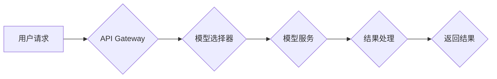

> 自然语言处理 (NLP)，访问接口，NPL，API设计，模型部署，微服务架构

## 1. 背景介绍

随着人工智能技术的飞速发展，自然语言处理 (NLP) 领域取得了显著的突破。基于 Transformer 架构的预训练语言模型 (如 BERT、GPT-3 等) 涌现，展现出强大的文本理解和生成能力。这些模型的出现为构建更智能、更人性化的应用程序提供了强大的工具。

然而，如何方便地将这些强大的 NLP 模型应用于实际场景中仍然是一个挑战。传统的开发方式需要开发者深入了解模型的内部结构和参数，并进行复杂的代码编写和调试。为了解决这个问题，基于 NPL 的自然语言处理访问接口应运而生。

NPL (Natural Processing Language) 是一种基于云计算和微服务架构的 NLP 平台，它提供了一系列预训练模型和 API 接口，方便开发者快速集成 NLP 功能到自己的应用程序中。

## 2. 核心概念与联系

NPL 平台的核心概念包括：

* **预训练模型库:** NPL 平台提供多种预训练语言模型，涵盖文本分类、情感分析、问答系统、机器翻译等多个领域。
* **API 接口:** NPL 平台提供简洁易用的 API 接口，开发者可以通过简单的代码调用即可使用预训练模型进行文本处理。
* **微服务架构:** NPL 平台采用微服务架构，将不同的 NLP 功能模块独立部署，提高系统的可扩展性和可靠性。

**NPL 平台架构图:**



## 3. 核心算法原理 & 具体操作步骤

### 3.1  算法原理概述

NPL 平台的核心算法原理是基于 Transformer 架构的预训练语言模型。Transformer 模型通过自注意力机制 (Self-Attention) 和多头注意力机制 (Multi-Head Attention) 学习文本之间的上下文关系，从而实现对文本的理解和生成。

### 3.2  算法步骤详解

1. **预训练:** 预训练模型在海量文本数据上进行训练，学习语言的语法规则和语义关系。
2. **微调:** 根据具体的应用场景，对预训练模型进行微调，使其能够更好地处理特定类型的文本数据。
3. **API 调用:** 开发者通过 API 接口调用预训练模型，将文本数据作为输入，模型会输出相应的处理结果。

### 3.3  算法优缺点

**优点:**

* **高精度:** Transformer 模型在 NLP 领域取得了state-of-the-art 的性能。
* **易于使用:** NPL 平台提供简洁易用的 API 接口，方便开发者快速集成 NLP 功能。
* **可扩展性强:** 微服务架构使得 NPL 平台能够轻松扩展新的 NLP 功能模块。

**缺点:**

* **计算资源需求高:** Transformer 模型训练和推理都需要大量的计算资源。
* **模型参数量大:** Transformer 模型的参数量较大，需要较大的存储空间。

### 3.4  算法应用领域

NPL 平台的算法应用领域非常广泛，包括：

* **文本分类:** 文本情感分析、垃圾邮件过滤、新闻分类等。
* **问答系统:** 基于知识图谱的问答系统、对话机器人等。
* **机器翻译:** 语种之间的文本翻译。
* **文本生成:** 自动写作、代码生成、诗歌创作等。

## 4. 数学模型和公式 & 详细讲解 & 举例说明

### 4.1  数学模型构建

Transformer 模型的核心是自注意力机制，其数学模型可以表示为：

$$
Attention(Q, K, V) = \frac{exp(Q \cdot K^T / \sqrt{d_k})}{exp(Q \cdot K^T / \sqrt{d_k})} \cdot V
$$

其中：

* $Q$：查询矩阵
* $K$：键矩阵
* $V$：值矩阵
* $d_k$：键向量的维度

### 4.2  公式推导过程

自注意力机制通过计算查询向量 $Q$ 与键向量 $K$ 的点积，并将其归一化，从而得到每个键向量对查询向量的注意力权重。然后，将注意力权重与值向量 $V$ 相乘，得到最终的输出。

### 4.3  案例分析与讲解

例如，在机器翻译任务中，查询向量 $Q$ 可以表示源语言的词向量，键向量 $K$ 可以表示目标语言的词向量，值向量 $V$ 可以表示目标语言的词嵌入。通过自注意力机制，模型可以学习到源语言和目标语言之间的词语对应关系，从而实现文本翻译。

## 5. 项目实践：代码实例和详细解释说明

### 5.1  开发环境搭建

NPL 平台提供多种开发环境，包括云端环境和本地环境。开发者可以根据自己的需求选择合适的开发环境。

### 5.2  源代码详细实现

```python
import requests

# NPL 平台 API 接口地址
api_url = "https://api.npl.com/v1/text-classification"

# 文本数据
text = "这是一个非常棒的电影！"

# API 请求参数
params = {
    "text": text,
    "model_id": "bert-base-uncased"
}

# 发送 API 请求
response = requests.post(api_url, params=params)

# 处理 API 返回结果
result = response.json()
print(result)
```

### 5.3  代码解读与分析

这段代码演示了如何使用 NPL 平台的 API 接口进行文本分类。

1. 首先，导入 requests 库，用于发送 HTTP 请求。
2. 定义 NPL 平台 API 接口地址和文本数据。
3. 设置 API 请求参数，包括文本数据和模型 ID。
4. 使用 requests.post() 函数发送 POST 请求到 API 接口。
5. 处理 API 返回结果，打印分类结果。

### 5.4  运行结果展示

API 返回结果示例：

```json
{
  "label": "positive",
  "score": 0.95
}
```

## 6. 实际应用场景

NPL 平台的应用场景非常广泛，例如：

* **客服机器人:** 使用 NPL 平台的文本分类和问答系统功能，构建智能客服机器人，自动处理客户咨询。
* **内容审核:** 使用 NPL 平台的文本分类和情感分析功能，对用户生成的内容进行审核，过滤违规内容。
* **搜索引擎:** 使用 NPL 平台的文本理解和信息抽取功能，提高搜索引擎的搜索结果质量。

### 6.4  未来应用展望

随着人工智能技术的不断发展，NPL 平台的应用场景将会更加广泛。例如：

* **个性化推荐:** 使用 NPL 平台的文本理解和用户画像功能，提供个性化的产品和服务推荐。
* **自动写作:** 使用 NPL 平台的文本生成功能，自动生成新闻报道、产品描述等文本内容。
* **跨语言沟通:** 使用 NPL 平台的机器翻译功能，实现跨语言的文本沟通。

## 7. 工具和资源推荐

### 7.1  学习资源推荐

* **NPL 平台官方文档:** https://docs.npl.com/
* **Transformer 模型论文:** https://arxiv.org/abs/1706.03762

### 7.2  开发工具推荐

* **Python:** https://www.python.org/
* **requests 库:** https://requests.readthedocs.io/en/latest/

### 7.3  相关论文推荐

* **BERT: Pre-training of Deep Bidirectional Transformers for Language Understanding:** https://arxiv.org/abs/1810.04805
* **GPT-3: Language Models are Few-Shot Learners:** https://arxiv.org/abs/2005.14165

## 8. 总结：未来发展趋势与挑战

### 8.1  研究成果总结

NPL 平台基于 Transformer 架构的预训练语言模型，为 NLP 应用提供了高效、便捷的解决方案。

### 8.2  未来发展趋势

未来，NPL 平台将继续朝着以下方向发展：

* **模型性能提升:** 开发更强大的预训练语言模型，提高模型的准确性和泛化能力。
* **功能模块扩展:** 开发更多类型的 NLP 功能模块，满足更广泛的应用需求。
* **平台生态建设:** 构建完善的 NPL 平台生态系统，吸引更多开发者和合作伙伴加入。

### 8.3  面临的挑战

NPL 平台也面临一些挑战：

* **计算资源需求:** 预训练语言模型训练和推理需要大量的计算资源，成本较高。
* **模型可解释性:** Transformer 模型的内部结构复杂，难以解释模型的决策过程。
* **数据安全:** NPL 平台需要处理大量用户数据，数据安全问题需要得到重视。

### 8.4  研究展望

未来，NPL 平台的研究方向将包括：

* **高效训练方法:** 研究更有效的预训练语言模型训练方法，降低训练成本。
* **模型可解释性研究:** 研究 Transformer 模型的决策机制，提高模型的可解释性。
* **数据安全保障:** 研究数据安全保护技术，保障用户数据安全。

## 9. 附录：常见问题与解答

### 9.1  常见问题

* **如何注册 NPL 平台账号？**

  访问 NPL 平台官网，点击注册按钮即可注册账号。

* **如何选择合适的预训练模型？**

  根据具体的应用场景选择合适的预训练模型。NPL 平台提供多种预训练模型，开发者可以根据自己的需求进行选择。

* **如何部署 NPL 平台？**

  NPL 平台提供云端环境和本地环境两种部署方式。开发者可以根据自己的需求选择合适的部署方式。

### 9.2  解答

* **如何获取更多帮助？**

  访问 NPL 平台官网，查看帮助文档或联系客服。


作者：禅与计算机程序设计艺术 / Zen and the Art of Computer Programming 
<end_of_turn>