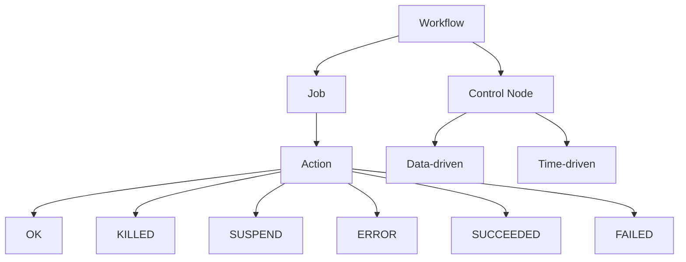

                 

**Oozie原理与代码实例讲解**

**作者：禅与计算机程序设计艺术 / Zen and the Art of Computer Programming**

## 1. 背景介绍

Apache Oozie是一个用于协调和调度Hadoop作业的开源工作流引擎。它允许用户定义和调度复杂的数据处理工作流，这些工作流可以包含MapReduce、Pig、Hive、Sqoop和Shell等任务。Oozie与Hadoop生态系统无缝集成，是大数据处理领域的关键组件之一。

## 2. 核心概念与联系

Oozie的核心概念包括**工作流（Workflow）**、**作业（Job）**、**控制节点（Control Node）**、**动作（Action）**、**数据驱动（Data-driven）**、**时间驱动（Time-driven）**、**OK（OK）**、**KILLED（KILLED）**、**SUSPEND（SUSPEND）**、**ERROR（ERROR）**、**SUCCEEDED（SUCCEEDED）**、**FAILED（FAILED）**。这些概念的关系如下：



## 3. 核心算法原理 & 具体操作步骤

### 3.1 算法原理概述

Oozie的核心算法是工作流调度算法。它基于用户定义的工作流XML配置文件，动态生成调度计划，并根据计划执行工作流中的任务。

### 3.2 算法步骤详解

1. **解析工作流配置**：Oozie解析用户提供的工作流XML配置文件，提取其中的作业、控制节点和动作信息。
2. **生成调度计划**：根据工作流配置，Oozie生成一个调度计划，该计划定义了每个动作的执行时间和依赖关系。
3. **执行动作**：Oozie根据调度计划执行动作。如果动作执行成功，Oozie会记录动作的状态为**SUCCEEDED**；如果动作执行失败，Oozie会记录动作的状态为**FAILED**。
4. **检查控制节点**：Oozie检查工作流中的控制节点，根据动作的执行结果和控制节点的类型（数据驱动或时间驱动）确定下一步的操作。
5. **重试和失败处理**：如果动作执行失败，Oozie会根据用户配置的重试次数和失败处理策略来重试或终止工作流。

### 3.3 算法优缺点

**优点**：Oozie的算法允许用户定义复杂的数据处理工作流，并提供了灵活的调度和失败处理机制。它与Hadoop生态系统无缝集成，可以轻松扩展到大规模集群。

**缺点**：Oozie的算法对用户配置的工作流文件有较高的要求，如果配置不当，可能会导致工作流执行失败。此外，Oozie的性能可能会受到集群资源的限制。

### 3.4 算法应用领域

Oozie的算法主要应用于大数据处理领域，用于协调和调度MapReduce、Pig、Hive、Sqoop和Shell等任务。它适用于需要处理大量数据的应用，如数据仓库、数据湖、实时数据处理和机器学习等。

## 4. 数学模型和公式 & 详细讲解 & 举例说明

### 4.1 数学模型构建

Oozie的数学模型可以表示为有向图$G = (V, E)$，其中$V$是动作集合，$E$是动作之间的依赖关系集合。每个动作$v \in V$有两个属性：执行时间$t_v$和执行时长$d_v$。每条边$e \in E$表示动作之间的先后顺序，即如果$(u, v) \in E$，则动作$u$必须在动作$v$之前执行。

### 4.2 公式推导过程

给定工作流的开始时间$T_s$和结束时间$T_e$，我们可以推导出动作$v$的最早开始时间$EST_v$和最迟开始时间$LST_v$：

$$
EST_v = \max_{u \in pred(v)} (EST_u + d_u)
$$

$$
LST_v = \min_{u \in succ(v)} (LST_u - d_v)
$$

其中$pred(v)$是动作$v$的前驱动作集合，$succ(v)$是动作$v$的后继动作集合。

### 4.3 案例分析与讲解

考虑以下工作流配置：

```xml
<workflow-app name="example" xmlns="uri:oozie:workflow:0.2">
  <start to="action1"/>
  <action name="action1">
    <map-reduce>
      <job-tracker>jobtracker</job-tracker>
      <name-node>namenode</name-node>
      <prepare>
        <delete path="output"/>
      </prepare>
      <configuration>
        <property>
          <name>mapred.job.queue.name</name>
          <value>default</value>
        </property>
      </configuration>
      <map>map1</map>
      <reduce>reduce1</reduce>
    </map-reduce>
    <ok to="action2"/>
    <error to="fail"/>
  </action>
  <action name="action2">
    <shell>
      <exec>echo "Action 2 completed"</exec>
    </shell>
    <ok to="end"/>
  </action>
  <kill name="fail">
    <message>Action failed, so killing the job</message>
  </kill>
  <end/>
</workflow-app>
```

根据上述公式，我们可以计算出动作的最早开始时间和最迟开始时间：

- $EST_{action1} = T_s$
- $LST_{action1} = \min(EST_{action2} - d_{action2}, T_e)$
- $EST_{action2} = EST_{action1} + d_{action1}$
- $LST_{action2} = T_e$

## 5. 项目实践：代码实例和详细解释说明

### 5.1 开发环境搭建

要运行Oozie示例，您需要在Hadoop集群上安装Oozie。您可以参考[Apache Oozie官方文档](https://oozie.apache.org/docs/4.2.0/DG_BuildingOozieFromSource.html)来搭建开发环境。

### 5.2 源代码详细实现

以下是一个简单的Oozie工作流配置文件示例（`example.xml`），该文件定义了两个动作：MapReduce作业和Shell作业。

```xml
<workflow-app name="example" xmlns="uri:oozie:workflow:0.2">
  <start to="action1"/>
  <action name="action1">
    <map-reduce>
      <job-tracker>jobtracker</job-tracker>
      <name-node>namenode</name-node>
      <prepare>
        <delete path="output"/>
      </prepare>
      <configuration>
        <property>
          <name>mapred.job.queue.name</name>
          <value>default</value>
        </property>
      </configuration>
      <map>map1</map>
      <reduce>reduce1</reduce>
    </map-reduce>
    <ok to="action2"/>
    <error to="fail"/>
  </action>
  <action name="action2">
    <shell>
      <exec>echo "Action 2 completed"</exec>
    </shell>
    <ok to="end"/>
  </action>
  <kill name="fail">
    <message>Action failed, so killing the job</message>
  </kill>
  <end/>
</workflow-app>
```

### 5.3 代码解读与分析

- `<start to="action1"/>`：定义工作流的起始节点，指向动作`action1`。
- `<action name="action1">`：定义动作`action1`，该动作是一个MapReduce作业。
- `<map-reduce>`：定义MapReduce作业的配置，包括JobTracker、NameNode、Map和Reduce任务等。
- `<ok to="action2"/>`：定义动作`action1`执行成功后的下一步动作，指向动作`action2`。
- `<error to="fail"/>`：定义动作`action1`执行失败后的下一步动作，指向失败处理节点`fail`。
- `<action name="action2">`：定义动作`action2`，该动作是一个Shell作业。
- `<shell>`：定义Shell作业的配置，包括需要执行的命令。
- `<ok to="end"/>`：定义动作`action2`执行成功后的下一步动作，指向工作流的结束节点`end`。
- `<kill name="fail">`：定义失败处理节点`fail`，当动作执行失败时，Oozie会跳转到此节点，并执行定义的失败处理逻辑。
- `<end/>`：定义工作流的结束节点。

### 5.4 运行结果展示

您可以使用Oozie命令行工具来运行工作流配置文件。以下是运行示例工作流的命令：

```bash
oozie job -config example.xml -run
```

如果动作`action1`和`action2`都执行成功，您应该会看到以下输出：

```
Action 2 completed
```

## 6. 实际应用场景

Oozie可以应用于各种大数据处理场景，例如：

### 6.1 数据仓库建设

Oozie可以用于协调数据仓库建设过程中的各个任务，如数据抽取、数据清洗、数据转换和数据加载等。

### 6.2 实时数据处理

Oozie可以与Apache Kafka和Apache Spark等实时数据处理框架集成，用于协调实时数据处理工作流。

### 6.3 机器学习管道

Oozie可以用于构建机器学习管道，协调数据预处理、特征工程、模型训练和模型部署等任务。

### 6.4 未来应用展望

随着大数据处理领域的不断发展，Oozie的应用场景也在不断扩展。未来，Oozie可能会与更多的大数据处理框架集成，并提供更灵活和强大的调度和失败处理机制。

## 7. 工具和资源推荐

### 7.1 学习资源推荐

- [Apache Oozie官方文档](https://oozie.apache.org/docs/4.2.0/)
- [Oozie用户指南](https://oozie.apache.org/docs/4.2.0/DG_BuildingOozieFromSource.html)
- [Oozie开发者指南](https://oozie.apache.org/docs/4.2.0/DG_DevelopingOozie.html)

### 7.2 开发工具推荐

- [Apache Ambari](https://ambari.apache.org/): 一款用于部署和管理Hadoop集群的开源工具，支持Oozie的安装和配置。
- [Apache Atlas](https://atlas.apache.org/): 一款用于数据治理和元数据管理的开源工具，可以与Oozie集成以提供数据治理功能。

### 7.3 相关论文推荐

- [Oozie: A Workflow Scheduler System for Hadoop](https://www.usenix.org/system/files/login/articles/login_summer11_11_roubtsov.pdf)
- [Oozie: A Workflow Scheduler for Hadoop](https://www.slideshare.net/ramgopal_raghuram/oozie-a-workflow-scheduler-for-hadoop)

## 8. 总结：未来发展趋势与挑战

### 8.1 研究成果总结

本文介绍了Oozie的核心概念、算法原理、数学模型和代码实例。我们讨论了Oozie的优缺点，并展示了其在数据仓库建设、实时数据处理和机器学习管道等领域的应用场景。

### 8.2 未来发展趋势

未来，Oozie的发展趋势可能包括：

- **多云和多集群支持**：Oozie将支持在多云和多集群环境中运行工作流，以满足企业的弹性需求。
- **更强大的失败处理机制**：Oozie将提供更灵活和强大的失败处理机制，以提高工作流的可靠性和可用性。
- **更好的可视化和监控**：Oozie将提供更好的可视化和监控功能，以帮助用户更轻松地管理和调试工作流。

### 8.3 面临的挑战

Oozie面临的挑战包括：

- **复杂性**：Oozie的配置和使用可能会对用户造成一定的复杂性，需要不断改进以提高用户体验。
- **性能**：Oozie的性能可能会受到集群资源的限制，需要不断优化以提高工作流的执行效率。
- **安全性**：Oozie需要提供更好的安全机制，以保护工作流和数据免受未授权访问和攻击。

### 8.4 研究展望

未来的研究方向可能包括：

- **动态工作流**：研究动态工作流的调度和执行机制，以适应不断变化的数据和任务需求。
- **自动化工作流**：研究自动化工作流的构建和管理机制，以提高工作流的自动化程度和可维护性。
- **弹性工作流**：研究弹性工作流的调度和执行机制，以适应集群资源的动态变化。

## 9. 附录：常见问题与解答

**Q1：Oozie与Apache Airflow有什么区别？**

A1：Oozie和Apache Airflow都是用于协调和调度大数据处理工作流的开源工具。它们的区别在于：

- **设计哲学**：Oozie是为Hadoop生态系统而设计的，它与Hadoop集成度高，但配置复杂。Airflow则是为更广泛的大数据处理场景而设计的，它提供了更简单和灵活的配置机制。
- **工作流定义**：Oozie使用XML配置文件定义工作流，而Airflow使用Python定义工作流。
- **执行引擎**：Oozie使用Hadoop YARN作为执行引擎，而Airflow使用自己的执行引擎。

**Q2：如何在Oozie中定义失败处理逻辑？**

A2：在Oozie中，您可以使用`<kill>`元素来定义失败处理逻辑。当动作执行失败时，Oozie会跳转到`<kill>`元素指定的节点，并执行定义的失败处理逻辑。您可以在`<kill>`元素中定义消息和动作，例如：

```xml
<kill name="fail">
  <message>Action failed, so killing the job</message>
  <action>email</action>
</kill>
```

**Q3：如何在Oozie中定义数据驱动和时间驱动的控制节点？**

A3：在Oozie中，您可以使用`<decision>`元素来定义数据驱动和时间驱动的控制节点。您可以在`<decision>`元素中使用`<switch>`元素来定义条件，并使用`<case>`元素来定义动作。例如：

```xml
<decision name="decision1">
  <switch>
    <case to="action2">$${nameNodeHealthy}</case>
    <case to="fail">$${nameNodeHealthy == 'false'}</case>
  </switch>
</decision>
```

在上述示例中，`<decision>`元素定义了一个数据驱动的控制节点，它根据`nameNodeHealthy`变量的值来选择下一步的动作。如果`nameNodeHealthy`为`true`，则跳转到动作`action2`；否则，跳转到失败处理节点`fail`。

**Q4：如何在Oozie中定义动作的依赖关系？**

A4：在Oozie中，您可以使用`<ok>`和`<error>`元素来定义动作的依赖关系。当动作执行成功时，Oozie会跳转到`<ok>`元素指定的节点；当动作执行失败时，Oozie会跳转到`<error>`元素指定的节点。例如：

```xml
<action name="action1">
  <map-reduce>
   ...
  </map-reduce>
  <ok to="action2"/>
  <error to="fail"/>
</action>
```

在上述示例中，动作`action1`的成功路径指向动作`action2`，失败路径指向失败处理节点`fail`。

**Q5：如何在Oozie中定义动作的重试机制？**

A5：在Oozie中，您可以使用`<retry>`元素来定义动作的重试机制。您可以在`<retry>`元素中指定重试次数和重试间隔。例如：

```xml
<action name="action1">
  <map-reduce>
   ...
  </map-reduce>
  <retry max=3 interval=60>
    <ok to="action2"/>
    <error to="fail"/>
  </retry>
</action>
```

在上述示例中，动作`action1`最多重试3次，重试间隔为60秒。如果动作执行成功，则跳转到动作`action2`；如果动作执行失败，则重试动作`action1`。

## 结束语

本文介绍了Oozie的核心概念、算法原理、数学模型和代码实例。我们讨论了Oozie的优缺点，并展示了其在数据仓库建设、实时数据处理和机器学习管道等领域的应用场景。我们还推荐了相关的学习资源、开发工具和论文，并总结了未来发展趋势和挑战。最后，我们回答了常见问题，以帮助读者更好地理解和使用Oozie。

**作者：禅与计算机程序设计艺术 / Zen and the Art of Computer Programming**

