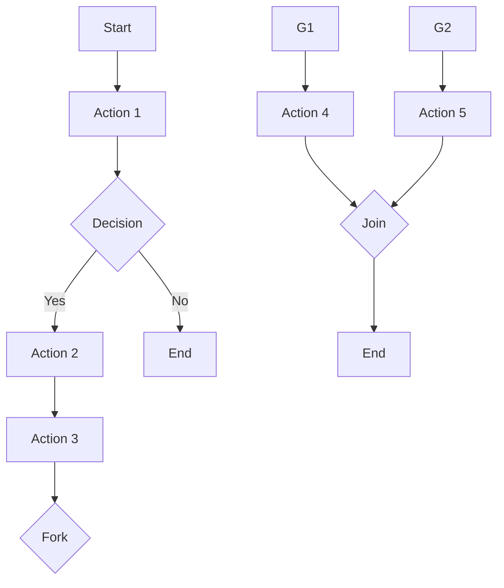

                 

**Oozie工作流调度原理与代码实例讲解**

**作者：禅与计算机程序设计艺术 / Zen and the Art of Computer Programming**

## 1. 背景介绍

Apache Oozie是一个用于协调和调度Hadoop作业的开源工作流引擎。它允许用户定义和调度复杂的数据处理工作流，这些工作流可以包含MapReduce、Pig、Hive、Sqoop和Shell等任务。Oozie提供了一个基于Web的用户界面，用户可以通过它来创建、监控和管理工作流。本文将深入探讨Oozie的工作原理，并提供代码实例以帮助读者理解和应用Oozie。

## 2. 核心概念与联系

### 2.1 核心概念

- **Workflow（工作流）**：Oozie中的工作流是一组有序的任务，这些任务可以是MapReduce、Pig、Hive、Sqoop或Shell任务。
- **Action（动作）**：动作是工作流中的单个任务，它可以是MapReduce、Pig、Hive、Sqoop或Shell任务。
- **Control Flow（控制流）**：控制流定义了工作流中任务的执行顺序。
- **Control Node（控制节点）**：控制节点用于控制工作流的执行，例如Start（开始）、End（结束）、Decision（决策）和Fork/Join（分支/合并）。

### 2.2 Mermaid 流程图



## 3. 核心算法原理 & 具体操作步骤

### 3.1 算法原理概述

Oozie使用基于XML的工作流定义语言（WDL）来定义工作流。一旦工作流被定义，Oozie的调度系统会根据定义的控制流执行任务。Oozie支持两种调度方式：时间驱动（Time-driven）和数据驱动（Data-driven）。

### 3.2 算法步骤详解

1. **定义工作流**：使用WDL定义工作流，包括任务、控制流和控制节点。
2. **提交工作流**：将定义好的工作流提交给Oozie服务器。
3. **调度任务**：Oozie的调度系统根据定义的控制流调度任务。
4. **执行任务**：Oozie运行任务，并监控其进度。
5. **管理工作流**：用户可以通过Oozie的Web用户界面监控和管理工作流。

### 3.3 算法优缺点

**优点**：

- 提供了一个统一的平台来协调和调度Hadoop作业。
- 支持复杂的控制流，允许用户定义复杂的数据处理工作流。
- 提供了一个基于Web的用户界面，用户可以通过它来创建、监控和管理工作流。

**缺点**：

- 学习曲线较陡，对新用户来说可能比较复杂。
- 定义和管理大型工作流可能会变得复杂。

### 3.4 算法应用领域

Oozie适用于需要协调和调度多个Hadoop作业的场景，例如：

- ETL（Extract, Transform, Load）过程：Oozie可以协调数据提取、转换和加载过程。
- 数据处理工作流：Oozie可以协调MapReduce、Pig、Hive等任务，用于处理大数据。
- 机器学习工作流：Oozie可以协调机器学习任务，例如数据预处理、模型训练和预测。

## 4. 数学模型和公式 & 详细讲解 & 举例说明

### 4.1 数学模型构建

Oozie的数学模型可以表示为有向图（Directed Graph），其中节点表示任务，边表示控制流。数学模型可以表示为：

$$G = (V, E)$$

其中：

- $V$ 是任务集合，
- $E$ 是控制流集合。

### 4.2 公式推导过程

给定一个工作流，$G = (V, E)$，我们可以推导出任务的执行顺序。假设任务$v_i$在任务$v_j$之前执行，可以表示为：

$$v_i \prec v_j$$

如果任务$v_i$在任务$v_j$之前执行，并且没有其他任务在$v_i$和$v_j$之间执行，则任务$v_i$是任务$v_j$的直接前驱，可以表示为：

$$v_i \rightarrow v_j$$

### 4.3 案例分析与讲解

考虑以下工作流：

```xml
<workflow-app name="example-wf" xmlns="uri:oozie:workflow:0.4">
  <start to="action1"/>
  <action name="action1">
    <map-reduce>
      <job-tracker>local</job-tracker>
      <name-node>local</name-node>
      <prepare>
        <delete path="${nameNode}/user/${user.name}/output"/>
      </prepare>
      <configuration>
        <property>
          <name>mapred.job.queue.name</name>
          <value>default</value>
        </property>
      </configuration>
      <map-reduce>
        <job-tracker>local</job-tracker>
        <name-node>local</name-node>
        <prepare>
          <delete path="${nameNode}/user/${user.name}/output"/>
        </prepare>
        <configuration>
          <property>
            <name>mapred.job.queue.name</name>
            <value>default</value>
          </property>
        </configuration>
        <map>map.py</map>
        <reduce>reduce.py</reduce>
      </map-reduce>
    </map-reduce>
    <ok to="action2"/>
    <error to="fail"/>
  </action>
  <action name="action2">
    <shell>
      <job-tracker>local</job-tracker>
      <name-node>local</name-node>
      <prepare>
        <delete path="${nameNode}/user/${user.name}/output"/>
      </prepare>
      <configuration>
        <property>
          <name>mapred.job.queue.name</name>
          <value>default</value>
        </property>
      </configuration>
      <command>echo "Hello, World!"</command>
    </shell>
    <ok to="end"/>
    <error to="fail"/>
  </action>
  <kill name="fail">
    <message>Action failed, so killing the job</message>
  </kill>
  <end name="end"/>
</workflow-app>
```

在这个工作流中，$V = \{action1, action2\}$，$E = \{(action1, action2)\}$。任务$action1$是任务$action2$的直接前驱，可以表示为：

$$action1 \rightarrow action2$$

## 5. 项目实践：代码实例和详细解释说明

### 5.1 开发环境搭建

要在本地开发和测试Oozie工作流，您需要安装以下软件：

- Apache Hadoop
- Apache Oozie
- Apache Hive
- Apache Pig
- Apache Sqoop

### 5.2 源代码详细实现

以下是一个简单的Oozie工作流示例，该示例包含一个MapReduce任务和一个Shell任务：

```xml
<workflow-app name="example-wf" xmlns="uri:oozie:workflow:0.4">
  <start to="action1"/>
  <action name="action1">
    <map-reduce>
      <job-tracker>local</job-tracker>
      <name-node>local</name-node>
      <prepare>
        <delete path="${nameNode}/user/${user.name}/output"/>
      </prepare>
      <configuration>
        <property>
          <name>mapred.job.queue.name</name>
          <value>default</value>
        </property>
      </configuration>
      <map>map.py</map>
      <reduce>reduce.py</reduce>
    </map-reduce>
    <ok to="action2"/>
    <error to="fail"/>
  </action>
  <action name="action2">
    <shell>
      <job-tracker>local</job-tracker>
      <name-node>local</name-node>
      <prepare>
        <delete path="${nameNode}/user/${user.name}/output"/>
      </prepare>
      <configuration>
        <property>
          <name>mapred.job.queue.name</name>
          <value>default</value>
        </property>
      </configuration>
      <command>echo "Hello, World!"</command>
    </shell>
    <ok to="end"/>
    <error to="fail"/>
  </action>
  <kill name="fail">
    <message>Action failed, so killing the job</message>
  </kill>
  <end name="end"/>
</workflow-app>
```

### 5.3 代码解读与分析

- `<start to="action1"/>`：工作流的开始节点，指向第一个任务`action1`。
- `<action name="action1">`：第一个任务，是一个MapReduce任务。
- `<map-reduce>`：MapReduce任务的配置。
- `<job-tracker>`和`<name-node>`：Hadoop集群的JobTracker和NameNode的位置。
- `<prepare>`：在任务执行之前要执行的操作，例如删除输出目录。
- `<configuration>`：任务的配置属性。
- `<map>`和`<reduce>`：Map和Reduce任务的位置。
- `<ok to="action2"/>`：如果任务成功，则指向下一个任务`action2`。
- `<error to="fail"/>`：如果任务失败，则指向失败节点`fail`。
- `<action name="action2">`：第二个任务，是一个Shell任务。
- `<shell>`：Shell任务的配置。
- `<command>`：要执行的Shell命令。
- `<ok to="end"/>`：如果任务成功，则指向结束节点`end`。
- `<error to="fail"/>`：如果任务失败，则指向失败节点`fail`。
- `<kill name="fail">`：失败节点，用于发送失败消息。
- `<end name="end"/>`：工作流的结束节点。

### 5.4 运行结果展示

运行工作流后，您可以在Oozie的Web用户界面中监控其进度。一旦任务完成，您可以查看MapReduce任务的输出和Shell任务的标准输出。

## 6. 实际应用场景

### 6.1 当前应用

Oozie广泛应用于大数据处理领域，用于协调和调度MapReduce、Pig、Hive、Sqoop和Shell任务。它被用于ETL过程，数据处理工作流和机器学习工作流。

### 6.2 未来应用展望

未来，Oozie可能会扩展其支持的任务类型，以适应新的大数据处理框架。此外，Oozie可能会集成更多的监控和管理功能，以帮助用户更好地管理大型工作流。

## 7. 工具和资源推荐

### 7.1 学习资源推荐

- [Apache Oozie官方文档](https://oozie.apache.org/docs/4.2.0/)
- [Oozie Tutorial](https://www.tutorialspoint.com/apache_oozie/apache_oozie_workflow.htm)
- [Oozie Best Practices](https://cwiki.apache.org/confluence/display/OOZIE/Best+Practices)

### 7.2 开发工具推荐

- [Apache Ambari](https://ambari.apache.org/): 用于管理Hadoop集群的Web用户界面。
- [Apache Hue](https://gethue.com/): 用于管理Hadoop集群的Web用户界面，包括Oozie。

### 7.3 相关论文推荐

- [Oozie: A Workflow Scheduler for Hadoop](https://www.usenix.org/system/files/login/articles/login_summer11_12_arnold.pdf)
- [Oozie Workflow Scheduler for Hadoop](https://www.slideshare.net/arunmurthy/oozie-workflow-scheduler-for-hadoop)

## 8. 总结：未来发展趋势与挑战

### 8.1 研究成果总结

本文介绍了Oozie的工作原理，包括核心概念、算法原理、数学模型和代码实例。我们还讨论了Oozie的优缺点和应用领域。

### 8.2 未来发展趋势

未来，Oozie可能会扩展其支持的任务类型，以适应新的大数据处理框架。此外，Oozie可能会集成更多的监控和管理功能，以帮助用户更好地管理大型工作流。

### 8.3 面临的挑战

Oozie面临的挑战包括学习曲线较陡，定义和管理大型工作流可能会变得复杂。

### 8.4 研究展望

未来的研究可能会集中在Oozie的扩展上，以支持新的大数据处理框架，并集成更多的监控和管理功能。

## 9. 附录：常见问题与解答

**Q：如何在Oozie中定义工作流？**

A：使用基于XML的工作流定义语言（WDL）定义工作流。

**Q：Oozie支持哪些任务类型？**

A：Oozie支持MapReduce、Pig、Hive、Sqoop和Shell任务。

**Q：如何在Oozie中管理工作流？**

A：Oozie提供了一个基于Web的用户界面，用户可以通过它来创建、监控和管理工作流。

**Q：如何在Oozie中定义控制流？**

A：使用控制节点，例如Start（开始）、End（结束）、Decision（决策）和Fork/Join（分支/合并），定义控制流。

**Q：如何在Oozie中定义任务的依赖关系？**

A：使用控制流定义任务的执行顺序。如果任务$v_i$在任务$v_j$之前执行，则可以表示为：

$$v_i \prec v_j$$

如果任务$v_i$在任务$v_j$之前执行，并且没有其他任务在$v_i$和$v_j$之间执行，则任务$v_i$是任务$v_j$的直接前驱，可以表示为：

$$v_i \rightarrow v_j$$

**Q：如何在Oozie中定义任务的配置属性？**

A：使用`<configuration>`元素定义任务的配置属性。例如：

```xml
<configuration>
  <property>
    <name>mapred.job.queue.name</name>
    <value>default</value>
  </property>
</configuration>
```

**Q：如何在Oozie中定义任务的输入和输出？**

A：使用`<prepare>`元素定义任务的输入和输出。例如：

```xml
<prepare>
  <delete path="${nameNode}/user/${user.name}/output"/>
</prepare>
```

**Q：如何在Oozie中定义失败处理？**

A：使用`<kill>`元素定义失败处理。例如：

```xml
<kill name="fail">
  <message>Action failed, so killing the job</message>
</kill>
```

**Q：如何在Oozie中定义结束节点？**

A：使用`<end>`元素定义结束节点。例如：

```xml
<end name="end"/>
```

**Q：如何在Oozie中定义开始节点？**

A：使用`<start>`元素定义开始节点。例如：

```xml
<start to="action1"/>
```

**Q：如何在Oozie中定义MapReduce任务？**

A：使用`<map-reduce>`元素定义MapReduce任务。例如：

```xml
<map-reduce>
  <job-tracker>local</job-tracker>
  <name-node>local</name-node>
  <prepare>
    <delete path="${nameNode}/user/${user.name}/output"/>
  </prepare>
  <configuration>
    <property>
      <name>mapred.job.queue.name</name>
      <value>default</value>
    </property>
  </configuration>
  <map>map.py</map>
  <reduce>reduce.py</reduce>
</map-reduce>
```

**Q：如何在Oozie中定义Shell任务？**

A：使用`<shell>`元素定义Shell任务。例如：

```xml
<shell>
  <job-tracker>local</job-tracker>
  <name-node>local</name-node>
  <prepare>
    <delete path="${nameNode}/user/${user.name}/output"/>
  </prepare>
  <configuration>
    <property>
      <name>mapred.job.queue.name</name>
      <value>default</value>
    </property>
  </configuration>
  <command>echo "Hello, World!"</command>
</shell>
```

**Q：如何在Oozie中定义Fork/Join任务？**

A：使用`<fork>`和`<join>`元素定义Fork/Join任务。例如：

```xml
<fork name="fork">
  <path start="action3"/>
  <path start="action4"/>
</fork>
<join name="join">
  <path to="action5"/>
</join>
```

**Q：如何在Oozie中定义决策任务？**

A：使用`<decision>`元素定义决策任务。例如：

```xml
<decision name="decision">
  <switch>
    <case to="action3">Condition 1</case>
    <case to="action4">Condition 2</case>
    <default to="action5">Default condition</default>
  </switch>
</decision>
```

**Q：如何在Oozie中定义动作组？**

A：使用`<action>`元素定义动作组。例如：

```xml
<action name="action1">
  <map-reduce>
   ...
  </map-reduce>
  <ok to="action2"/>
  <error to="fail"/>
</action>
```

**Q：如何在Oozie中定义动作的成功和失败路径？**

A：使用`<ok>`和`<error>`元素定义动作的成功和失败路径。例如：

```xml
<ok to="action2"/>
<error to="fail"/>
```

**Q：如何在Oozie中定义动作的名称？**

A：使用`<action>`元素的`name`属性定义动作的名称。例如：

```xml
<action name="action1">
 ...
</action>
```

**Q：如何在Oozie中定义动作的描述？**

A：使用`<action>`元素的`description`属性定义动作的描述。例如：

```xml
<action name="action1" description="This is a MapReduce action">
 ...
</action>
```

**Q：如何在Oozie中定义动作的配置属性？**

A：使用`<configuration>`元素定义动作的配置属性。例如：

```xml
<configuration>
  <property>
    <name>mapred.job.queue.name</name>
    <value>default</value>
  </property>
</configuration>
```

**Q：如何在Oozie中定义动作的输入和输出？**

A：使用`<prepare>`元素定义动作的输入和输出。例如：

```xml
<prepare>
  <delete path="${nameNode}/user/${user.name}/output"/>
</prepare>
```

**Q：如何在Oozie中定义动作的失败处理？**

A：使用`<kill>`元素定义动作的失败处理。例如：

```xml
<kill name="fail">
  <message>Action failed, so killing the job</message>
</kill>
```

**Q：如何在Oozie中定义动作的结束节点？**

A：使用`<end>`元素定义动作的结束节点。例如：

```xml
<end name="end"/>
```

**Q：如何在Oozie中定义动作的开始节点？**

A：使用`<start>`元素定义动作的开始节点。例如：

```xml
<start to="action1"/>
```

**Q：如何在Oozie中定义动作的控制流？**

A：使用控制节点，例如Start（开始）、End（结束）、Decision（决策）和Fork/Join（分支/合并），定义动作的控制流。

**Q：如何在Oozie中定义动作的依赖关系？**

A：使用控制流定义动作的执行顺序。如果动作$v_i$在动作$v_j$之前执行，则可以表示为：

$$v_i \prec v_j$$

如果动作$v_i$在动作$v_j$之前执行，并且没有其他动作在$v_i$和$v_j$之间执行，则动作$v_i$是动作$v_j$的直接前驱，可以表示为：

$$v_i \rightarrow v_j$$

**Q：如何在Oozie中定义动作的配置属性？**

A：使用`<configuration>`元素定义动作的配置属性。例如：

```xml
<configuration>
  <property>
    <name>mapred.job.queue.name</name>
    <value>default</value>
  </property>
</configuration>
```

**Q：如何在Oozie中定义动作的输入和输出？**

A：使用`<prepare>`元素定义动作的输入和输出。例如：

```xml
<prepare>
  <delete path="${nameNode}/user/${user.name}/output"/>
</prepare>
```

**Q：如何在Oozie中定义动作的失败处理？**

A：使用`<kill>`元素定义动作的失败处理。例如：

```xml
<kill name="fail">
  <message>Action failed, so killing the job</message>
</kill>
```

**Q：如何在Oozie中定义动作的结束节点？**

A：使用`<end>`元素定义动作的结束节点。例如：

```xml
<end name="end"/>
```

**Q：如何在Oozie中定义动作的开始节点？**

A：使用`<start>`元素定义动作的开始节点。例如：

```xml
<start to="action1"/>
```

**Q：如何在Oozie中定义动作的控制流？**

A：使用控制节点，例如Start（开始）、End（结束）、Decision（决策）和Fork/Join（分支/合并），定义动作的控制流。

**Q：如何在Oozie中定义动作的依赖关系？**

A：使用控制流定义动作的执行顺序。如果动作$v_i$在动作$v_j$之前执行，则可以表示为：

$$v_i \prec v_j$$

如果动作$v_i$在动作$v_j$之前执行，并且没有其他动作在$v_i$和$v_j$之间执行，则动作$v_i$是动作$v_j$的直接前驱，可以表示为：

$$v_i \rightarrow v_j$$

**Q：如何在Oozie中定义动作的配置属性？**

A：使用`<configuration>`元素定义动作的配置属性。例如：

```xml
<configuration>
  <property>
    <name>mapred.job.queue.name</name>
    <value>default</value>
  </property>
</configuration>
```

**Q：如何在Oozie中定义动作的输入和输出？**

A：使用`<prepare>`元素定义动作的输入和输出。例如：

```xml
<prepare>
  <delete path="${nameNode}/user/${user.name}/output"/>
</prepare>
```

**Q：如何在Oozie中定义动作的失败处理？**

A：使用`<kill>`元素定义动作的失败处理。例如：

```xml
<kill name="fail">
  <message>Action failed, so killing the job</message>
</kill>
```

**Q：如何在Oozie中定义动作的结束节点？**

A：使用`<end>`元素定义动作的结束节点。例如：

```xml
<end name="end"/>
```

**Q：如何在Oozie中定义动作的开始节点？**

A：使用`<start>`元素定义动作的开始节点。例如：

```xml
<start to="action1"/>
```

**Q：如何在Oozie中定义动作的控制流？**

A：使用控制节点，例如Start（开始）、End（结束）、Decision（决策）和Fork/Join（分支/合并），定义动作的控制流。

**Q：如何在Oozie中定义动作的依赖关系？**

A：使用控制流定义动作的执行顺序。如果动作$v_i$在动作$v_j$之前执行，则可以表示为：

$$v_i \prec v_j$$

如果动作$v_i$在动作$v_j$之前执行，并且没有其他动作在$v_i$和$v_j$之间执行，则动作$v_i$是动作$v_j$的直接前驱，可以表示为：

$$v_i \rightarrow v_j$$

**Q：如何在Oozie中定义动作的配置属性？**

A：使用`<configuration>`元素定义动作的配置属性。例如：

```xml
<configuration>
  <property>
    <name>mapred.job.queue.name</name>
    <value>default</value>
  </property>
</configuration>
```

**Q：如何在Oozie中定义动作的输入和输出？**

A：使用`<prepare>`元素定义动作的输入和输出。例如：

```xml
<prepare>
  <delete path="${nameNode}/user/${user.name}/output"/>
</prepare>
```

**Q：如何在Oozie中定义动作的失败处理？**

A：使用`<kill>`元素定义动作的失败处理。例如：

```xml
<kill name="fail">
  <message>Action failed, so killing the job</message>
</kill>
```

**Q：如何在Oozie中定义动作的结束节点？**

A：使用`<end>`元素定义动作的结束节点。例如：

```xml
<end name="end"/>
```

**Q：如何在Oozie中定义动作的开始节点？**

A：使用`<start>`元素定义动作的开始节点。例如：

```xml
<start to="action1"/>
```

**Q：如何在Oozie中定义动作的控制流？**

A：使用控制节点，例如Start（开始）、End（结束）、Decision（决策）和Fork/Join（分支/合并），定义动作的控制流。

**Q：如何在Oozie中定义动作的依赖关系？**

A：使用控制流定义动作的执行顺序。如果动作$v_i$在动作$v_j$之前执行，则可以表示为：

$$v_i \prec v_j$$

如果动作$v_i$在动作$v_j$之前执行，并且没有其他动作在$v_i$和$v_j$之间执行，则动作$v_i$是动作$v_j$的直接前驱，可以表示为：

$$v_i \rightarrow v_j$$

**Q：如何在Oozie中定义动作的配置属性？**

A：使用`<configuration>`元素定义动作的配置属性。例如：

```xml
<configuration>
  <property>
    <name>mapred.job.queue.name</name>
    <value>default</value>
  </property>
</configuration>
```

**Q：如何在Oozie中定义动作的输入和输出？**

A：使用`<prepare>`元素定义动作的输入和输出。例如：

```xml
<prepare>
  <delete path="${nameNode}/user/${user.name}/output"/>
</prepare>
```

**Q：如何在Oozie中定义动作的失败处理？**

A：使用`<kill>`元素定义动作的失败处理。例如：

```xml
<kill name="fail">
  <message>Action failed, so killing the job</message>
</kill>
```

**Q：如何在Oozie中定义动作的结束节点？**

A：使用`<end>`元素定义动作的结束节点。例如：

```xml
<end name="end"/>
```

**Q：如何在Oozie中定义动作的开始节点？**

A：使用`<start>`元素定义动作的开始节点。例如：

```xml
<start to="action1"/>
```

**Q：如何在Oozie中定义动作的控制流？**

A：使用控制节点，例如Start（开始）、End（结束）、Decision（决策）和Fork/Join（分支/合并），定义动作的控制流。

**Q：如何在Oozie中定义动作的依赖关系？**

A：使用控制流定义动作的执行顺序。如果动作$v_i$在动作$v_j$之前执行，则可以表示为：

$$v_i \prec v_j$$

如果动作$v_i$在动作$v_j$之前执行，并且没有其他动作在$v_i$和$v_j$之间执行，则动作$v_i$是动作$v_j$的直接前驱，可以表示为：

$$v_i \rightarrow v_j$$

**Q：如何在Oozie中定义动作的配置属性？**

A：使用`<configuration>`元素定义动作的配置属性。例如：

```xml
<configuration>
  <property>
    <name>mapred.job.queue.name</name>
    <value>default</value>
  </property>
</configuration>
```

**Q：如何在Oozie中定义动作的输入和输出？**

A：使用`<prepare>`元素定义动作的输入和输出。例如：

```xml
<prepare>
  <delete path="${nameNode}/user/${user.name}/output"/>
</prepare>
```

**Q：如何在Oozie中定义动作的失败处理？**

A：使用`<kill>`元素定义动作的失败处理。例如：

```xml
<kill name="fail">
  <message>Action failed, so killing the job</message>
</kill>
```

**Q：如何在Oozie中定义动作的结束节点？**

A：使用`<end>`元素定义动作的结束节点。例如：

```xml
<end name="end"/>
```

**Q：如何在Oozie中定义动作的开始节点？**

A：使用`<start>`元素定义动作的开始节点。例如：

```xml
<start to="action1"/>
```

**Q：如何在Oozie中定义动作的控制流？**

A：使用控制节点，例如Start（开始）、End（结束）、Decision（决策）和Fork/Join（分支/合并），定义动作的控制流。

**Q：如何在Oozie中定义动作的依赖关系？**

A：使用控制流定义动作的执行顺序。如果动作$v_i$在动作$v_j$之前执行，则可以表示为：

$$v_i \prec v_j$$

如果动作$v_i$在动作$v_j$之前执行，并且没有其他动作在$v_i$和$v_j$之间执行，则动作$v_i$是动作$v_j$的直接前驱，可以表示为：

$$v_i \rightarrow v_j$$

**Q：如何在Oozie中定义动作的配置属性？**

A：使用`<configuration>`元素定义动作的配置属性。例如：

```xml
<configuration>
  <property>
    <name>mapred.job.queue.name</name>
    <value>default</value>
  </property>
</configuration>
```

**Q：如何在Oozie中定义动作的输入和输出？**

A：使用`<prepare>`元素定义动作的输入和输出。例如：

```xml
<prepare>
  <delete path="${nameNode}/user/${user.name}/output"/>
</prepare>
```

**Q：如何在Oozie中定义动作的失败处理？**

A：使用`<kill>`元素定义动作的失败处理。例如：

```xml
<kill name="fail">
  <message>Action failed, so killing the job</message>
</kill>
```

**Q：如何在Oozie中定义动作的结束节点？**

A：使用`<end>`元素定义动作的结束节点。例如：

```xml
<end name="end"/>
```

**Q：如何在Oozie中定义动作的开始节点？**

A：使用`<start>`元素定义动作的开始节点。例如：

```xml
<start to="action1"/>
```

**Q：如何在Oozie中定义动作的控制流？**

A：使用控制节点，例如Start（开始）、End（结束）、Decision（决策）和Fork/Join（分支/合并），定义动作的控制流。

**Q：如何在Oozie中定义动作的依赖关系？**


