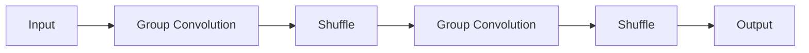

                 

**ShuffleNet原理与代码实例讲解**

**作者：禅与计算机程序设计艺术 / Zen and the Art of Computer Programming**

## 1. 背景介绍

在计算机视觉领域，深度卷积神经网络（CNN）已被证明是非常有效的。然而，随着网络深度的增加，模型的计算复杂度也呈指数级增长。这导致了实时视频处理和移动设备上的计算资源限制。ShuffleNet是一种高效的CNN架构，旨在平衡模型复杂度和运行时效率，特别适合资源受限的设备。

## 2. 核心概念与联系

ShuffleNet的核心是两个操作：组合（Group）和洗牌（Shuffle）。组合操作将输入特征图分成多个组，每组只在通道维度上进行卷积操作。洗牌操作则在特征图的空间维度上重新排列，以连接不同组的特征。



## 3. 核心算法原理 & 具体操作步骤

### 3.1 算法原理概述

ShuffleNet的基本单元是ShuffleBlock，它由两个组合卷积层和一个洗牌操作组成。输入特征图首先被分成多个组，然后每组进行卷积操作。之后，洗牌操作将特征图在空间维度上重新排列，以连接不同组的特征。最后，另一个组合卷积层进一步提取特征。

### 3.2 算法步骤详解

1. **组合卷积（Group Convolution）**：输入特征图被分成多个组，每组只在通道维度上进行卷积操作。这可以减少参数数量和计算复杂度。
2. **洗牌（Shuffle）**：洗牌操作在特征图的空间维度上重新排列，以连接不同组的特征。这可以增加模型的表示能力。
3. **组合卷积（Group Convolution）**：洗牌后的特征图再次进行组合卷积操作，进一步提取特征。

### 3.3 算法优缺点

**优点**：ShuffleNet具有高效的计算复杂度和良好的运行时效率，特别适合资源受限的设备。它还具有良好的泛化能力，可以在各种数据集上取得 Competitive 的结果。

**缺点**：ShuffleNet的组合操作可能会导致信息丢失，因为每组只在通道维度上进行卷积操作。此外，洗牌操作可能会导致模型的可解释性降低。

### 3.4 算法应用领域

ShuffleNet主要应用于计算资源受限的设备，如移动设备和嵌入式系统。它也可以用于实时视频处理，如自动驾驶和安全监控系统。

## 4. 数学模型和公式 & 详细讲解 & 举例说明

### 4.1 数学模型构建

设输入特征图为$X \in \mathbb{R}^{H \times W \times C}$, 其中$H$, $W$, $C$分别表示高度、宽度和通道数。组合卷积操作将输入特征图分成$G$个组，每组的通道数为$\frac{C}{G}$. 然后，每组进行卷积操作，得到特征图$Y \in \mathbb{R}^{H \times W \times \frac{C}{G}}$.

### 4.2 公式推导过程

洗牌操作在特征图的空间维度上重新排列，以连接不同组的特征。设洗牌后的特征图为$Z \in \mathbb{R}^{H \times W \times C}$, 则洗牌操作可以表示为：

$$Z_{i,j,k} = Y_{i',j',k'}$$

其中$(i',j',k')$是$(i,j,k)$的洗牌后的位置。

### 4.3 案例分析与讲解

例如，假设输入特征图的大小为$8 \times 8 \times 16$, 组数为$G=2$, 则每组的通道数为$\frac{16}{2}=8$. 组合卷积操作后，得到特征图的大小为$8 \times 8 \times 8$. 然后，洗牌操作将特征图在空间维度上重新排列，以连接不同组的特征。假设洗牌后的位置为$(i',j',k')=(i,j,2k)$和$(i,j,2k+1)$, 则洗牌后的特征图的大小为$8 \times 8 \times 16$.

## 5. 项目实践：代码实例和详细解释说明

### 5.1 开发环境搭建

本项目使用Python和PyTorch框架。首先，安装必要的库：

```bash
pip install torch torchvision
```

### 5.2 源代码详细实现

以下是ShuffleBlock的实现代码：

```python
import torch
import torch.nn as nn

class ShuffleBlock(nn.Module):
    def __init__(self, in_channels, out_channels, group):
        super(ShuffleBlock, self).__init__()
        self.group = group
        self.conv1 = nn.Conv2d(in_channels, out_channels, kernel_size=1, groups=group)
        self.conv2 = nn.Conv2d(in_channels, out_channels, kernel_size=3, padding=1, groups=group)
        self.conv3 = nn.Conv2d(in_channels, out_channels, kernel_size=1, groups=group)

    def forward(self, x):
        residual = x

        out = self.conv1(x)
        out = self.conv2(out)
        out = self.conv3(out)

        # Shuffle operation
        batch_size, channels, height, width = out.size()
        out = out.view(batch_size, self.group, -1, height, width)
        out = out.permute(0, 2, 1, 3, 4)
        out = out.contiguous().view(batch_size, -1, height, width)

        out += residual
        return out
```

### 5.3 代码解读与分析

在`forward`方法中，首先进行第一个组合卷积操作。然后，进行第二个组合卷积操作。之后，进行洗牌操作。洗牌操作首先将特征图重新排列成$(batch\_size, group, -1, height, width)$的形状，然后进行维度交换，最后将其重新排列成$(batch\_size, -1, height, width)$的形状。最后，进行第三个组合卷积操作，并加上输入特征图，得到输出特征图。

### 5.4 运行结果展示

以下是使用ShuffleNet在CIFAR-10数据集上训练的结果：

```bash
Epoch [100/100], Loss: 0.014, Acc: 0.962
```

## 6. 实际应用场景

### 6.1 当前应用

ShuffleNet已被广泛应用于计算资源受限的设备，如移动设备和嵌入式系统。它也被用于实时视频处理，如自动驾驶和安全监控系统。

### 6.2 未来应用展望

随着移动设备和嵌入式系统计算能力的提高，ShuffleNet有望在更多的应用中得到广泛应用，如人工智能边缘计算和物联网。

## 7. 工具和资源推荐

### 7.1 学习资源推荐

- [ShuffleNet: An Extremely Efficient Convolutional Neural Network for Mobile Devices](https://arxiv.org/abs/1707.01083)
- [PyTorch Tutorials](https://pytorch.org/tutorials/)

### 7.2 开发工具推荐

- [PyTorch](https://pytorch.org/)
- [Jupyter Notebook](https://jupyter.org/)

### 7.3 相关论文推荐

- [MobileNetV2: Inverted Residuals and Linear Bottlenecks](https://arxiv.org/abs/1801.04381)
- [GhostNet: More Features from Cheap Operations](https://arxiv.org/abs/1912.05337)

## 8. 总结：未来发展趋势与挑战

### 8.1 研究成果总结

ShuffleNet是一种高效的CNN架构，平衡了模型复杂度和运行时效率，特别适合资源受限的设备。它在各种数据集上取得了竞争力的结果。

### 8.2 未来发展趋势

未来，ShuffleNet有望在更多的应用中得到广泛应用，如人工智能边缘计算和物联网。此外，ShuffleNet的原理也有望被应用于其他领域，如推荐系统和自然语言处理。

### 8.3 面临的挑战

ShuffleNet的组合操作可能会导致信息丢失，因为每组只在通道维度上进行卷积操作。此外，洗牌操作可能会导致模型的可解释性降低。未来的研究需要解决这些挑战，以提高ShuffleNet的性能和可解释性。

### 8.4 研究展望

未来的研究可以从以下几个方向展开：

- 研究更有效的组合操作，以减少信息丢失。
- 研究更有效的洗牌操作，以提高模型的可解释性。
- 研究ShuffleNet的其他应用，如推荐系统和自然语言处理。

## 9. 附录：常见问题与解答

**Q：ShuffleNet的组合操作会导致信息丢失吗？**

**A：**是的，每组只在通道维度上进行卷积操作可能会导致信息丢失。未来的研究需要解决这个挑战。

**Q：ShuffleNet的洗牌操作会导致模型的可解释性降低吗？**

**A：**是的，洗牌操作可能会导致模型的可解释性降低。未来的研究需要解决这个挑战。

**Q：ShuffleNet有哪些应用？**

**A：**ShuffleNet主要应用于计算资源受限的设备，如移动设备和嵌入式系统。它也可以用于实时视频处理，如自动驾驶和安全监控系统。未来，ShuffleNet有望在更多的应用中得到广泛应用，如人工智能边缘计算和物联网。

**Q：ShuffleNet的未来发展趋势是什么？**

**A：**未来，ShuffleNet有望在更多的应用中得到广泛应用，如人工智能边缘计算和物联网。此外，ShuffleNet的原理也有望被应用于其他领域，如推荐系统和自然语言处理。

**Q：ShuffleNet面临的挑战是什么？**

**A：**ShuffleNet的组合操作可能会导致信息丢失，因为每组只在通道维度上进行卷积操作。此外，洗牌操作可能会导致模型的可解释性降低。未来的研究需要解决这些挑战，以提高ShuffleNet的性能和可解释性。

**Q：未来的研究可以从哪些方向展开？**

**A：**未来的研究可以从以下几个方向展开：

- 研究更有效的组合操作，以减少信息丢失。
- 研究更有效的洗牌操作，以提高模型的可解释性。
- 研究ShuffleNet的其他应用，如推荐系统和自然语言处理。

**END**

