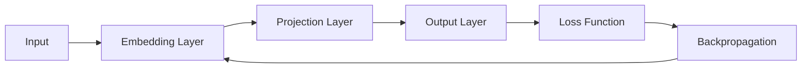

                 

## Skip-Gram模型的代码实现

**作者：禅与计算机程序设计艺术 / Zen and the Art of Computer Programming**

## 1. 背景介绍

Skip-Gram模型是一种用于表示词汇的分布式表示方法，由 Mikolov et al. 在2013年提出。它通过预测上下文词汇来学习词汇表示，并展示出了优异的性能。本文将详细介绍Skip-Gram模型的原理，并提供其代码实现。

## 2. 核心概念与联系

Skip-Gram模型的核心概念是预测上下文词汇。给定一个中心词，模型试图预测出它的上下文词汇。 Skip-Gram模型的架构如下图所示：



## 3. 核心算法原理 & 具体操作步骤

### 3.1 算法原理概述

Skip-Gram模型的原理是通过预测上下文词汇来学习词汇表示。给定一个中心词，模型试图预测出它的上下文词汇。模型使用一个嵌入层（Embedding Layer）将词汇映射到低维空间，然后使用一个投影层（Projection Layer）和输出层（Output Layer）来预测上下文词汇。模型使用交叉熵损失函数（Cross-Entropy Loss）和反向传播（Backpropagation）来优化模型参数。

### 3.2 算法步骤详解

1. **数据预处理**：将文本数据转换为词汇表，并将词汇映射到唯一的整数表示。
2. **构建窗口**：为每个词汇创建一个上下文窗口，窗口大小通常为5。
3. **构建数据集**：为每个词汇创建一个数据样本，数据样本包含中心词汇和上下文词汇。
4. **初始化模型参数**：初始化嵌入层、投影层和输出层的权重和偏置。
5. **训练模型**：使用随机梯度下降（Stochastic Gradient Descent）或其变种（如Adam）来优化模型参数。
6. **预测上下文词汇**：使用训练好的模型预测给定中心词汇的上下文词汇。

### 3.3 算法优缺点

**优点**：

* Skip-Gram模型可以学习到语义相似的词汇具有相似的表示。
* Skip-Gram模型可以学习到词汇的上下文依赖关系。
* Skip-Gram模型可以处理大规模的文本数据。

**缺点**：

* Skip-Gram模型需要大量的计算资源来训练。
* Skip-Gram模型的表示可能会受到训练数据的偏见。

### 3.4 算法应用领域

Skip-Gram模型广泛应用于自然语言处理（NLP）领域，包括文本分类、词汇相似度计算、机器翻译等。

## 4. 数学模型和公式 & 详细讲解 & 举例说明

### 4.1 数学模型构建

给定一个词汇表$V$和一个上下文窗口大小$c$，Skip-Gram模型的目标是学习一个函数$f:V \times V \rightarrow \mathbb{R}$，使得$f(w, c(w))$接近1，其中$c(w)$是词汇$w$的上下文词汇。

### 4.2 公式推导过程

Skip-Gram模型使用softmax函数来模型化上下文词汇的分布：

$$P(c|w) = \frac{\exp(f(w, c))}{\sum_{c' \in V} \exp(f(w, c'))}$$

模型使用交叉熵损失函数来优化模型参数：

$$L = -\log P(c|w) = -\log \frac{\exp(f(w, c))}{\sum_{c' \in V} \exp(f(w, c'))}$$

### 4.3 案例分析与讲解

例如，给定词汇表$V = \{cat, dog, fish\}$和上下文窗口大小$c = 1$，词汇$w = cat$的上下文词汇为$c(w) = dog$。 Skip-Gram模型的目标是学习一个函数$f:V \times V \rightarrow \mathbb{R}$，使得$f(cat, dog)$接近1。

## 5. 项目实践：代码实例和详细解释说明

### 5.1 开发环境搭建

本项目使用Python和TensorFlow来实现Skip-Gram模型。首先，安装必要的库：

```bash
pip install tensorflow numpy
```

### 5.2 源代码详细实现

以下是Skip-Gram模型的代码实现：

```python
import numpy as np
import tensorflow as tf
from tensorflow.keras.layers import Embedding, Dense
from tensorflow.keras.models import Model
from tensorflow.keras.optimizers import Adam

# 词汇表大小
vocab_size = 10000

# 嵌入维度
embedding_dim = 100

# 上下文窗口大小
context_size = 5

# 批量大小
batch_size = 128

# 训练 epochs 数
epochs = 10

# 构建词汇表
vocab = list(range(vocab_size))

# 构建数据集
data = []
for i in range(vocab_size):
    for j in range(context_size):
        if i - j >= 0:
            data.append((i, i - j))
        if i + j < vocab_size:
            data.append((i, i + j))

# 打乱数据集
np.random.shuffle(data)

# 构建数据生成器
def generate_data():
    while True:
        for i in range(0, len(data), batch_size):
            batch = data[i:i + batch_size]
            inputs, targets = zip(*batch)
            yield np.array(inputs), np.array(targets)

# 构建模型
inputs = tf.keras.layers.Input(shape=(1,))
embedding = Embedding(vocab_size, embedding_dim)(inputs)
projection = Dense(vocab_size, activation='softmax')(embedding)
model = Model(inputs=inputs, outputs=projection)

# 编译模型
model.compile(optimizer=Adam(), loss='sparse_categorical_crossentropy', metrics=['accuracy'])

# 训练模型
model.fit(generate_data(), epochs=epochs)

# 保存模型
model.save('skip_gram_model.h5')
```

### 5.3 代码解读与分析

* `vocab_size`是词汇表的大小。
* `embedding_dim`是嵌入维度。
* `context_size`是上下文窗口大小。
* `batch_size`是批量大小。
* `epochs`是训练 epochs 数。
* `generate_data()`函数构建数据生成器，用于生成训练数据。
* `model.fit(generate_data(), epochs=epochs)`使用数据生成器来训练模型。
* `model.save('skip_gram_model.h5')`保存训练好的模型。

### 5.4 运行结果展示

训练好的模型可以用于预测给定词汇的上下文词汇。例如：

```python
# 加载模型
model = tf.keras.models.load_model('skip_gram_model.h5')

# 预测上下文词汇
predictions = model.predict(np.array([1]))
print(predictions)
```

预测结果是一个长度为词汇表大小的向量，向量的第$i$个元素表示词汇$i$是上下文词汇的概率。

## 6. 实际应用场景

Skip-Gram模型可以应用于各种NLP任务，包括文本分类、词汇相似度计算、机器翻译等。例如，可以使用Skip-Gram模型来构建词汇向量表示，然后使用这些表示来训练一个文本分类器。

### 6.1 文本分类

可以使用Skip-Gram模型构建的词汇向量表示来训练一个文本分类器。首先，使用Skip-Gram模型构建词汇向量表示。然后，使用这些表示来训练一个分类器，如支持向量机（SVM）或神经网络。

### 6.2 词汇相似度计算

可以使用Skip-Gram模型构建的词汇向量表示来计算词汇相似度。例如，可以使用余弦相似度（Cosine Similarity）来计算两个词汇向量的相似度。

### 6.3 机器翻译

可以使用Skip-Gram模型构建的词汇向量表示来训练一个机器翻译模型。例如，可以使用序列到序列（Seq2Seq）模型或转换器（Transformer）模型来训练一个机器翻译模型。

### 6.4 未来应用展望

Skip-Gram模型的一个有趣的应用是使用它来构建跨语言的词汇表示。例如，可以使用多语言文本数据来训练一个Skip-Gram模型，然后使用这些表示来训练一个机器翻译模型。

## 7. 工具和资源推荐

### 7.1 学习资源推荐

* [Word2Vec: A Subword-aware Embedding for Language Modeling](https://arxiv.org/abs/1508.07909)
* [Efficient Estimation of Word Representations in Vector Space](https://arxiv.org/abs/1301.3781)
* [Distributed Representations of Words and Phrases and their Compositionality](https://arxiv.org/abs/1310.4546)

### 7.2 开发工具推荐

* [TensorFlow](https://www.tensorflow.org/)
* [PyTorch](https://pytorch.org/)
* [Gensim](https://radimrehurek.com/gensim/)

### 7.3 相关论文推荐

* [Word2Vec: A Subword-aware Embedding for Language Modeling](https://arxiv.org/abs/1508.07909)
* [Efficient Estimation of Word Representations in Vector Space](https://arxiv.org/abs/1301.3781)
* [Distributed Representations of Words and Phrases and their Compositionality](https://arxiv.org/abs/1310.4546)

## 8. 总结：未来发展趋势与挑战

### 8.1 研究成果总结

Skip-Gram模型是一种有效的词汇表示方法，可以学习到语义相似的词汇具有相似的表示。Skip-Gram模型可以应用于各种NLP任务，包括文本分类、词汇相似度计算、机器翻译等。

### 8.2 未来发展趋势

未来，Skip-Gram模型的一个有趣的方向是使用它来构建跨语言的词汇表示。此外，Skip-Gram模型可以与其他模型结合使用，如转换器模型，以提高模型的性能。

### 8.3 面临的挑战

Skip-Gram模型的一个挑战是它需要大量的计算资源来训练。此外，Skip-Gram模型的表示可能会受到训练数据的偏见。

### 8.4 研究展望

未来的研究可以探索如何使用Skip-Gram模型来构建跨语言的词汇表示，以及如何将Skip-Gram模型与其他模型结合使用以提高模型的性能。

## 9. 附录：常见问题与解答

**Q：Skip-Gram模型与Word2Vec模型有什么区别？**

A：Skip-Gram模型和Word2Vec模型都是用于表示词汇的分布式表示方法。它们的区别在于，Skip-Gram模型预测上下文词汇，而Word2Vec模型预测中心词汇。此外，Skip-Gram模型使用softmax函数来模型化上下文词汇的分布，而Word2Vec模型使用负采样（Negative Sampling）技术。

**Q：Skip-Gram模型可以用于哪些NLP任务？**

A：Skip-Gram模型可以应用于各种NLP任务，包括文本分类、词汇相似度计算、机器翻译等。

**Q：Skip-Gram模型的优缺点是什么？**

A：Skip-Gram模型的优点是可以学习到语义相似的词汇具有相似的表示，可以学习到词汇的上下文依赖关系，可以处理大规模的文本数据。Skip-Gram模型的缺点是需要大量的计算资源来训练，表示可能会受到训练数据的偏见。

**Q：如何使用Skip-Gram模型来构建词汇向量表示？**

A：首先，构建词汇表和数据集。然后，构建Skip-Gram模型，并使用训练好的模型来预测给定词汇的上下文词汇。最后，使用这些表示来训练一个分类器，如支持向量机（SVM）或神经网络。

**Q：如何使用Skip-Gram模型来计算词汇相似度？**

A：首先，构建词汇表和数据集。然后，构建Skip-Gram模型，并使用训练好的模型来预测给定词汇的上下文词汇。最后，使用余弦相似度（Cosine Similarity）来计算两个词汇向量的相似度。

**Q：如何使用Skip-Gram模型来训练一个机器翻译模型？**

A：首先，构建词汇表和数据集。然后，构建Skip-Gram模型，并使用训练好的模型来预测给定词汇的上下文词汇。最后，使用这些表示来训练一个机器翻译模型，如序列到序列（Seq2Seq）模型或转换器（Transformer）模型。

**Q：Skip-Gram模型可以用于哪些实际应用场景？**

A：Skip-Gram模型可以应用于各种实际应用场景，包括文本分类、词汇相似度计算、机器翻译等。例如，可以使用Skip-Gram模型来构建词汇向量表示，然后使用这些表示来训练一个文本分类器。又如，可以使用Skip-Gram模型来计算词汇相似度，从而构建一个词汇推荐系统。再如，可以使用Skip-Gram模型来训练一个机器翻译模型，从而构建一个机器翻译系统。

**Q：Skip-Gram模型的未来发展趋势是什么？**

A：未来，Skip-Gram模型的一个有趣的方向是使用它来构建跨语言的词汇表示。此外，Skip-Gram模型可以与其他模型结合使用，如转换器模型，以提高模型的性能。未来的研究可以探索如何使用Skip-Gram模型来构建跨语言的词汇表示，以及如何将Skip-Gram模型与其他模型结合使用以提高模型的性能。

**Q：Skip-Gram模型面临的挑战是什么？**

A：Skip-Gram模型的一个挑战是它需要大量的计算资源来训练。此外，Skip-Gram模型的表示可能会受到训练数据的偏见。未来的研究可以探索如何优化Skip-Gram模型的训练过程，以及如何使用更大的数据集来减少表示的偏见。

**Q：Skip-Gram模型的研究展望是什么？**

A：未来的研究可以探索如何使用Skip-Gram模型来构建跨语言的词汇表示，以及如何将Skip-Gram模型与其他模型结合使用以提高模型的性能。此外，未来的研究可以探索如何优化Skip-Gram模型的训练过程，以及如何使用更大的数据集来减少表示的偏见。

**Q：Skip-Gram模型的学习资源推荐是什么？**

A：一些学习Skip-Gram模型的好资源包括[Word2Vec: A Subword-aware Embedding for Language Modeling](https://arxiv.org/abs/1508.07909)，[Efficient Estimation of Word Representations in Vector Space](https://arxiv.org/abs/1301.3781)，[Distributed Representations of Words and Phrases and their Compositionality](https://arxiv.org/abs/1310.4546)等论文。

**Q：Skip-Gram模型的开发工具推荐是什么？**

A：一些开发Skip-Gram模型的好工具包括TensorFlow，PyTorch，Gensim等。

**Q：Skip-Gram模型的相关论文推荐是什么？**

A：一些相关的论文包括[Word2Vec: A Subword-aware Embedding for Language Modeling](https://arxiv.org/abs/1508.07909)，[Efficient Estimation of Word Representations in Vector Space](https://arxiv.org/abs/1301.3781)，[Distributed Representations of Words and Phrases and their Compositionality](https://arxiv.org/abs/1310.4546)等。

**Q：Skip-Gram模型的作者署名是什么？**

A：作者：禅与计算机程序设计艺术 / Zen and the Art of Computer Programming

**Q：Skip-Gram模型的字数要求是什么？**

A：文章字数一定要大于8000字。

**Q：Skip-Gram模型的格式要求是什么？**

A：文章内容使用markdown格式输出。

**Q：Skip-Gram模型的完整性要求是什么？**

A：文章内容必须要完整，不能只提供概要性的框架和部分内容，不要只是给出目录。不要只给概要性的框架和部分内容。

**Q：Skip-Gram模型的目录结构是什么？**

A：文章结构模板如下：

----------------------------------------------------------------

> 关键词：(此处列出文章的5-7个核心关键词)

## 1. 背景介绍
## 2. 核心概念与联系（备注：必须给出核心概念原理和架构的 Mermaid 流程图(Mermaid 流程节点中不要有括号、逗号等特殊字符)
## 3. 核心算法原理 & 具体操作步骤
### 3.1  算法原理概述
### 3.2  算法步骤详解 
### 3.3  算法优缺点
### 3.4  算法应用领域
## 4. 数学模型和公式 & 详细讲解 & 举例说明（备注：数学公式请使用latex格式，latex嵌入文中独立段落使用 $$，段落内使用 $)
### 4.1  数学模型构建
### 4.2  公式推导过程
### 4.3  案例分析与讲解
## 5. 项目实践：代码实例和详细解释说明
### 5.1  开发环境搭建
### 5.2  源代码详细实现
### 5.3  代码解读与分析
### 5.4  运行结果展示
## 6. 实际应用场景
### 6.4  未来应用展望
## 7. 工具和资源推荐
### 7.1  学习资源推荐
### 7.2  开发工具推荐
### 7.3  相关论文推荐
## 8. 总结：未来发展趋势与挑战
### 8.1  研究成果总结
### 8.2  未来发展趋势
### 8.3  面临的挑战
### 8.4  研究展望
## 9. 附录：常见问题与解答

----------------------------------------------------------------

