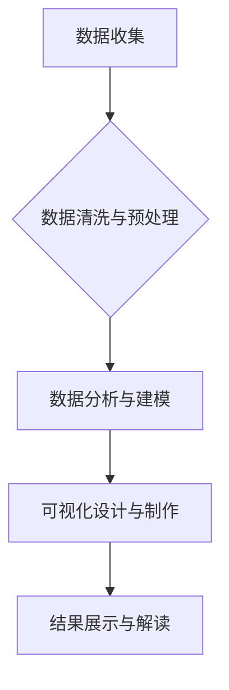

> 数据可视化, 人口统计学, 农村, 城镇, 趋势分析, GIS, Python, Tableau

## 1. 背景介绍

随着信息技术的飞速发展，海量数据正在各个领域蓬勃涌现。其中，人口数据作为反映社会发展的重要指标，蕴含着丰富的社会信息和发展趋势。如何有效地挖掘和分析人口数据，为政府决策、社会发展和个人生活提供支持，成为一个重要的研究课题。

农村和城镇是构成社会的基本单元，其人口结构、生活方式、发展水平等方面存在着显著差异。深入了解农村和城镇人口数据的分布、变化趋势以及相互关系，对于促进城乡协调发展、优化资源配置、提升人民生活水平具有重要意义。

传统的统计分析方法往往局限于数据表和图表，难以直观地展现数据背后的复杂关系和发展趋势。数据可视化技术凭借其直观、生动、易于理解的特点，为人口数据分析提供了新的视角和方法。

## 2. 核心概念与联系

数据可视化是指将数据以图形、图表、地图等形式进行呈现，以增强数据理解性和可读性。它将数据转化为视觉信息，帮助人们快速识别数据趋势、发现隐藏模式和洞察数据背后的故事。

**数据可视化分析流程:**



**核心概念:**

* **人口统计学:** 研究人口数量、结构、分布、变化规律等方面的学科。
* **地理信息系统 (GIS):** 用于处理、分析和可视化地理空间数据的系统。
* **数据挖掘:** 从大规模数据中发现隐藏的模式、规律和知识。
* **机器学习:** 利用算法从数据中学习，提高预测和决策能力。

**联系:**

数据可视化分析可以将人口统计学、GIS、数据挖掘和机器学习等多学科知识有机结合，为农村和城镇人口数据分析提供更全面、更深入的视角。

## 3. 核心算法原理 & 具体操作步骤

### 3.1  算法原理概述

数据可视化分析算法主要包括数据清洗、数据转换、数据聚类、数据建模和可视化呈现等步骤。

* **数据清洗:** 剔除数据中的错误、缺失和重复数据，确保数据质量。
* **数据转换:** 将数据转换为可视化算法所需的格式，例如将时间序列数据转换为折线图。
* **数据聚类:** 将具有相似特征的数据点进行分组，发现数据中的潜在结构和模式。
* **数据建模:** 建立数学模型或统计模型，描述数据之间的关系和趋势。
* **可视化呈现:** 将数据转化为图形、图表、地图等形式，直观地展现数据信息。

### 3.2  算法步骤详解

1. **数据收集:** 从政府统计部门、社会调查机构、互联网平台等渠道收集农村和城镇人口数据。
2. **数据清洗:** 使用数据清洗工具或编程语言对数据进行清洗，剔除错误、缺失和重复数据。
3. **数据转换:** 将数据转换为可视化算法所需的格式，例如将时间序列数据转换为折线图。
4. **数据分析:** 使用统计分析方法或机器学习算法对数据进行分析，发现数据中的趋势、模式和异常值。
5. **可视化设计:** 根据数据分析结果，选择合适的图表类型和视觉元素，设计可视化方案。
6. **可视化制作:** 使用数据可视化工具或编程语言，制作可视化图表和地图。
7. **结果展示:** 将可视化结果展示给用户，并进行解读和分析。

### 3.3  算法优缺点

**优点:**

* **直观易懂:** 数据可视化可以将复杂的数据信息转化为直观易懂的图形和图表，方便用户理解和分析。
* **发现隐藏模式:** 数据可视化可以帮助用户发现数据中的隐藏模式和趋势，提供新的洞察和启示。
* **提高决策效率:** 数据可视化可以帮助用户快速了解数据情况，提高决策效率。

**缺点:**

* **数据选择:** 选择合适的图表类型和数据指标对于数据可视化效果至关重要。
* **数据误导:** 不当的图表设计或数据处理可能会导致数据误导，影响用户判断。
* **技术门槛:** 数据可视化技术需要一定的编程和数据分析知识。

### 3.4  算法应用领域

数据可视化分析算法广泛应用于各个领域，例如：

* **人口统计学:** 分析人口结构、人口流动、人口增长趋势等。
* **城市规划:** 研究城市人口分布、交通流量、公共服务需求等。
* **商业分析:** 分析市场趋势、客户行为、销售数据等。
* **医疗保健:** 分析疾病流行、患者数据、医疗资源配置等。

## 4. 数学模型和公式 & 详细讲解 & 举例说明

### 4.1  数学模型构建

人口数据可视化分析通常使用以下数学模型：

* **人口增长模型:** 描述人口数量随时间的变化趋势，例如指数增长模型和Logistic增长模型。
* **人口结构模型:** 描述人口年龄、性别、教育水平等结构特征的分布和变化。
* **人口流动模型:** 描述人口在不同地区之间的流动趋势，例如迁移模型和通勤模型。

### 4.2  公式推导过程

**指数增长模型:**

$$
P(t) = P_0 \cdot e^{rt}
$$

其中：

* $P(t)$ 是时间 $t$ 时的人口数量。
* $P_0$ 是初始人口数量。
* $r$ 是人口增长率。
* $e$ 是自然对数的底数。

**Logistic增长模型:**

$$
\frac{dP}{dt} = rP \left(1 - \frac{P}{K}\right)
$$

其中：

* $\frac{dP}{dt}$ 是人口增长率。
* $r$ 是最大增长率。
* $P$ 是当前人口数量。
* $K$ 是环境承载力。

### 4.3  案例分析与讲解

**案例:** 假设一个农村地区的初始人口数量为 10000 人，人口增长率为 2% 。使用指数增长模型计算该地区人口在 10 年后的数量。

**计算:**

$$
P(10) = 10000 \cdot e^{0.02 \cdot 10} \approx 12214
$$

因此，该地区人口在 10 年后约为 12214 人。

## 5. 项目实践：代码实例和详细解释说明

### 5.1  开发环境搭建

* **操作系统:** Windows、macOS 或 Linux
* **编程语言:** Python
* **数据可视化工具:** Matplotlib、Seaborn、Plotly 或 Tableau

### 5.2  源代码详细实现

```python
import pandas as pd
import matplotlib.pyplot as plt

# 加载人口数据
data = pd.read_csv('population_data.csv')

# 数据清洗和预处理
# ...

# 计算人口增长率
data['population_growth_rate'] = (data['population_2020'] - data['population_2010']) / data['population_2010'] * 100

# 绘制人口增长率地图
plt.figure(figsize=(10, 6))
plt.scatter(data['longitude'], data['latitude'], s=data['population_2020'] * 0.01, c=data['population_growth_rate'], cmap='viridis')
plt.title('人口增长率地图')
plt.xlabel('经度')
plt.ylabel('纬度')
plt.colorbar(label='人口增长率 (%)')
plt.show()
```

### 5.3  代码解读与分析

* 使用 pandas 库加载人口数据。
* 使用 matplotlib 库绘制人口增长率地图。
* 地图上的每个点代表一个地区，点的颜色表示该地区的增长率。
* 点的大小表示该地区的2020年人口数量。

### 5.4  运行结果展示

运行代码后，将生成一个显示人口增长率地图的图形。

## 6. 实际应用场景

### 6.1  农村人口流动分析

利用数据可视化技术，可以分析农村人口流向、流动原因和流动趋势，为农村人口发展提供决策支持。

### 6.2  城镇化进程监测

通过可视化分析城镇人口增长、城镇化率和城乡人口结构变化等数据，可以监测城镇化进程，评估城镇化带来的影响。

### 6.3  公共服务资源配置

根据人口分布、人口需求和公共服务资源配置情况，利用数据可视化技术，可以优化公共服务资源配置，提高服务效率。

### 6.4  未来应用展望

随着数据量的不断增长和可视化技术的不断发展，数据可视化分析在农村和城镇人口数据分析领域将发挥越来越重要的作用。未来，数据可视化技术将更加智能化、个性化和交互式，为人口数据分析提供更强大的工具和手段。

## 7. 工具和资源推荐

### 7.1  学习资源推荐

* **书籍:**
    * 《数据可视化设计》
    * 《Python数据可视化》
* **在线课程:**
    * Coursera: Data Visualization
    * edX: Data Visualization with Tableau

### 7.2  开发工具推荐

* **Python:** Matplotlib, Seaborn, Plotly
* **Tableau:** 数据可视化和分析平台
* **Power BI:** 数据可视化和分析平台

### 7.3  相关论文推荐

* **"Data Visualization for Population Analysis"**
* **"Visualizing Urban Growth and Change"**

## 8. 总结：未来发展趋势与挑战

### 8.1  研究成果总结

数据可视化分析技术为农村和城镇人口数据分析提供了新的视角和方法，可以帮助我们更好地理解人口结构、人口流动、人口增长趋势等问题，为政府决策、社会发展和个人生活提供支持。

### 8.2  未来发展趋势

* **人工智能驱动的可视化:** 利用人工智能技术，自动生成更智能、更个性化的可视化图表。
* **沉浸式可视化:** 使用虚拟现实和增强现实技术，构建沉浸式的可视化体验。
* **数据故事化:** 将数据可视化与叙事结合，讲述数据背后的故事，提高用户理解和记忆。

### 8.3  面临的挑战

* **数据质量:** 数据可视化效果依赖于数据质量，需要不断提高数据采集、清洗和处理的效率。
* **可视化设计:** 选择合适的图表类型和视觉元素对于数据可视化效果至关重要，需要不断探索新的可视化方法。
* **技术普及:** 数据可视化技术需要一定的编程和数据分析知识，需要提高大众对数据可视化技术的理解和应用能力。

### 8.4  研究展望

未来，我们将继续探索数据可视化技术在农村和城镇人口数据分析领域的应用，开发更智能、更便捷、更具洞察力的可视化工具，为社会发展提供更有效的支持。

## 9. 附录：常见问题与解答

**问题:** 如何选择合适的图表类型？

**解答:** 选择图表类型需要根据数据类型、数据关系和分析目标。例如，时间序列数据可以使用折线图，分类数据可以使用柱状图，地理空间数据可以使用地图。

**问题:** 如何避免数据误导？

**解答:** 数据可视化设计需要遵循一定的原则，例如避免过度装饰、选择合适的颜色和比例，并提供清晰的解释和说明。

**问题:** 如何提高数据可视化效果？

**解答:** 可以使用更丰富的视觉元素，例如动画、交互和3D效果，提高用户体验和理解度。


作者：禅与计算机程序设计艺术 / Zen and the Art of Computer Programming 
