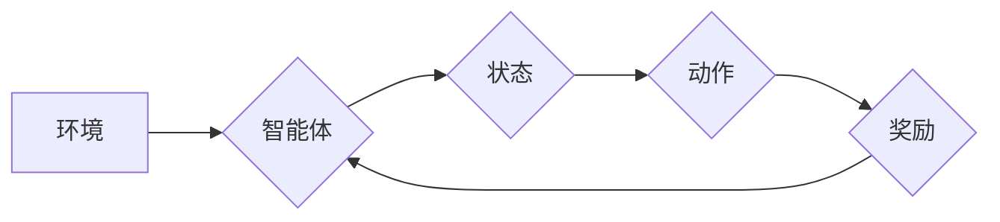

> 自动机器学习 (AutoML)、神经架构搜索 (NAS)、强化学习 (RL)、深度学习 (DL)、进化算法

## 1. 背景介绍

随着深度学习的蓬勃发展，模型的复杂度和参数量不断增加，模型设计和训练变得越来越困难。传统人工设计模型架构的方法效率低下，难以探索出最优的模型结构。为了解决这一问题，自动机器学习 (AutoML) 应运而生，其中神经架构搜索 (NAS) 作为其重要分支，旨在自动搜索最优的模型架构。

NAS的目标是通过自动搜索算法找到最适合特定任务的模型结构，从而提高模型性能和效率。传统的NAS方法主要依赖于启发式搜索算法，例如进化算法、梯度下降等，这些方法往往难以探索整个搜索空间，且计算成本较高。

近年来，强化学习 (RL) 作为一种强大的机器学习算法，在NAS领域取得了显著进展。RL算法可以将模型架构搜索问题转化为一个马尔可夫决策过程 (MDP)，通过学习策略，找到最优的架构搜索路径。

## 2. 核心概念与联系

**2.1 强化学习 (RL)**

RL是一种基于交互学习的机器学习方法，其核心思想是通过奖励机制引导智能体在环境中采取最优行动。RL系统由以下几个关键组成部分组成：

* **智能体 (Agent):** 负责做出决策并与环境交互。
* **环境 (Environment):** 提供智能体感知的信息和反馈。
* **状态 (State):** 描述环境当前的状态。
* **动作 (Action):** 智能体可以采取的行动。
* **奖励 (Reward):** 环境对智能体动作的反馈，用于指导智能体学习。
* **策略 (Policy):** 智能体根据当前状态选择动作的策略。

**2.2 神经架构搜索 (NAS)**

NAS的目标是自动搜索最优的模型架构，以提高模型性能和效率。NAS可以将模型架构搜索问题转化为一个优化问题，通过搜索算法找到最优的架构。

**2.3 强化学习与NAS的结合**

将RL与NAS结合，可以构建一个智能体，通过学习策略，自动搜索最优的模型架构。RL算法可以将NAS问题转化为一个MDP，其中：

* **状态:** 当前模型架构。
* **动作:** 对模型架构进行修改的操作。
* **奖励:** 模型在特定任务上的性能。

通过学习策略，RL智能体可以不断探索不同的模型架构，并选择性能最好的架构。

**2.4  Mermaid 流程图**



## 3. 核心算法原理 & 具体操作步骤

### 3.1  算法原理概述

基于RL的NAS算法通常采用以下步骤：

1. **定义搜索空间:** 首先需要定义模型架构的搜索空间，包括可搜索的层类型、连接方式、参数数量等。
2. **构建奖励函数:** 奖励函数用于评估模型在特定任务上的性能，例如准确率、损失函数值等。
3. **训练RL智能体:** 使用RL算法训练智能体，使其学习策略，选择最优的模型架构。
4. **评估模型性能:** 在测试集上评估训练得到的模型性能，并根据性能进行反馈。

### 3.2  算法步骤详解

1. **初始化:** 初始化RL智能体，并设置搜索空间、奖励函数和训练参数。
2. **搜索:** 智能体根据策略选择一个模型架构，并将其训练。
3. **评估:** 评估模型在测试集上的性能，并计算奖励。
4. **更新策略:** 使用奖励更新智能体的策略，使其倾向于选择性能更好的架构。
5. **重复步骤2-4:** 重复上述步骤，直到达到预设的训练次数或性能目标。

### 3.3  算法优缺点

**优点:**

* 可以探索更广阔的搜索空间，找到更优的模型架构。
* 能够自动适应不同的任务和数据集。

**缺点:**

* 计算成本较高，训练时间较长。
* 奖励函数的设计对算法性能有很大影响。

### 3.4  算法应用领域

基于RL的NAS算法在图像分类、目标检测、自然语言处理等领域取得了成功应用。

## 4. 数学模型和公式 & 详细讲解 & 举例说明

### 4.1  数学模型构建

RL算法可以将NAS问题转化为一个MDP，其中：

* **状态空间:** 所有可能的模型架构。
* **动作空间:** 对模型架构进行修改的操作，例如添加层、改变连接方式等。
* **转移概率:** 从一个状态到另一个状态的概率。
* **奖励函数:** 评估模型在特定任务上的性能。

### 4.2  公式推导过程

RL算法的目标是学习一个策略 $\pi(s,a)$，其中 $s$ 是当前状态， $a$ 是动作。策略 $\pi(s,a)$ 表示在状态 $s$ 下采取动作 $a$ 的概率。

常用的RL算法包括Q学习、SARSA等。这些算法通过迭代更新Q值表，来学习策略。Q值表 $Q(s,a)$ 表示在状态 $s$ 下采取动作 $a$ 后获得的期望奖励。

### 4.3  案例分析与讲解

例如，在图像分类任务中，我们可以使用Q学习算法进行NAS。

* **状态空间:** 所有可能的卷积神经网络架构。
* **动作空间:** 添加卷积层、改变卷积核大小、改变池化方式等。
* **奖励函数:** 模型在测试集上的准确率。

通过训练Q学习算法，我们可以学习到一个策略，该策略可以指导智能体选择最优的卷积神经网络架构。

## 5. 项目实践：代码实例和详细解释说明

### 5.1  开发环境搭建

* Python 3.6+
* TensorFlow 2.0+
* PyTorch 1.0+
* CUDA 10.0+

### 5.2  源代码详细实现

```python
# 导入必要的库
import tensorflow as tf
from tensorflow.keras.models import Model
from tensorflow.keras.layers import Conv2D, MaxPooling2D, Flatten, Dense

# 定义搜索空间
search_space = {
    'num_layers': [2, 3, 4],
    'filters': [32, 64, 128],
    'kernel_size': [3, 5],
    'pool_size': [2, 3],
}

# 定义奖励函数
def reward_function(model, dataset):
    # 使用模型对数据集进行预测
    predictions = model.predict(dataset)
    # 计算模型的准确率
    accuracy = tf.keras.metrics.categorical_accuracy(dataset[:, 1], predictions)
    # 返回准确率作为奖励
    return accuracy

# 定义RL智能体
class NASAgent:
    def __init__(self, search_space):
        self.search_space = search_space
        # 初始化策略
        self.policy = tf.random.uniform(shape=(len(search_space),))

    def choose_action(self, state):
        # 根据策略选择动作
        action = tf.random.categorical(self.policy, num_samples=1)
        return action

    def update_policy(self, reward):
        # 使用奖励更新策略
        # ...

# 训练RL智能体
agent = NASAgent(search_space)
for episode in range(num_episodes):
    # 初始化状态
    state = random.sample(search_space, 1)
    # 训练模型
    model = build_model(state)
    # 计算奖励
    reward = reward_function(model, dataset)
    # 更新策略
    agent.update_policy(reward)

```

### 5.3  代码解读与分析

* **搜索空间定义:** 首先定义了模型架构的搜索空间，包括可搜索的层类型、连接方式、参数数量等。
* **奖励函数定义:** 定义了奖励函数，用于评估模型在特定任务上的性能，例如准确率、损失函数值等。
* **RL智能体定义:** 定义了RL智能体，包括策略初始化、动作选择和策略更新等方法。
* **训练循环:** 训练RL智能体，通过迭代更新策略，使其倾向于选择性能更好的模型架构。

### 5.4  运行结果展示

训练完成后，可以评估训练得到的模型性能，并选择性能最好的模型架构。

## 6. 实际应用场景

基于RL的NAS算法在图像分类、目标检测、自然语言处理等领域取得了成功应用。

### 6.1  图像分类

例如，Google的AutoML Vision使用RL算法自动搜索图像分类模型架构，取得了超过人类专家水平的性能。

### 6.2  目标检测

Facebook的Detectron2也使用RL算法进行NAS，提高了目标检测模型的性能和效率。

### 6.3  自然语言处理

OpenAI的GPT-3也使用了RL算法进行NAS，提高了语言模型的生成能力。

### 6.4  未来应用展望

未来，基于RL的NAS算法将应用于更多领域，例如药物研发、材料科学等。

## 7. 工具和资源推荐

### 7.1  学习资源推荐

* **书籍:**
    * 《Reinforcement Learning: An Introduction》 by Richard S. Sutton and Andrew G. Barto
    * 《Deep Reinforcement Learning Hands-On》 by Maxim Lapan
* **在线课程:**
    * Coursera: Reinforcement Learning Specialization
    * Udacity: Deep Reinforcement Learning Nanodegree

### 7.2  开发工具推荐

* **TensorFlow:** https://www.tensorflow.org/
* **PyTorch:** https://pytorch.org/
* **Keras:** https://keras.io/

### 7.3  相关论文推荐

* **NASNet:** https://arxiv.org/abs/1707.07012
* **EfficientNet:** https://arxiv.org/abs/1905.11946
* **DARTS:** https://arxiv.org/abs/1806.09090

## 8. 总结：未来发展趋势与挑战

### 8.1  研究成果总结

基于RL的NAS算法取得了显著进展，在模型性能和效率方面取得了突破。

### 8.2  未来发展趋势

* **更有效的搜索算法:** 探索更有效的搜索算法，提高搜索效率和探索能力。
* **多任务学习:** 研究多任务学习的NAS算法，提高模型的泛化能力。
* **硬件加速:** 利用硬件加速技术，加速NAS算法的训练和推理过程。

### 8.3  面临的挑战

* **计算成本:** RL算法的训练成本较高，需要大量的计算资源。
* **奖励函数设计:** 奖励函数的设计对算法性能有很大影响，需要精心设计。
* **可解释性:** RL算法的决策过程难以解释，需要提高算法的可解释性。

### 8.4  研究展望

未来，基于RL的NAS算法将继续发展，并应用于更多领域，推动人工智能技术的发展。

## 9. 附录：常见问题与解答

**Q1: RL算法的训练时间较长，如何提高训练效率？**

**A1:** 可以使用以下方法提高训练效率：

* 使用更有效的搜索算法。
* 利用硬件加速技术，例如GPU加速。
* 使用预训练模型，减少训练时间。

**Q2: 如何设计一个好的奖励函数？**

**A2:** 奖励函数的设计需要根据具体的任务和目标进行设计。一般来说，奖励函数应该能够准确地反映模型性能，并鼓励模型学习最优的架构。

**Q3: RL算法的决策过程难以解释，如何提高算法的可解释性？**

**A3:** 可以使用以下方法提高算法的可解释性：

* 使用可解释的RL算法，例如LIME、SHAP等。
* 分析RL算法的决策过程，找出关键的因素。
* 使用可视化工具，直观地展示RL算法的决策过程。


作者：禅与计算机程序