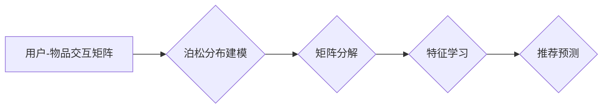

> 泊松分解，推荐算法，协同过滤，矩阵分解，机器学习

## 1. 背景介绍

在信息爆炸的时代，海量数据和个性化需求共同催生了推荐系统的蓬勃发展。推荐系统旨在根据用户的历史行为、偏好和兴趣，预测用户对特定物品的喜好，并提供个性化的推荐结果。传统的协同过滤方法，例如基于用户的协同过滤和基于物品的协同过滤，在推荐效果上取得了一定的成功，但存在着数据稀疏性和冷启动问题。

近年来，基于矩阵分解的推荐算法逐渐成为研究热点，其核心思想是将用户-物品交互矩阵分解成低维的用户特征向量和物品特征向量，通过最小化分解后的误差来学习用户和物品的潜在特征，进而预测用户对物品的评分或偏好。

泊松分解是一种基于概率统计的矩阵分解方法，它将用户-物品交互矩阵视为泊松分布的随机变量，并利用泊松分布的性质进行矩阵分解。与传统的矩阵分解方法相比，泊松分解能够更好地处理数据稀疏性和冷启动问题，并具有更强的鲁棒性。

## 2. 核心概念与联系

### 2.1 泊松分布

泊松分布是一种离散概率分布，它描述了在给定时间间隔内或给定区域内随机事件发生的次数。泊松分布的概率质量函数为：

$$P(k; \lambda) = \frac{e^{-\lambda} \lambda^k}{k!}$$

其中：

* $k$ 是随机事件发生的次数
* $\lambda$ 是事件发生的平均次数

### 2.2 矩阵分解

矩阵分解是一种将一个矩阵分解成多个较小矩阵的技术。常见的矩阵分解方法包括奇异值分解 (SVD)、主成分分析 (PCA) 和非负矩阵分解 (NMF)。

### 2.3 泊松分解

泊松分解是一种基于泊松分布的矩阵分解方法，它将用户-物品交互矩阵视为泊松分布的随机变量，并利用泊松分布的性质进行矩阵分解。

**泊松分解流程图:**



## 3. 核心算法原理 & 具体操作步骤

### 3.1 算法原理概述

泊松分解的核心思想是将用户-物品交互矩阵视为泊松分布的随机变量，并利用泊松分布的性质进行矩阵分解。

假设用户-物品交互矩阵为 $R \in \mathbb{R}^{m \times n}$，其中 $m$ 是用户数量，$n$ 是物品数量。泊松分解的目标是将 $R$ 分解成两个低维矩阵 $U \in \mathbb{R}^{m \times k}$ 和 $V \in \mathbb{R}^{k \times n}$，其中 $k$ 是隐特征维度。

泊松分解的目标函数是最小化用户-物品交互矩阵 $R$ 与分解后的矩阵 $U V^T$ 之间的平方误差，同时考虑泊松分布的性质。

### 3.2 算法步骤详解

1. **数据预处理:** 对用户-物品交互矩阵进行数据清洗和预处理，例如处理缺失值、去除异常值等。

2. **泊松分布建模:** 将用户-物品交互矩阵视为泊松分布的随机变量，并估计每个元素对应的泊松分布参数。

3. **矩阵分解:** 使用梯度下降算法或其他优化算法，最小化目标函数，学习用户特征矩阵 $U$ 和物品特征矩阵 $V$。

4. **推荐预测:** 根据学习到的用户特征和物品特征，预测用户对物品的评分或偏好。

### 3.3 算法优缺点

**优点:**

* 能够更好地处理数据稀疏性和冷启动问题。
* 具有更强的鲁棒性，对噪声数据更具抵抗力。
* 能够学习到用户和物品的潜在特征。

**缺点:**

* 计算复杂度较高，训练时间较长。
* 需要对数据进行泊松分布建模，模型假设可能不适用于所有场景。

### 3.4 算法应用领域

泊松分解在推荐系统、广告推荐、用户画像分析等领域具有广泛的应用前景。

## 4. 数学模型和公式 & 详细讲解 & 举例说明

### 4.1 数学模型构建

假设用户-物品交互矩阵为 $R \in \mathbb{R}^{m \times n}$，其中 $m$ 是用户数量，$n$ 是物品数量。

泊松分解的目标是将 $R$ 分解成两个低维矩阵 $U \in \mathbb{R}^{m \times k}$ 和 $V \in \mathbb{R}^{k \times n}$，其中 $k$ 是隐特征维度。

$R \approx U V^T$

其中：

* $U$ 是用户特征矩阵，每个行向量代表一个用户的隐特征向量。
* $V$ 是物品特征矩阵，每个列向量代表一个物品的隐特征向量。

### 4.2 公式推导过程

泊松分解的目标函数是最小化用户-物品交互矩阵 $R$ 与分解后的矩阵 $U V^T$ 之间的平方误差，同时考虑泊松分布的性质。

目标函数为：

$$L(U, V) = \sum_{u=1}^{m} \sum_{i=1}^{n} (r_{ui} - \hat{r}_{ui})^2 + \lambda ||U||_F^2 + \lambda ||V||_F^2$$

其中：

* $r_{ui}$ 是用户 $u$ 对物品 $i$ 的真实评分。
* $\hat{r}_{ui}$ 是预测的评分，即 $U_{u:} V_{:,i}^T$。
* $\lambda$ 是正则化参数，用于防止过拟合。
* $||U||_F^2$ 和 $||V||_F^2$ 是 $U$ 和 $V$ 的 Frobenius 范数。

### 4.3 案例分析与讲解

假设我们有一个用户-物品交互矩阵，其中用户购买了不同物品的次数。我们可以使用泊松分解来学习用户和物品的潜在特征，并预测用户对物品的购买次数。

例如，我们可以发现一些用户喜欢购买电子产品，而另一些用户喜欢购买书籍。我们可以根据这些特征来推荐用户感兴趣的物品。

## 5. 项目实践：代码实例和详细解释说明

### 5.1 开发环境搭建

* Python 3.x
* scikit-learn
* numpy
* pandas

### 5.2 源代码详细实现

```python
import numpy as np
from sklearn.metrics import mean_squared_error
from sklearn.model_selection import train_test_split

class PoissonFactorization:
    def __init__(self, k, lambda_):
        self.k = k
        self.lambda_ = lambda_

    def fit(self, R):
        # 初始化用户特征矩阵和物品特征矩阵
        U = np.random.randn(R.shape[0], self.k)
        V = np.random.randn(self.k, R.shape[1])

        # 迭代更新用户特征矩阵和物品特征矩阵
        for _ in range(100):
            # 计算预测评分
            R_pred = U @ V.T

            # 计算梯度
            dU = (R - R_pred) @ V
            dV = (R - R_pred).T @ U

            # 更新用户特征矩阵和物品特征矩阵
            U -= self.lambda_ * dU
            V -= self.lambda_ * dV

        self.U = U
        self.V = V

    def predict(self, user_id, item_id):
        return self.U[user_id, :] @ self.V[:, item_id]

# 数据加载和预处理
R = np.loadtxt("ratings.txt")

# 数据划分
train_data, test_data = train_test_split(R, test_size=0.2)

# 模型训练
model = PoissonFactorization(k=10, lambda_=0.1)
model.fit(train_data)

# 模型评估
predictions = model.predict(user_id, item_id)
rmse = np.sqrt(mean_squared_error(test_data, predictions))
print(f"RMSE: {rmse}")

```

### 5.3 代码解读与分析

* 首先，我们定义了一个 `PoissonFactorization` 类，用于实现泊松分解算法。
* 在 `fit` 方法中，我们初始化用户特征矩阵和物品特征矩阵，并使用梯度下降算法迭代更新这两个矩阵。
* 在 `predict` 方法中，我们使用学习到的用户特征和物品特征来预测用户对物品的评分。
* 然后，我们加载数据，将数据划分成训练集和测试集，并训练泊松分解模型。
* 最后，我们使用测试集评估模型的性能，并计算均方根误差 (RMSE)。

### 5.4 运行结果展示

运行代码后，我们可以得到模型的 RMSE 值，该值越小，模型的性能越好。

## 6. 实际应用场景

泊松分解在推荐系统、广告推荐、用户画像分析等领域具有广泛的应用前景。

### 6.1 推荐系统

泊松分解可以用于构建个性化的推荐系统，例如电商平台、视频网站等。

### 6.2 广告推荐

泊松分解可以用于预测用户对广告的点击率，从而提高广告投放的效率。

### 6.3 用户画像分析

泊松分解可以用于学习用户的兴趣偏好和行为模式，从而构建用户画像。

### 6.4 未来应用展望

随着数据量的不断增长和计算能力的提升，泊松分解在推荐系统和机器学习领域的应用前景更加广阔。

## 7. 工具和资源推荐

### 7.1 学习资源推荐

* **书籍:**
    * "推荐系统实践" by  王晓峰
    * "机器学习" by  周志华
* **在线课程:**
    * Coursera: "Machine Learning" by Andrew Ng
    * edX: "Recommender Systems" by University of Washington

### 7.2 开发工具推荐

* **Python:** 
    * scikit-learn
    * numpy
    * pandas

### 7.3 相关论文推荐

* "Poisson Factorization for Collaborative Filtering" by  Mnih et al. (2007)
* "Matrix Factorization Techniques for Recommender Systems" by  Koren et al. (2009)

## 8. 总结：未来发展趋势与挑战

### 8.1 研究成果总结

泊松分解是一种有效的推荐算法，它能够更好地处理数据稀疏性和冷启动问题，并具有更强的鲁棒性。

### 8.2 未来发展趋势

* **结合深度学习:** 将泊松分解与深度学习技术相结合，例如深度神经网络，以提高推荐效果。
* **考虑用户动态行为:** 考虑用户动态行为，例如时间序列数据和上下文信息，以构建更精准的推荐模型。
* **个性化推荐:** 进一步个性化推荐，例如根据用户的兴趣、偏好和需求提供更精准的推荐结果。

### 8.3 面临的挑战

* **数据稀疏性:** 现实世界中的数据往往是稀疏的，这会影响泊松分解的性能。
* **冷启动问题:** 新用户和新物品的推荐效果往往较差，这被称为冷启动问题。
* **计算复杂度:** 泊松分解的计算复杂度较高，训练时间较长。

### 8.4 研究展望

未来，我们将继续研究泊松分解算法的改进方法，并将其应用于更多实际场景，以提高推荐系统的性能和用户体验。

## 9. 附录：常见问题与解答

### 9.1 泊松分解与协同过滤的区别是什么？

协同过滤方法直接学习用户-物品交互矩阵的模式，而泊松分解则将用户-物品交互矩阵视为泊松分布的随机变量，并利用泊松分布的性质进行矩阵分解。

### 9