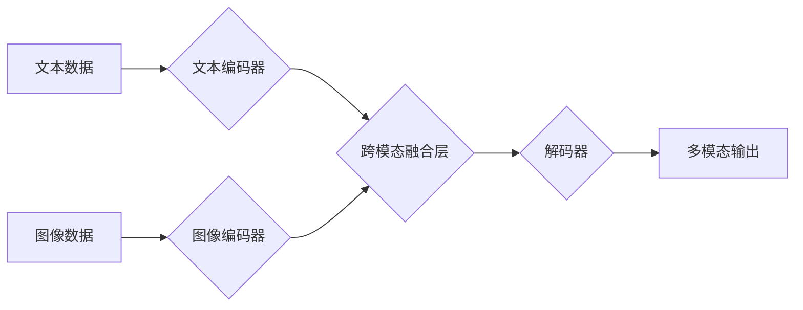

> 多模态大模型，大语言模型，图像识别，自然语言处理，计算机视觉，深度学习，Transformer，BERT，Vision Transformer

## 1. 背景介绍

近年来，人工智能技术取得了飞速发展，其中大模型在自然语言处理、计算机视觉等领域取得了突破性进展。传统的单模态模型只能处理单一类型的数据，例如文本或图像。而多模态大模型能够处理多种类型的数据，例如文本、图像、音频、视频等，并从中学习到更丰富的知识和表示。

多模态大模型的出现，标志着人工智能迈向更智能、更通用化的方向。它能够更好地理解和模拟人类的认知能力，并应用于更广泛的场景，例如：

* **智能客服:** 通过文本和语音交互，提供更自然、更人性化的服务体验。
* **内容创作:** 基于文本和图像的输入，自动生成高质量的文本、图像、视频等内容。
* **跨模态搜索:** 根据文本或图像查询，检索相关的多模态内容。
* **医疗诊断:** 通过分析患者的医学影像和病历，辅助医生进行诊断。

## 2. 核心概念与联系

多模态大模型的核心是融合不同模态数据的信息，学习跨模态的表示和关系。

**2.1  模态数据:** 指不同类型的数据，例如文本、图像、音频、视频等。

**2.2  跨模态表示:** 指能够将不同模态数据映射到同一个语义空间，使得不同模态的数据能够相互理解和交互。

**2.3  多模态融合:** 指将不同模态数据的信息融合在一起，学习更丰富的知识和表示。

**2.4  多模态任务:** 指利用多模态数据进行的各种任务，例如图像字幕生成、文本图像匹配、视频问答等。

**2.5  多模态架构:** 指用于构建多模态大模型的架构，例如基于Transformer的架构、基于图神经网络的架构等。

**Mermaid 流程图:**



## 3. 核心算法原理 & 具体操作步骤

### 3.1  算法原理概述

多模态大模型的训练主要基于深度学习算法，例如Transformer、图神经网络等。这些算法能够学习数据之间的复杂关系，并生成跨模态的表示。

### 3.2  算法步骤详解

1. **数据预处理:** 将多模态数据进行预处理，例如文本分词、图像裁剪、音频降噪等。
2. **模态编码:** 使用不同的编码器对不同模态数据进行编码，例如使用BERT对文本进行编码，使用Vision Transformer对图像进行编码。
3. **跨模态融合:** 将不同模态的编码结果进行融合，例如使用注意力机制、拼接操作等。
4. **解码:** 使用解码器将融合后的结果解码成最终的输出，例如生成文本、预测图像类别等。
5. **损失函数:** 使用损失函数衡量模型的预测结果与真实值的差距，并通过反向传播算法更新模型参数。

### 3.3  算法优缺点

**优点:**

* 能够处理多种类型的数据，学习更丰富的知识和表示。
* 在跨模态任务中表现优异，例如图像字幕生成、文本图像匹配等。

**缺点:**

* 训练成本高，需要大量的计算资源和数据。
* 模型复杂度高，难以理解和调试。

### 3.4  算法应用领域

* **智能客服:** 通过文本和语音交互，提供更自然、更人性化的服务体验。
* **内容创作:** 基于文本和图像的输入，自动生成高质量的文本、图像、视频等内容。
* **跨模态搜索:** 根据文本或图像查询，检索相关的多模态内容。
* **医疗诊断:** 通过分析患者的医学影像和病历，辅助医生进行诊断。

## 4. 数学模型和公式 & 详细讲解 & 举例说明

### 4.1  数学模型构建

多模态大模型的数学模型通常基于深度学习框架，例如TensorFlow、PyTorch等。模型的结构通常由多个层组成，例如编码器、解码器、注意力层等。

### 4.2  公式推导过程

例如，Transformer模型中的注意力机制公式如下：

$$
Attention(Q, K, V) = \frac{exp(Q \cdot K^T / \sqrt{d_k})}{exp(Q \cdot K^T / \sqrt{d_k})} \cdot V
$$

其中：

* $Q$：查询矩阵
* $K$：键矩阵
* $V$：值矩阵
* $d_k$：键向量的维度

### 4.3  案例分析与讲解

例如，在图像字幕生成任务中，多模态大模型会将图像编码成一个向量表示，并将文本编码成一个序列向量表示。然后，模型会使用注意力机制来学习图像和文本之间的关系，并生成相应的字幕。

## 5. 项目实践：代码实例和详细解释说明

### 5.1  开发环境搭建

使用Python语言开发多模态大模型，需要安装相关的库和工具，例如TensorFlow、PyTorch、OpenCV等。

### 5.2  源代码详细实现

```python
# 使用TensorFlow构建多模态大模型
import tensorflow as tf

# 定义文本编码器
text_encoder = tf.keras.Sequential([
    tf.keras.layers.Embedding(vocab_size, embedding_dim),
    tf.keras.layers.LSTM(units)
])

# 定义图像编码器
image_encoder = tf.keras.Sequential([
    tf.keras.layers.Conv2D(filters, kernel_size),
    tf.keras.layers.MaxPooling2D(pool_size),
    tf.keras.layers.Flatten()
])

# 定义跨模态融合层
fusion_layer = tf.keras.layers.Concatenate()

# 定义解码器
decoder = tf.keras.Sequential([
    # ...
])

# 定义模型
model = tf.keras.Model(inputs=[text_input, image_input], outputs=decoder(fusion_layer([text_encoder(text_input), image_encoder(image_input)])))

# 编译模型
model.compile(optimizer='adam', loss='categorical_crossentropy', metrics=['accuracy'])

# 训练模型
model.fit(x_train, y_train, epochs=10)
```

### 5.3  代码解读与分析

这段代码展示了使用TensorFlow构建多模态大模型的基本流程。

* 首先定义了文本编码器和图像编码器，分别对文本和图像数据进行编码。
* 然后定义了跨模态融合层，将编码后的文本和图像信息融合在一起。
* 最后定义了解码器，将融合后的信息解码成最终的输出。

### 5.4  运行结果展示

训练完成后，可以将模型应用于实际任务中，例如图像字幕生成、文本图像匹配等。

## 6. 实际应用场景

### 6.1  智能客服

多模态大模型可以理解用户通过文本和语音的交互，提供更自然、更人性化的服务体验。例如，用户可以向智能客服发送语音消息，智能客服可以理解用户的语音内容，并提供相应的回复。

### 6.2  内容创作

多模态大模型可以根据文本和图像的输入，自动生成高质量的文本、图像、视频等内容。例如，用户可以提供一个文本描述，多模态大模型可以根据文本描述生成相应的图像或视频。

### 6.3  跨模态搜索

多模态大模型可以根据文本或图像查询，检索相关的多模态内容。例如，用户可以输入一个文本关键词，多模态大模型可以检索出与该关键词相关的文本、图像、视频等内容。

### 6.4  未来应用展望

多模态大模型在未来将有更广泛的应用场景，例如：

* **教育:** 提供个性化的学习体验，例如根据学生的学习进度和风格，生成相应的学习内容。
* **医疗:** 辅助医生进行诊断，例如分析患者的医学影像，辅助医生判断疾病类型。
* **娱乐:** 创建更沉浸式的娱乐体验，例如根据用户的喜好，生成个性化的游戏场景。

## 7. 工具和资源推荐

### 7.1  学习资源推荐

* **书籍:**
    * 《深度学习》
    * 《自然语言处理》
    * 《计算机视觉》
* **在线课程:**
    * Coursera
    * edX
    * Udacity

### 7.2  开发工具推荐

* **TensorFlow:** 开源深度学习框架
* **PyTorch:** 开源深度学习框架
* **OpenCV:** 图像处理库

### 7.3  相关论文推荐

* **BERT:** Pre-training of Deep Bidirectional Transformers for Language Understanding
* **Vision Transformer:** An Image is Worth 16x16 Words: Transformers for Image Recognition at Scale

## 8. 总结：未来发展趋势与挑战

### 8.1  研究成果总结

多模态大模型在跨模态任务中取得了显著的进展，例如图像字幕生成、文本图像匹配等。

### 8.2  未来发展趋势

* **模型规模更大:** 未来多模态大模型的规模将进一步扩大，学习更丰富的知识和表示。
* **跨模态融合更深:** 未来将探索更有效的跨模态融合方法，更好地学习不同模态之间的关系。
* **应用场景更广泛:** 多模态大模型将应用于更多领域，例如教育、医疗、娱乐等。

### 8.3  面临的挑战

* **数据获取困难:** 多模态数据的获取和标注成本较高。
* **模型训练复杂:** 多模态大模型的训练需要大量的计算资源和时间。
* **伦理问题:** 多模态大模型的应用可能带来一些伦理问题，例如数据隐私、算法偏见等。

### 8.4  研究展望

未来研究将重点关注以下几个方面:

* **高效的数据标注方法:** 降低多模态数据的标注成本。
* **更有效的跨模态融合方法:** 更好地学习不同模态之间的关系。
* **可解释性:** 提高多模态大模型的可解释性，帮助人们理解模型的决策过程。
* **伦理问题:** 研究多模态大模型的伦理问题，并制定相应的规范和政策。

## 9. 附录：常见问题与解答

### 9.1  Q1: 多模态大模型的训练成本高吗？

**A1:** 是的，多模态大模型的训练成本较高，需要大量的计算资源和数据。

### 9.2  Q2: 多模态大模型的应用场景有哪些？

**A2:** 多模态大模型的应用场景非常广泛，例如智能客服、内容创作、跨模态搜索、医疗诊断等。

### 9.3  Q3: 如何学习多模态大模型？

**A3:** 可以通过阅读相关书籍、在线课程、论文等方式学习多模态大模型。

作者：禅与计算机程序设计艺术 / Zen and the Art of Computer Programming


<end_of_turn>