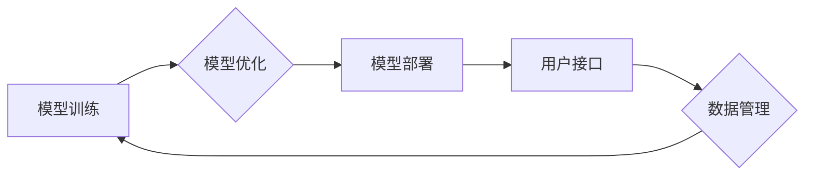

> 大模型、产品化、挑战、乐趣、落地应用、技术架构、算法原理、实践经验、未来趋势

## 1. 背景介绍

近年来，深度学习技术取得了飞速发展，大模型（Large Language Model，LLM）作为其重要分支，展现出强大的泛化能力和应用潜力。从文本生成、机器翻译到代码编写、图像理解，大模型在各个领域都取得了突破性进展。然而，将这些强大的模型转化为实际产品，并将其应用于现实世界，仍然面临着诸多挑战。

大模型产品的开发和应用，需要跨越多个领域的技术积累和经验沉淀，包括机器学习、自然语言处理、软件工程、产品设计等。同时，大模型产品的成功也离不开对用户需求的深刻理解和对商业模式的创新探索。

## 2. 核心概念与联系

大模型产品通常由以下几个核心模块组成：

* **模型训练:** 利用海量数据训练大模型，使其具备强大的知识表示和推理能力。
* **模型优化:** 对训练好的模型进行调优，提高其性能和效率。
* **模型部署:** 将训练好的模型部署到生产环境中，使其能够提供服务。
* **用户接口:** 提供用户友好的接口，方便用户与大模型进行交互。
* **数据管理:** 建立完善的数据管理体系，保障数据质量和安全。

**Mermaid 流程图:**



## 3. 核心算法原理 & 具体操作步骤

### 3.1  算法原理概述

大模型的训练主要基于深度学习算法，其中Transformer模型是目前最主流的架构。Transformer模型利用自注意力机制，能够捕捉文本序列中长距离依赖关系，从而实现更准确的文本理解和生成。

### 3.2  算法步骤详解

1. **数据预处理:** 将原始文本数据进行清洗、分词、标记等预处理操作，使其能够被模型理解。
2. **模型构建:** 根据Transformer模型架构，构建模型结构，包括编码器、解码器和注意力机制等模块。
3. **模型训练:** 利用训练数据，通过反向传播算法，调整模型参数，使其能够生成更准确的文本输出。
4. **模型评估:** 使用验证集或测试集，评估模型的性能，例如准确率、困惑度等指标。
5. **模型调优:** 根据评估结果，调整模型超参数，例如学习率、批处理大小等，进一步提高模型性能。

### 3.3  算法优缺点

**优点:**

* 能够捕捉长距离依赖关系，提高文本理解和生成能力。
* 训练效率高，能够处理海量数据。
* 泛化能力强，能够应用于多种自然语言处理任务。

**缺点:**

* 模型参数量大，训练和部署成本高。
* 对训练数据质量要求高，容易受到数据偏差的影响。
* 缺乏对真实世界知识的理解，难以处理一些需要逻辑推理的任务。

### 3.4  算法应用领域

* 文本生成：小说、诗歌、剧本等
* 机器翻译：将一种语言翻译成另一种语言
* 代码生成：自动生成代码
* 聊天机器人：与用户进行自然语言对话
* 文本摘要：提取文本的关键信息

## 4. 数学模型和公式 & 详细讲解 & 举例说明

### 4.1  数学模型构建

Transformer模型的核心是自注意力机制，其数学模型可以表示为：

$$
Attention(Q, K, V) = softmax(\frac{QK^T}{\sqrt{d_k}})V
$$

其中：

* $Q$：查询矩阵
* $K$：键矩阵
* $V$：值矩阵
* $d_k$：键向量的维度
* $softmax$：softmax函数

### 4.2  公式推导过程

自注意力机制的目的是计算每个词与其他词之间的相关性，并根据相关性权重来聚合信息。

1. 计算查询矩阵 $Q$ 与键矩阵 $K$ 的点积，并进行归一化处理，得到注意力权重矩阵。
2. 将注意力权重矩阵与值矩阵 $V$ 进行加权求和，得到最终的输出。

### 4.3  案例分析与讲解

例如，在翻译句子“The cat sat on the mat”时，自注意力机制可以计算每个词与其他词之间的相关性，例如“cat”与“sat”之间的相关性较高，因为它们描述了同一个动作。

## 5. 项目实践：代码实例和详细解释说明

### 5.1  开发环境搭建

* Python 3.7+
* PyTorch 1.7+
* CUDA 10.2+

### 5.2  源代码详细实现

```python
import torch
import torch.nn as nn

class Transformer(nn.Module):
    def __init__(self, vocab_size, embedding_dim, num_heads, num_layers):
        super(Transformer, self).__init__()
        self.embedding = nn.Embedding(vocab_size, embedding_dim)
        self.transformer_layers = nn.ModuleList([
            nn.TransformerEncoderLayer(embedding_dim, num_heads)
            for _ in range(num_layers)
        ])
        self.linear = nn.Linear(embedding_dim, vocab_size)

    def forward(self, x):
        x = self.embedding(x)
        for layer in self.transformer_layers:
            x = layer(x)
        x = self.linear(x)
        return x
```

### 5.3  代码解读与分析

* `__init__` 方法初始化模型参数，包括词嵌入层、Transformer编码器层和输出层。
* `forward` 方法定义模型的正向传播过程，将输入序列经过词嵌入层、Transformer编码器层和输出层，最终得到输出序列。

### 5.4  运行结果展示

训练好的模型可以用于文本生成、机器翻译等任务。

## 6. 实际应用场景

大模型产品已经应用于各个领域，例如：

* **教育:** 智能辅导系统、个性化学习平台
* **医疗:** 疾病诊断、药物研发
* **金融:** 风险评估、欺诈检测
* **客服:** 智能客服机器人

### 6.4  未来应用展望

未来，大模型产品将更加智能化、个性化和场景化，例如：

* **多模态大模型:** 融合文本、图像、音频等多模态数据，实现更全面的理解和生成。
* **个性化大模型:** 根据用户的个性化需求，定制化模型参数，提供更精准的服务。
* **边缘计算大模型:** 将大模型部署到边缘设备，实现低延迟、高效率的应用。

## 7. 工具和资源推荐

### 7.1  学习资源推荐

* **书籍:**
    * 《深度学习》
    * 《自然语言处理》
* **在线课程:**
    * Coursera: 深度学习
    * Udacity: 自然语言处理
* **开源项目:**
    * HuggingFace Transformers
    * OpenAI GPT-3

### 7.2  开发工具推荐

* **编程语言:** Python
* **深度学习框架:** PyTorch, TensorFlow
* **云平台:** AWS, Azure, GCP

### 7.3  相关论文推荐

* Attention Is All You Need
* BERT: Pre-training of Deep Bidirectional Transformers for Language Understanding
* GPT-3: Language Models are Few-Shot Learners

## 8. 总结：未来发展趋势与挑战

### 8.1  研究成果总结

近年来，大模型技术取得了显著进展，在文本生成、机器翻译、代码生成等领域取得了突破性成果。

### 8.2  未来发展趋势

未来，大模型技术将朝着以下方向发展：

* **模型规模更大:** 训练更大规模的模型，提升模型能力。
* **模型架构更复杂:** 设计更复杂的模型架构，提高模型性能。
* **模型应用更广泛:** 将大模型应用于更多领域，解决更多实际问题。

### 8.3  面临的挑战

大模型技术也面临着一些挑战：

* **训练成本高:** 训练大模型需要大量的计算资源和时间。
* **数据安全问题:** 大模型训练需要海量数据，如何保障数据安全是一个重要问题。
* **模型可解释性:** 大模型的决策过程难以理解，如何提高模型可解释性是一个关键挑战。

### 8.4  研究展望

未来，需要进一步研究大模型的训练方法、模型架构、应用场景等方面，以推动大模型技术的发展和应用。

## 9. 附录：常见问题与解答

* **Q: 如何选择合适的模型架构？**
* **A:** 选择模型架构需要根据具体任务和数据特点进行考虑。

* **Q: 如何训练大模型？**
* **A:** 训练大模型需要强大的计算资源和海量数据。

* **Q: 如何部署大模型？**
* **A:** 大模型的部署需要考虑模型规模、性能和成本等因素。


作者：禅与计算机程序设计艺术 / Zen and the Art of Computer Programming 
<end_of_turn>