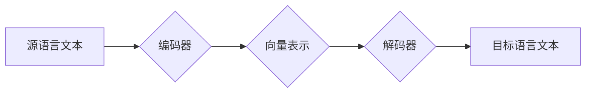

> 大模型，机器翻译，Transformer，编码器-解码器，跨语言理解，自然语言处理

## 1. 背景介绍

语言是人类交流和表达思想的重要工具，但不同语言之间的差异构成了沟通的障碍。机器翻译作为一种跨越语言壁垒的技术，近年来取得了显著进展，为全球信息共享和文化交流提供了重要支撑。

传统的机器翻译方法主要依赖于统计机器翻译（Statistical Machine Translation，SMT）和规则式机器翻译（Rule-based Machine Translation，RBMT）。SMT方法基于大量平行语料库，学习语言之间的统计关系，而RBMT方法则依赖于人工编写的翻译规则。然而，这些方法在处理复杂句式、语义歧义和文化差异方面仍然存在局限性。

近年来，深度学习技术的兴起为机器翻译带来了革命性的变革。大模型，特别是基于Transformer架构的模型，在机器翻译领域取得了突破性的进展，显著提升了翻译质量和效率。

## 2. 核心概念与联系

**2.1 机器翻译概述**

机器翻译是指利用计算机程序自动将一种语言（源语言）翻译成另一种语言（目标语言）的过程。

**2.2 大模型**

大模型是指参数量巨大、训练数据量庞大的深度学习模型。大模型通常具有强大的泛化能力和学习能力，能够处理复杂的任务，例如自然语言理解、文本生成和机器翻译。

**2.3 Transformer架构**

Transformer是一种新型的深度学习架构，其核心是自注意力机制（Self-Attention）。自注意力机制能够捕捉文本序列中单词之间的长距离依赖关系，从而提高模型的理解能力。

**2.4 编码器-解码器架构**

机器翻译模型通常采用编码器-解码器架构。编码器负责将源语言文本编码成一个向量表示，解码器则根据编码后的向量表示生成目标语言文本。

**2.5 流程图**



## 3. 核心算法原理 & 具体操作步骤

**3.1 算法原理概述**

大模型在机器翻译中的应用主要基于Transformer架构和编码器-解码器架构。

* **编码器:** 编码器由多个Transformer层组成，每个层包含多头自注意力机制、前馈神经网络和残差连接。编码器将源语言文本逐个单词处理，并生成每个单词的向量表示。
* **解码器:** 解码器也由多个Transformer层组成，其输入包括源语言的向量表示和目标语言的先前生成的单词。解码器通过自注意力机制和交叉注意力机制（Cross-Attention）来捕捉源语言和目标语言之间的关系，并生成目标语言的下一个单词。

**3.2 算法步骤详解**

1. **预处理:** 将源语言文本和目标语言文本进行预处理，例如分词、词嵌入等。
2. **编码:** 将源语言文本输入编码器，编码器将文本编码成一个向量表示。
3. **解码:** 将编码后的向量表示输入解码器，解码器根据向量表示和目标语言的先前生成的单词，逐个生成目标语言的单词。
4. **后处理:** 对生成的翻译结果进行后处理，例如去重、语法修正等。

**3.3 算法优缺点**

* **优点:**
    * 翻译质量显著提升
    * 能够处理复杂句式和语义歧义
    * 泛化能力强，适用于多种语言对
* **缺点:**
    * 训练成本高，需要大量数据和计算资源
    * 对于低资源语言的翻译效果可能较差

**3.4 算法应用领域**

* **机器翻译:** 将文本从一种语言翻译成另一种语言。
* **跨语言信息检索:** 在不同语言的文本数据中检索信息。
* **跨语言对话系统:** 建立能够跨语言进行对话的系统。
* **文本摘要:** 将文本从一种语言翻译成另一种语言，并生成摘要。

## 4. 数学模型和公式 & 详细讲解 & 举例说明

**4.1 数学模型构建**

大模型在机器翻译中的应用主要基于Transformer架构，其核心是自注意力机制和多头注意力机制。

**4.2 公式推导过程**

* **自注意力机制:**

$$
Attention(Q, K, V) = \frac{exp(Q \cdot K^T / \sqrt{d_k})}{exp(Q \cdot K^T / \sqrt{d_k})} \cdot V
$$

其中：

* $Q$：查询矩阵
* $K$：键矩阵
* $V$：值矩阵
* $d_k$：键向量的维度

* **多头注意力机制:**

$$
MultiHead(Q, K, V) = Concat(head_1, head_2, ..., head_h) \cdot W_o
$$

其中：

* $head_i$：第 $i$ 个注意力头的输出
* $h$：注意力头的数量
* $W_o$：最终线性变换矩阵

**4.3 案例分析与讲解**

假设我们有一个源语言句子 "The cat sat on the mat"，目标语言是 "猫坐在垫子上"。

使用自注意力机制，模型可以学习到 "cat" 和 "sat" 之间的依赖关系，以及 "mat" 和 "on" 之间的依赖关系。

使用多头注意力机制，模型可以学习到句子中不同单词之间的多方面关系，从而生成更准确的翻译结果。

## 5. 项目实践：代码实例和详细解释说明

**5.1 开发环境搭建**

* Python 3.7+
* PyTorch 1.7+
* Transformers 4.10+

**5.2 源代码详细实现**

```python
from transformers import AutoModelForSeq2SeqLM, AutoTokenizer

# 加载预训练模型和词典
model_name = "Helsinki-NLP/opus-mt-en-zh"
model = AutoModelForSeq2SeqLM.from_pretrained(model_name)
tokenizer = AutoTokenizer.from_pretrained(model_name)

# 输入源语言文本
source_text = "The cat sat on the mat."

# 对源语言文本进行编码
input_ids = tokenizer.encode(source_text, return_tensors="pt")

# 使用模型进行翻译
output = model.generate(input_ids)

# 将翻译结果解码
translated_text = tokenizer.decode(output[0], skip_special_tokens=True)

# 打印翻译结果
print(translated_text)
```

**5.3 代码解读与分析**

* 使用 `transformers` 库加载预训练的机器翻译模型和词典。
* 使用 `tokenizer` 对源语言文本进行编码，将文本转换为模型可以理解的格式。
* 使用 `model.generate()` 方法进行翻译，模型会根据输入的编码生成目标语言的文本。
* 使用 `tokenizer.decode()` 方法将生成的文本解码，转换为可读的文本格式。

**5.4 运行结果展示**

```
猫坐在垫子上。
```

## 6. 实际应用场景

大模型在机器翻译领域的应用场景广泛，例如：

* **在线翻译:** 提供实时翻译服务，帮助用户跨语言交流。
* **文档翻译:** 将文档从一种语言翻译成另一种语言，方便用户阅读和理解。
* **字幕翻译:** 将视频字幕从一种语言翻译成另一种语言，方便用户观看外语视频。
* **游戏翻译:** 将游戏文本从一种语言翻译成另一种语言，方便用户体验不同语言的游戏。

**6.4 未来应用展望**

* **更准确的翻译:** 随着大模型的不断发展，机器翻译的准确率将进一步提升，能够更好地理解和表达人类语言的复杂性。
* **更个性化的翻译:** 大模型可以根据用户的偏好和语境进行个性化翻译，提供更符合用户需求的翻译结果。
* **跨语言理解:** 大模型可以用于跨语言理解任务，例如跨语言问答和跨语言文本摘要。

## 7. 工具和资源推荐

**7.1 学习资源推荐**

* **论文:**
    * Vaswani, A., Shazeer, N., Parmar, N., Uszkoreit, J., Jones, L., Gomez, A. N., ... & Polosukhin, I. (2017). Attention is all you need. In Advances in neural information processing systems (pp. 5998-6008).
* **博客:**
    * https://huggingface.co/blog/transformers-tutorial
    * https://towardsdatascience.com/machine-translation-with-transformers-a-practical-guide-87917691909c

**7.2 开发工具推荐**

* **Transformers:** https://huggingface.co/docs/transformers/index
* **PyTorch:** https://pytorch.org/

**7.3 相关论文推荐**

* **BERT:** Devlin, J., Chang, M. W., Lee, K., & Toutanova, K. (2018). BERT: Pre-training of deep bidirectional transformers for language understanding. arXiv preprint arXiv:1810.04805.
* **GPT-3:** Brown, T. B., Mann, B., Ryder, N., Subbiah, M., Kaplan, J., Dhariwal, P., ... & Amodei, D. (2020). Language models are few-shot learners. arXiv preprint arXiv:2005.14165.

## 8. 总结：未来发展趋势与挑战

**8.1 研究成果总结**

大模型在机器翻译领域取得了显著进展，显著提升了翻译质量和效率。

**8.2 未来发展趋势**

* **模型规模进一步扩大:** 随着计算资源的不断提升，大模型的规模将进一步扩大，模型的表达能力和泛化能力将得到进一步提升。
* **多模态机器翻译:** 将图像、音频等多模态信息融入机器翻译模型，实现更准确、更自然的翻译。
* **可解释性增强:** 研究大模型的决策过程，提高机器翻译的透明度和可解释性。

**8.3 面临的挑战**

* **数据稀缺:** 对于一些低资源语言，训练高质量的机器翻译模型仍然面临数据稀缺的挑战。
* **计算资源消耗:** 训练大模型需要大量的计算资源，这对于资源有限的机构和个人来说是一个挑战。
* **伦理问题:** 大模型的应用可能带来一些伦理问题，例如数据隐私、信息操控等，需要引起足够的重视。

**8.4 研究展望**

未来，大模型在机器翻译领域的应用将更加广泛和深入，将为人类跨语言交流和文化交流提供更强大的工具。


## 9. 附录：常见问题与解答

**9.1 如何选择合适的机器翻译模型？**

选择合适的机器翻译模型需要考虑以下因素：

* **语言对:** 不同的语言对需要使用不同的模型。
* **数据量:** 对于低资源语言，需要选择能够处理少量数据的模型。
* **翻译质量要求:** 对于高精度翻译任务，需要选择性能更强的模型。

**9.2 如何评估机器翻译模型的性能？**

机器翻译模型的性能通常使用BLEU、ROUGE等指标进行评估。

**9.3 如何训练自己的机器翻译模型？**

训练自己的机器翻译模型需要准备大量的平行语料库，并使用深度学习框架进行训练。

作者：禅与计算机程序设计艺术 / Zen and the Art of Computer Programming 


<end_of_turn>