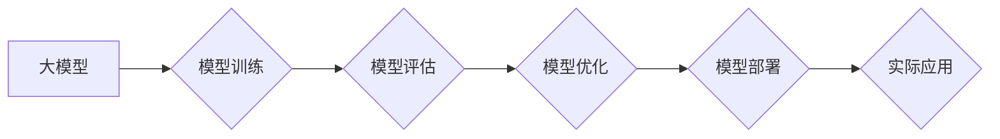

> 大模型、应用开发、技术细节、模型训练、模型部署、模型优化、算法原理、数学模型、代码实现、实际应用场景

## 1. 背景介绍

近年来，深度学习技术取得了飞速发展，大模型的出现更是掀起了人工智能领域的全新浪潮。大模型，是指参数规模庞大、训练数据海量的人工智能模型，其强大的学习能力和泛化能力使其在自然语言处理、计算机视觉、语音识别等领域展现出令人瞩目的应用潜力。然而，将大模型应用于实际场景并非易事，需要深入理解其核心技术细节，并进行针对性的开发和优化。

大模型应用开发的技术细节涵盖多个方面，包括模型训练、模型部署、模型优化等。本文将深入探讨大模型应用开发的各个环节，从算法原理、数学模型到代码实现，并结合实际应用场景，为读者提供全面的技术指南。

## 2. 核心概念与联系

大模型应用开发的核心概念包括：

* **大模型:** 参数规模庞大、训练数据海量的人工智能模型。
* **模型训练:** 利用大规模数据训练大模型，使其能够学习到复杂的模式和规律。
* **模型部署:** 将训练好的大模型部署到实际应用环境中，使其能够为用户提供服务。
* **模型优化:** 通过调整模型参数、优化算法等手段，提高模型的性能和效率。

**Mermaid 流程图:**



## 3. 核心算法原理 & 具体操作步骤

### 3.1  算法原理概述

大模型的训练主要基于深度学习算法，其中最常用的算法是**Transformer**。Transformer是一种基于注意力机制的序列模型，能够有效地捕捉长距离依赖关系，在自然语言处理任务中取得了优异的性能。

**Transformer** 的核心结构包括：

* **编码器:** 将输入序列转换为隐藏表示。
* **解码器:** 根据编码器的输出生成目标序列。
* **注意力机制:** 允许模型关注输入序列中的重要部分，提高学习效率。

### 3.2  算法步骤详解

大模型训练的具体步骤如下：

1. **数据预处理:** 将原始数据清洗、格式化、转换为模型可理解的格式。
2. **模型构建:** 根据选定的算法架构构建模型结构。
3. **模型初始化:** 为模型参数赋予初始值。
4. **模型训练:** 利用训练数据训练模型，通过反向传播算法更新模型参数。
5. **模型评估:** 使用验证集评估模型性能，并根据评估结果调整训练参数。
6. **模型保存:** 保存训练好的模型参数。

### 3.3  算法优缺点

**优点:**

* 强大的学习能力，能够学习到复杂的模式和规律。
* 泛化能力强，能够应用于多种不同的任务。
* 训练效率高，能够利用分布式训练加速训练速度。

**缺点:**

* 训练成本高，需要大量的计算资源和数据。
* 模型参数量大，部署和推理成本较高。
* 训练过程容易出现过拟合问题。

### 3.4  算法应用领域

Transformer 算法在自然语言处理领域有着广泛的应用，例如：

* **机器翻译:** 将一种语言翻译成另一种语言。
* **文本摘要:** 将长文本压缩成短文本。
* **问答系统:** 回答用户提出的问题。
* **对话系统:** 与用户进行自然语言对话。

## 4. 数学模型和公式 & 详细讲解 & 举例说明

### 4.1  数学模型构建

Transformer 模型的核心数学模型是**注意力机制**。注意力机制允许模型关注输入序列中的重要部分，并根据其重要性分配不同的权重。

**注意力机制的公式:**

$$
Attention(Q, K, V) = softmax(\frac{QK^T}{\sqrt{d_k}})V
$$

其中：

* $Q$：查询矩阵
* $K$：键矩阵
* $V$：值矩阵
* $d_k$：键向量的维度
* $softmax$：softmax 函数

### 4.2  公式推导过程

注意力机制的公式通过以下步骤推导而来：

1. 计算查询矩阵 $Q$ 与键矩阵 $K$ 的点积，并进行归一化处理。
2. 应用 softmax 函数将点积结果转换为概率分布。
3. 将概率分布与值矩阵 $V$ 进行加权求和，得到最终的注意力输出。

### 4.3  案例分析与讲解

假设我们有一个句子 "The cat sat on the mat"，想要计算 "cat" 这个词与整个句子的注意力权重。

1. 将句子转换为词向量表示，得到 $Q$、$K$ 和 $V$ 矩阵。
2. 计算 $Q$ 与 $K$ 的点积，并进行归一化处理。
3. 应用 softmax 函数将点积结果转换为概率分布，其中 "cat" 的注意力权重较高。
4. 将概率分布与 $V$ 进行加权求和，得到 "cat" 与整个句子的注意力输出。

## 5. 项目实践：代码实例和详细解释说明

### 5.1  开发环境搭建

大模型应用开发通常需要使用 Python 语言和相关的深度学习框架，例如 TensorFlow 或 PyTorch。

**开发环境搭建步骤:**

1. 安装 Python 语言和相关库。
2. 安装深度学习框架，例如 TensorFlow 或 PyTorch。
3. 安装必要的工具，例如 Git、CUDA 等。

### 5.2  源代码详细实现

以下是一个使用 TensorFlow 实现 Transformer 模型的简单代码示例：

```python
import tensorflow as tf

# 定义 Transformer 模型
class Transformer(tf.keras.Model):
    def __init__(self, vocab_size, embedding_dim, num_heads, num_layers):
        super(Transformer, self).__init__()
        self.embedding = tf.keras.layers.Embedding(vocab_size, embedding_dim)
        self.transformer_layers = tf.keras.layers.StackedRNNCells([
            tf.keras.layers.MultiHeadAttention(num_heads=num_heads, key_dim=embedding_dim)
            for _ in range(num_layers)
        ])

    def call(self, inputs):
        x = self.embedding(inputs)
        x = self.transformer_layers(x)
        return x

# 实例化 Transformer 模型
model = Transformer(vocab_size=10000, embedding_dim=512, num_heads=8, num_layers=6)

# 训练模型
model.compile(optimizer='adam', loss='mse')
model.fit(x_train, y_train, epochs=10)
```

### 5.3  代码解读与分析

* **模型定义:** 代码定义了一个名为 `Transformer` 的类，继承自 `tf.keras.Model`，实现 Transformer 模型的结构。
* **嵌入层:** `embedding` 层将输入的词索引转换为词向量表示。
* **Transformer 层:** `transformer_layers` 层使用多头注意力机制和多层感知机构建 Transformer 模型的编码器和解码器。
* **模型训练:** 使用 `compile` 方法配置模型的优化器和损失函数，然后使用 `fit` 方法训练模型。

### 5.4  运行结果展示

训练完成后，可以使用测试数据评估模型的性能，并可视化模型的输出结果。

## 6. 实际应用场景

大模型在各个领域都有着广泛的应用场景，例如：

* **自然语言处理:** 机器翻译、文本摘要、问答系统、对话系统等。
* **计算机视觉:** 图像分类、目标检测、图像生成等。
* **语音识别:** 语音转文本、语音合成等。
* **推荐系统:** 商品推荐、内容推荐等。

### 6.4  未来应用展望

随着大模型技术的不断发展，其应用场景将更加广泛，例如：

* **个性化教育:** 根据学生的学习情况提供个性化的学习方案。
* **医疗诊断:** 辅助医生进行疾病诊断和治疗方案制定。
* **科学研究:** 加速科学研究的进程，例如药物研发、材料科学等。

## 7. 工具和资源推荐

### 7.1  学习资源推荐

* **书籍:**
    * 《深度学习》
    * 《自然语言处理》
    * 《Transformer 详解》
* **在线课程:**
    * Coursera: 深度学习
    * Udacity: 自然语言处理
    * fast.ai: 深度学习

### 7.2  开发工具推荐

* **深度学习框架:** TensorFlow, PyTorch, JAX
* **编程语言:** Python
* **云计算平台:** AWS, Azure, GCP

### 7.3  相关论文推荐

* **Attention Is All You Need:** https://arxiv.org/abs/1706.03762
* **BERT: Pre-training of Deep Bidirectional Transformers for Language Understanding:** https://arxiv.org/abs/1810.04805
* **GPT-3: Language Models are Few-Shot Learners:** https://arxiv.org/abs/2005.14165

## 8. 总结：未来发展趋势与挑战

### 8.1  研究成果总结

大模型技术取得了显著的进展，在自然语言处理、计算机视觉等领域取得了突破性成果。

### 8.2  未来发展趋势

* **模型规模进一步扩大:** 随着计算资源的不断提升，大模型的规模将继续扩大，模型能力将进一步增强。
* **多模态大模型:** 将文本、图像、音频等多种模态数据融合到一起，构建多模态大模型，实现更智能的交互和理解。
* **可解释性增强:** 研究大模型的决策机制，提高模型的可解释性和透明度。

### 8.3  面临的挑战

* **训练成本高:** 大模型的训练需要大量的计算资源和数据，成本较高。
* **模型部署困难:** 大模型的参数量大，部署和推理成本较高。
* **伦理问题:** 大模型的应用可能带来伦理问题，例如偏见、隐私等。

### 8.4  研究展望

未来，大模型技术将继续发展，并应用于更多领域，为人类社会带来更多福祉。

## 9. 附录：常见问题与解答

* **Q: 如何选择合适的深度学习框架？**
* **A:** TensorFlow 和 PyTorch 是两个常用的深度学习框架，选择哪个框架取决于个人喜好和项目需求。

* **Q: 如何解决大模型的过拟合问题？**
* **A:** 可以使用正则化技术、数据增强、Dropout 等方法来解决大模型的过拟合问题。

* **Q: 如何部署大模型？**

* **A:** 可以使用云计算平台、容器技术等方法部署大模型。


作者：禅与计算机程序设计艺术 / Zen and the Art of Computer Programming 
<end_of_turn>