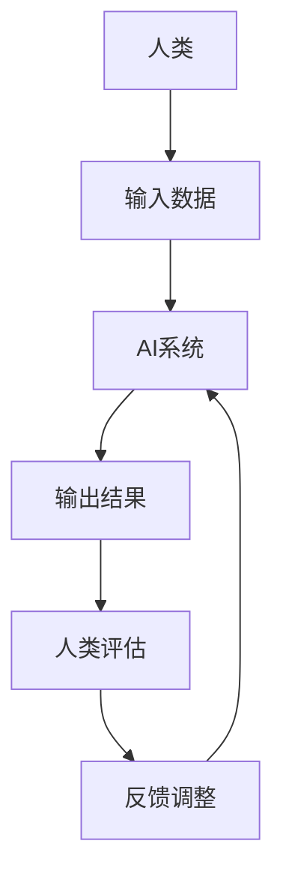

                 

**人类计算：AI时代的未来就业前景与技能需求**

**作者：禅与计算机程序设计艺术 / Zen and the Art of Computer Programming**

## 1. 背景介绍

在人工智能（AI）飞速发展的今天，AI技术已经渗透到各行各业，从自动驾驶到医疗诊断，从金融风控到客户服务，AI正在重新定义我们的世界。然而，AI的崛起也引发了人们对未来就业前景的担忧。本文将探讨AI时代的人类计算，分析AI对就业市场的影响，并提供未来技能需求的洞察。

## 2. 核心概念与联系

### 2.1 人类计算的定义

人类计算（Human-in-the-Loop）是指在AI系统中，人类始终保持在决策回路中，与AI协同工作的概念。人类计算强调人类的判断、创造力和经验在AI系统中的重要性。



### 2.2 AI与就业市场

AI的发展对就业市场产生了双重影响：一方面，AI自动化了许多重复性工作，导致一些岗位消失；另一方面，AI也创造了新的岗位，如数据科学家、AI工程师等。根据世界经济论坛的报告，到2025年，AI将创造出9700万个新岗位，同时消除8500万个岗位。

## 3. 核心算法原理 & 具体操作步骤

### 3.1 算法原理概述

人类计算中常用的算法包括监督学习、无监督学习、强化学习等。其中，监督学习是最常用的算法，它涉及到输入数据和对应的标签，目标是学习数据的映射关系。

### 3.2 算法步骤详解

1. 数据收集：收集包含输入特征和输出标签的数据。
2. 数据预处理：清洗数据，处理缺失值，进行特征工程。
3. 模型选择：选择合适的监督学习算法，如线性回归、逻辑回归、决策树等。
4. 模型训练：使用训练数据训练模型。
5. 模型评估：使用测试数据评估模型的性能。
6. 模型部署：将模型部署到生产环境中。

### 3.3 算法优缺点

优点：监督学习算法简单易懂，可以处理各种类型的数据，性能良好。

缺点：监督学习需要大量的标记数据，对数据的质量和量非常敏感，易受过拟合影响。

### 3.4 算法应用领域

监督学习广泛应用于图像识别、语音识别、自然语言处理等领域。在人类计算中，监督学习可以帮助AI系统学习人类的决策规则，从而提高AI系统的准确性和可靠性。

## 4. 数学模型和公式 & 详细讲解 & 举例说明

### 4.1 数学模型构建

在监督学习中，数学模型通常是一个函数$f(x; \theta)$，其中$x$是输入特征，$f(x; \theta)$是输出标签，$θ$是模型的参数。模型的目标是学习参数$θ$，使得$f(x; \theta)$尽可能接近真实的输出标签。

### 4.2 公式推导过程

在监督学习中，常用的损失函数是均方误差（MSE），定义为：

$$MSE = \frac{1}{n}\sum_{i=1}^{n}(y_i - f(x_i; \theta))^2$$

其中，$y_i$是真实的输出标签，$f(x_i; \theta)$是模型的预测输出，$n$是数据的数量。模型的目标是最小化MSE，即：

$$\min_{\theta} \frac{1}{n}\sum_{i=1}^{n}(y_i - f(x_i; \theta))^2$$

### 4.3 案例分析与讲解

例如，在线性回归中，$f(x; \theta) = \theta^T x$，其中$\theta$是模型的参数，$x$是输入特征。模型的目标是学习参数$\theta$，使得$f(x; \theta)$尽可能接近真实的输出标签。使用梯度下降算法，可以最小化MSE，从而学习参数$\theta$。

## 5. 项目实践：代码实例和详细解释说明

### 5.1 开发环境搭建

本项目使用Python作为编程语言，并使用Scikit-learn库进行模型训练和评估。环境搭建如下：

```bash
pip install scikit-learn pandas numpy
```

### 5.2 源代码详细实现

以下是线性回归的Python实现：

```python
from sklearn.linear_model import LinearRegression
from sklearn.model_selection import train_test_split
from sklearn.metrics import mean_squared_error
import pandas as pd
import numpy as np

# Load data
data = pd.read_csv('housing.csv')
X = data.drop('median_house_value', axis=1)
y = data['median_house_value']

# Preprocess data
#...

# Split data into training and test sets
X_train, X_test, y_train, y_test = train_test_split(X, y, test_size=0.2, random_state=42)

# Train model
model = LinearRegression()
model.fit(X_train, y_train)

# Evaluate model
y_pred = model.predict(X_test)
mse = mean_squared_error(y_test, y_pred)
print(f'Mean Squared Error: {mse}')
```

### 5.3 代码解读与分析

代码首先导入必要的库，然后加载数据集。数据预处理包括填充缺失值、编码类别特征等。之后，数据被分成训练集和测试集。线性回归模型被训练在训练集上，并使用测试集评估模型的性能。均方误差（MSE）被用作评估指标。

### 5.4 运行结果展示

运行代码后，输出的MSE值可以衡量模型的性能。较低的MSE值表示模型的预测更接近真实值。

## 6. 实际应用场景

### 6.1 当前应用

人类计算已经在各行各业得到应用。例如，在医疗领域，AI系统可以帮助医生诊断疾病，但最终决策权仍在医生手中。在金融领域，AI系统可以帮助风控人员评估风险，但最终决策权仍在风控人员手中。

### 6.2 未来应用展望

未来，人类计算将继续在AI系统中扮演关键角色。随着AI技术的发展，AI系统将越来越智能，但人类的判断、创造力和经验仍将是不可或缺的。人类计算将帮助AI系统学习人类的决策规则，从而提高AI系统的准确性和可靠性。

## 7. 工具和资源推荐

### 7.1 学习资源推荐

- 书籍：《机器学习》作者：Tom Mitchell
- 课程：Stanford University的机器学习课程（CS229）
- 在线资源：Kaggle、Udacity、Coursera

### 7.2 开发工具推荐

- 编程语言：Python
- 数据分析库：Pandas、NumPy
- 机器学习库：Scikit-learn、TensorFlow、PyTorch

### 7.3 相关论文推荐

- "Human-in-the-Loop Machine Learning" by Peter Norvig
- "The Master Algorithm" by Pedro Domingos
- "Artificial Intelligence: A Modern Approach" by Stuart Russell and Peter Norvig

## 8. 总结：未来发展趋势与挑战

### 8.1 研究成果总结

本文分析了AI对就业市场的影响，并提供了未来技能需求的洞察。人类计算是AI系统中的人类角色，它强调人类的判断、创造力和经验在AI系统中的重要性。监督学习是人类计算中常用的算法，它可以帮助AI系统学习人类的决策规则。

### 8.2 未来发展趋势

未来，AI技术将继续发展，AI系统将越来越智能。然而，人类的判断、创造力和经验仍将是不可或缺的。人类计算将帮助AI系统学习人类的决策规则，从而提高AI系统的准确性和可靠性。

### 8.3 面临的挑战

然而，AI的发展也面临着挑战。这些挑战包括数据隐私、算法偏见、就业市场变化等。人类计算可以帮助解决这些挑战，但它本身也面临着挑战，如如何设计人机交互界面，如何评估人机协作系统的性能等。

### 8.4 研究展望

未来的研究将关注人机协作系统的设计，人机交互界面的设计，人机协作系统性能的评估等。此外，研究还将关注AI技术的伦理和社会影响，以确保AI技术的发展造福人类。

## 9. 附录：常见问题与解答

**Q1：AI会取代人类的工作吗？**

**A1：**AI会自动化许多重复性工作，但它也创造了新的岗位。根据世界经济论坛的报告，到2025年，AI将创造出9700万个新岗位，同时消除8500万个岗位。

**Q2：人类计算是什么？**

**A2：**人类计算是指在AI系统中，人类始终保持在决策回路中，与AI协同工作的概念。人类计算强调人类的判断、创造力和经验在AI系统中的重要性。

**Q3：如何学习人类计算？**

**A3：**学习人类计算需要学习机器学习、人机交互等相关技能。推荐阅读《机器学习》一书，并参加相关课程，如Stanford University的机器学习课程（CS229）。此外，还可以参考Kaggle、Udacity、Coursera等在线资源。

**作者：禅与计算机程序设计艺术 / Zen and the Art of Computer Programming**

