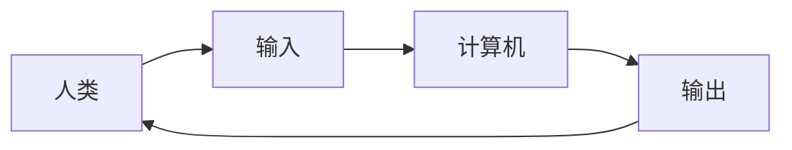

                 

**人类计算：科技与伦理的平衡**

## 1. 背景介绍

在当今数字化的世界里，人工智能（AI）和计算技术正在飞速发展，渗透到我们的日常生活和工作的方方面面。然而，随着技术的进步，我们也面临着一系列的伦理挑战。本文将探讨人类计算的概念，即如何平衡技术创新与伦理考量，以确保技术的发展能够造福人类，而不是成为负担。

## 2. 核心概念与联系

### 2.1 人类计算的定义

人类计算是一种计算范式，旨在将人类的智慧和计算机的能力结合起来，创造出一种新的、更强大的智能。它不同于传统的AI，后者试图模仿人类智能，而是将人类置于计算过程的中心，使计算技术成为人类的延伸和助手。

### 2.2 人类计算的架构

人类计算的架构可以用下面的Mermaid流程图表示：



人类通过输入设备（如键盘、鼠标、语音设备等）与计算机交互，计算机则根据输入执行计算任务，并通过输出设备（如显示器、打印机等）将结果反馈给人类。

### 2.3 人类计算与AI的关系

人类计算与AI并非对立关系，而是互补关系。AI可以作为人类计算的工具，帮助人类完成复杂的计算任务。然而，人类计算强调人类在计算过程中的主导地位，而AI则试图模仿人类智能，二者的侧重点不同。

## 3. 核心算法原理 & 具体操作步骤

### 3.1 算法原理概述

人类计算的核心算法是人类-计算机交互算法，其目的是最大化人类在计算过程中的控制权和理解能力。该算法的原理是将计算任务分解为人类可以理解和控制的子任务，并通过人机交互界面与人类进行互动。

### 3.2 算法步骤详解

1. **任务分解**：将计算任务分解为人类可以理解和控制的子任务。
2. **人机交互**：通过人机交互界面，人类与计算机进行互动，输入指令和接收输出。
3. **计算执行**：计算机根据人类的指令执行计算任务。
4. **结果反馈**：计算机将计算结果反馈给人类。
5. **人类评估**：人类评估计算结果，并根据需要调整指令或任务分解。

### 3.3 算法优缺点

**优点**：

* 最大化了人类在计算过程中的控制权和理解能力。
* 可以帮助人类完成复杂的计算任务。
* 可以减少人类的工作量和错误率。

**缺点**：

* 要求人类具有较高的计算能力和理解能力。
* 可能会导致人机交互的复杂性和学习曲线。

### 3.4 算法应用领域

人类计算的应用领域非常广泛，包括但不限于：

* 科学计算：帮助科学家处理和分析大规模数据。
* 工程设计：帮助工程师设计和优化系统。
* 创意设计：帮助设计师创造新颖的设计方案。
* 个人生产力：帮助个人处理日常任务和信息。

## 4. 数学模型和公式 & 详细讲解 & 举例说明

### 4.1 数学模型构建

人类计算的数学模型可以表示为：

$$M = \{T, I, O, P\}$$

其中：

* $T$ 是计算任务集合。
* $I$ 是输入集合。
* $O$ 是输出集合。
* $P$ 是人类参与的概率分布。

### 4.2 公式推导过程

人类计算的目标是最大化人类参与度，即最大化$P$。为了实现这个目标，我们需要优化人机交互界面，以便人类可以更轻松地理解和控制计算任务。

### 4.3 案例分析与讲解

例如，在数据分析任务中，人类计算模型可以表示为：

$$M_{data} = \{T_{data}, I_{data}, O_{data}, P_{data}\}$$

其中：

* $T_{data}$ 是数据分析任务集合，如数据清洗、数据可视化等。
* $I_{data}$ 是数据输入集合，如数据文件、数据库等。
* $O_{data}$ 是数据输出集合，如数据分析结果、数据可视化图表等。
* $P_{data}$ 是人类参与数据分析的概率分布。

通过优化人机交互界面，我们可以帮助数据分析师更轻松地理解和控制数据分析任务，从而提高数据分析的效率和准确性。

## 5. 项目实践：代码实例和详细解释说明

### 5.1 开发环境搭建

本项目使用Python作为编程语言，并使用Jupyter Notebook作为开发环境。我们需要安装以下库：

* NumPy
* Pandas
* Matplotlib
* Seaborn

### 5.2 源代码详细实现

以下是一个简单的数据分析任务的实现代码：

```python
import numpy as np
import pandas as pd
import matplotlib.pyplot as plt
import seaborn as sns

# 读取数据
data = pd.read_csv('data.csv')

# 数据清洗
data = data.dropna()

# 数据可视化
sns.pairplot(data)
plt.show()
```

### 5.3 代码解读与分析

* 我们首先导入必要的库。
* 然后，我们读取数据文件，并进行简单的数据清洗，删除缺失值。
* 最后，我们使用Seaborn库绘制数据的对数图，以帮助我们理解数据的分布和关系。

### 5.4 运行结果展示

运行代码后，我们可以看到数据的对数图，从中我们可以发现数据的分布和关系。

## 6. 实际应用场景

### 6.1 当前应用

人类计算已经在各种领域得到广泛应用，如科学计算、工程设计、创意设计、个人生产力等。

### 6.2 未来应用展望

随着技术的发展，人类计算的应用将会更加广泛。例如，它可以应用于自动驾驶汽车，帮助司机控制汽车并理解汽车的状态。它也可以应用于医疗领域，帮助医生分析病人的数据并做出诊断。

## 7. 工具和资源推荐

### 7.1 学习资源推荐

* "人类计算"概念的创始人、计算机科学家本杰明·布卢姆的著作《人类计算：计算机与人类智慧的结合》。
* 计算机人机交互设计的经典著作《人机交互设计：用户中心的设计过程》。

### 7.2 开发工具推荐

* Jupyter Notebook：一个交互式的开发环境，支持Python和其他编程语言。
* Tableau：一个强大的数据可视化工具。
* Adobe XD：一个用于创意设计的原型设计工具。

### 7.3 相关论文推荐

* Benjamin B. Blume, "Human-in-the-loop computing: A new paradigm for human-computer interaction," Proceedings of the 2018 CHI conference on human factors in computing systems, 2018.
* Hiroshi Ishii, "Tangible bits: Towards seamless interfaces between people, bits and atoms," Proceedings of the 1998 ACM conference on designing interactive systems, 1998.

## 8. 总结：未来发展趋势与挑战

### 8.1 研究成果总结

本文介绍了人类计算的概念、架构、算法原理、数学模型和应用场景。我们还提供了一个简单的数据分析任务的代码实例。

### 8.2 未来发展趋势

人类计算的未来发展趋势包括：

* 更智能的人机交互界面，可以更好地理解和适应人类的需求。
* 更强大的计算能力，可以处理更复杂的任务。
* 更广泛的应用领域，如自动驾驶汽车、医疗领域等。

### 8.3 面临的挑战

人类计算面临的挑战包括：

* 如何设计更智能的人机交互界面，以理解和适应人类的需求。
* 如何处理更复杂的任务，以满足人类的需求。
* 如何在更广泛的应用领域应用人类计算，并确保其安全和有效。

### 8.4 研究展望

未来的研究方向包括：

* 更智能的人机交互界面的设计和实现。
* 更强大的计算能力的开发和应用。
* 更广泛的应用领域的研究和实践。

## 9. 附录：常见问题与解答

**Q1：人类计算与AI有什么区别？**

A1：人类计算强调人类在计算过程中的主导地位，而AI则试图模仿人类智能。人类计算将计算技术作为人类的延伸和助手，而AI则试图替代人类智能。

**Q2：人类计算的应用领域有哪些？**

A2：人类计算的应用领域非常广泛，包括但不限于科学计算、工程设计、创意设计、个人生产力等。

**Q3：人类计算面临的挑战是什么？**

A3：人类计算面临的挑战包括如何设计更智能的人机交互界面，如何处理更复杂的任务，如何在更广泛的应用领域应用人类计算，并确保其安全和有效。

## 作者：禅与计算机程序设计艺术 / Zen and the Art of Computer Programming

