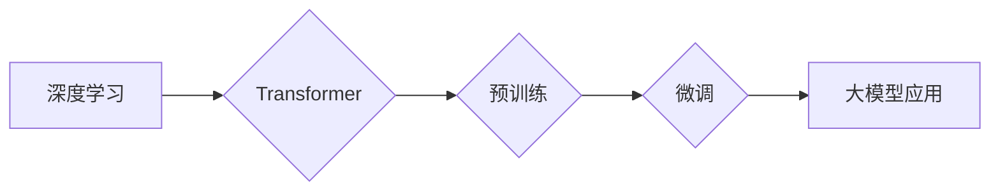

> 大模型、深度学习、自然语言处理、计算机视觉、生成式模型、Transformer、预训练、微调、市场需求、技术潜力

## 1. 背景介绍

近年来，人工智能（AI）技术取得了飞速发展，其中大模型作为AI领域的重要突破口，展现出强大的应用潜力。大模型是指参数规模庞大、训练数据海量的人工智能模型，其强大的学习能力和泛化能力使其能够在自然语言处理、计算机视觉、语音识别等多个领域取得突破性进展。

大模型的兴起与以下几个因素密切相关：

* **计算能力的提升:**  近年来，GPU和TPU等高性能计算硬件的不断发展，为训练大模型提供了强大的计算支撑。
* **数据量的爆炸式增长:**  互联网的普及和数字化转型，使得海量数据资源得以积累，为大模型的训练提供了充足的数据支撑。
* **算法的创新:**  深度学习算法的不断发展，特别是Transformer模型的出现，为大模型的训练和应用提供了新的思路和方法。

## 2. 核心概念与联系

大模型的核心概念包括：

* **深度学习:**  深度学习是一种机器学习的子领域，它利用多层神经网络来模拟人类大脑的学习过程。
* **Transformer:**  Transformer是一种新型的神经网络架构，它通过注意力机制来捕捉序列数据中的长距离依赖关系，在自然语言处理领域取得了显著的成果。
* **预训练:**  预训练是指在大量通用数据上训练模型，使其学习到通用的语言表示或视觉特征，为后续特定任务的微调提供基础。
* **微调:**  微调是指在预训练模型的基础上，使用特定任务的数据进行进一步训练，以提高模型在特定任务上的性能。

**Mermaid 流程图:**



## 3. 核心算法原理 & 具体操作步骤

### 3.1  算法原理概述

大模型的训练主要基于深度学习算法，其中Transformer模型是目前最流行的架构之一。Transformer模型的核心是注意力机制，它能够有效地捕捉序列数据中的长距离依赖关系，从而提高模型的理解和生成能力。

### 3.2  算法步骤详解

大模型的训练过程可以概括为以下步骤：

1. **数据预处理:**  收集和清洗训练数据，将其转换为模型可以理解的格式。
2. **模型构建:**  根据任务需求选择合适的模型架构，例如Transformer模型。
3. **模型训练:**  使用训练数据训练模型，通过反向传播算法不断调整模型参数，使其能够准确地预测或生成目标输出。
4. **模型评估:**  使用验证数据评估模型的性能，并根据评估结果调整训练参数或模型结构。
5. **模型部署:**  将训练好的模型部署到实际应用场景中，用于进行预测或生成任务。

### 3.3  算法优缺点

**优点:**

* **强大的学习能力:**  大模型能够学习到复杂的模式和关系，从而在各种任务中表现出色。
* **良好的泛化能力:**  预训练模型在通用数据上训练，能够更好地泛化到新的任务和数据。
* **可迁移性强:**  预训练模型可以微调到不同的任务，降低了模型训练的成本和时间。

**缺点:**

* **训练成本高:**  大模型的训练需要大量的计算资源和时间。
* **数据依赖性强:**  大模型的性能取决于训练数据的质量和数量。
* **可解释性差:**  大模型的内部机制复杂，难以解释其决策过程。

### 3.4  算法应用领域

大模型在以下领域具有广泛的应用前景：

* **自然语言处理:**  文本生成、机器翻译、问答系统、情感分析等。
* **计算机视觉:**  图像识别、物体检测、图像生成、视频分析等。
* **语音识别:**  语音转文本、语音合成、语音助手等。
* **推荐系统:**  商品推荐、内容推荐、用户画像等。
* **药物研发:**  药物发现、药物设计、药物安全性评估等。

## 4. 数学模型和公式 & 详细讲解 & 举例说明

### 4.1  数学模型构建

Transformer模型的核心是注意力机制，其数学模型可以表示为：

$$
Attention(Q, K, V) = softmax(\frac{QK^T}{\sqrt{d_k}})V
$$

其中：

* $Q$：查询矩阵
* $K$：键矩阵
* $V$：值矩阵
* $d_k$：键向量的维度
* $softmax$：softmax函数

### 4.2  公式推导过程

注意力机制的目的是计算查询向量与键向量的相关性，并根据相关性对值向量进行加权求和。

* $QK^T$：计算查询向量与键向量的点积，得到一个得分矩阵。
* $\frac{QK^T}{\sqrt{d_k}}$：对得分矩阵进行归一化，使得每个元素的范围在0到1之间。
* $softmax$：对归一化后的得分矩阵应用softmax函数，得到每个键向量的权重。
* $V$：使用权重对值向量进行加权求和，得到最终的输出。

### 4.3  案例分析与讲解

例如，在机器翻译任务中，查询向量可以表示源语言的词语，键向量可以表示目标语言的词语，值向量可以表示目标语言的词语嵌入。注意力机制可以计算源语言词语与目标语言词语之间的相关性，并根据相关性选择合适的目标语言词语进行翻译。

## 5. 项目实践：代码实例和详细解释说明

### 5.1  开发环境搭建

* Python 3.7+
* TensorFlow 2.0+
* PyTorch 1.0+
* CUDA 10.0+

### 5.2  源代码详细实现

```python
import tensorflow as tf

# 定义Transformer模型
class Transformer(tf.keras.Model):
    def __init__(self, vocab_size, embedding_dim, num_heads, num_layers):
        super(Transformer, self).__init__()
        self.embedding = tf.keras.layers.Embedding(vocab_size, embedding_dim)
        self.transformer_layers = [
            tf.keras.layers.MultiHeadAttention(num_heads=num_heads, key_dim=embedding_dim)
            for _ in range(num_layers)
        ]
        self.dense = tf.keras.layers.Dense(vocab_size)

    def call(self, inputs):
        x = self.embedding(inputs)
        for layer in self.transformer_layers:
            x = layer(x, x, x)
        x = self.dense(x)
        return x

# 实例化模型
model = Transformer(vocab_size=10000, embedding_dim=512, num_heads=8, num_layers=6)

# 训练模型
model.compile(optimizer='adam', loss='sparse_categorical_crossentropy', metrics=['accuracy'])
model.fit(train_data, train_labels, epochs=10)
```

### 5.3  代码解读与分析

* 代码首先定义了一个Transformer模型类，包含嵌入层、多头注意力层和全连接层。
* 然后实例化模型，并使用Adam优化器、交叉熵损失函数和准确率指标进行训练。
* 训练过程使用训练数据和标签进行迭代，不断调整模型参数，使其能够准确地预测目标输出。

### 5.4  运行结果展示

训练完成后，可以使用验证数据评估模型的性能，并根据评估结果进行模型调优。

## 6. 实际应用场景

### 6.1  自然语言处理

* **机器翻译:**  大模型可以实现高质量的机器翻译，例如Google Translate、DeepL等。
* **文本摘要:**  大模型可以自动生成文本摘要，例如新闻摘要、会议纪要等。
* **聊天机器人:**  大模型可以构建更智能的聊天机器人，例如微软的Tay、Google的LaMDA等。

### 6.2  计算机视觉

* **图像识别:**  大模型可以识别图像中的物体、场景、人物等，例如Google Lens、Amazon Rekognition等。
* **图像生成:**  大模型可以生成逼真的图像，例如DALL-E 2、Stable Diffusion等。
* **视频分析:**  大模型可以分析视频内容，例如动作识别、事件检测等。

### 6.3  语音识别

* **语音转文本:**  大模型可以将语音转换为文本，例如Google语音识别、Apple Siri等。
* **语音合成:**  大模型可以将文本转换为语音，例如Amazon Polly、Microsoft Azure Text to Speech等。

### 6.4  未来应用展望

大模型的应用前景广阔，未来将应用于更多领域，例如：

* **医疗保健:**  辅助诊断、药物研发、个性化医疗等。
* **教育:**  智能辅导、个性化学习、自动批改等。
* **金融:**  风险评估、欺诈检测、投资决策等。

## 7. 工具和资源推荐

### 7.1  学习资源推荐

* **书籍:**
    * 《深度学习》
    * 《Transformer模型详解》
* **在线课程:**
    * Coursera: 深度学习
    * Udacity: 自然语言处理
* **博客:**
    * The Gradient
    * Towards Data Science

### 7.2  开发工具推荐

* **TensorFlow:**  开源深度学习框架
* **PyTorch:**  开源深度学习框架
* **Hugging Face:**  预训练模型库和工具

### 7.3  相关论文推荐

* 《Attention Is All You Need》
* 《BERT: Pre-training of Deep Bidirectional Transformers for Language Understanding》
* 《GPT-3: Language Models are Few-Shot Learners》

## 8. 总结：未来发展趋势与挑战

### 8.1  研究成果总结

近年来，大模型在自然语言处理、计算机视觉等领域取得了显著的成果，展现出强大的应用潜力。

### 8.2  未来发展趋势

* **模型规模的进一步扩大:**  随着计算能力的提升，大模型的规模将继续扩大，从而提升模型的性能。
* **模型架构的创新:**  新的模型架构将不断涌现，例如混合模型、联邦学习等，以提高模型的效率和鲁棒性。
* **多模态大模型的开发:**  将文本、图像、音频等多种模态数据融合到一起，开发更智能的多模态大模型。

### 8.3  面临的挑战

* **训练成本高:**  大模型的训练需要大量的计算资源和时间，成本较高。
* **数据依赖性强:**  大模型的性能取决于训练数据的质量和数量，数据获取和标注成本高。
* **可解释性差:**  大模型的内部机制复杂，难以解释其决策过程，缺乏可解释性。

### 8.4  研究展望

未来研究将集中在以下几个方面：

* **降低训练成本:**  探索新的训练方法和硬件架构，降低大模型的训练成本。
* **提升数据利用效率:**  开发新的数据增强技术和模型训练方法，提高数据利用效率。
* **增强模型可解释性:**  研究新的模型解释方法，提高大模型的可解释性。


## 9. 附录：常见问题与解答

**Q1: 大模型的训练需要多少计算资源？**

A1: 大模型的训练需要大量的计算资源，例如数百甚至数千个GPU。

**Q2: 大模型的训练需要多少时间？**

A2: 大模型的训练时间取决于模型规模、数据量和训练硬件等因素，通常需要数天甚至数周的时间。

**Q3: 如何评估大模型的性能？**

A3: 大模型的性能可以通过各种指标进行评估，例如准确率、F1-score、BLEU等。

**Q4: 如何部署大模型？**

A4: 大模型可以部署到云端、边缘设备或本地服务器上，具体部署方式取决于应用场景和资源限制。

**Q5: 大模型有哪些伦理问题？**

A5: 大模型的应用存在一些伦理问题，例如数据隐私、算法偏见、信息操纵等，需要引起重视并制定相应的规范和制度。


作者：禅与计算机程序设计艺术 / Zen and the Art of Computer Programming 
<end_of_turn>