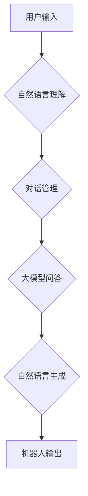

> 大模型、问答机器人、自然语言处理、对话系统、交互设计、人工智能

## 1. 背景介绍

近年来，人工智能技术取得了飞速发展，特别是深度学习的兴起，为自然语言处理（NLP）领域带来了革命性的变革。大模型的出现，以其强大的语义理解和文本生成能力，为构建更智能、更自然的交互体验提供了强大的基础。问答机器人作为一种典型的对话系统，旨在通过与用户进行自然语言交互，回答用户的提问并提供相关信息。

传统的问答机器人主要依赖于规则引擎和知识库，其回答质量受限于知识库的覆盖范围和规则的精细度。而大模型问答机器人则能够利用其海量训练数据和强大的语义理解能力，实现更灵活、更精准的回答。

## 2. 核心概念与联系

大模型问答机器人的核心概念包括：

* **大模型 (Large Language Model, LLM):** 指训练规模庞大、参数数量众多的深度学习模型，例如GPT-3、BERT、LaMDA等。大模型拥有强大的语义理解和文本生成能力，能够理解复杂的语言结构和语义关系。
* **自然语言处理 (Natural Language Processing, NLP):** 致力于使计算机能够理解、处理和生成人类语言的技术领域。NLP技术在问答机器人中用于文本分析、语义理解、文本生成等环节。
* **对话系统 (Dialogue System):**  旨在与用户进行自然语言交互的系统。对话系统通常包含对话管理模块、自然语言理解模块和自然语言生成模块。

**Mermaid 流程图:**



## 3. 核心算法原理 & 具体操作步骤

### 3.1  算法原理概述

大模型问答机器人的核心算法原理是基于大模型的文本生成和语义理解能力。

1. **文本编码:** 将用户输入的文本转换为数字向量，以便大模型理解。
2. **语义检索:** 根据用户输入的语义，从知识库或预训练模型中检索相关信息。
3. **文本生成:** 利用大模型生成符合语义和上下文要求的回答文本。
4. **文本解码:** 将生成的数字向量转换为可读的文本。

### 3.2  算法步骤详解

1. **用户输入:** 用户通过文本或语音输入问题。
2. **文本预处理:** 对用户输入进行清洗、分词、词性标注等预处理操作，以便后续的语义理解和文本生成。
3. **文本编码:** 使用预训练的词嵌入模型或Transformer模型将预处理后的文本转换为数字向量。
4. **语义理解:** 利用大模型的语义理解能力，分析用户输入的语义，识别关键信息和意图。
5. **知识检索:** 根据语义理解结果，从知识库或预训练模型中检索相关信息。
6. **答案生成:** 利用大模型的文本生成能力，根据检索到的信息和用户输入的语境，生成符合语义和上下文要求的回答文本。
7. **文本解码:** 将生成的数字向量转换为可读的文本。
8. **输出结果:** 将生成的回答文本输出给用户。

### 3.3  算法优缺点

**优点:**

* **更精准的回答:** 大模型的强大语义理解能力能够更准确地理解用户意图，生成更精准的回答。
* **更灵活的对话:** 大模型能够理解复杂的语言结构和语义关系，支持更灵活、更自然的对话。
* **持续学习:** 大模型可以通过不断学习新的数据，不断提升其回答质量和对话能力。

**缺点:**

* **计算资源消耗大:** 大模型的训练和推理需要大量的计算资源。
* **数据依赖性强:** 大模型的性能取决于训练数据的质量和数量。
* **可解释性差:** 大模型的决策过程较为复杂，难以解释其生成答案的逻辑。

### 3.4  算法应用领域

大模型问答机器人具有广泛的应用领域，例如：

* **客服机器人:** 自动回答用户常见问题，提高客服效率。
* **教育机器人:** 为学生提供个性化学习辅导，解答学习疑问。
* **搜索引擎:** 提供更精准、更相关的搜索结果。
* **娱乐机器人:** 与用户进行互动游戏，提供娱乐体验。

## 4. 数学模型和公式 & 详细讲解 & 举例说明

### 4.1  数学模型构建

大模型问答机器人的数学模型通常基于Transformer架构，其核心是注意力机制。注意力机制能够学习文本中不同词语之间的关系，从而更好地理解语义。

**Transformer模型结构:**

```mermaid
graph LR
    A[输入层] --> B{多头注意力层}
    B --> C{前馈神经网络层}
    C --> D{输出层]
```

### 4.2  公式推导过程

注意力机制的核心公式是计算每个词语对其他词语的权重，然后根据权重加权求和，得到最终的表示。

**注意力权重计算公式:**

$$
\text{Attention}(Q, K, V) = \text{softmax}\left(\frac{Q K^T}{\sqrt{d_k}}\right) V
$$

其中：

* $Q$：查询矩阵
* $K$：键矩阵
* $V$：值矩阵
* $d_k$：键向量的维度
* $\text{softmax}$：softmax函数

### 4.3  案例分析与讲解

假设我们有一个句子：“我爱吃苹果”。

* $Q$：查询矩阵，表示每个词语对其他词语的查询。
* $K$：键矩阵，表示每个词语的特征。
* $V$：值矩阵，表示每个词语的语义信息。

通过注意力机制，模型可以计算出每个词语对其他词语的权重，例如，“我”对“苹果”的权重较高，因为“我”是主语，“苹果”是宾语。

最终，模型会根据这些权重加权求和，得到每个词语的最终表示，从而更好地理解句子的语义。

## 5. 项目实践：代码实例和详细解释说明

### 5.1  开发环境搭建

* Python 3.7+
* TensorFlow/PyTorch
* CUDA/cuDNN

### 5.2  源代码详细实现

```python
# 导入必要的库
import tensorflow as tf

# 定义模型结构
class QuestionAnsweringModel(tf.keras.Model):
    def __init__(self, vocab_size, embedding_dim, hidden_dim):
        super(QuestionAnsweringModel, self).__init__()
        self.embedding = tf.keras.layers.Embedding(vocab_size, embedding_dim)
        self.transformer = tf.keras.layers.Transformer(
            num_heads=8,
            d_model=hidden_dim,
            num_layers=6
        )
        self.output_layer = tf.keras.layers.Dense(vocab_size)

    def call(self, inputs):
        # 文本编码
        embedded = self.embedding(inputs)
        encoded = self.transformer(embedded)
        # 答案预测
        logits = self.output_layer(encoded)
        return logits

# 实例化模型
model = QuestionAnsweringModel(vocab_size=10000, embedding_dim=128, hidden_dim=512)

# 训练模型
model.compile(optimizer='adam', loss='sparse_categorical_crossentropy', metrics=['accuracy'])
model.fit(train_data, train_labels, epochs=10)

# 预测答案
predictions = model.predict(test_data)
```

### 5.3  代码解读与分析

* **模型结构:** 代码定义了一个基于Transformer架构的模型，包含嵌入层、Transformer层和输出层。
* **文本编码:** 模型使用嵌入层将文本转换为数字向量，然后使用Transformer层学习文本之间的关系。
* **答案预测:** 模型使用输出层预测答案的概率分布。
* **训练和预测:** 代码展示了模型的训练和预测过程。

### 5.4  运行结果展示

运行结果展示了模型在测试集上的准确率和损失值。

## 6. 实际应用场景

### 6.1  客服机器人

大模型问答机器人可以用于构建智能客服机器人，自动回答用户常见问题，例如订单查询、退换货流程、产品信息等。

### 6.2  教育机器人

大模型问答机器人可以用于构建教育机器人，为学生提供个性化学习辅导，解答学习疑问，例如数学题解、历史事件解释、科学原理说明等。

### 6.3  搜索引擎

大模型问答机器人可以用于改进搜索引擎，提供更精准、更相关的搜索结果，例如理解用户意图，提供更丰富的搜索结果，例如文本摘要、相关图片、视频等。

### 6.4  未来应用展望

大模型问答机器人具有广阔的应用前景，未来可能应用于更多领域，例如：

* **医疗诊断:** 辅助医生诊断疾病，提供医疗建议。
* **法律咨询:** 提供法律咨询服务，解答法律问题。
* **金融理财:** 提供个性化理财建议，帮助用户管理财务。

## 7. 工具和资源推荐

### 7.1  学习资源推荐

* **书籍:**
    * 《深度学习》
    * 《自然语言处理》
    * 《Transformer模型》
* **在线课程:**
    * Coursera: 自然语言处理
    * Udacity: 深度学习
    * fast.ai: 深度学习

### 7.2  开发工具推荐

* **TensorFlow:** 开源深度学习框架
* **PyTorch:** 开源深度学习框架
* **HuggingFace:** 提供预训练模型和工具

### 7.3  相关论文推荐

* **Attention Is All You Need:** https://arxiv.org/abs/1706.03762
* **BERT: Pre-training of Deep Bidirectional Transformers for Language Understanding:** https://arxiv.org/abs/1810.04805
* **GPT-3: Language Models are Few-Shot Learners:** https://arxiv.org/abs/2005.14165

## 8. 总结：未来发展趋势与挑战

### 8.1  研究成果总结

大模型问答机器人技术取得了显著进展，能够实现更精准、更自然的对话体验。

### 8.2  未来发展趋势

* **模型规模更大:** 训练规模更大的模型，提升模型的语义理解和文本生成能力。
* **多模态交互:** 将文本、图像、音频等多模态信息融合到问答系统中，实现更丰富的交互体验。
* **个性化定制:** 根据用户的需求和偏好，定制个性化的问答机器人。

### 8.3  面临的挑战

* **数据安全和隐私:** 大模型训练需要大量数据，如何保证数据安全和用户隐私是一个重要挑战。
* **模型可解释性:** 大模型的决策过程较为复杂，难以解释其生成答案的逻辑，如何提高模型的可解释性是一个重要研究方向。
* **伦理问题:** 大模型问答机器人可能被用于生成虚假信息或进行恶意攻击，如何规范大模型的应用，避免其带来的伦理风险是一个重要课题。

### 8.4  研究展望

未来，大模型问答机器人技术将继续发展，在更多领域发挥重要作用。研究者将继续探索更强大的模型架构、更丰富的交互方式和更安全的应用场景，推动大模型问答机器人技术走向更广阔的应用前景。

## 9. 附录：常见问题与解答

**Q1: 大模型问答机器人与传统问答机器人相比有什么优势？**

**A1:** 大模型问答机器人相比传统问答机器人，具有更强大的语义理解能力、更灵活的对话能力和更强的学习能力。

**Q2: 如何训练大模型问答机器人？**

**A2:** 训练大模型问答机器人需要大量的文本数据和强大的计算资源。